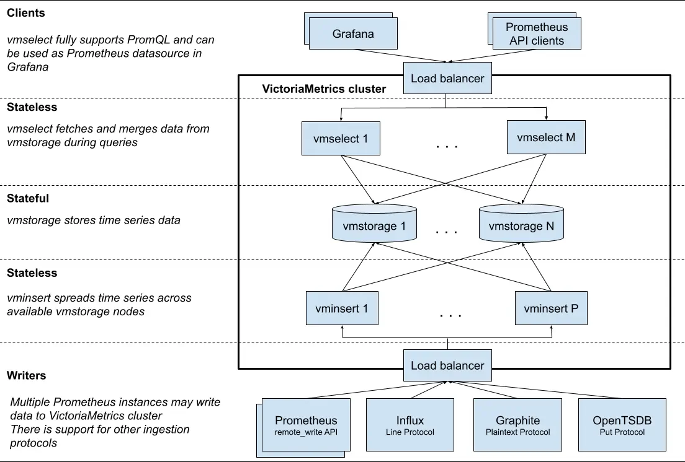

VictoriaMetrics is a fast, cost-effective and scalable time series database. It can be used as a long-term remote storage for Prometheus.

It is recommended to use the [single-node version](https://github.com/VictoriaMetrics/VictoriaMetrics) instead of the cluster version
for ingestion rates lower than a million data points per second.
The single-node version [scales perfectly](https://medium.com/@valyala/measuring-vertical-scalability-for-time-series-databases-in-google-cloud-92550d78d8ae)
with the number of CPU cores, RAM and available storage space and can be set up in [High Availability](https://docs.victoriametrics.com/victoriametrics/#high-availability) mode.
The single-node version is easier to configure and operate compared to the cluster version, so think twice before choosing the cluster version.
See [this question](https://docs.victoriametrics.com/victoriametrics/faq/#which-victoriametrics-type-is-recommended-for-use-in-production---single-node-or-cluster) for more details.

There is also user-friendly database for logs - [VictoriaLogs](https://docs.victoriametrics.com/victorialogs/).

If you have questions about VictoriaMetrics, then feel free asking them at [VictoriaMetrics community Slack chat](https://victoriametrics.slack.com/),
you can join it via [Slack Inviter](https://slack.victoriametrics.com/).

[Contact us](mailto:info@victoriametrics.com) if you need enterprise support for VictoriaMetrics.
See [features available in enterprise package](https://docs.victoriametrics.com/victoriametrics/enterprise/).
Enterprise binaries can be downloaded and evaluated for free
from [the releases page](https://github.com/VictoriaMetrics/VictoriaMetrics/releases/latest).
See how to request a free [trial license](https://victoriametrics.com/products/enterprise/trial/).

VictoriaMetrics is developed at a fast pace, so it is recommended periodically checking the [CHANGELOG](https://docs.victoriametrics.com/victoriametrics/changelog/) and performing [regular upgrades](https://docs.victoriametrics.com/victoriametrics/#how-to-upgrade-victoriametrics).

VictoriaMetrics has achieved security certifications for Database Software Development and Software-Based Monitoring Services. We apply strict security measures in everything we do. See our [Security page](https://victoriametrics.com/security/) for more details.

## Prominent features

- Supports all the features of the [single-node version](https://github.com/VictoriaMetrics/VictoriaMetrics).
- Performance and capacity scale horizontally. See [these docs for details](#cluster-resizing-and-scalability).
- Supports multiple independent namespaces for time series data (aka multi-tenancy). See [these docs for details](#multitenancy).
- Supports replication. See [these docs for details](#replication-and-data-safety).

## Architecture overview

VictoriaMetrics cluster consists of the following services:

- `vmstorage` - stores the raw data and returns the queried data on the given time range for the given label filters
- `vminsert` - accepts the ingested data and spreads it among `vmstorage` nodes according to consistent hashing over metric name and all its labels
- `vmselect` - performs incoming queries by fetching the needed data from all the configured `vmstorage` nodes

Each service may scale independently and may run on the most suitable hardware.
`vmstorage` nodes don't know about each other, don't communicate with each other and don't share any data.
This is a [shared nothing architecture](https://en.wikipedia.org/wiki/Shared-nothing_architecture).
It increases cluster availability, and simplifies cluster maintenance as well as cluster scaling.



> Note that `vmselect` despite being stateless still requires some disk space (a few GBs) for temporary caches. Refer to the `-cacheDataPath` command-line flag for more details.

## vmui

VictoriaMetrics cluster version provides UI for query troubleshooting and exploration. The UI is available at
`http://<vmselect>:8481/select/<accountID>/vmui/` in each `vmselect` service.
The UI allows exploring query results via graphs and tables. See more details about [vmui](https://docs.victoriametrics.com/victoriametrics/single-server-victoriametrics/#vmui).

## Multitenancy

VictoriaMetrics cluster supports multiple isolated tenants (aka namespaces).
Tenants are identified by `accountID` or `accountID:projectID`, which are put inside request URLs for writes and reads.
See [these docs](#url-format) for details.

Some facts about tenants in VictoriaMetrics:

- Each `accountID` and `projectID` is identified by an arbitrary 32-bit integer in the range `[0 .. 2^32)`.
If `projectID` is missing, then it is automatically assigned to `0`. It is expected that other information about tenants
such as auth tokens, tenant names, limits, accounting, etc. is stored in a separate relational database. This database must be managed
by a separate service sitting in front of VictoriaMetrics cluster such as [vmauth](https://docs.victoriametrics.com/victoriametrics/vmauth/)
or [vmgateway](https://docs.victoriametrics.com/victoriametrics/vmgateway/). [Contact us](mailto:info@victoriametrics.com) if you need assistance with such service.

- Tenants are automatically created when the first data point is written into the given tenant.

- Data for all the tenants is evenly spread among available `vmstorage` nodes. This guarantees even load among `vmstorage` nodes
when different tenants have different amounts of data and different query load.

- The database performance and resource usage doesn't depend on the number of tenants. It depends mostly on the total number of [active time series](https://docs.victoriametrics.com/victoriametrics/faq/#what-is-an-active-time-series) in all the tenants. A time series is considered active if it received at least a single sample during the last hour.

- The list of registered tenants can be obtained via `http://<vmselect>:8481/admin/tenants` url. See [these docs](#url-format).

- VictoriaMetrics exposes various per-tenant statistics via metrics - see [these docs](https://docs.victoriametrics.com/victoriametrics/pertenantstatistic/).

See also [multitenancy via labels](#multitenancy-via-labels).

### Multitenancy via labels

**Writes:**

`vminsert` can accept data from multiple [tenants](#multitenancy) via a special `multitenant` endpoints `http://vminsert:8480/insert/multitenant/<suffix>`,
where `<suffix>` can be replaced with any supported suffix for data ingestion from [this list](#url-format).
In this case the account ID and project ID are obtained from optional `vm_account_id` and `vm_project_id` labels of the incoming samples.
If `vm_account_id` or `vm_project_id` labels are missing or invalid, then the corresponding account ID and project ID are set to 0.
These labels are automatically removed from samples before forwarding them to `vmstorage`.
For example, if the following samples are written into `http://vminsert:8480/insert/multitenant/prometheus/api/v1/write`:

```promtextmetric
http_requests_total{path="/foo",vm_account_id="42"} 12
http_requests_total{path="/bar",vm_account_id="7",vm_project_id="9"} 34
```

Then the `http_requests_total{path="/foo"} 12` would be stored in the tenant `accountID=42, projectID=0`,
while the `http_requests_total{path="/bar"} 34` would be stored in the tenant `accountID=7, projectID=9`.

The `vm_account_id` and `vm_project_id` labels are extracted after applying the [relabeling](https://docs.victoriametrics.com/victoriametrics/relabeling/)
set via `-relabelConfig` command-line flag, so these labels can be set at this stage.

The `vm_account_id` and `vm_project_id` labels are also taken into account when ingesting data via non-http-based protocols
such as [Graphite](https://docs.victoriametrics.com/victoriametrics/integrations/graphite/#ingesting),
[InfluxDB line protocol via TCP and UDP](https://docs.victoriametrics.com/victoriametrics/integrations/influxdb/) and
[OpenTSDB telnet put protocol](https://docs.victoriametrics.com/victoriametrics/integrations/opentsdb/#sending-data-via-telnet).

**Reads:**

_For better performance prefer specifying [tenants in read URL](https://docs.victoriametrics.com/victoriametrics/cluster-victoriametrics/#url-format)._

`vmselect` can execute {} queries over multiple [tenants](#multitenancy) via special `multitenant` endpoints `http://vmselect:8481/select/multitenant/<suffix>`.
Currently supported endpoints for `<suffix>` are:

- `/prometheus/api/v1/query`
- `/prometheus/api/v1/query_range`
- `/prometheus/api/v1/series`
- `/prometheus/api/v1/labels`
- `/prometheus/api/v1/label/<label_name>/values`
- `/prometheus/api/v1/status/active_queries`
- `/prometheus/api/v1/status/top_queries`
- `/prometheus/api/v1/status/tsdb`
- `/prometheus/api/v1/export`
- `/prometheus/api/v1/export/csv`
- `/vmui`

It is allowed to explicitly specify tenant IDs via `vm_account_id` and `vm_project_id` labels in the query.
For example, the following query fetches metric `up` for the tenants `accountID=42` and `accountID=7, projectID=9`:

```promtextmetric
up{vm_account_id="7", vm_project_id="9" or vm_account_id="42"}
```

`vm_account_id` and `vm_project_id` labels support all operators for label matching. For example:

```promtextmetric
up{vm_account_id!="42"} # selects all the time series except those belonging to accountID=42
up{vm_account_id=~"4.*"} # selects all the time series belonging to accountIDs starting with 4
```

Alternatively, it is possible to use [`extra_filters[]` and `extra_label`](https://docs.victoriametrics.com/victoriametrics/single-server-victoriametrics/#prometheus-querying-api-enhancements)
query args to apply additional filters for the query:

```bash
curl 'http://vmselect:8481/select/multitenant/prometheus/api/v1/query' \
  -d 'query=up' \
  -d 'extra_filters[]={vm_account_id="7",vm_project_id="9"}' \
  -d 'extra_filters[]={vm_account_id="42"}'
```

The precedence for applying filters for tenants follows this order:

1. Filter tenants by `extra_label` and `extra_filters` filters.
 These filters have the highest priority and are applied first when provided through the query arguments.
2. Filter tenants from labels selectors defined at metricsQL query expression.

**Security considerations**
It is recommended restricting access to `multitenant` endpoints only to trusted sources,
since untrusted source may break per-tenant data by writing unwanted samples or get access to data of arbitrary tenants.

## Binaries

Compiled binaries for the cluster version are available in the `assets` section of the [releases page](https://github.com/VictoriaMetrics/VictoriaMetrics/releases/latest).
Also see archives containing the word `cluster`.

Docker images for the cluster version are available here:

- `vminsert` - [Docker Hub](https://hub.docker.com/r/victoriametrics/vminsert/tags) and [Quay](https://quay.io/repository/victoriametrics/vminsert?tab=tags)
- `vmselect` - [Docker Hub](https://hub.docker.com/r/victoriametrics/vmselect/tags) and [Quay](https://quay.io/repository/victoriametrics/vmselect?tab=tags)
- `vmstorage` - [Docker Hub](https://hub.docker.com/r/victoriametrics/vmstorage/tags) and [Quay](https://quay.io/repository/victoriametrics/vmstorage?tab=tags)

## Building from sources

The source code for the cluster version is available in the [cluster branch](https://github.com/VictoriaMetrics/VictoriaMetrics/tree/cluster).

### Production builds

There is no need to install Go on a host system since binaries are built
inside [the official docker container for Go](https://hub.docker.com/_/golang).
This allows reproducible builds.
So [install docker](https://docs.docker.com/install/) and run the following command:

```bash
make vminsert-prod vmselect-prod vmstorage-prod
```

Production binaries are built into statically linked binaries. They are put into the `bin` folder with `-prod` suffixes:

```bash
$ make vminsert-prod vmselect-prod vmstorage-prod
$ ls -1 bin
vminsert-prod
vmselect-prod
vmstorage-prod
```

### Development Builds

1. [Install go](https://golang.org/doc/install).
1. Run `make` from [the repository root](https://github.com/VictoriaMetrics/VictoriaMetrics). It should build `vmstorage`, `vmselect`
   and `vminsert` binaries and put them into the `bin` folder.

### Building docker images

Run `make package`. It will build the following docker images locally:

- `victoriametrics/vminsert:<PKG_TAG>`
- `victoriametrics/vmselect:<PKG_TAG>`
- `victoriametrics/vmstorage:<PKG_TAG>`

`<PKG_TAG>` is auto-generated image tag, which depends on source code in [the repository](https://github.com/VictoriaMetrics/VictoriaMetrics).
The `<PKG_TAG>` may be manually set via `PKG_TAG=foobar make package`.

By default, images are built on top of [alpine](https://hub.docker.com/_/scratch) image in order to improve debuggability.
It is possible to build an image on top of any other base image by setting it via `<ROOT_IMAGE>` environment variable.
For example, the following command builds images on top of [scratch](https://hub.docker.com/_/scratch) image:

```bash
ROOT_IMAGE=scratch make package
```

## High availability

The database is considered highly available if it continues accepting new data and processing incoming queries when some of its components are temporarily unavailable.
VictoriaMetrics cluster is highly available according to this definition - see [cluster availability docs](#cluster-availability).

It is recommended to run all the components for a single cluster in the same subnetwork with high bandwidth, low latency and low error rates.
This improves cluster performance and availability. It isn't recommended spreading components for a single cluster
across multiple availability zones, since cross-AZ network usually has lower bandwidth, higher latency and higher
error rates comparing the network inside a single AZ.

If you need multi-AZ setup, then it is recommended running independent clusters in each AZ and setting up
[vmagent](https://docs.victoriametrics.com/victoriametrics/vmagent/) in front of these clusters, so it could replicate incoming data
into all the cluster - see [these docs](https://docs.victoriametrics.com/victoriametrics/vmagent/#multitenancy) for details.
Then an additional `vmselect` nodes can be configured for reading the data from multiple clusters according to [these docs](#multi-level-cluster-setup).

See [victoria-metrics-distributed chart](https://docs.victoriametrics.com/helm/victoriametrics-distributed/) for an example.

## Cluster setup

A minimal cluster must contain the following nodes:

- a single `vmstorage` node with `-retentionPeriod` and `-storageDataPath` flags
- a single `vminsert` node with `-storageNode=<vmstorage_host>`
- a single `vmselect` node with `-storageNode=<vmstorage_host>`

[Enterprise version of VictoriaMetrics](https://docs.victoriametrics.com/victoriametrics/enterprise/) supports automatic discovering and updating of `vmstorage` nodes.
See [these docs](#automatic-vmstorage-discovery) for details.

It is recommended to run at least two nodes for each service for high availability purposes. In this case the cluster continues working when a single node is temporarily unavailable and the remaining nodes can handle the increased workload. The node may be temporarily unavailable when the underlying hardware breaks, during software upgrades, migration or other maintenance tasks.

It is preferred to run many small `vmstorage` nodes over a few big `vmstorage` nodes, since this reduces the workload increase on the remaining `vmstorage` nodes when some of `vmstorage` nodes become temporarily unavailable.

An http load balancer such as [vmauth](https://docs.victoriametrics.com/victoriametrics/vmauth/) or `nginx` must be put in front of `vminsert` and `vmselect` nodes.
It must contain the following routing configs according to [the url format](#url-format):

- requests starting with `/insert` must be routed to port `8480` on `vminsert` nodes.
- requests starting with `/select` must be routed to port `8481` on `vmselect` nodes.

Ports may be altered by setting `-httpListenAddr` on the corresponding nodes.

It is recommended setting up [monitoring](#monitoring) for the cluster.

The following tools can simplify cluster setup:

- [An example docker-compose config for VictoriaMetrics cluster](https://github.com/VictoriaMetrics/VictoriaMetrics/tree/master/deployment/docker#victoriametrics-cluster)
- [Helm charts for VictoriaMetrics](https://github.com/VictoriaMetrics/helm-charts)
- [Kubernetes operator for VictoriaMetrics](https://github.com/VictoriaMetrics/operator)

It is possible manually setting up a toy cluster on a single host. In this case every cluster component - `vminsert`, `vmselect` and `vmstorage` - must have distinct values for `-httpListenAddr` command-line flag. This flag specifies http address for accepting http requests for [monitoring](#monitoring) and [profiling](#profiling). `vmstorage` node must have distinct values for the following additional command-line flags in order to prevent resource usage clash:

- `-storageDataPath` - every `vmstorage` node must have a dedicated data storage.
- `-vminsertAddr` - every `vmstorage` node must listen for a distinct tcp address for accepting data from `vminsert` nodes.
- `-vmselectAddr` - every `vmstorage` node must listen for a distinct tcp address for accepting requests from `vmselect` nodes.

### Cluster availability

VictoriaMetrics cluster architecture prioritizes availability over data consistency.
This means that the cluster remains available for data ingestion and data querying
if some of its components are temporarily unavailable.

VictoriaMetrics cluster remains available if the following conditions are met:

- HTTP load balancer must stop routing requests to unavailable `vminsert` and `vmselect` nodes
  ([vmauth](https://docs.victoriametrics.com/victoriametrics/vmauth/) stops routing requests to unavailable nodes).

- At least a single `vminsert` node must remain available in the cluster for processing data ingestion workload.
  The remaining active `vminsert` nodes must have enough compute capacity (CPU, RAM, network bandwidth)
  for handling the current data ingestion workload.
  If the remaining active `vminsert` nodes have no enough resources for processing the data ingestion workload,
  then arbitrary delays may occur during data ingestion.
  See [capacity planning](#capacity-planning) and [cluster resizing](#cluster-resizing-and-scalability) docs for more details.

- At least a single `vmselect` node must remain available in the cluster for processing query workload.
  The remaining active `vmselect` nodes must have enough compute capacity (CPU, RAM, network bandwidth, disk IO)
  for handling the current query workload.
  If the remaining active `vmselect` nodes have no enough resources for processing query workload,
  then arbitrary failures and delays may occur during query processing.
  See [capacity planning](#capacity-planning) and [cluster resizing](#cluster-resizing-and-scalability) docs for more details.

- At least a single `vmstorage` node must remain available in the cluster for accepting newly ingested data
  and for processing incoming queries. The remaining active `vmstorage` nodes must have enough compute capacity
  (CPU, RAM, network bandwidth, disk IO, free disk space) for  handling the current workload.
  If the remaining active `vmstorage` nodes have no enough resources for processing query workload,
  then arbitrary failures and delay may occur during data ingestion and query processing.
  See [capacity planning](#capacity-planning) and [cluster resizing](#cluster-resizing-and-scalability) docs for more details.

The cluster works in the following way when some of `vmstorage` nodes are unavailable:

- `vminsert` re-routes newly ingested data from unavailable `vmstorage` nodes to remaining healthy `vmstorage` nodes.
  This guarantees that the newly ingested data is properly saved if the healthy `vmstorage` nodes have enough CPU, RAM, disk IO and network bandwidth
  for processing the increased data ingestion workload.
  `vminsert` spreads evenly the additional data among the healthy `vmstorage` nodes in order to spread evenly
  the increased load on these nodes. During re-routing, healthy `vmstorage` nodes will experience higher resource usage
  and increase in number of [active time series](https://docs.victoriametrics.com/victoriametrics/faq/#what-is-an-active-time-series).

- `vmselect` continues serving queries if at least a single `vmstorage` nodes is available.
  It marks responses as partial for queries served from the remaining healthy `vmstorage` nodes,
  since such responses may miss historical data stored on the temporarily unavailable `vmstorage` nodes.
  Every partial JSON response contains `"isPartial": true` option.
  If you prefer consistency over availability, then run `vmselect` nodes with `-search.denyPartialResponse` command-line flag.
  In this case `vmselect` returns an error if at least a single `vmstorage` node is unavailable.
  Another option is to pass `deny_partial_response=1` query arg to requests to `vmselect` nodes.

  `vmselect` also accepts `-replicationFactor=N` command-line flag. This flag instructs `vmselect` to return full response
  if less than `-replicationFactor` vmstorage nodes are unavailable during querying, since it assumes that the remaining
  `vmstorage` nodes contain the full data. See [these docs](#replication-and-data-safety) for details.

  It is also possible to configure independent replication factor per distinct `vmstorage` groups - see [these docs](#vmstorage-groups-at-vmselect).

`vmselect` doesn't serve partial responses for API handlers returning [raw datapoints](https://docs.victoriametrics.com/victoriametrics/keyconcepts/#raw-samples),
since users usually expect this data is always complete. The following handlers return raw samples:

- [`/api/v1/export*` endpoints](https://docs.victoriametrics.com/victoriametrics/single-server-victoriametrics/#how-to-export-time-series)
- [`/api/v1/query`](https://docs.victoriametrics.com/victoriametrics/url-examples/#apiv1query) when the `query` contains [series selector](https://docs.victoriametrics.com/victoriametrics/keyconcepts/#filtering)
  ending with some duration in square brackets. For example, `/api/v1/query?query=up[1h]&time=2024-01-02T03:00:00Z`.
  This query returns [raw samples](https://docs.victoriametrics.com/victoriametrics/keyconcepts/#raw-samples) for [time series](https://docs.victoriametrics.com/victoriametrics/keyconcepts/#time-series)
  with the `up` name on the time range `(2024-01-02T02:00:00 .. 2024-01-02T03:00:00]`. See [this article](https://valyala.medium.com/analyzing-prometheus-data-with-external-tools-5f3e5e147639)
  for details.

Data replication can be used for increasing storage durability. See [these docs](#replication-and-data-safety) for details.

### Multi-level cluster setup

`vmselect` nodes can be queried by other `vmselect` nodes if they run with `-clusternativeListenAddr` command-line flag.
For example, if `vmselect` is started with `-clusternativeListenAddr=:8401`, then it can accept queries from another `vmselect` nodes at TCP port 8401
in the same way as `vmstorage` nodes do. This allows chaining `vmselect` nodes and building multi-level cluster topologies.
For example, the top-level `vmselect` node can query second-level `vmselect` nodes in different availability zones (AZ),
while the second-level `vmselect` nodes can query `vmstorage` nodes in local AZ. See also [vmstorage groups at vmselect](#vmstorage-groups-at-vmselect).

`vminsert` nodes can accept data from another `vminsert` nodes if they run with `-clusternativeListenAddr` command-line flag.
For example, if `vminsert` is started with `-clusternativeListenAddr=:8400`, then it can accept data from another `vminsert` nodes at TCP port 8400
in the same way as `vmstorage` nodes do. This allows chaining `vminsert` nodes and building multi-level cluster topologies.
For example, the top-level `vminsert` node can replicate data among the second level of `vminsert` nodes located in distinct availability zones (AZ),
while the second-level `vminsert` nodes can spread the data among `vmstorage` nodes in local AZ.

The multi-level cluster setup for `vminsert` nodes has the following shortcomings because of synchronous replication and data sharding:

- Data ingestion speed is limited by the slowest link to AZ.
- `vminsert` nodes at top level re-route incoming data to the remaining AZs when some AZs are temporarily unavailable. This results in data gaps at AZs which were temporarily unavailable.

These issues are addressed by [vmagent](https://docs.victoriametrics.com/victoriametrics/vmagent/) when it runs in [multitenancy mode](https://docs.victoriametrics.com/victoriametrics/vmagent/#multitenancy).
`vmagent` buffers data, which must be sent to a particular AZ, when this AZ is temporarily unavailable. The buffer is stored on disk. The buffered data is sent to AZ as soon as it becomes available.

See the [cluster instability troubleshooting guide](https://docs.victoriametrics.com/victoriametrics/troubleshooting/#cluster-instability) for details on diagnosing and mitigating networking problems.

### vmstorage groups at vmselect

`vmselect` can be configured to query multiple distinct groups of `vmstorage` nodes with individual `-replicationFactor` per each group.
The following format for `-storageNode` command-line flag value should be used for assigning a particular `addr` of `vmstorage` to a particular `groupName` -
`-storageNode=groupName/addr`. The `groupName` can contain arbitrary value. The only rule is that every `vmstorage` group must have an unique name.

For example, the following command runs `vmselect`, which continues returning full responses if up to one node per each group is temporarily unavailable
because the given `-replicationFactor=2` is applied individually per each group:

```bash
/path/to/vmselect \
 -replicationFactor=2 \
 -storageNode=g1/host1,g1/host2,g1/host3 \
 -storageNode=g2/host4,g2/host5,g2/host6 \
 -storageNode=g3/host7,g3/host8,g3/host9
```

It is possible specifying distinct `-replicationFactor` per each group via the following format - `-replicationFactor=groupName:rf`.
For example, the following command runs `vmselect`, which uses `-replicationFactor=3` for the group `g1`, `-replicationFactor=2` for the group `g2`
and `-replicationFactor=1` for the group `g3`:

```bash
/path/to/vmselect \
 -replicationFactor=g1:3 \
 -storageNode=g1/host1,g1/host2,g1/host3 \
 -replicationFactor=g2:2 \
 -storageNode=g2/host4,g2/host5,g2/host6 \
 -replicationFactor=g3:1 \
 -storageNode=g3/host4,g3/host5,g3/host6
```

If every ingested sample is replicated across multiple `vmstorage` groups, then pass `-globalReplicationFactor=N` command-line flag to `vmselect`,
so it could continue returning full responses if up to `N-1` `vmstorage` groups are temporarily unavailable.
For example, the following command runs `vmselect`, which continues returning full responses if any number of `vmstorage` nodes
in a single `vmstorage` group are temporarily unavailable:

```bash
/path/to/vmselect \
 -globalReplicationFactor=2 \
 -storageNode=g1/host1,g1/host2,g1/host3 \
 -storageNode=g2/host4,g2/host5,g2/host6 \
 -storageNode=g3/host7,g3/host8,g3/host9
```

It is OK to mix `-replicationFactor` and `-globalReplicationFactor`. For example, the following command runs `vmselect`, which continues returning full responses
if any number of `vmstorage` nodes in a single `vmstorage` group are temporarily unavailable and the remaining groups contain up to two unavailable `vmstorage` node:

```bash
/path/to/vmselect \
 -globalReplicationFactor=2 \
 -replicationFactor=3 \
 -storageNode=g1/host1,g1/host2,g1/host3 \
 -storageNode=g2/host4,g2/host5,g2/host6 \
 -storageNode=g3/host7,g3/host8,g3/host9
```

See also [multi-level cluster setup](#multi-level-cluster-setup).

### Automatic vmstorage discovery

`vminsert` and `vmselect` components in [enterprise version of VictoriaMetrics](https://docs.victoriametrics.com/victoriametrics/enterprise/) support
the following approaches for automatic discovery of `vmstorage` nodes:

- file-based discovery - put the list of `vmstorage` nodes into a file - one node address per each line - and then pass `-storageNode=file:/path/to/file-with-vmstorage-list`
  to `vminsert` and `vmselect`. It is possible to read the list of vmstorage nodes from http or https urls.
  For example, `-storageNode=file:http://some-host/vmstorage-list` would read the list of storage nodes
  from `http://some-host/vmstorage-list`.
  The list of discovered `vmstorage` nodes is automatically updated when the file contents changes.
  The update frequency can be controlled with `-storageNode.discoveryInterval` command-line flag.

- [DNS SRV](https://en.wikipedia.org/wiki/SRV_record) - pass `srv+some-name` value to `-storageNode` command-line flag.
  In this case the provided `some-name` is resolved into tcp addresses of `vmstorage` nodes.
  The list of discovered `vmstorage` nodes is automatically updated at `vminsert` and `vmselect`
  when it changes behind the `some-name` DNS SRV record.
  The update frequency can be controlled with `-storageNode.discoveryInterval` command-line flag.

It is possible passing multiple `file` and DNS SRV names to `-storageNode` command-line flag. In this case all these names
are resolved to tcp addresses of `vmstorage` nodes to connect to.
For example, `-storageNode=file:/path/to/local-vmstorage-list -storageNode='srv+vmstorage-hot' -storageNode='srv+vmstorage-cold'`.

It is OK to pass regular static `vmstorage` addresses together with `file` and DNS SRV addresses at `-storageNode`. For example,
`-storageNode=vmstorage1,vmstorage2 -storageNode='srv+vmstorage-autodiscovery'`.

The discovered addresses can be filtered with optional `-storageNode.filter` command-line flag, which can contain arbitrary regular expression filter.
For example, `-storageNode.filter='^[^:]+:8400$'` would leave discovered addresses ending with `8400` port only, e.g. the default port used
for sending data from `vminsert` to `vmstorage` node according to `-vminsertAddr` command-line flag.

The currently discovered `vmstorage` nodes can be [monitored](#monitoring) with `vm_rpc_vmstorage_is_reachable` and `vm_rpc_vmstorage_is_read_only` metrics.

Discovery mechanism could be also used together with [vmstorage group](#vmstorage-groups-at-vmselect). Consider the following example:

```bash
/path/to/vmselect \
  -globalReplicationFactor=2 \
  -storageNode=g1/file:/path/to/file-with-vmstorage-list/ \      # Group g1: static list from file
  -storageNode=g2/srv+vmstorage-autodiscovery \                  # Group g2: nodes discovered dynamically via SRV records
  -storageNode=g3/host7,g3/host8,g3/host9                        # Group g3: statically defined hostnames
```

Each `-storageNode` parameter assigns one or more storage nodes to a specific group (e.g., `g1`, `g2`, `g3`).
The automatically discovered nodes retain the [vmstorage group](#vmstorage-groups-at-vmselect) prefix to maintain consistent group mapping.

### Environment variables

See [these docs](https://docs.victoriametrics.com/victoriametrics/single-server-victoriametrics/#environment-variables).

## Security

General security recommendations:

- All the VictoriaMetrics cluster components must run in protected private network without direct access from untrusted networks such as Internet.
- External clients must access `vminsert` and `vmselect` via auth proxy such as [vmauth](https://docs.victoriametrics.com/victoriametrics/vmauth/)
  or [vmgateway](https://docs.victoriametrics.com/victoriametrics/vmgateway/).
- The auth proxy must accept auth tokens from untrusted networks only via https in order to protect the auth tokens from MitM attacks.
- It is recommended using distinct auth tokens for distinct [tenants](#multitenancy) in order to reduce potential damage in case of compromised auth token for some tenants.
- Prefer using lists of allowed [API endpoints](#url-format), while disallowing access to other endpoints when configuring auth proxy in front of `vminsert` and `vmselect`.
  This minimizes attack surface.

See also [security recommendation for single-node VictoriaMetrics](https://docs.victoriametrics.com/victoriametrics/single-server-victoriametrics/#security)
and [the general security page at VictoriaMetrics website](https://victoriametrics.com/security/).

### mTLS protection

By default `vminsert` and `vmselect` nodes accept http requests at `8480` and `8481` ports accordingly (these ports can be changed via `-httpListenAddr` command-line flags),
since it is expected that [vmauth](https://docs.victoriametrics.com/victoriametrics/vmauth/) is used for authorization and [TLS termination](https://en.wikipedia.org/wiki/TLS_termination_proxy)
in front of `vminsert` and `vmselect`.
[Enterprise version of VictoriaMetrics](https://docs.victoriametrics.com/victoriametrics/enterprise/) supports the ability to accept [mTLS](https://en.wikipedia.org/wiki/Mutual_authentication)
requests at `8480` and `8481` ports for `vminsert` and `vmselect` nodes, by specifying `-tls` and `-mtls` command-line flags.
For example, the following command runs `vmselect`, which accepts only mTLS requests at port `8481`:

```bash
./vmselect -tls -mtls
```

By default, system-wide [TLS Root CA](https://en.wikipedia.org/wiki/Root_certificate) is used for verifying client certificates if `-mtls` command-line flag is specified.
It is possible to specify custom TLS Root CA via `-mtlsCAFile` command-line flag.

By default `vminsert` and `vmselect` nodes use unencrypted connections to `vmstorage` nodes, since it is assumed that all the cluster components [run in a protected environment](#security). [Enterprise version of VictoriaMetrics](https://docs.victoriametrics.com/victoriametrics/enterprise/) provides optional support for [mTLS connections](https://en.wikipedia.org/wiki/Mutual_authentication#mTLS) between cluster components. Pass `-cluster.tls=true` command-line flag to `vminsert`, `vmselect` and `vmstorage` nodes in order to enable mTLS protection. Additionally, `vminsert`, `vmselect` and `vmstorage` must be configured with mTLS certificates via `-cluster.tlsCertFile`, `-cluster.tlsKeyFile` command-line options. These certificates are mutually verified when `vminsert` and `vmselect` dial `vmstorage`.

The following optional command-line flags related to mTLS are supported:

- `-cluster.tlsInsecureSkipVerify` can be set at `vminsert`, `vmselect` and `vmstorage` in order to disable peer certificate verification. Note that this breaks security.
- `-cluster.tlsCAFile` can be set at `vminsert`, `vmselect` and `vmstorage` for verifying peer certificates issued with custom [certificate authority](https://en.wikipedia.org/wiki/Certificate_authority). By default, system-wide certificate authority is used for peer certificate verification.
- `-cluster.tlsCipherSuites` can be set to the list of supported TLS cipher suites at `vmstorage`. See [the list of supported TLS cipher suites](https://pkg.go.dev/crypto/tls#pkg-constants).

When `vmselect` runs with `-clusternativeListenAddr` command-line option, then it can be configured with `-clusternative.tls*` options similar to `-cluster.tls*` for accepting `mTLS` connections from top-level `vmselect` nodes in [multi-level cluster setup](#multi-level-cluster-setup).

See [these docs](https://gist.github.com/f41gh7/76ed8e5fb1ebb9737fe746bae9175ee6) on how to set up mTLS in VictoriaMetrics cluster.

[Enterprise version of VictoriaMetrics](https://docs.victoriametrics.com/victoriametrics/enterprise/) can be downloaded and evaluated for free from [the releases page](https://github.com/VictoriaMetrics/VictoriaMetrics/releases/latest).
See how to request a free [trial license](https://victoriametrics.com/products/enterprise/trial/).

## Monitoring

All the cluster components [expose various metrics](https://github.com/VictoriaMetrics/VictoriaMetrics/blob/master/deployment/docker/prometheus-vm-cluster.yml)
in Prometheus-compatible format at `/metrics` page on the TCP port set in `-httpListenAddr` command-line flag.
By default, the following TCP ports are used:

- `vminsert` - 8480
- `vmselect` - 8481
- `vmstorage` - 8482

> Prefer giving distinct scrape job names per each component type. I.e. `vmstorage`, `vminsert` and `vmselect` should have corresponding job names.

Use [the official Grafana dashboard for VictoriaMetrics cluster](https://grafana.com/grafana/dashboards/11176).

See more details on [how to monitor VictoriaMetrics components](https://docs.victoriametrics.com/victoriametrics/#monitoring).

## Cardinality limiter

`vmstorage` nodes can be configured with limits on the number of unique time series across all the tenants with the following command-line flags:

- `-storage.maxHourlySeries` is the limit on the number of [active time series](https://docs.victoriametrics.com/victoriametrics/faq/#what-is-an-active-time-series) during the last hour.
- `-storage.maxDailySeries` is the limit on the number of unique time series during the day. This limit can be used for limiting daily [time series churn rate](https://docs.victoriametrics.com/victoriametrics/faq/#what-is-high-churn-rate).

Note that these limits are set and applied individually per each `vmstorage` node in the cluster. So, if the cluster has `N` `vmstorage` nodes, then the cluster-level limits will be `N` times bigger than the per-`vmstorage` limits.

See more details about cardinality limiter in [these docs](https://docs.victoriametrics.com/victoriametrics/single-server-victoriametrics/#cardinality-limiter).

## Troubleshooting

- If your VictoriaMetrics cluster experiences data ingestion delays during
  [rolling restarts and configuration updates](https://docs.victoriametrics.com/victoriametrics/cluster-victoriametrics/#updating--reconfiguring-cluster-nodes),
  then see [these docs](#improving-re-routing-performance-during-restart).

[Troubleshooting docs for single-node VictoriaMetrics](https://docs.victoriametrics.com/victoriametrics/troubleshooting/) apply to VictoriaMetrics cluster as well.

## Readonly mode

`vmstorage` nodes automatically switch to readonly mode when the directory pointed by `-storageDataPath`
contains less than `-storage.minFreeDiskSpaceBytes` of free space. `vminsert` nodes stop sending data to such nodes
and start re-routing the data to the remaining `vmstorage` nodes.

`vmstorage` sets `vm_storage_is_read_only` metric at `http://vmstorage:8482/metrics` to `1` when it enters read-only mode.
The metric is set to `0` when the `vmstorage` isn't in read-only mode.

## URL format

The main differences between URL formats of cluster and [Single server](https://docs.victoriametrics.com/victoriametrics/single-server-victoriametrics/)
versions are that cluster has separate components for read and ingestion path, and because of multi-tenancy support.
Also in the cluster version the `/prometheus/api/v1` endpoint ingests  `jsonl`, `csv`, `native` and `prometheus` data formats **not** only `prometheus` data.
Check practical examples of [VictoriaMetrics API](https://docs.victoriametrics.com/victoriametrics/url-examples/).

- URLs for data ingestion: `http://<vminsert>:8480/insert/<accountID>/<suffix>`, where:
  - `<accountID>` is an arbitrary 32-bit integer identifying namespace for data ingestion (aka tenant). It is possible to set it as `accountID:projectID`,
    where `projectID` is also arbitrary 32-bit integer. If `projectID` isn't set, then it equals to `0`. See [multitenancy docs](#multitenancy) for more details.
    The `<accountID>` can be set to `multitenant` string, e.g. `http://<vminsert>:8480/insert/multitenant/<suffix>`. Such urls accept data from multiple tenants
    specified via `vm_account_id` and `vm_project_id` labels. See [multitenancy via labels](#multitenancy-via-labels) for more details.
  - `<suffix>` may have the following values:
    - `prometheus` and `prometheus/api/v1/write` - for ingesting data with [Prometheus remote write API](https://prometheus.io/docs/prometheus/latest/configuration/configuration/#remote_write).
    - `prometheus/api/v1/import` - for importing data obtained via `api/v1/export` at `vmselect` (see below), JSON line format.
    - `prometheus/api/v1/import/native` - for importing data obtained via `api/v1/export/native` on `vmselect` (see below).
    - `prometheus/api/v1/import/csv` - for importing arbitrary CSV data. See [these docs](https://docs.victoriametrics.com/victoriametrics/single-server-victoriametrics/#how-to-import-csv-data) for details.
    - `prometheus/api/v1/import/prometheus` - for importing data in [Prometheus text exposition format](https://github.com/prometheus/docs/blob/master/content/docs/instrumenting/exposition_formats.md#text-based-format) and in [OpenMetrics format](https://github.com/OpenObservability/OpenMetrics/blob/master/specification/OpenMetrics.md). This endpoint also supports [Pushgateway protocol](https://github.com/prometheus/pushgateway#url). See [these docs](https://docs.victoriametrics.com/victoriametrics/single-server-victoriametrics/#how-to-import-data-in-prometheus-exposition-format) for details.
    - `opentelemetry/v1/metrics` - for ingesting data via [OpenTelemetry protocol for metrics](https://github.com/open-telemetry/opentelemetry-specification/blob/ffddc289462dfe0c2041e3ca42a7b1df805706de/specification/metrics/data-model.md). See [these docs](https://docs.victoriametrics.com/victoriametrics/single-server-victoriametrics/#sending-data-via-opentelemetry).
    - `datadog/api/v1/series` - for ingesting data with DataDog submit metrics API v1. See [these docs](https://docs.victoriametrics.com/victoriametrics/url-examples/#datadogapiv1series) for details.
    - `datadog/api/v2/series` - for ingesting data with [DataDog submit metrics API](https://docs.datadoghq.com/api/latest/metrics/#submit-metrics). See [these docs](https://docs.victoriametrics.com/victoriametrics/integrations/datadog/) for details.
    - `datadog/api/beta/sketches` - for ingesting data with [DataDog lambda extension](https://docs.datadoghq.com/serverless/libraries_integrations/extension/).
    - `influx/write` and `influx/api/v2/write` - for ingesting data with [InfluxDB line protocol](https://docs.influxdata.com/influxdb/v1.7/write_protocols/line_protocol_tutorial/). TCP and UDP receiver is disabled by default. It is exposed on a distinct TCP address set via `-influxListenAddr` command-line flag. See [these docs](https://docs.victoriametrics.com/victoriametrics/integrations/influxdb/) for details.
    - `newrelic/infra/v2/metrics/events/bulk` - for accepting data from [NewRelic infrastructure agent](https://docs.newrelic.com/docs/infrastructure/install-infrastructure-agent). See [these docs](https://docs.victoriametrics.com/victoriametrics/integrations/newrelic/#sending-data-from-agent) for details.
    - `opentsdb/api/put` - for accepting [OpenTSDB HTTP /api/put requests](http://opentsdb.net/docs/build/html/api_http/put.html). This handler is disabled by default. It is exposed on a distinct TCP address set via `-opentsdbHTTPListenAddr` command-line flag. See [these docs](https://docs.victoriametrics.com/victoriametrics/integrations/opentsdb/#sending-data-via-http) for details.

- URLs for [Prometheus querying API](https://prometheus.io/docs/prometheus/latest/querying/api/): `http://<vmselect>:8481/select/<accountID>/prometheus/<suffix>`, where:
  - `<accountID>` is an arbitrary number identifying data namespace for the query (aka tenant)
  - `<suffix>` may have the following values:
    - `api/v1/query` - performs [PromQL instant query](https://docs.victoriametrics.com/victoriametrics/keyconcepts/#instant-query).
    - `api/v1/query_range` - performs [PromQL range query](https://docs.victoriametrics.com/victoriametrics/keyconcepts/#range-query).
    - `api/v1/series` - performs [series query](https://docs.victoriametrics.com/victoriametrics/url-examples/#apiv1series).
    - `api/v1/labels` - returns a [list of label names](https://docs.victoriametrics.com/victoriametrics/url-examples/#apiv1labels).
    - `api/v1/label/<label_name>/values` - returns values for the given `<label_name>` according [to the API](https://docs.victoriametrics.com/victoriametrics/url-examples/#apiv1labelvalues).
    - `federate` - returns [federated metrics](https://prometheus.io/docs/prometheus/latest/federation/).
    - `api/v1/export` - exports raw data in JSON line format. See [this article](https://medium.com/@valyala/analyzing-prometheus-data-with-external-tools-5f3e5e147639) for details.
    - `api/v1/export/native` - exports raw data in native binary format. It may be imported into another VictoriaMetrics via `api/v1/import/native` (see above).
    - `api/v1/export/csv` - exports data in CSV. It may be imported into another VictoriaMetrics via `api/v1/import/csv` (see above).
    - `api/v1/series/count` - returns the total number of series.
    - `api/v1/status/tsdb` - for time series stats. See [these docs](https://docs.victoriametrics.com/victoriametrics/single-server-victoriametrics/#tsdb-stats) for details.
    - `api/v1/status/active_queries` - for currently executed active queries. Note that every `vmselect` maintains an independent list of active queries,
      which is returned in the response.
    - `api/v1/status/top_queries` - for listing the most frequently executed queries and queries taking the most duration.
    - `metric-relabel-debug` - for debugging [relabeling rules](https://docs.victoriametrics.com/victoriametrics/relabeling/).

- URLs for [Graphite Metrics API](https://graphite-api.readthedocs.io/en/latest/api.html#the-metrics-api): `http://<vmselect>:8481/select/<accountID>/graphite/<suffix>`, where:
  - `<accountID>` is an arbitrary number identifying data namespace for query (aka tenant)
  - `<suffix>` may have the following values:
    - `render` - implements Graphite Render API. See [these docs](https://graphite.readthedocs.io/en/stable/render_api.html).
    - `metrics/find` - searches Graphite metrics. See [these docs](https://graphite-api.readthedocs.io/en/latest/api.html#metrics-find).
    - `metrics/expand` - expands Graphite metrics. See [these docs](https://graphite-api.readthedocs.io/en/latest/api.html#metrics-expand).
    - `metrics/index.json` - returns all the metric names. See [these docs](https://graphite-api.readthedocs.io/en/latest/api.html#metrics-index-json).
    - `tags/tagSeries` - registers time series. See [these docs](https://graphite.readthedocs.io/en/stable/tags.html#adding-series-to-the-tagdb).
    - `tags/tagMultiSeries` - register multiple time series. See [these docs](https://graphite.readthedocs.io/en/stable/tags.html#adding-series-to-the-tagdb).
    - `tags` - returns tag names. See [these docs](https://graphite.readthedocs.io/en/stable/tags.html#exploring-tags).
    - `tags/<tag_name>` - returns tag values for the given `<tag_name>`. See [these docs](https://graphite.readthedocs.io/en/stable/tags.html#exploring-tags).
    - `tags/findSeries` - returns series matching the given `expr`. See [these docs](https://graphite.readthedocs.io/en/stable/tags.html#exploring-tags).
    - `tags/autoComplete/tags` - returns tags matching the given `tagPrefix` and/or `expr`. See [these docs](https://graphite.readthedocs.io/en/stable/tags.html#auto-complete-support).
    - `tags/autoComplete/values` - returns tag values matching the given `valuePrefix` and/or `expr`. See [these docs](https://graphite.readthedocs.io/en/stable/tags.html#auto-complete-support).
    - `tags/delSeries` - deletes series matching the given `path`. See [these docs](https://graphite.readthedocs.io/en/stable/tags.html#removing-series-from-the-tagdb).

- URL with basic Web UI: `http://<vmselect>:8481/select/<accountID>/vmui/`.

- URL for query stats across all tenants: `http://<vmselect>:8481/api/v1/status/top_queries`. It lists with the most frequently executed queries and queries taking the most duration.

- URL for time series deletion: `http://<vmselect>:8481/delete/<accountID>/prometheus/api/v1/admin/tsdb/delete_series?match[]=<timeseries_selector_for_delete>`.
  Note that the `delete_series` handler should be used only in exceptional cases such as deletion of accidentally ingested incorrect time series. It shouldn't
  be used on a regular basis, since it carries non-zero overhead.

- URL for listing [tenants](#multitenancy) with the ingested data on the given time range: `http://<vmselect>:8481/admin/tenants?start=...&end=...`.
  The `start` and `end` query args are optional. If they are missing, then all the tenants with at least one sample stored in VictoriaMetrics are returned.

- URL for accessing [vmalerts](https://docs.victoriametrics.com/victoriametrics/vmalert/) UI: `http://<vmselect>:8481/select/<accountID>/prometheus/vmalert/`.
  This URL works only when `-vmalert.proxyURL` flag is set. See more about [vmalert](#vmalert).

- `vmstorage` nodes provide the following HTTP endpoints on `8482` port:
  - `/internal/force_merge` - initiate [forced compactions](https://docs.victoriametrics.com/victoriametrics/single-server-victoriametrics/#forced-merge) on the given `vmstorage` node.
  - `/snapshot/create` - create [instant snapshot](https://medium.com/@valyala/how-victoriametrics-makes-instant-snapshots-for-multi-terabyte-time-series-data-e1f3fb0e0282),
    which can be used for backups in background. Snapshots are created in `<storageDataPath>/snapshots` folder, where `<storageDataPath>` is the corresponding
    command-line flag value.
  - `/snapshot/list` - list available snapshots.
  - `/snapshot/delete?snapshot=<id>` - delete the given snapshot.
  - `/snapshot/delete_all` - delete all the snapshots.

  Snapshots may be created independently on each `vmstorage` node. There is no need in synchronizing snapshots' creation
  across `vmstorage` nodes.

## Cluster resizing and scalability

Cluster performance and capacity can be scaled up in two ways:

- By adding more resources (CPU, RAM, disk IO, disk space, network bandwidth) to existing nodes in the cluster (aka vertical scalability).
- By adding more nodes to the cluster (aka horizontal scalability).

General recommendations for cluster scalability:

- Adding more CPU and RAM to existing `vmselect` nodes improves the performance for heavy queries, which process big number of time series with big number of raw samples.
  See [this article on how to detect and optimize heavy queries](https://valyala.medium.com/how-to-optimize-promql-and-metricsql-queries-85a1b75bf986).

- Adding more `vmstorage` nodes (aka horizontal scaling) increases the number of [active time series](https://docs.victoriametrics.com/victoriametrics/faq/#what-is-an-active-time-series)
  the cluster can handle. This also increases query performance over time series with [high churn rate](https://docs.victoriametrics.com/victoriametrics/faq/#what-is-high-churn-rate),
  since every `vmstorage` node contains lower number of time series when the number of `vmstorage` nodes increases.

  The cluster stability is also improved with the number of `vmstorage` nodes, since active `vmstorage` nodes need to handle lower additional workload
  when some of `vmstorage` nodes become unavailable. For example, if one node out of 3 nodes is unavailable, then `1/3=33%` of the load is re-distributed across 2 remaining nodes,
  so per-node workload increase is `(1/3/2)/(1/3) = 1/2 = 50%`.
  If one node out of 10 nodes is unavailable, then `1/10=10%` of the load is re-distributed across 9 remaining nodes, so per-node workload increase is `(1/10/9)/(1/10) = 1/9 =~ 11%`.

- Adding more CPU and RAM to existing `vmstorage` nodes (aka vertical scaling) increases the number
  of [active time series](https://docs.victoriametrics.com/victoriametrics/faq/#what-is-an-active-time-series) the cluster can handle.
  It is preferred to add more `vmstorage` nodes over adding more CPU and RAM to existing `vmstorage` nodes, since higher number of `vmstorage` nodes
  increases cluster stability and improves query performance over time series with [high churn rate](https://docs.victoriametrics.com/victoriametrics/faq/#what-is-high-churn-rate).

- Adding more `vminsert` nodes increases the maximum possible data ingestion speed, since the ingested data may be split among bigger number of `vminsert` nodes.

- Adding more `vmselect` nodes increases the maximum possible queries rate, since the incoming concurrent requests may be split among bigger number of `vmselect` nodes.

Steps to add `vmstorage` node:

1. Start new `vmstorage` node with the same `-retentionPeriod` as existing nodes in the cluster.
1. Gradually restart all the `vmselect` nodes with new `-storageNode` arg containing `<new_vmstorage_host>`.
1. Gradually restart all the `vminsert` nodes with new `-storageNode` arg containing `<new_vmstorage_host>`.

In order to handle uneven disk space usage distribution after adding new `vmstorage` node it is possible to update `vminsert` configuration to route newly ingested metrics only to new storage nodes. Once disk usage will be similar configuration can be updated to include all nodes again. Note that `vmselect` nodes need to reference all storage nodes for querying.

### Updating / reconfiguring cluster nodes

All the node types - `vminsert`, `vmselect` and `vmstorage` - may be updated via graceful shutdown.
Send `SIGINT` signal to the corresponding process, wait until it finishes and then start new version
with new configs.

There are the following cluster update / upgrade approaches exist:

### No downtime strategy

Gracefully restart every node in the cluster one-by-one with the updated config / upgraded binary.

It is recommended restarting the nodes in the following order:

1. Restart `vmstorage` nodes.
1. Restart `vminsert` nodes.
1. Restart `vmselect` nodes.

This strategy allows upgrading the cluster without downtime if the following conditions are met:

- The cluster has at least a pair of nodes of each type - `vminsert`, `vmselect` and `vmstorage`,
  so it can continue to accept new data and serve incoming requests when a single node is temporary unavailable
  during its restart. See [cluster availability docs](#cluster-availability) for details.
- The cluster has enough compute resources (CPU, RAM, network bandwidth, disk IO) for processing
  the current workload when a single node of any type (`vminsert`, `vmselect` or `vmstorage`)
  is temporarily unavailable during its restart.
- The updated config / upgraded binary is compatible with the remaining components in the cluster.
  See the [CHANGELOG](https://docs.victoriametrics.com/victoriametrics/changelog/) for compatibility notes between different releases.

If at least a single condition isn't met, then the rolling restart may result in cluster unavailability
during the config update / version upgrade. In this case the following strategy is recommended.

### Minimum downtime strategy

1. Gracefully stop all the `vminsert` and `vmselect` nodes in parallel.
1. Gracefully restart all the `vmstorage` nodes in parallel.
1. Start all the `vminsert` and `vmselect` nodes in parallel.

The cluster is unavailable for data ingestion and querying when performing the steps above.
The downtime is minimized by restarting cluster nodes in parallel at every step above.
The `minimum downtime` strategy has the following benefits comparing to `no downtime` strategy:

- It allows performing config update / version upgrade with minimum disruption
  when the previous config / version is incompatible with the new config / version.
- It allows performing config update / version upgrade with minimum disruption
  when the cluster has no enough compute resources (CPU, RAM, disk IO, network bandwidth)
  for rolling upgrade.
- It allows minimizing the duration of config update / version upgrade for clusters with big number of nodes
  of for clusters with big `vmstorage` nodes, which may take long time for graceful restart.

### Improving re-routing performance during restart

`vmstorage` nodes may experience increased usage for CPU, RAM and disk IO during
[rolling restarts](https://docs.victoriametrics.com/victoriametrics/cluster-victoriametrics/#no-downtime-strategy),
since they need to process higher load when some of `vmstorage` nodes are temporarily unavailable in the cluster.

The following approaches can be used for reducing resource usage at `vmstorage` nodes during rolling restart:

- To pass `-disableReroutingOnUnavailable` command-line flag to `vminsert` nodes, so they pause data ingestion when `vmstorage` nodes are restarted
  instead of re-routing the ingested data to other available `vmstorage` nodes.
  Note that the `-disableReroutingOnUnavailable` flag may pause data ingestion for long time when some `vmstorage` nodes are unavailable
  for long time.

- To pass bigger values to `-storage.vminsertConnsShutdownDuration` (available from [v1.95.0](https://docs.victoriametrics.com/victoriametrics/changelog/#v1950))
  command-line flag at `vmstorage` nodes.In this case `vmstorage` increases the interval between gradual closing of `vminsert` connections during graceful shutdown.
  This reduces data ingestion slowdown during rollout restarts.

  Make sure that the `-storage.vminsertConnsShutdownDuration` is smaller than the graceful shutdown timeout configured at the system which manages `vmstorage`
  (e.g. Docker, Kubernetes, systemd, etc.). Otherwise the system may kill `vmstorage` node before it finishes gradual closing of `vminsert` connections.

See also [minimum downtime strategy](#minimum-downtime-strategy).

## Capacity planning

VictoriaMetrics uses lower amounts of CPU, RAM and storage space on production workloads compared to competing solutions (Prometheus, Thanos, Cortex, TimescaleDB, InfluxDB, QuestDB, M3DB) according to [our case studies](https://docs.victoriametrics.com/victoriametrics/casestudies/).

Each node type - `vminsert`, `vmselect` and `vmstorage` - can run on the most suitable hardware. Cluster capacity scales linearly with the available resources. The needed amounts of CPU and RAM per each node type highly depends on the workload - the number of [active time series](https://docs.victoriametrics.com/victoriametrics/faq/#what-is-an-active-time-series), [series churn rate](https://docs.victoriametrics.com/victoriametrics/faq/#what-is-high-churn-rate), query types, query qps, etc. It is recommended setting up a test VictoriaMetrics cluster for your production workload and iteratively scaling per-node resources and the number of nodes per node type until the cluster becomes stable. It is recommended setting up [monitoring for the cluster](#monitoring). It helps to determine bottlenecks in cluster setup. It is also recommended following [the troubleshooting docs](https://docs.victoriametrics.com/victoriametrics/single-server-victoriametrics/#troubleshooting).

The needed storage space for the given retention (the retention is set via `-retentionPeriod` command-line flag at `vmstorage`) can be extrapolated from disk space usage in a test run. For example, if the storage space usage is 10GB after a day-long test run on a production workload, then it will need at least `10GB*100=1TB` of disk space for `-retentionPeriod=100d` (100-days retention period). Storage space usage can be monitored with [the official Grafana dashboard for VictoriaMetrics cluster](#monitoring).

It is recommended leaving the following amounts of spare resources:

- 50% of free RAM across all the node types for reducing the probability of OOM (out of memory) crashes and slowdowns during temporary spikes in workload.
- 50% of spare CPU across all the node types for reducing the probability of slowdowns during temporary spikes in workload.
- At least 20% of free storage space at the directory pointed by `-storageDataPath` command-line flag at `vmstorage` nodes. See also `-storage.minFreeDiskSpaceBytes` command-line flag [description for vmstorage](#list-of-command-line-flags-for-vmstorage).

Increase free storage space and `-storage.minFreeDiskSpaceBytes` to match at least the amount of data you plan to ingest in a calendar month: on each vmstorage pod, the monthly final deduplication process will temporarily need as much space as is used for the previous month's data, before it can free up space. For example, if you have a 3 month retention period and you want to keep at least 10 % space free at all times, you could pick 35 % of your total space as value. When some of your vmstorage pods are in [read-only mode](#readonly-mode), the remaining pods will have a higher share of the total data ingestion, and will therefore need more free space the next month.

Some capacity planning tips for VictoriaMetrics cluster:

- The [replication](#replication-and-data-safety) increases the amounts of needed resources for the cluster by up to `N` times where `N` is replication factor. This is because `vminsert` stores `N` copies of every ingested sample on distinct `vmstorage` nodes. These copies are de-duplicated by `vmselect` during querying. The most cost-efficient and performant solution for data durability is to rely on replicated durable persistent disks such as [Google Compute persistent disks](https://cloud.google.com/compute/docs/disks#pdspecs) instead of using the [replication at VictoriaMetrics level](#replication-and-data-safety).
- It is recommended to run a cluster with big number of small `vmstorage` nodes instead of a cluster with small number of big `vmstorage` nodes. This increases chances that the cluster remains available and stable when some of `vmstorage` nodes are temporarily unavailable during maintenance events such as upgrades, configuration changes or migrations. For example, when a cluster contains 10 `vmstorage` nodes and a single node becomes temporarily unavailable, then the workload on the remaining 9 nodes increases by `1/9=11%`. When a cluster contains 3 `vmstorage` nodes and a single node becomes temporarily unavailable, then the workload on the remaining 2 nodes increases by `1/2=50%`. The remaining `vmstorage` nodes may have no enough free capacity for handling the increased workload. In this case the cluster may become overloaded, which may result to decreased availability and stability.
- Cluster capacity for [active time series](https://docs.victoriametrics.com/victoriametrics/faq/#what-is-an-active-time-series) can be increased by increasing RAM and CPU resources per each `vmstorage` node or by adding new `vmstorage` nodes.
- Query latency can be reduced by increasing CPU resources per each `vmselect` node, since each incoming query is processed by a single `vmselect` node. Performance for heavy queries scales with the number of available CPU cores at `vmselect` node, since `vmselect` processes time series referred by the query on all the available CPU cores.
- If the cluster needs to process incoming queries at a high rate, then its capacity can be increased by adding more `vmselect` nodes, so incoming queries could be spread among bigger number of `vmselect` nodes.
- By default `vminsert` compresses the data it sends to `vmstorage` in order to reduce network bandwidth usage. The compression takes additional CPU resources at `vminsert`. If `vminsert` nodes have limited CPU, then the compression can be disabled by passing `-rpc.disableCompression` command-line flag at `vminsert` nodes.
- By default `vmstorage` compresses the data it sends to `vmselect` during queries in order to reduce network bandwidth usage. The compression takes additional CPU resources at `vmstorage`. If `vmstorage` nodes have limited CPU, then the compression can be disabled by passing `-rpc.disableCompression` command-line flag at `vmstorage` nodes.

See also [resource usage limits docs](#resource-usage-limits).

## Resource usage limits

By default, cluster components of VictoriaMetrics are tuned for an optimal resource usage under typical workloads.
Some workloads may need fine-grained resource usage limits. In these cases the following command-line flags may be useful:

- `-memory.allowedPercent` and `-memory.allowedBytes` limit the amounts of memory, which may be used for various internal caches
  at all the cluster components of VictoriaMetrics - `vminsert`, `vmselect` and `vmstorage`. Note that VictoriaMetrics components may use more memory,
  since these flags don't limit additional memory, which may be needed on a per-query basis.
- `-search.maxMemoryPerQuery` limits the amounts of memory, which can be used for processing a single query at `vmselect` node.
  Queries, which need more memory, are rejected. Heavy queries, which select big number of time series,
  may exceed the per-query memory limit by a small percent. The total memory limit for concurrently executed queries can be estimated
  as `-search.maxMemoryPerQuery` multiplied by `-search.maxConcurrentRequests`.
- `-search.maxUniqueTimeseries` at `vmstorage` component limits the number of unique time series a single query can find and process.
  This means that the maximum memory usage and CPU usage a single query can use at `vmstorage` is proportional to `-search.maxUniqueTimeseries`.
  By default, `vmstorage` calculates this limit automatically based on the available memory and the maximum number of concurrent read requests (see `-search.maxConcurrentRequests`).
  The calculated limit will be printed during process start-up logs and exposed as `vm_search_max_unique_timeseries` metric.
- `-search.maxUniqueTimeseries` at `vmselect` adjusts the limit with the same name at `vmstorage`. The limit cannot exceed the
   value set in vmstorage if the `-search.maxUniqueTimeseries` flag is explicitly defined there. By default, vmselect doesn't apply limit adjustments.
- `-search.maxQueryDuration` at `vmselect` limits the duration of a single query. If the query takes longer than the given duration, then it is canceled.
  This allows saving CPU and RAM at `vmselect` and `vmstorage` when executing unexpectedly heavy queries.
  The limit can be overridden to a smaller value by passing `timeout` GET parameter.
- `-search.maxConcurrentRequests` at `vmselect` and `vmstorage` limits the number of concurrent requests a single `vmselect` / `vmstorage` node can process.
  Bigger number of concurrent requests usually require bigger amounts of memory at both `vmselect` and `vmstorage`.
  For example, if a single query needs 100 MiB of additional memory during its execution, then 100 concurrent queries
  may need `100 * 100 MiB = 10 GiB` of additional memory. So it is better to limit the number of concurrent queries,
  while pausing additional incoming queries if the concurrency limit is reached.
  `vmselect` and `vmstorage` provides `-search.maxQueueDuration` command-line flag for limiting the maximum wait time for paused queries.
  See also `-search.maxMemoryPerQuery` command-line flag at `vmselect`.
- `-search.maxQueueDuration` at `vmselect` and `vmstorage` limits the maximum duration queries may wait for execution when `-search.maxConcurrentRequests`
  concurrent queries are executed.
- `-search.ignoreExtraFiltersAtLabelsAPI` at `vmselect` enables ignoring of `match[]`, [`extra_filters[]` and `extra_label`](https://docs.victoriametrics.com/victoriametrics/single-server-victoriametrics/#prometheus-querying-api-enhancements)
  query args at [/api/v1/labels](https://docs.victoriametrics.com/victoriametrics/url-examples/#apiv1labels) and
  [/api/v1/label/.../values](https://docs.victoriametrics.com/victoriametrics/url-examples/#apiv1labelvalues).
  This may be useful for reducing the load on `vmstorage` if the provided extra filters match too many time series.
  The downside is that the endpoints can return labels and series, which do not match the provided extra filters.
- `-search.maxSamplesPerSeries` at `vmselect` limits the number of raw samples the query can process per each time series.
  `vmselect` processes raw samples sequentially per each found time series during the query. It unpacks raw samples on the selected time range
  per each time series into memory and then applies the given [rollup function](https://docs.victoriametrics.com/victoriametrics/metricsql/#rollup-functions).
  The `-search.maxSamplesPerSeries` command-line flag allows limiting memory usage at `vmselect` in the case when the query is executed on a time range,
  which contains hundreds of millions of raw samples per each located time series.
- `-search.maxSamplesPerQuery` at `vmselect` limits the number of raw samples a single query can process. This allows limiting CPU usage at `vmselect` for heavy queries.
- `-search.maxResponseSeries` at `vmselect` limits the number of time series a single query can return
  from [`/api/v1/query`](https://docs.victoriametrics.com/victoriametrics/keyconcepts/#instant-query) and [`/api/v1/query_range`](https://docs.victoriametrics.com/victoriametrics/keyconcepts/#range-query).
- `-search.maxPointsPerTimeseries` limits the number of calculated points, which can be returned per each
  matching time series from [range query](https://docs.victoriametrics.com/victoriametrics/keyconcepts/#range-query).
- `-search.maxPointsSubqueryPerTimeseries` limits the number of calculated points, which can be generated
  per each matching time series during [subquery](https://docs.victoriametrics.com/victoriametrics/metricsql/#subqueries) evaluation.
- `-search.maxSeriesPerAggrFunc` limits the number of time series, which can be generated by [MetricsQL aggregate functions](https://docs.victoriametrics.com/victoriametrics/metricsql/#aggregate-functions) in a single query.
- `-search.maxSeries` at `vmselect` limits the number of time series, which may be returned from
  [/api/v1/series](https://docs.victoriametrics.com/victoriametrics/url-examples/#apiv1series).
  This endpoint is used mostly by Grafana for auto-completion of metric names, label names and label values.
  Queries to this endpoint may take big amounts of CPU time and memory at `vmstorage` and `vmselect` when the database contains
  big number of unique time series because of [high churn rate](https://docs.victoriametrics.com/victoriametrics/faq/#what-is-high-churn-rate).
  In this case it might be useful to set the `-search.maxSeries` to quite low value in order limit CPU and memory usage.
- `-search.maxDeleteSeries` at `vmselect` limits the number of unique time
  series that can be deleted by a single
  [/api/v1/admin/tsdb/delete_series](https://docs.victoriametrics.com/victoriametrics/url-examples/#apiv1admintsdbdelete_series)
  call. The duration is limited via `-search.maxDeleteDuration` flag{}. Deleting too many time series may require big
  amount of CPU and memory at `vmstorage` and this limit guards against unplanned resource usage spikes.
  Also see [How to delete time series](https://docs.victoriametrics.com/victoriametrics/single-server-victoriametrics/#how-to-delete-time-series) section to
  learn about different ways of deleting series.
- `-search.maxTSDBStatusTopNSeries` at `vmselect` limits the number of unique time
  series that can be queried with topN argument by a single
  [/api/v1/status/tsdb?topN=N](https://docs.victoriametrics.com/victoriametrics/single-server-victoriametrics/#tsdb-stats)
  call.
- `-search.maxTagKeys` at `vmstorage` limits the number of items, which may be returned from
  [/api/v1/labels](https://docs.victoriametrics.com/victoriametrics/url-examples/#apiv1labels). This endpoint is used mostly by Grafana
  for auto-completion of label names. Queries to this endpoint may take big amounts of CPU time and memory at `vmstorage` and `vmselect`
  when the database contains big number of unique time series because of [high churn rate](https://docs.victoriametrics.com/victoriametrics/faq/#what-is-high-churn-rate).
  In this case it might be useful to set the `-search.maxTagKeys` to quite low value in order to limit CPU and memory usage.
  See also `-search.maxLabelsAPIDuration` and `-search.maxLabelsAPISeries`.
- `-search.maxTagValues` at `vmstorage` limits the number of items, which may be returned from
  [/api/v1/label/.../values](https://docs.victoriametrics.com/victoriametrics/url-examples/#apiv1labelvalues). This endpoint is used mostly by Grafana
  for auto-completion of label values. Queries to this endpoint may take big amounts of CPU time and memory at `vmstorage` and `vmselect`
  when the database contains big number of unique time series because of [high churn rate](https://docs.victoriametrics.com/victoriametrics/faq/#what-is-high-churn-rate).
  In this case it might be useful to set the `-search.maxTagValues` to quite low value in order to limit CPU and memory usage.
  See also `-search.maxLabelsAPIDuration` and `-search.maxLabelsAPISeries`.
- `-search.maxLabelsAPISeries` at `vmselect` limits the number of time series, which can be scanned
  when performing [/api/v1/labels](https://docs.victoriametrics.com/victoriametrics/url-examples/#apiv1labels) or
  [/api/v1/label/.../values](https://docs.victoriametrics.com/victoriametrics/url-examples/#apiv1labelvalues) requests.
  These endpoints are used mostly by Grafana for auto-completion of label names and label values. Queries to these endpoints may take big amounts of CPU time and memory
  when the database contains big number of unique time series because of [high churn rate](https://docs.victoriametrics.com/victoriametrics/faq/#what-is-high-churn-rate).
  In this case it might be useful to set the `-search.maxLabelsAPISeries` to quite low value in order to limit CPU and memory usage.
  See also `-search.maxLabelsAPIDuration` and `-search.ignoreExtraFiltersAtLabelsAPI`.
- `-search.maxLabelsAPIDuration` at `vmselect` limits the duration for requests to [/api/v1/labels](https://docs.victoriametrics.com/victoriametrics/url-examples/#apiv1labels),
  [/api/v1/label/.../values](https://docs.victoriametrics.com/victoriametrics/url-examples/#apiv1labelvalues)
  or [/api/v1/series](https://docs.victoriametrics.com/victoriametrics/url-examples/#apiv1series).
  The limit can be overridden to a smaller value by passing `timeout` GET parameter.
  These endpoints are used mostly by Grafana for auto-completion of label names and label values. Queries to these endpoints may take big amounts of CPU time and memory
  when the database contains big number of unique time series because of [high churn rate](https://docs.victoriametrics.com/victoriametrics/faq/#what-is-high-churn-rate).
  In this case it might be useful to set the `-search.maxLabelsAPIDuration` to quite low value in order to limit CPU and memory usage.
  See also `-search.maxLabelsAPISeries` and `-search.ignoreExtraFiltersAtLabelsAPI`.
- `-search.maxFederateSeries` at `vmselect` limits maximum number of time series, which can be returned via [/federate API](https://docs.victoriametrics.com/victoriametrics/single-server-victoriametrics/#federation).
  The duration of the `/federate` queries is limited via `-search.maxQueryDuration` flag. This option allows limiting memory usage.
- `-search.maxExportSeries` at `vmselect` limits maximum number of time series, which can be returned from [/api/v1/export* APIs](https://docs.victoriametrics.com/victoriametrics/single-server-victoriametrics/#how-to-export-data-in-json-line-format).
  The duration of the export queries is limited via `-search.maxExportDuration` flag. This option allows limiting memory usage.
- `-search.maxTSDBStatusSeries` at `vmselect` limits maximum number of time series, which can be processed during the call to [/api/v1/status/tsdb](https://docs.victoriametrics.com/victoriametrics/single-server-victoriametrics/#tsdb-stats).
  The duration of the status queries is limited via `-search.maxStatusRequestDuration` flag. This option allows limiting memory usage.
- `-storage.maxDailySeries` at `vmstorage` can be used for limiting the number of time series seen per day aka
  [time series churn rate](https://docs.victoriametrics.com/victoriametrics/faq/#what-is-high-churn-rate). See [cardinality limiter docs](#cardinality-limiter).
- `-storage.maxHourlySeries` at `vmstorage` can be used for limiting the number of [active time series](https://docs.victoriametrics.com/victoriametrics/faq/#what-is-an-active-time-series).
  See [cardinality limiter docs](#cardinality-limiter).

See also [capacity planning docs](#capacity-planning) and [cardinality limiter in vmagent](https://docs.victoriametrics.com/victoriametrics/vmagent/#cardinality-limiter).

## Helm

Helm chart simplifies managing cluster version of VictoriaMetrics in Kubernetes.
It is available in the [helm-charts](https://github.com/VictoriaMetrics/helm-charts) repository.

## Kubernetes operator

[K8s operator](https://github.com/VictoriaMetrics/operator) simplifies managing VictoriaMetrics components in Kubernetes.

## Replication and data safety

By default, VictoriaMetrics offloads replication to the underlying storage pointed by `-storageDataPath` such as [Google compute persistent disk](https://cloud.google.com/compute/docs/disks#pdspecs),
which guarantees data durability. VictoriaMetrics supports application-level replication if replicated durable persistent disks cannot be used for some reason.

The replication can be enabled by passing `-replicationFactor=N` command-line flag to `vminsert`. This instructs `vminsert` to store `N` copies for every ingested sample
on `N` distinct `vmstorage` nodes. This guarantees that all the stored data remains available for querying if up to `N-1` `vmstorage` nodes are unavailable.

Passing `-replicationFactor=N` command-line flag to `vmselect` instructs it to not mark responses as `partial` if less than `-replicationFactor` vmstorage nodes are unavailable during the query.
See [cluster availability docs](#cluster-availability) for details.

The cluster must contain at least `2*N-1` `vmstorage` nodes, where `N` is replication factor, in order to maintain the given replication factor
for newly ingested data when `N-1` of storage nodes are unavailable.

VictoriaMetrics stores timestamps with millisecond precision, so `-dedup.minScrapeInterval=1ms` command-line flag must be passed to `vmselect` nodes when the replication is enabled,
so they could de-duplicate replicated samples obtained from distinct `vmstorage` nodes during querying. If duplicate data is pushed to VictoriaMetrics
from identically configured [vmagent](https://docs.victoriametrics.com/victoriametrics/vmagent/) instances or Prometheus instances, then the `-dedup.minScrapeInterval` must be set
to `scrape_interval` from scrape configs according to [deduplication docs](#deduplication).

Note that [replication doesn't save from disaster](https://medium.com/@valyala/speeding-up-backups-for-big-time-series-databases-533c1a927883),
so it is recommended performing regular backups. See [these docs](#backups) for details.

Note that the replication increases resource usage - CPU, RAM, disk space, network bandwidth - by up to `-replicationFactor=N` times, because `vminsert` stores `N` copies
of incoming data to distinct `vmstorage` nodes and `vmselect` needs to de-duplicate the replicated data obtained from `vmstorage` nodes during querying.
So it is more cost-effective to offload the replication to underlying replicated durable storage pointed by `-storageDataPath`
such as [Google Compute Engine persistent disk](https://cloud.google.com/compute/docs/disks/#pdspecs), which is protected from data loss and data corruption.
It also provides consistently high performance and [may be resized](https://cloud.google.com/compute/docs/disks/add-persistent-disk) without downtime.
HDD-based persistent disks should be enough for the majority of use cases. It is recommended using durable replicated persistent volumes in Kubernetes.

## Deduplication

Cluster version of VictoriaMetrics supports data deduplication in the same way as single-node version do.
See [these docs](https://docs.victoriametrics.com/victoriametrics/single-server-victoriametrics/#deduplication) for details. The only difference is that
deduplication can't be guaranteed when samples and sample duplicates for the same time series end up on different
`vmstorage` nodes. This could happen in the following scenarios:

- when adding/removing `vmstorage` nodes a new samples for time series will be re-routed to another `vmstorage` nodes;
- when `vmstorage` nodes are temporarily unavailable (for instance, during their restart). Then new samples are re-routed to the remaining available `vmstorage` nodes;
- when `vmstorage` node has no enough capacity for processing incoming data stream. Then `vminsert` re-routes new samples to other `vmstorage` nodes.

It is recommended to set **the same** `-dedup.minScrapeInterval` command-line flag value to both `vmselect` and `vmstorage` nodes
to ensure query results consistency, even if storage layer didn't complete deduplication yet.

## Backups

It is recommended performing periodical backups from [instant snapshots](https://medium.com/@valyala/how-victoriametrics-makes-instant-snapshots-for-multi-terabyte-time-series-data-e1f3fb0e0282)
for protecting from user errors such as accidental data deletion.

The following steps must be performed for each `vmstorage` node for creating a backup:

1. Create an instant snapshot by navigating to `/snapshot/create` HTTP handler. It will create snapshot and return its name.
1. Archive the created snapshot from `<-storageDataPath>/snapshots/<snapshot_name>` folder using [vmbackup](https://docs.victoriametrics.com/victoriametrics/vmbackup/).
   The archival process doesn't interfere with `vmstorage` work, so it may be performed at any suitable time.
1. Delete unused snapshots via `/snapshot/delete?snapshot=<snapshot_name>` or `/snapshot/delete_all` in order to free up occupied storage space.

There is no need in synchronizing backups among all the `vmstorage` nodes.

Restoring from backup:

1. Stop `vmstorage` node with `kill -INT`.
1. Restore data from backup using [vmrestore](https://docs.victoriametrics.com/victoriametrics/vmrestore/) into `-storageDataPath` directory.
1. Start `vmstorage` node.

## Retention filters

[VictoriaMetrics Enterprise](https://docs.victoriametrics.com/victoriametrics/enterprise/) supports configuring multiple retentions for distinct sets of time series
by passing `-retentionFilter` command-line flag to `vmstorage` nodes. See [these docs](https://docs.victoriametrics.com/victoriametrics/single-server-victoriametrics/#retention-filters) for details on this feature.

Additionally, enterprise version of VictoriaMetrics cluster supports multiple retentions for distinct sets of [tenants](#multitenancy)
by specifying filters on `vm_account_id` and/or `vm_project_id` pseudo-labels in `-retentionFilter` command-line flag.
If the tenant doesn't match specified `-retentionFilter` options, then the global `-retentionPeriod` is used for it.

For example, the following config sets retention to 1 day for [tenants](#multitenancy) with `accountID` starting from `42`,
then sets retention to 3 days for time series with label `env="dev"` or `env="prod"` from any tenant,
while the rest of tenants will have 4 weeks retention:

```bash
-retentionFilter='{vm_account_id=~"42.*"}:1d' -retentionFilter='{env=~"dev|staging"}:3d' -retentionPeriod=4w
```

It is OK to mix filters on real labels with filters on `vm_account_id` and `vm_project_id` pseudo-labels.
For example, the following config sets retention to 5 days for time series with `env="dev"` label from [tenant](#multitenancy) `accountID=5`:

```bash
-retentionFilter='{vm_account_id="5",env="dev"}:5d'
```

See also [downsampling](#downsampling).

Enterprise binaries can be downloaded and evaluated for free from [the releases page](https://github.com/VictoriaMetrics/VictoriaMetrics/releases/latest).
See how to request a free [trial license](https://victoriametrics.com/products/enterprise/trial/).

## Downsampling

[VictoriaMetrics Enterprise](https://docs.victoriametrics.com/victoriametrics/enterprise/) supports configuring downsampling rules for different time series sets by passing `-downsampling.period` command-line flag to `vmstorage` and `vmselect` nodes. See [these docs](https://docs.victoriametrics.com/victoriametrics/single-server-victoriametrics/#downsampling) for details.

It is possible to downsample series, which belong to a particular [tenant](#multitenancy) by using [filters](https://docs.victoriametrics.com/victoriametrics/keyconcepts/#filtering)
on `vm_account_id` or `vm_project_id` pseudo-labels in `-downsampling.period` command-line flag. For example, the following config leaves the last sample per each minute for samples
older than one hour only for [tenants](#multitenancy) with accountID equal to 12 and 42, while series for other tenants are dropped:

```bash
-downsampling.period='{vm_account_id=~"12|42"}:1h:1m'
```

It is OK to mix filters on real labels with filters on `vm_account_id` and `vm_project_id` pseudo-labels.
For example, the following config instructs leaving the last sample per hour after 30 days for time series with `env="dev"` label from [tenant](#multitenancy) `accountID=5`:

```bash
-downsampling.period='{vm_account_id="5",env="dev"}:30d:1h'
```

The same flag value must be passed to both `vmstorage` and `vmselect` nodes. Configuring `vmselect` node with `-downsampling.period`
command-line flag makes query results more consistent, because `vmselect` uses the maximum configured downsampling interval
on the requested time range if this time range covers multiple downsampling levels.
For example, if `-downsampling.period=30d:5m` and the query requests the last 60 days of data, then `vmselect`
downsamples all the [raw samples](https://docs.victoriametrics.com/victoriametrics/keyconcepts/#raw-samples) on the requested time range
using 5 minute interval. If `-downsampling.period` command-line flag isn't set at `vmselect`,
then query results can be less consistent because of mixing raw and downsampled data.

See also [retention filters](#retention-filters).

Enterprise binaries can be downloaded and evaluated for free from [the releases page](https://github.com/VictoriaMetrics/VictoriaMetrics/releases/latest).
See how to request a free [trial license](https://victoriametrics.com/products/enterprise/trial/).

## Profiling

All the cluster components provide the following handlers for [profiling](https://blog.golang.org/profiling-go-programs):

- `http://vminsert:8480/debug/pprof/heap` for memory profile and `http://vminsert:8480/debug/pprof/profile` for CPU profile
- `http://vmselect:8481/debug/pprof/heap` for memory profile and `http://vmselect:8481/debug/pprof/profile` for CPU profile
- `http://vmstorage:8482/debug/pprof/heap` for memory profile and `http://vmstorage:8482/debug/pprof/profile` for CPU profile

Example command for collecting cpu profile from `vmstorage` (replace `0.0.0.0` with `vmstorage` hostname if needed):

```bash
curl http://0.0.0.0:8482/debug/pprof/profile > cpu.pprof
```

Example command for collecting memory profile from `vminsert` (replace `0.0.0.0` with `vminsert` hostname if needed):

```bash
curl http://0.0.0.0:8480/debug/pprof/heap > mem.pprof
```

It is safe sharing the collected profiles from security point of view, since they do not contain sensitive information.

## vmalert

vmselect is capable of proxying requests to [vmalert](https://docs.victoriametrics.com/victoriametrics/vmalert/)
when `-vmalert.proxyURL` flag is set. Use this feature for the following cases:

- for proxying requests from [Grafana Alerting UI](https://grafana.com/docs/grafana/latest/alerting/);
- for accessing vmalert UI through vmselect Web interface.

For accessing vmalerts UI through vmselect configure `-vmalert.proxyURL` flag and visit
`http://<vmselect>:8481/select/<accountID>/prometheus/vmalert/` link.

## Community and contributions

Feel free asking any questions regarding VictoriaMetrics:

- [Slack Inviter](https://slack.victoriametrics.com/) and [Slack channel](https://victoriametrics.slack.com/)
- [X (Twitter)](https://x.com/VictoriaMetrics/)
- [Linkedin](https://www.linkedin.com/company/victoriametrics/)
- [Reddit](https://www.reddit.com/r/VictoriaMetrics/)
- [Telegram-en](https://t.me/VictoriaMetrics_en)
- [Telegram-ru](https://t.me/VictoriaMetrics_ru1)
- [Mastodon](https://mastodon.social/@victoriametrics/)

If you like VictoriaMetrics and want contributing, then please read [these docs](https://docs.victoriametrics.com/victoriametrics/contributing/).

## Reporting bugs

Report bugs and propose new features in our [GitHub Issues](https://github.com/VictoriaMetrics/VictoriaMetrics/issues).

## List of command-line flags

- [List of command-line flags for vminsert](#list-of-command-line-flags-for-vminsert)
- [List of command-line flags for vmselect](#list-of-command-line-flags-for-vmselect)
- [List of command-line flags for vmstorage](#list-of-command-line-flags-for-vmstorage)

### List of command-line flags for vminsert

Below is the output for `/path/to/vminsert -help`:

{}

### List of command-line flags for vmselect

Below is the output for `/path/to/vmselect -help`:

{}

### List of command-line flags for vmstorage

{}