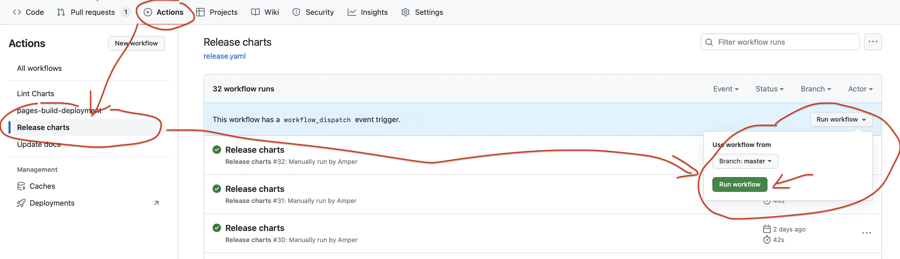

## PreRequisites

1. Make sure you have these tools installed `golang`, `docker`, `make`, `git`, `gcc`, `ca-certificates`, `curl`, `zip`:
1. Make sure you have `enterprise` remote configured

   ```sh
   git remote add enterprise <url>
   ```

1. Replace `origin` remote with `opensource` to avoid accidentally pushing enterprise stuff to public repository.

   ```sh
   git remote remove origin
   git remote add opensource git@github.com:VictoriaMetrics/VictoriaMetrics.git
   ```

1. Make sure you have singing key configured
1. Make sure you have github token with at least `read:org, repo, write:packages` permissions exported under `GITHUB_TOKEN` env variable.
   You can create a token in your [profile settings](https://github.com/settings/tokens)
1. Make sure you're [authorized](https://hub.docker.com/orgs/victoriametrics/settings/enforce-sign-in/windows) for pushing docker images to [docker.io](https://hub.docker.com/u/victoriametrics) and [quay.io](https://quay.io/organization/victoriametrics).

### For MacOS users

Make sure you have GNU version of utilities `zip`, `tar`, `sha256sum`. To install them run the following commands:

```sh
brew install coreutils
brew install gnu-tar
export PATH="/usr/local/opt/coreutils/libexec/gnubin:$PATH"
```

Docker may need additional configuration changes:

```sh
docker buildx create --use --name=qemu
docker buildx inspect --bootstrap
```

By default, docker on MacOS has limited amount of resources (CPU, mem) to use.
Bumping the limits may significantly improve build speed.

## Release

The release process is divided into two steps.

### Step 1

In the first step, which usually takes place on Friday, the binaries are compiled,
release candidate images are built and pushed, a draft GitHub release is created,
and the candidate is deployed to the sandbox environment.

1. Lock merges for 24h with `/mutex merge` in Slack.
1. Make sure you get all changes fetched.

   ```sh
   git fetch opensource
   git fetch enterprise
   ```

1. Make sure all the changes are synced between `master`, `cluster`, `enterprise-single-node` and `enterprise-cluster` branches.
   This serves as a double-check. The synchronization should already have been done by the person who merged a PR.
   You can use the following commands to gather the changes and then compare them using your favorite diff tool.

   ```sh
   git checkout master && git log v1.xx.y..HEAD --oneline > master_changelog.txt
   git checkout cluster && git log v1.xx.y-cluster..HEAD --oneline > cluster_changelog.txt
   git checkout enterprise-single-node && git log v1.xx.y-enterprise..HEAD --oneline > enterprise_changelog.txt
   git checkout enterprise-cluster && git log v1.xx.y-enterprise-cluster..HEAD --oneline > enterprise_cluster_changelog.txt
   ```

1. Review bugfixes in the changelog to determine if they need to be backported to LTS versions.
   Cherry-pick bug fixes relevant for [LTS releases](https://docs.victoriametrics.com/victoriametrics/lts-releases/).
   This serves as a double-check. The initial assessment should already have been done by the person who merged a PR.

1. Make sure tests pass on branches `master`, `cluster`, `enterprise-single-node` and `enterprise-cluster`.

   ```sh
   make test-full
   make check-all
   ```

1. Verify no CVEs in Go code or base images according to the [CVE handling policy](https://docs.victoriametrics.com/victoriametrics/#cve-handling-policy).
   It’s sufficient to run `govulncheck` on the `master` branch since other branches are checked in CI on regular bases. 
   For image scanning, build and check Alpine base image.

   ```sh
   make govulncheck
   
   make package-base
   grype  --only-fixed [base-image-tag]
   ```

1. Re-build `vmui` static files. Static assets needs to be rebuilt separately for oss and enterprise branches (changes should not be cherry-picked between these branches). See [commit example](https://github.com/VictoriaMetrics/VictoriaMetrics/commit/9dde5b8ee3fdc9d4cd495c8118e04ff4ee32e650).

   ```sh
   make vmui-update
   ```

1. Make sure that the release branches have no security issues.
1. Update release versions if needed in [SECURITY.md](https://github.com/VictoriaMetrics/VictoriaMetrics/blob/master/SECURITY.md).
1. Run `PKG_TAG=v1.xx.y make docs-update-version` command to update version help tooltips.
1. Cut new version in [CHANGELOG.md](https://github.com/VictoriaMetrics/VictoriaMetrics/blob/master/docs/victoriametrics/changelog/CHANGELOG.md) and commit it. See example in this [commit](https://github.com/VictoriaMetrics/VictoriaMetrics/commit/b771152039d23b5ccd637a23ea748bc44a9511a7).
1. Create the following release tags:
   * `git tag -s v1.xx.y` in `master` branch
   * `git tag -s v1.xx.y-cluster` in `cluster` branch
   * `git tag -s v1.xx.y-enterprise` in `enterprise-single-node` branch
   * `git tag -s v1.xx.y-enterprise-cluster` in `enterprise-cluster` branch
1. Run `TAG=v1.xx.y EXTRA_DOCKER_TAG_SUFFIX=-rcY make publish-release`. This command performs the following tasks:

   * a) Build and package binaries in `*.tar.gz` release archives with the corresponding `_checksums.txt` files inside `bin` directory.
      This step can be run manually with the command `make release` from the needed git tag.
   * b)  Build and publish [multi-platform Docker images](https://docs.docker.com/build/buildx/multiplatform-images/)
      for the given `TAG`, `TAG-cluster`, `TAG-enterprise` and `TAG-enterprise-cluster`.
      The resulting docker images will have special release candidate suffix for the given `EXTRA_DOCKER_TAG_SUFFIX`.
      The multi-platform Docker image is built for the following platforms:
      * linux/amd64
      * linux/arm64
      * linux/arm
      * linux/ppc64le
      * linux/386
      This step can be run manually with the command `make publish` from the needed git tag.

1. Run `TAG=v1.xx.y make github-create-release github-upload-assets`. This command performs the following tasks:

   * a) Create draft GitHub release with the name `TAG`. This step can be run manually
      with the command `TAG=v1.xx.y make github-create-release`.
      The release id is stored at `/tmp/vm-github-release` file.
   * b) Upload all the binaries and checksums created at step `11a` to that release.
      This step can be run manually with the command `make github-upload-assets`.
      It is expected that the needed release id is stored at `/tmp/vm-github-release` file,
      which must be created at the step `a`.
      If the upload process is interrupted by any reason, then the following recovery steps must be performed:
      * To delete the created draft release by running the command `make github-delete-release`.
        This command expects that the id of the release to delete is located at `/tmp/vm-github-release`
        file created at the step `a`.
      * To run the command `TAG=v1.xx.y make github-create-release github-upload-assets`, so new release is created
        and all the needed assets are re-uploaded to it.

1. Go to <https://github.com/VictoriaMetrics/VictoriaMetrics/releases> and verify that draft release with the name `TAG` has been created
   and this release contains all the needed binaries and checksums.
1. Update the release description with the content of [CHANGELOG](https://github.com/VictoriaMetrics/VictoriaMetrics/blob/master/docs/victoriametrics/changelog/CHANGELOG.md) for this release. **Use "Save Draft" button, do not publish the release yet!**.
1. Follow the instructions in [LTS release](https://github.com/VictoriaMetrics/VictoriaMetrics-enterprise/blob/enterprise-single-node/Release-Guide.md#lts-release).
1. Deploy created images to sandbox environment. Make sure it is deployed and don't introduce any regressions. Follow instructions at [Testing Releases](https://github.com/VictoriaMetrics/VictoriaMetrics-enterprise/blob/enterprise-single-node/Release-Guide.md#testing-releases).

### Step 2

In the second step, typically on Monday, the release candidate's performance in the sandbox is reviewed.
If no issues are found, the release candidate is promoted and officially published and announced to the community.
Version numbers are updated in the codebase, documentation, and related projects.
Issues included in the release are closed, with the comment.

1. Review the performance of the release candidate in the sandbox environment.
   If any issues are found, they must be addressed, and the release process restarted from [Step 1](#step-1) with an incremented release candidate version.
1. Run `TAG=v1.xx.y EXTRA_DOCKER_TAG_SUFFIX=-rc1 make publish-final-images`. This command publishes the final release images from release candidate image for given `EXTRA_DOCKER_TAG_SUFFIX` and updates  `latest` Docker image tag for the given `TAG`.
   This command must be run only for the latest officially published release. It must be skipped when publishing other releases such as
   [LTS releases](https://docs.victoriametrics.com/victoriametrics/lts-releases/) or some test releases.
1. Deploy the final images to the sandbox environment and perform a quick smoke test to verify basic functionality works.
1. Push the tags `v1.xx.y` and `v1.xx.y-cluster` created at previous steps to public GitHub repository at [https://github.com/VictoriaMetrics/VictoriaMetrics](https://github.com/VictoriaMetrics/VictoriaMetrics):

   ```shell
   git push opensource v1.xx.y
   git push opensource v1.xx.y-cluster
   ```

   Push the tags `v1.xx.y`, `v1.xx.y-cluster`, `v1.xx.y-enterprise` and `v1.xx.y-enterprise-cluster` to the corresponding
   branches in private repository:

   ```shell
   git push enterprise v1.xx.y
   git push enterprise v1.xx.y-cluster
   git push enterprise v1.xx.y-enterprise
   git push enterprise v1.xx.y-enterprise-cluster
   ```

   **Important note:** do not push enterprise tags to public GitHub repository - they must be pushed only to private repository.

1. Publish release by pressing "Publish release" green button on GitHub [releases page](https://github.com/VictoriaMetrics/VictoriaMetrics/releases).
1. Update GitHub issues related to the new release. Usually, such issues have a label [waiting for release](https://github.com/VictoriaMetrics/VictoriaMetrics/issues?q=is%3Aopen+is%3Aissue+label%3A%22waiting+for+release%22). Close such issues by mentioning which release they were included into, and remove the label. See an example of a [closed issue](https://github.com/VictoriaMetrics/VictoriaMetrics/issues/6637#issuecomment-2390729511).
1. Bump VictoriaMetrics version at `deployment/docker/*.yml`. For example:

   ```shell
   for f in $(grep "v1\.116\.0" -R deployment/docker/ -l); do sed -i 's/v1.116.0/v1.117.0/g' $f; done
   ```

1. Bump VictoriaMetrics version mentioned in [docs](https://github.com/VictoriaMetrics/VictoriaMetrics/issues/7388).
1. Follow the instructions in [release follow-up](https://github.com/VictoriaMetrics/VictoriaMetrics-enterprise/blob/enterprise-single-node/Release-Guide.md).

#### Operator

The operator repository [https://github.com/VictoriaMetrics/operator/](https://github.com/VictoriaMetrics/operator/)

1. Bump the VictoriaMetrics version in [file `internal/config/config.go`](https://github.com/VictoriaMetrics/operator/blob/master/internal/config/config.go) with new release version for:
   * `VM_METRICS_VERSION` key in `defaultEnvs` map.
   * `BaseOperatorConf.MetricsVersion` default value.
1. Run `make docs`.
1. Add the dependency to the new release to the tip section in `docs/CHANGELOG.md` ([example](https://github.com/VictoriaMetrics/operator/pull/1355/commits/1d7f4439c359b371b05a06e93f615dbcfb266cf5)).
1. Commit and send a PR for review.

#### Helm Charts

The helm chart repository [https://github.com/VictoriaMetrics/helm-charts/](https://github.com/VictoriaMetrics/helm-charts/)

Bump the version of images

> Note that helm charts versioning uses its own versioning scheme. The version of the charts not tied to the version of VictoriaMetrics components.

Bump `appVersion` field in `Chart.yaml` with new release version.
Add new line to "Next release" section in `CHANGELOG.md` about version update (the line must always start with "`-`"). Do **NOT** change headers in `CHANGELOG.md`.
Bump `version` field in `Chart.yaml` with incremental semver version (based on the `CHANGELOG.md` analysis).

Do these updates to the following charts:

1. Update `vmagent` chart `version` and `appVersion` in [`Chart.yaml`](https://github.com/VictoriaMetrics/helm-charts/blob/master/charts/victoria-metrics-agent/Chart.yaml)
1. Update `vmalert` chart `version` and `appVersion` in [`Chart.yaml`](https://github.com/VictoriaMetrics/helm-charts/blob/master/charts/victoria-metrics-alert/Chart.yaml)
1. Update `vmauth` chart `version` and `appVersion` in [`Chart.yaml`](https://github.com/VictoriaMetrics/helm-charts/blob/master/charts/victoria-metrics-auth/Chart.yaml)
1. Update `cluster` chart `version` and `appVersion` in  [`Chart.yaml`](https://github.com/VictoriaMetrics/helm-charts/blob/master/charts/victoria-metrics-cluster/Chart.yaml)
1. Update `distributed` chart `version` and `appVersion` in  [`Chart.yaml`](https://github.com/VictoriaMetrics/helm-charts/blob/master/charts/victoria-metrics-distributed/Chart.yaml)
1. Update `gateway` chart `version` and `appVersion` in  [`Chart.yaml`](https://github.com/VictoriaMetrics/helm-charts/blob/master/charts/victoria-metrics-gateway/Chart.yaml)
1. Update `k8s-stack` chart `version` and `appVersion` in [`Chart.yaml`](https://github.com/VictoriaMetrics/helm-charts/blob/master/charts/victoria-metrics-k8s-stack/Chart.yaml)
1. Update `single` chart `version` and `appVersion` in [`Chart.yaml`](https://github.com/VictoriaMetrics/helm-charts/blob/master/charts/victoria-metrics-single/Chart.yaml)

See commit example of a [helm chart](https://github.com/VictoriaMetrics/helm-charts/commit/0ec3ab81795cb098d4741451b66886cc6d9be36c).

Once updated, run the following commands:

1. Commit and push changes to `master`.
1. Run "Release" action on Github:
   
1. Merge new PRs *"Automatic update CHANGELOGs and READMEs"* and *"Synchronize docs"* after pipelines are complete.

#### Ansible Roles

> Note that ansible playbooks versioning uses its own versioning scheme. The version of the playbooks is not tied to the version of VictoriaMetrics components.

1. Update the version of VictoriaMetrics components at [https://github.com/VictoriaMetrics/ansible-playbooks](https://github.com/VictoriaMetrics/ansible-playbooks).
1. Commit changes.
1. Create a new tag with `git tag -sm <TAG> <TAG>`.
1. Push the changes with the new tag. This automatically publishes the new versions to galaxy.ansible.com.
