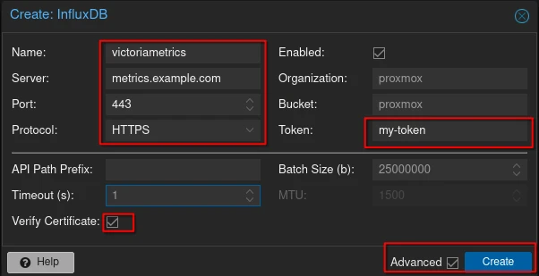

Since Proxmox Virtual Environment(PVE) and Proxmox Backup Server(PBS) support sending data using the InfluxDB 
we can use the InfluxDB write support built into VictoriaMetrics.
Currently, PVE and PBS only support using an Authorization Token for authentication and does not support basic auth 
or a username and password.

## Proxmox Virtual Environment (PVE)

> If you want to send your data to VictoriaMetrics Cloud check out [our blog](https://victoriametrics.com/blog/proxmox-monitoring-with-dbaas/).

1. Login to PVE as an administrator
2. Go to DataCenter > MetricServer > Add > InfluxDB

3. Set the parameters as follows:
  - Name: VictoriaMetrics (can be changed to any string)
  - Server: the hostname or IP of your VictoriaMetrics Instance
  - Port: This will vary depending on how you are sending data to VictoriaMetrics, but the defaults for all components are listed in the [data ingestion documentation](https://docs.victoriametrics.com/data-ingestion.html)
  - Protocol: use HTTPS if you have TLS/SSL configured otherwise use HTTP
  - Organization: leave it empty since it doesn't get used
  - Bucket: leave it empty since it doesn't get used
  - Token: your token from vmauth or leave blank if you don't have authentication enabled
  - If you need to ignore TLS/SSL errors check the advanced box and uncheck the verify certificate box
4. Click the `Create` button

5. Run `system_uptime{object="nodes"}` in vmui or in the explore view in Grafana to verify metrics from PVE are being sent to VictoriaMetrics.
You should see 1 time series per node in your PVE cluster.

## Proxmox Backup Server (PBS)

1. Log in to PBS as an administrator
2. Go to Configuration > Metrics Server > Add > InfluxDB

3.  Set the parameters as follows:
  - Name: VictoriaMetrics (can be set to any string)
  - URL: http(s)://<ip_or_host>:<port>
    - set the URL to HTTPS if you have TLS enabled and HTTP if you do not
    - Port: This will vary depending on how you are sending data to VictoriaMetrics, but the defaults for all components are listed in the [data ingestion documentation](https://docs.victoriametrics.com/data-ingestion.html)
  - Organization: leave it empty since it doesn't get used
  - Bucket: leave it empty since it doesn't get used
  - Token: your token from vmauth or leave blank if you don't have authentication enabled
4. Click the `Create` button

5. Run `cpustat_idle{object="host"}` in vmui or in the explore view in Grafana to verify metrics from PBS are being to VictoriaMetrics.

# References

- [Blog Post for configuring VictoriaMetrics Cloud and Proxmox VE](https://victoriametrics.com/blog/proxmox-monitoring-with-dbaas/)
