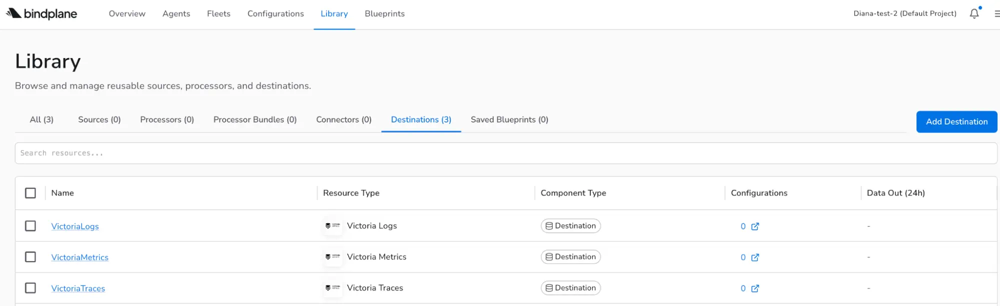
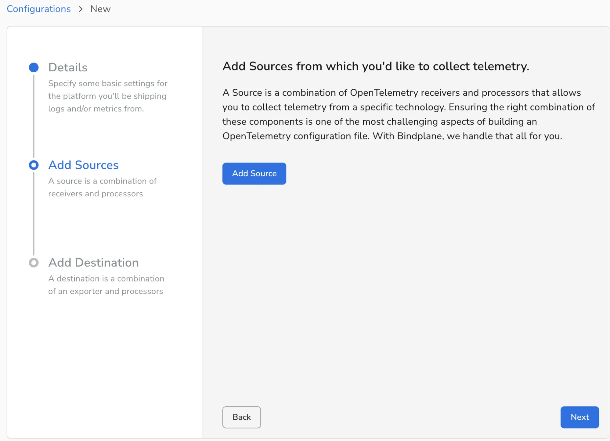
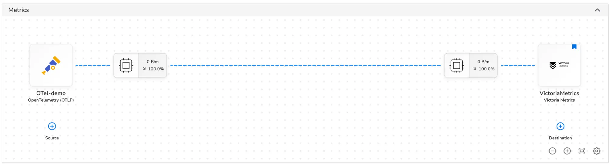

VictoriaMetrics integrates with [Bindplane](https://docs.bindplane.com/) via the [Bindplane application](https://app.bindplane.com/).

## Setup the destination

1. Sign up for a Bindplane account.
2. Go to Agents and install the agent.
3. Go to the Library and Add Destination. Choose VictoriaMetrics.
4. Configure hostname, port, and headers.
5. Name the destination and click on Save.

## Add a configuration

1. Go to Configurations, create Configuration.
2. Give it a name and select the Agent Type and Platform.
3. Add your telemetry sources such as OTLP, Prometheus scrape, or cloud services.
4. Select the destination.

Your integration will be complete and ready to send and receive data.

You can check the global view in the Library to view the resource type, component type and configurations.  

For VictoriaLogs with Bindplane integration, check [this page](https://docs.victoriametrics.com/victorialogs/integrations/bindplane/).