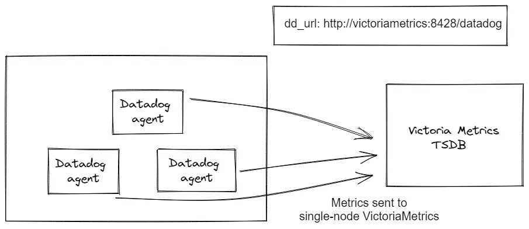
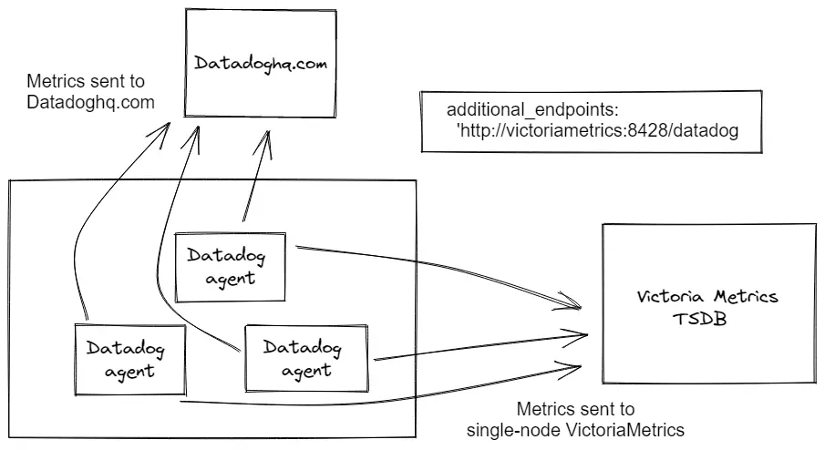

VictoriaMetrics components like **vmagent**, **vminsert** or **single-node** accepts data from [DataDog agent](https://docs.datadoghq.com/agent/),
[DogStatsD](https://docs.datadoghq.com/developers/dogstatsd/) and [DataDog Lambda Extension](https://docs.datadoghq.com/serverless/libraries_integrations/extension/)
via ["submit metrics" API](https://docs.datadoghq.com/api/latest/metrics/#submit-metrics) at `/datadog/api/v2/series` 
or via "sketches" API at `/datadog/api/beta/sketches`.

_For logs ingestion see [DataDog integration with VictoriaLogs](https://docs.victoriametrics.com/victorialogs/data-ingestion/datadog-agent/)._

See full list of DataDog-related configuration flags by running:
```sh
/path/to/victoria-metrics-prod --help | grep datadog
```

See how to send data to VictoriaMetrics via [DataDog "submit metrics" API](https://docs.victoriametrics.com/victoriametrics/url-examples/#datadogapiv2series).
The imported data can be read via [export API](https://docs.victoriametrics.com/victoriametrics/url-examples/#apiv1export).

## Sending metrics to VictoriaMetrics

DataDog agent allows configuring destinations for metrics sending via ENV variable `DD_DD_URL`
or via [configuration file](https://docs.datadoghq.com/agent/guide/agent-configuration-files/) in section `dd_url`.



To configure DataDog agent via ENV variable add the following prefix:
```sh
DD_DD_URL=http://<victoriametrics-addr>:8428/datadog
```
_Replace `<victoriametrics-addr>` with the VictoriaMetrics hostname or IP address._

For cluster version use vminsert address:
```
http://<vminsert-addr>:8480/insert/<tenant>/datadog
```
_Replace `<vminsert-addr>` with the hostname or IP address of vminsert service._

If you have more than 1 vminsert, configure [load-balancing](https://docs.victoriametrics.com/victoriametrics/cluster-victoriametrics/#cluster-setup).
Replace `<tenant>` based on your [multitenancy settings](https://docs.victoriametrics.com/victoriametrics/cluster-victoriametrics/#multitenancy).

To configure DataDog agent via [configuration file](https://github.com/DataDog/datadog-agent/blob/878600ef7a55c5ef0efb41ed0915f020cf7e3bd0/pkg/config/config_template.yaml#L33)
add the following line:
```yaml
dd_url: http://<victoriametrics-addr>:8428/datadog
```

## Sending metrics to DataDog and VictoriaMetrics

DataDog allows configuring [Dual Shipping](https://docs.datadoghq.com/agent/guide/dual-shipping/) via ENV variable 
`DD_ADDITIONAL_ENDPOINTS` or via configuration file `additional_endpoints`.



Run DataDog agent using the following ENV variable with VictoriaMetrics as additional metrics receiver:
```sh
DD_ADDITIONAL_ENDPOINTS='{\"http://<victoriametrics-addr>:8428/datadog\": [\"apikey\"]}'
```

To configure DataDog Dual Shipping via [configuration file](https://docs.datadoghq.com/agent/guide/agent-configuration-files)
add the following line:

```yaml
additional_endpoints:
  "http://<victoriametrics-addr>:8428/datadog":
  - apikey
```

## Serverless DataDog plugin

Disable logs (logs ingestion is not supported by VictoriaMetrics) and set a custom endpoint in `serverless.yaml`:
```yaml
custom:
  datadog:
    enableDDLogs: false             # VictoriaMetrics doesn't support logs ingestion.
    apiKey: fakekey                 # Set any key, otherwise plugin fails
provider:
  environment:
    DD_DD_URL: <victoriametrics-addr>:8428/datadog   # VictoriaMetrics endpoint for DataDog
```

_For logs ingestion see [DataDog integration with VictoriaLogs](https://docs.victoriametrics.com/victorialogs/data-ingestion/datadog-agent/)._

## Additional details

VictoriaMetrics automatically sanitizes metric names for the data ingested via DataDog protocol
according to [DataDog metric naming recommendations](https://docs.datadoghq.com/metrics/custom_metrics/#naming-custom-metrics).
If you need accepting metric names as is without sanitizing, then pass `-datadog.sanitizeMetricName=false` command-line flag to VictoriaMetrics.

Extra labels may be added to all the written time series by passing `extra_label=name=value` query args.
For example, `/datadog/api/v2/series?extra_label=foo=bar` would add `{foo="bar"}` label to all the ingested metrics.

DataDog agent sends the [configured tags](https://docs.datadoghq.com/getting_started/tagging/) to
undocumented endpoint - `/datadog/intake`. This endpoint isn't supported by VictoriaMetrics yet.
This prevents from adding the configured tags to DataDog agent data sent into VictoriaMetrics.
The workaround is to run a sidecar [vmagent](https://docs.victoriametrics.com/victoriametrics/vmagent/) alongside every DataDog agent,
which must run with `DD_DD_URL=http://localhost:8429/datadog` environment variable.
The sidecar `vmagent` must be configured with the needed tags via `-remoteWrite.label` command-line flag and must forward
incoming data with the added tags to a centralized VictoriaMetrics specified via `-remoteWrite.url` command-line flag.

See [how to add labels to metrics](https://docs.victoriametrics.com/victoriametrics/vmagent/#adding-labels-to-metrics) on ingestion.
