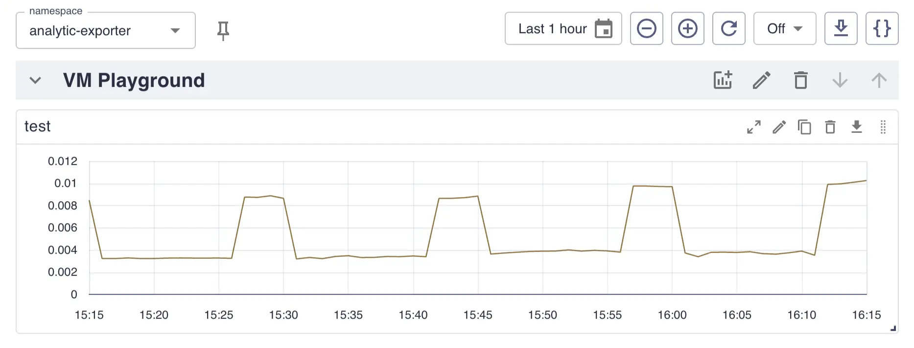
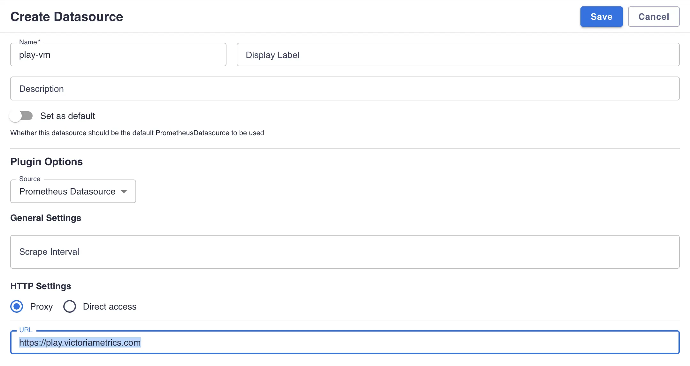
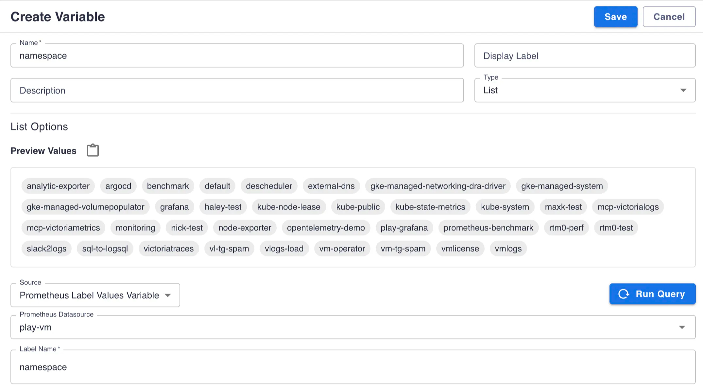
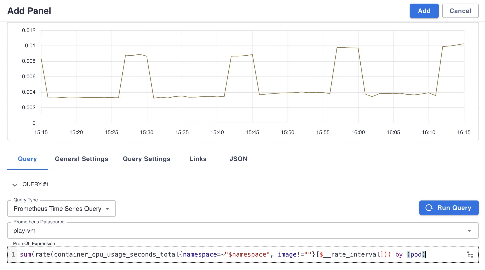

Since VictoriaMetrics is Prometheus-compatible TSDB it's possible to use set of Prometheus plugins for [Perses](https://perses.dev/).

# Plugins setup

## Datasource plugin

* Go to `http://<perses-url>/projects/<project-name>/datasources` and click `ADD DATASOURCE`.
* Fill `Name` field with desired datasource name and select `Prometheus Datasource` in `Source` dropdown.
* Choose `Proxy` or `Direct access` depending on the public availability of your VictoriaMetrics instance.
* Click `Save` to submit.

## Variables plugin

* Go to `http://<perses-url>/projects/<project-name>/variables` and click `ADD VARIABLE`.
* Fill `Name` field with desired variable name.
* Select `List` in `Type` dropdown.
* Select `Prometheus Label Values Variable` in `Source` dropdown.
* Select the Prometheus datasource you created above from the `Prometheus Datasource` dropdown.
* Type name of label to extract values for in `Label Name` field.
* Click `Save` to submit.

# Create panels

## Time Series Panel

* Go to project dashboard page `http://<perses-url>/projects/<project-name>/dashboards/<dashboard-name>`, click `Edit` and then `Panel` buttons.
* Fill `Name` field with desired panel name.
* Select `Time Series Chart` in `Type` dropdown.
* Select `Prometheus Time Series Query` in `Query Type` dropdown.
* Select the Prometheus datasource you configured above from the `Prometheus Datasource` dropdown.
* Type a valid [MetricsQL expression](https://docs.victoriametrics.com/victoriametrics/metricsql) you want to build a graph for in `PromQL Expression` field. It may reference a variable defined in variables plugin section using `${var-name}` expression or with specific formats like `${var:pipe}` for regex filters or `${var:csv}` for comma-separated values.
* Click `Add` to save a panel.

