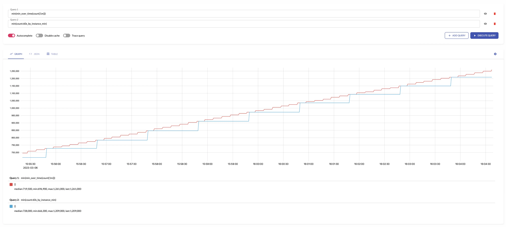
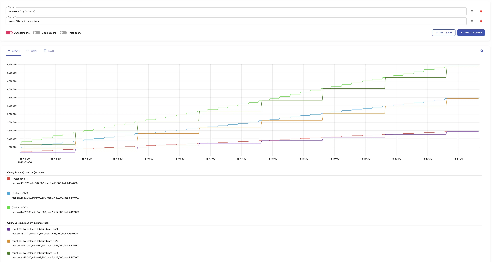

Stream aggregation can be configured via the following command-line flags:

- `-streamAggr.config` at [single-node VictoriaMetrics](https://docs.victoriametrics.com/victoriametrics/single-server-victoriametrics/)
  and at [vmagent](https://docs.victoriametrics.com/victoriametrics/vmagent/).
- `-remoteWrite.streamAggr.config` at [vmagent](https://docs.victoriametrics.com/victoriametrics/vmagent/) only. This flag can be specified individually
  per each `-remoteWrite.url`, so the aggregation happens independently per each remote storage destination.
  This allows writing different aggregates to different remote storage systems.

These flags must point to a file containing [stream aggregation config](https://docs.victoriametrics.com/victoriametrics/stream-aggregation/configuration/#aggregation-config).
The file may contain `%{ENV_VAR}` placeholders which are substituted by the corresponding `ENV_VAR` environment variable values.

By default, the following data is written to the storage when stream aggregation is enabled:

- the aggregated samples;
- the raw input samples, which didn't match any `match` option in the provided [config](https://docs.victoriametrics.com/victoriametrics/stream-aggregation/configuration/#aggregation-config).

This behaviour can be changed via the following command-line flags:

- `-streamAggr.keepInput` at [single-node VictoriaMetrics](https://docs.victoriametrics.com/victoriametrics/single-server-victoriametrics/)
  and [vmagent](https://docs.victoriametrics.com/victoriametrics/vmagent/). At [vmagent](https://docs.victoriametrics.com/victoriametrics/vmagent/)
  `-remoteWrite.streamAggr.keepInput` flag can be specified individually per each `-remoteWrite.url`.
  If one of these flags is set, then all the input samples are written to the storage alongside the aggregated samples.
- `-streamAggr.dropInput` at [single-node VictoriaMetrics](https://docs.victoriametrics.com/victoriametrics/single-server-victoriametrics/)
  and [vmagent](https://docs.victoriametrics.com/victoriametrics/vmagent/). At [vmagent](https://docs.victoriametrics.com/victoriametrics/vmagent/)
  `-remoteWrite.streamAggr.dropInput` flag can be specified individually per each `-remoteWrite.url`.
  If one of these flags are set, then all the input samples are dropped, while only the aggregated samples are written to the storage.

## Stream aggregation config

Below is the format for stream aggregation config file, which may be referred via `-streamAggr.config` command-line flag at
[single-node VictoriaMetrics](https://docs.victoriametrics.com/victoriametrics/single-server-victoriametrics/) and [vmagent](https://docs.victoriametrics.com/victoriametrics/vmagent/).
At [vmagent](https://docs.victoriametrics.com/victoriametrics/vmagent/) `-remoteWrite.streamAggr.config` command-line flag can be
specified individually per each `-remoteWrite.url`:

```yaml

  # name is an optional name of the given streaming aggregation config.
  #
  # If it is set, then it is used as `name` label in the exposed metrics
  # for the given aggregation config at /metrics page.
  # See https://docs.victoriametrics.com/victoriametrics/vmagent/#monitoring and https://docs.victoriametrics.com/victoriametrics/single-server-victoriametrics/#monitoring
- name: 'foobar'

  # match is an optional filter for incoming samples to aggregate.
  # It can contain arbitrary Prometheus series selector
  # according to https://docs.victoriametrics.com/victoriametrics/keyconcepts/#filtering .
  # If match isn't set, then all the incoming samples are aggregated.
  #
  # match also can contain a list of series selectors. Then the incoming samples are aggregated
  # if they match at least a single series selector.
  #
  match: 'http_request_duration_seconds_bucket{env=~"prod|staging"}'

  # interval is the interval for the aggregation.
  # The aggregated stats is sent to remote storage once per interval.
  #
  interval: 1m

  # dedup_interval is an optional interval for de-duplication of input samples before the aggregation.
  # Samples are de-duplicated on a per-series basis. See https://docs.victoriametrics.com/victoriametrics/keyconcepts/#time-series
  # and https://docs.victoriametrics.com/victoriametrics/single-server-victoriametrics/#deduplication
  # The deduplication is performed after input_relabel_configs relabeling is applied.
  # By default, the deduplication is disabled unless -remoteWrite.streamAggr.dedupInterval or -streamAggr.dedupInterval
  # command-line flags are set.
  #
  # dedup_interval: 30s

  # enable_windows is a boolean option to enable fixed aggregation windows.
  # See https://docs.victoriametrics.com/victoriametrics/stream-aggregation/#aggregation-windows
  #
  # enable_windows: true

  # staleness_interval is an optional interval for resetting the per-series state if no new samples
  # are received during this interval for the following outputs:
  # - histogram_bucket
  # - increase
  # - increase_prometheus
  # - rate_avg
  # - rate_sum
  # - total
  # - total_prometheus
  # See https://docs.victoriametrics.com/victoriametrics/stream-aggregation/#staleness for more details.
  #
  # staleness_interval: 2m
  
  # no_align_flush_to_interval disables aligning of flush times for the aggregated data to multiples of interval.
  # By default, flush times for the aggregated data is aligned to multiples of interval.
  # For example:
  # - if `interval: 1m` is set, then flushes happen at the end of every minute,
  # - if `interval: 1h` is set, then flushes happen at the end of every hour
  #
  # no_align_flush_to_interval: false

  # flush_on_shutdown instructs to flush aggregated data to the storage on the first and the last intervals
  # during vmagent starts, restarts or configuration reloads.
  # Incomplete aggregated data isn't flushed to the storage by default, since it is usually confusing.
  #
  # flush_on_shutdown: false

  # without is an optional list of labels, which must be removed from the output aggregation.
  # See https://docs.victoriametrics.com/victoriametrics/stream-aggregation/#aggregating-by-labels
  #
  # without: [instance]

  # by is an optional list of labels, which must be preserved in the output aggregation.
  # See https://docs.victoriametrics.com/victoriametrics/stream-aggregation/#aggregating-by-labels
  #
  # by: [job, vmrange]

  # outputs is the list of unique aggregations to perform on the input data.
  # See https://docs.victoriametrics.com/victoriametrics/stream-aggregation/#aggregation-outputs
  #
  outputs: [total]

  # keep_metric_names instructs keeping the original metric names for the aggregated samples.
  # This option can't be enabled together with `-streamAggr.keepInput` or `-remoteWrite.streamAggr.keepInput`.
  # This option can be set only if outputs list contains a single output.
  # By default, a special suffix is added to original metric names in the aggregated samples.
  # See https://docs.victoriametrics.com/victoriametrics/stream-aggregation/#output-metric-names
  #
  # keep_metric_names: false

  # ignore_old_samples instructs ignoring input samples with old timestamps outside the current aggregation interval.
  # See https://docs.victoriametrics.com/victoriametrics/stream-aggregation/#ignoring-old-samples
  # See also -remoteWrite.streamAggr.ignoreOldSamples and -streamAggr.ignoreOldSamples command-line flag.
  #
  # ignore_old_samples: false

  # ignore_first_intervals instructs ignoring the first N aggregation intervals after process start.
  # See https://docs.victoriametrics.com/victoriametrics/stream-aggregation/#ignore-aggregation-intervals-on-start
  # See also -remoteWrite.streamAggr.ignoreFirstIntervals and -streamAggr.ignoreFirstIntervals command-line flags.
  #
  # ignore_first_intervals: N

  # drop_input_labels instructs dropping the given labels from input samples.
  # The labels' dropping is performed before input_relabel_configs are applied.
  # This also means that the labels are dropped before de-duplication ( https://docs.victoriametrics.com/victoriametrics/stream-aggregation/#deduplication )
  # and stream aggregation.
  #
  # drop_input_labels: [replica, availability_zone]

  # input_relabel_configs is an optional relabeling rules,
  # which are applied to the incoming samples after they pass the match filter
  # and before being aggregated.
  # See https://docs.victoriametrics.com/victoriametrics/stream-aggregation/#relabeling
  #
  input_relabel_configs:
  - target_label: vmaggr
    replacement: before

  # output_relabel_configs is an optional relabeling rules,
  # which are applied to the aggregated output metrics.
  #
  output_relabel_configs:
  - target_label: vmaggr
    replacement: after
```

The file can contain multiple aggregation configs. The aggregation is performed independently
per each specified config entry.

### Configuration update

[vmagent](https://docs.victoriametrics.com/victoriametrics/vmagent/) and [single-node VictoriaMetrics](https://docs.victoriametrics.com/victoriametrics/single-server-victoriametrics/)
support the following approaches for hot reloading stream aggregation configs from `-remoteWrite.streamAggr.config` and `-streamAggr.config`:

* By sending `SIGHUP` signal to `vmagent` or `victoria-metrics` process:

  ```sh
  kill -SIGHUP `pidof vmagent`
  ```

* By sending HTTP request to `/-/reload` endpoint (e.g. `http://vmagent:8429/-/reload` or `http://victoria-metrics:8428/-/reload`).

## Aggregation outputs

The aggregations are calculated during the `interval` specified in the [config](https://docs.victoriametrics.com/victoriametrics/stream-aggregation/configuration/#aggregation-config)
and then sent to the storage once per `interval`. The aggregated samples are named according to [output metric naming](https://docs.victoriametrics.com/victoriametrics/stream-aggregation/#output-metric-names).

If `by` and `without` lists are specified in the [config](https://docs.victoriametrics.com/victoriametrics/stream-aggregation/configuration/#aggregation-config),
then the [aggregation by labels](https://docs.victoriametrics.com/victoriametrics/stream-aggregation/#aggregating-by-labels) is performed additionally to aggregation by `interval`.

Below are aggregation functions that can be put in the `outputs` list at [stream aggregation config](https://docs.victoriametrics.com/victoriametrics/stream-aggregation/configuration/#aggregation-config):

* [avg](#avg)
* [count_samples](#count_samples)
* [count_series](#count_series)
* [histogram_bucket](#histogram_bucket)
* [increase](#increase)
* [increase_prometheus](#increase_prometheus)
* [last](#last)
* [max](#max)
* [min](#min)
* [rate_avg](#rate_avg)
* [rate_sum](#rate_sum)
* [stddev](#stddev)
* [stdvar](#stdvar)
* [sum_samples](#sum_samples)
* [total](#total)
* [total_prometheus](#total_prometheus)
* [unique_samples](#unique_samples)
* [quantiles](#quantiles)

### avg

`avg` returns the average over input [sample values](https://docs.victoriametrics.com/victoriametrics/keyconcepts/#raw-samples).
`avg` makes sense only for aggregating [gauges](https://docs.victoriametrics.com/victoriametrics/keyconcepts/#gauge).

The results of `avg` is equal to the following [MetricsQL](https://docs.victoriametrics.com/victoriametrics/metricsql/) query:

```metricsql
sum(sum_over_time(some_metric[interval])) / sum(count_over_time(some_metric[interval]))
```

For example, see below time series produced by config with aggregation interval `1m` and `by: ["instance"]` and  the regular query:


See also:

- [max](#max)
- [min](#min)
- [quantiles](#quantiles)
- [sum_samples](#sum_samples)
- [count_samples](#count_samples)

### count_samples

`count_samples` counts the number of input [samples](https://docs.victoriametrics.com/victoriametrics/keyconcepts/#raw-samples) over the given `interval`.

The results of `count_samples` is equal to the following [MetricsQL](https://docs.victoriametrics.com/victoriametrics/metricsql/) query:

```metricsql
sum(count_over_time(some_metric[interval]))
```

See also:

- [count_series](#count_series)
- [sum_samples](#sum_samples)

### count_series

`count_series` counts the number of unique [time series](https://docs.victoriametrics.com/victoriametrics/keyconcepts/#time-series) over the given `interval`.

The results of `count_series` is equal to the following [MetricsQL](https://docs.victoriametrics.com/victoriametrics/metricsql/) query:

```metricsql
count(last_over_time(some_metric[interval]))
```

See also:

- [count_samples](#count_samples)
- [unique_samples](#unique_samples)

### histogram_bucket

`histogram_bucket` returns [VictoriaMetrics histogram buckets](https://valyala.medium.com/improving-histogram-usability-for-prometheus-and-grafana-bc7e5df0e350)
for the input [sample values](https://docs.victoriametrics.com/victoriametrics/keyconcepts/#raw-samples) over the given `interval`.
`histogram_bucket` makes sense only for aggregating [gauges](https://docs.victoriametrics.com/victoriametrics/keyconcepts/#gauge).
See how to aggregate regular histograms [here](https://docs.victoriametrics.com/victoriametrics/stream-aggregation/#aggregating-histograms).

The results of `histogram_bucket` is equal to the following [MetricsQL](https://docs.victoriametrics.com/victoriametrics/metricsql/) query:

```metricsql
sum(histogram_over_time(some_histogram_bucket[interval])) by (vmrange)
```

Aggregating irregular and sporadic metrics (received from [Lambdas](https://aws.amazon.com/lambda/)
or [Cloud Functions](https://cloud.google.com/functions)) can be controlled via [staleness_interval](https://docs.victoriametrics.com/victoriametrics/stream-aggregation/#staleness) option.

See also:
- [quantiles](#quantiles)
- [avg](#avg)
- [max](#max)
- [min](#min)

### increase

`increase` returns the increase of input [time series](https://docs.victoriametrics.com/victoriametrics/keyconcepts/#time-series) over the given 'interval'.
`increase` makes sense only for aggregating [counters](https://docs.victoriametrics.com/victoriametrics/keyconcepts/#counter).

The results of `increase` is equal to the following [MetricsQL](https://docs.victoriametrics.com/victoriametrics/metricsql/) query:

```metricsql
sum(increase_pure(some_counter[interval]))
```

`increase` assumes that all the counters start from 0. For example, if the first seen sample for new [time series](https://docs.victoriametrics.com/victoriametrics/keyconcepts/#time-series)
is `10`, then `increase` assumes that the time series has been increased by `10`. If you need ignoring the first sample for new time series,
then take a look at [increase_prometheus](#increase_prometheus).

For example, see below time series produced by config with aggregation interval `1m` and `by: ["instance"]` and the regular query:


Aggregating irregular and sporadic metrics (received from [Lambdas](https://aws.amazon.com/lambda/)
or [Cloud Functions](https://cloud.google.com/functions)) can be controlled via [staleness_interval](https://docs.victoriametrics.com/victoriametrics/stream-aggregation/#staleness) option.

See also:

- [increase_prometheus](#increase_prometheus)
- [total](#total)
- [rate_avg](#rate_avg)
- [rate_sum](#rate_sum)

### increase_prometheus

`increase_prometheus` returns the increase of input [time series](https://docs.victoriametrics.com/victoriametrics/keyconcepts/#time-series) over the given `interval`.
`increase_prometheus` makes sense only for aggregating [counters](https://docs.victoriametrics.com/victoriametrics/keyconcepts/#counter).

The results of `increase_prometheus` is equal to the following [MetricsQL](https://docs.victoriametrics.com/victoriametrics/metricsql/) query:

```metricsql
sum(increase_prometheus(some_counter[interval]))
```

`increase_prometheus` skips the first seen sample value per each [time series](https://docs.victoriametrics.com/victoriametrics/keyconcepts/#time-series).
If you need taking into account the first sample per time series, then take a look at [increase](#increase).

Aggregating irregular and sporadic metrics (received from [Lambdas](https://aws.amazon.com/lambda/)
or [Cloud Functions](https://cloud.google.com/functions)) can be controlled via [staleness_interval](https://docs.victoriametrics.com/victoriametrics/stream-aggregation/#staleness) option.

See also:

- [increase](#increase)
- [rate_avg](#rate_avg)
- [rate_sum](#rate_sum)
- [total](#total)
- [total_prometheus](#total_prometheus)

### last

`last` returns the last input [sample value](https://docs.victoriametrics.com/victoriametrics/keyconcepts/#raw-samples) over the given `interval`.

The results of `last` is roughly equal to the following [MetricsQL](https://docs.victoriametrics.com/victoriametrics/metricsql/) query:

```metricsql
last_over_time(some_metric[interval])
```

See also:

- [avg](#avg)
- [max](#max)
- [min](#min)
- [quantiles](#quantiles)

### max

`max` returns the maximum input [sample value](https://docs.victoriametrics.com/victoriametrics/keyconcepts/#raw-samples) over the given `interval`.

The results of `max` is equal to the following [MetricsQL](https://docs.victoriametrics.com/victoriametrics/metricsql/) query:

```metricsql
max(max_over_time(some_metric[interval]))
```

For example, see below time series produced by config with aggregation interval `1m` and the regular query:


See also:

- [min](#min)
- [avg](#avg)
- [last](#last)
- [quantiles](#quantiles)

### min

`min` returns the minimum input [sample value](https://docs.victoriametrics.com/victoriametrics/keyconcepts/#raw-samples) over the given `interval`.

The results of `min` is equal to the following [MetricsQL](https://docs.victoriametrics.com/victoriametrics/metricsql/) query:

```metricsql
min(min_over_time(some_metric[interval]))
```

For example, see below time series produced by config with aggregation interval `1m` and the regular query:



See also:

- [max](#max)
- [avg](#avg)
- [last](#last)
- [quantiles](#quantiles)

### rate_avg

`rate_avg` returns the average of average per-second increase rates across input [time series](https://docs.victoriametrics.com/victoriametrics/keyconcepts/#time-series) over the given `interval`.
`rate_avg` makes sense only for aggregating [counters](https://docs.victoriametrics.com/victoriametrics/keyconcepts/#counter).

The results of `rate_avg` are equal to the following [MetricsQL](https://docs.victoriametrics.com/victoriametrics/metricsql/) query:

```metricsql
avg(rate(some_counter[interval]))
```

See also:

- [rate_sum](#rate_sum)
- [increase](#increase)
- [total](#total)

### rate_sum

`rate_sum` returns the sum of average per-second increase rates across input [time series](https://docs.victoriametrics.com/victoriametrics/keyconcepts/#time-series) over the given `interval`.
`rate_sum` makes sense only for aggregating [counters](https://docs.victoriametrics.com/victoriametrics/keyconcepts/#counter).

The results of `rate_sum` are equal to the following [MetricsQL](https://docs.victoriametrics.com/victoriametrics/metricsql/) query:

```metricsql
sum(rate(some_counter[interval]))
```

See also:

- [rate_avg](#rate_avg)
- [increase](#increase)
- [total](#total)

### stddev

`stddev` returns [standard deviation](https://en.wikipedia.org/wiki/Standard_deviation) for the input [sample values](https://docs.victoriametrics.com/victoriametrics/keyconcepts/#raw-samples)
over the given `interval`.
`stddev` makes sense only for aggregating [gauges](https://docs.victoriametrics.com/victoriametrics/keyconcepts/#gauge).

The results of `stddev` is roughly equal to the following [MetricsQL](https://docs.victoriametrics.com/victoriametrics/metricsql/) query:

```metricsql
histogram_stddev(sum(histogram_over_time(some_metric[interval])) by (vmrange))
```

See also:

- [stdvar](#stdvar)
- [avg](#avg)
- [quantiles](#quantiles)

### stdvar

`stdvar` returns [standard variance](https://en.wikipedia.org/wiki/Variance) for the input [sample values](https://docs.victoriametrics.com/victoriametrics/keyconcepts/#raw-samples)
over the given `interval`.
`stdvar` makes sense only for aggregating [gauges](https://docs.victoriametrics.com/victoriametrics/keyconcepts/#gauge).

The results of `stdvar` is roughly equal to the following [MetricsQL](https://docs.victoriametrics.com/victoriametrics/metricsql/) query:

```metricsql
histogram_stdvar(sum(histogram_over_time(some_metric[interval])) by (vmrange))
```

For example, see below time series produced by config with aggregation interval `1m` and the regular query:


See also:

- [stddev](#stddev)
- [avg](#avg)
- [quantiles](#quantiles)

### sum_samples

`sum_samples` sums input [sample values](https://docs.victoriametrics.com/victoriametrics/keyconcepts/#raw-samples) over the given `interval`.
`sum_samples` makes sense only for aggregating [gauges](https://docs.victoriametrics.com/victoriametrics/keyconcepts/#gauge).

The results of `sum_samples` is equal to the following [MetricsQL](https://docs.victoriametrics.com/victoriametrics/metricsql/) query:

```metricsql
sum(sum_over_time(some_metric[interval]))
```

For example, see below time series produced by config with aggregation interval `1m` and the regular query:


See also:

- [count_samples](#count_samples)
- [count_series](#count_series)

### total

`total` generates output [counter](https://docs.victoriametrics.com/victoriametrics/keyconcepts/#counter) by summing the input counters over the given `interval`.
`total` makes sense only for aggregating [counters](https://docs.victoriametrics.com/victoriametrics/keyconcepts/#counter).

The results of `total` is roughly equal to the following [MetricsQL](https://docs.victoriametrics.com/victoriametrics/metricsql/) query:

```metricsql
sum(running_sum(increase_pure(some_counter)))
```

`total` assumes that all the counters start from 0. For example, if the first seen sample for new [time series](https://docs.victoriametrics.com/victoriametrics/keyconcepts/#time-series)
is `10`, then `total` assumes that the time series has been increased by `10`. If you need ignoring the first sample for new time series,
then take a look at [total_prometheus](#total_prometheus).

For example, see below time series produced by config with aggregation interval `1m` and `by: ["instance"]` and the regular query:



`total` is not affected by [counter resets](https://docs.victoriametrics.com/victoriametrics/keyconcepts/#counter) -
it continues to increase monotonically with respect to the previous value.
The counters are most often reset when the application is restarted.

For example:


The same behavior occurs when creating or deleting new series in an aggregation group -
`total` output increases monotonically considering the values of the series set.
An example of changing a set of series can be restarting a pod in the Kubernetes.
This changes pod name label, but the `total` accounts for such a scenario and doesn't reset the state of aggregated metric.

Aggregating irregular and sporadic metrics (received from [Lambdas](https://aws.amazon.com/lambda/)
or [Cloud Functions](https://cloud.google.com/functions)) can be controlled via [staleness_interval](https://docs.victoriametrics.com/victoriametrics/stream-aggregation/#staleness) option.

See also:

- [total_prometheus](#total_prometheus)
- [increase](#increase)
- [increase_prometheus](#increase_prometheus)
- [rate_sum](#rate_sum)
- [rate_avg](#rate_avg)

### total_prometheus

`total_prometheus` generates output [counter](https://docs.victoriametrics.com/victoriametrics/keyconcepts/#counter) by summing the input counters over the given `interval`.
`total_prometheus` makes sense only for aggregating [counters](https://docs.victoriametrics.com/victoriametrics/keyconcepts/#counter).

The results of `total_prometheus` is roughly equal to the following [MetricsQL](https://docs.victoriametrics.com/victoriametrics/metricsql/) query:

```metricsql
sum(running_sum(increase_prometheus(some_counter)))
```

`total_prometheus` skips the first seen sample value per each [time series](https://docs.victoriametrics.com/victoriametrics/keyconcepts/#time-series).
If you need taking into account the first sample per time series, then take a look at [total](#total).

`total_prometheus` is not affected by [counter resets](https://docs.victoriametrics.com/victoriametrics/keyconcepts/#counter) -
it continues to increase monotonically with respect to the previous value.
The counters are most often reset when the application is restarted.

Aggregating irregular and sporadic metrics (received from [Lambdas](https://aws.amazon.com/lambda/)
or [Cloud Functions](https://cloud.google.com/functions)) can be controlled via [staleness_interval](https://docs.victoriametrics.com/victoriametrics/stream-aggregation/#staleness) option.

See also:

- [total](#total)
- [increase](#increase)
- [increase_prometheus](#increase_prometheus)
- [rate_sum](#rate_sum)
- [rate_avg](#rate_avg)

### unique_samples

`unique_samples` counts the number of unique sample values over the given `interval`.
`unique_samples` makes sense only for aggregating [gauges](https://docs.victoriametrics.com/victoriametrics/keyconcepts/#gauge).

The results of `unique_samples` is equal to the following [MetricsQL](https://docs.victoriametrics.com/victoriametrics/metricsql/) query:

```metricsql
count(count_values_over_time(some_metric[interval]))
```

See also:

- [sum_samples](#sum_samples)
- [count_series](#count_series)

### quantiles

`quantiles(phi1, ..., phiN)` returns [percentiles](https://en.wikipedia.org/wiki/Percentile) for the given `phi*`
over the input [sample values](https://docs.victoriametrics.com/victoriametrics/keyconcepts/#raw-samples) on the given `interval`.
`phi` must be in the range `[0..1]`, where `0` means `0th` percentile, while `1` means `100th` percentile.
`quantiles(...)` makes sense only for aggregating [gauges](https://docs.victoriametrics.com/victoriametrics/keyconcepts/#gauge).

The results of `quantiles(phi1, ..., phiN)` is equal to the following [MetricsQL](https://docs.victoriametrics.com/victoriametrics/metricsql/) query:

```metricsql
histogram_quantiles("quantile", phi1, ..., phiN, sum(histogram_over_time(some_metric[interval])) by (vmrange))
```

See also:

- [histogram_bucket](#histogram_bucket)
- [avg](#avg)
- [max](#max)
- [min](#min)
