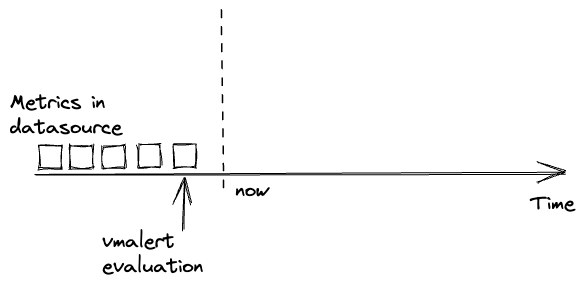

`vmalert` executes a list of the given [alerting](https://docs.victoriametrics.com/victoriametrics/vmalert/#alerting-rules)
or [recording](https://docs.victoriametrics.com/victoriametrics/vmalert/#recording-rules)
rules against configured `-datasource.url`. For sending alerting notifications
`vmalert` relies on [Alertmanager](https://github.com/prometheus/alertmanager) configured via `-notifier.url` flag.
Recording rules results are persisted via [remote write](https://prometheus.io/docs/prometheus/latest/storage/#remote-storage-integrations)
protocol and require `-remoteWrite.url` to be configured.
`vmalert` is heavily inspired by [Prometheus](https://prometheus.io/docs/alerting/latest/overview/)
implementation and aims to be compatible with its syntax.

Configure `-vmalert.proxyURL` on VictoriaMetrics [single-node](https://docs.victoriametrics.com/victoriametrics/single-server-victoriametrics/#vmalert)
or [vmselect in cluster version](https://docs.victoriametrics.com/victoriametrics/cluster-victoriametrics/#vmalert)
to proxy requests to `vmalert`. Proxying is needed for the following cases:

* to proxy requests from [Grafana Alerting UI](https://grafana.com/docs/grafana/latest/alerting/);
* to access `vmalert`'s UI through [vmui](https://docs.victoriametrics.com/victoriametrics/#vmui).

[VictoriaMetrics Cloud](https://console.victoriametrics.cloud/signUp?utm_source=website&utm_campaign=docs_vm_vmalert_intro)
provides out-of-the-box alerting functionality based on `vmalert`. This service simplifies the setup
and management of alerting and recording rules as well as the integration with Alertmanager. For more details,
please refer to the [VictoriaMetrics Cloud documentation](https://docs.victoriametrics.com/victoriametrics-cloud/alertmanager-setup-for-deployment/).

## Features

* Integration with [VictoriaMetrics](https://github.com/VictoriaMetrics/VictoriaMetrics) and [MetricsQL](https://docs.victoriametrics.com/victoriametrics/metricsql/);
* Integration with [VictoriaLogs](https://docs.victoriametrics.com/victorialogs/) and [LogsQL](https://docs.victoriametrics.com/victorialogs/logsql/). See [this doc](https://docs.victoriametrics.com/victorialogs/vmalert/);
* Prometheus [alerting rules definition format](https://prometheus.io/docs/prometheus/latest/configuration/alerting_rules/#defining-alerting-rules)
  support;
* Integration with [Alertmanager](https://github.com/prometheus/alertmanager) starting from [Alertmanager v0.16.0-alpha](https://github.com/prometheus/alertmanager/releases/tag/v0.16.0-alpha.0);
* Keeps the alerts [state on restarts](#alerts-state-on-restarts);
* Graphite datasource can be used for alerting and recording rules. See [these docs](#graphite);
* Recording and Alerting rules backfilling (aka `replay`). See [these docs](#rules-backfilling);
* Lightweight and without extra dependencies.
* Supports [reusable templates](#reusable-templates) for annotations;
* Load of recording and alerting rules from local filesystem, URL, GCS and S3;
* Detect alerting rules which [don't match any series](https://github.com/VictoriaMetrics/VictoriaMetrics/issues/4039).

## Limitations

* `vmalert` execute queries against remote datasource which has reliability risks because of the network.
  It is recommended to configure alerts thresholds and rules expressions with the understanding that network
  requests may fail;
* `vmalert` executes rules within a group sequentially, but persistence of execution results to remote
  storage is asynchronous. Hence, user shouldn't rely on chaining of recording rules when result of previous
  recording rule is reused in the next one. See how to [chain groups](https://docs.victoriametrics.com/victoriametrics/vmalert/#chaining-groups).

## QuickStart

To start using `vmalert` you will need the following things:

* list of rules - PromQL/MetricsQL expressions to execute;
* datasource address - reachable endpoint with [Prometheus HTTP API](https://prometheus.io/docs/prometheus/latest/querying/api/#http-api) support for running queries against;
* notifier address [optional] - reachable [Alert Manager](https://github.com/prometheus/alertmanager) instance for processing,
  aggregating alerts, and sending notifications. Please note, notifier address also supports Consul and DNS Service Discovery via
  [config file](https://docs.victoriametrics.com/victoriametrics/vmalert/#notifier-configuration-file).
* remote write address [optional] - [remote write](https://prometheus.io/docs/prometheus/latest/storage/#remote-storage-integrations)
  compatible storage to persist rules and alerts state info. To persist results to multiple destinations use vmagent
  configured with multiple remote writes as a proxy;
* remote read address [optional] - MetricsQL compatible datasource to restore alerts state from.

You can use the existing [docker-compose environment](https://github.com/VictoriaMetrics/VictoriaMetrics/tree/master/deployment/docker#victoriametrics-single-server)
as example. It already contains vmalert configured with list of alerting rules and integrated with Alert Manager and VictoriaMetrics.

Alternatively, build `vmalert` from sources:

```sh
git clone https://github.com/VictoriaMetrics/VictoriaMetrics
cd VictoriaMetrics
make vmalert
```

Then run `vmalert`:

```sh
./bin/vmalert -rule=alert.rules \            # Path to the file with rules configuration. Supports wildcard
    -datasource.url=http://localhost:8428 \  # Prometheus HTTP API compatible datasource
    -notifier.url=http://localhost:9093 \    # AlertManager URL (required if alerting rules are used)
    -notifier.url=http://127.0.0.1:9093 \    # AlertManager replica URL
    -remoteWrite.url=http://localhost:8428 \ # Remote write compatible storage to persist rules and alerts state info (required if recording rules are used)
    -remoteRead.url=http://localhost:8428 \  # MetricsQL compatible datasource to restore alerts state from
    -external.label=cluster=east-1 \         # External label to be applied for each rule
    -external.label=replica=a                # Multiple external labels may be set
```

> _To validate the syntax of configured rules simply run vmalert with `-rule` and `-dryRun` cmd-line flags._

Note there's a separate `-remoteWrite.url` command-line flag to allow writing results of
alerting/recording rules into a different storage than the initial data that's
queried. This allows using `vmalert` to aggregate data from a short-term,
high-frequency, high-cardinality storage into a long-term storage with
decreased cardinality and a bigger interval between samples.
See also [stream aggregation](https://docs.victoriametrics.com/victoriametrics/stream-aggregation/).

See the full list of configuration flags in [configuration](#configuration) section.

If you run multiple `vmalert` services on the same datastore or AlertManager and need to distinguish the results or alerts, 
specify different `-external.label` command-line flags to indicate which `vmalert` generated them. 
If rule result metrics have label that conflict with `-external.label`, `vmalert` will automatically rename
it with prefix `exported_`.

Configuration for [recording](https://prometheus.io/docs/prometheus/latest/configuration/recording_rules/)
and [alerting](https://prometheus.io/docs/prometheus/latest/configuration/alerting_rules/) rules is very
similar to Prometheus rules and configured using YAML. Configuration examples may be found
in [testdata](https://github.com/VictoriaMetrics/VictoriaMetrics/blob/master/app/vmalert/config/testdata) folder.
Every `rule` belongs to a `group` and every configuration file may contain arbitrary number of groups:

```yaml
groups:
  [ - <rule_group> ]
```

> Explore how to integrate `vmalert` with [VictoriaMetrics Anomaly Detection](https://docs.victoriametrics.com/anomaly-detection/) in the following [guide](https://docs.victoriametrics.com/anomaly-detection/guides/guide-vmanomaly-vmalert/).

> For users of [VictoriaMetrics Cloud](https://console.victoriametrics.cloud/signUp?utm_source=website&utm_campaign=docs_vm_vmalert_config),
> many of the configuration steps (including highly available setup of `vmalert` for cluster deployments) are handled automatically.
> Please, refer to the [VictoriaMetrics Cloud documentation](https://docs.victoriametrics.com/victoriametrics-cloud/alertmanager-setup-for-deployment/) for more details.

### Groups

Each group has the following attributes:

```yaml
# The name of the group. Must be unique within a file.
name: <string>

# How often rules in the group are evaluated.
[ interval: <duration> | default = -evaluationInterval flag ]

# Optional
# Group will be evaluated at the exact offset in the range of [0...interval].
# E.g. for Group with `interval: 1h` and `eval_offset: 5m` the evaluation will
# start at 5th minute of the hour. See https://github.com/VictoriaMetrics/VictoriaMetrics/issues/3409
# `interval` must be specified if `eval_offset` is used, and `eval_offset` cannot exceed `interval`.
# `eval_offset` cannot be used with `eval_delay`, as group will be executed at the exact offset and `eval_delay` is ignored.
[ eval_offset: <duration> ]

# Optional
# Adjust the `time` parameter of group evaluation requests to compensate intentional query delay from the datasource.
# By default, the value is inherited from the `-rule.evalDelay` cmd-line flag - see its description for details.
# If group has `latency_offset` set in `params`, then it is recommended to set `eval_delay` equal to `latency_offset`.
# See https://github.com/VictoriaMetrics/VictoriaMetrics/issues/5155 and https://docs.victoriametrics.com/victoriametrics/keyconcepts/#query-latency.
[ eval_delay: <duration> ]

# Limit limits the number of alerts or recording results a single rule within this group can produce.
# If exceeded, the rule will be marked with an error and all its results will be discarded.
# 0 means no limit.
[ limit: <integer> | default = -rule.resultsLimit flag]

# How many rules execute at once within a group. Increasing concurrency may speed
# up group's evaluation duration (exposed via `vmalert_iteration_duration_seconds` metric).
[ concurrency: <integer> | default = 1 ]

# Optional type for expressions inside rules to override the `-rule.defaultRuleType(default is "prometheus")` cmd-line flag.
# Supported values: "graphite", "prometheus" and "vlogs"(check https://docs.victoriametrics.com/victorialogs/vmalert/ for details).
[ type: <string> ]

# Optional
# The evaluation timestamp will be aligned with group's interval,
# instead of using the actual timestamp that evaluation happens at.
#
# It is enabled by default to get more predictable results
# and to visually align with graphs plotted via Grafana or vmui.
# When comparing with raw queries, remember to use `step` equal to evaluation interval.
#
# See https://github.com/VictoriaMetrics/VictoriaMetrics/issues/5049
# Available starting from v1.95
[ eval_alignment: <bool> | default true]

# Optional list of HTTP URL parameters
# applied for all rules requests within a group
# For example:
#  params:
#    nocache: ["1"]                # disable caching for vmselect
#    denyPartialResponse: ["true"] # fail if one or more vmstorage nodes returned an error
#    extra_label: ["env=dev"]      # apply additional label filter "env=dev" for all requests
# see more details at https://docs.victoriametrics.com/victoriametrics/single-server-victoriametrics/#prometheus-querying-api-enhancements
params:
  [ <string>: [<string>, ...]]

# Optional list of HTTP headers in form `header-name: value`
# applied for all rules requests within a group
# For example:
#  headers:
#    - "CustomHeader: foo"
#    - "CustomHeader2: bar"
# Headers set via this param have priority over headers set via `-datasource.headers` flag.
headers:
  [ <string>, ...]

# Optional list of HTTP headers in form `header-name: value`
# applied for all alert notifications sent to notifiers
# generated by rules of this group.
# It has higher priority over headers defined in notifier config.
# For example:
#  notifier_headers:
#    - "TenantID: foo"
notifier_headers:
  [ <string>, ...]

# Optional list of labels added to every rule within a group.
# It has priority over the external labels.
# Labels are commonly used for adding environment
# or tenant-specific tag.
labels:
  [ <labelname>: <labelvalue> ... ]

rules:
  [ - <rule> ... ]

# Enable debug mode for all rules in the group.
# This can be overridden by the `debug` field in rule.
[ debug: <bool> | default = false ]
```

### Rules

Every rule contains `expr` field for [PromQL](https://prometheus.io/docs/prometheus/latest/querying/basics/)
or [MetricsQL](https://docs.victoriametrics.com/victoriametrics/metricsql/) expression. `vmalert` will execute the configured
expression and then act according to the Rule type.

There are two types of Rules:

* [Alerting](https://docs.victoriametrics.com/victoriametrics/vmalert/#alerting-rules) -
  Alerting rules allow defining alert conditions via `expr` field and to send notifications to
  [Alertmanager](https://github.com/prometheus/alertmanager) if execution result is not empty ([Prometheus alerting rules docs](https://prometheus.io/docs/prometheus/latest/configuration/alerting_rules)).
* [Recording](https://docs.victoriametrics.com/victoriametrics/vmalert/#recording-rules) -
  Recording rules allow defining `expr` which result will be then backfilled to configured
  `-remoteWrite.url`. Recording rules are used to precompute frequently needed or computationally
  expensive expressions and save their result as a new set of time series ([Prometheus recording rules docs](https://prometheus.io/docs/prometheus/latest/configuration/recording_rules/)).

`vmalert` forbids defining duplicates - rules with the same combination of name, expression, and labels
within one group.

#### Alerting rules

The syntax for alerting rule is the following:

```yaml
# The name of the alert. Must be a valid metric name.
alert: <string>

# The expression to evaluate. The expression language depends on the type value.
# By default, PromQL/MetricsQL expression is used. If group.type="graphite", then the expression
# must contain valid Graphite expression.
expr: <string>

# Alerts are considered firing once they have been returned for this long.
# Alerts which have not yet been fired for long enough are considered pending.
# If param is omitted or set to 0 then alerts will be immediately considered
# as firing once they return.
[ for: <duration> | default = 0s ]

# Alert will continue firing for this long even when the alerting expression no longer has results.
# This allows you to delay alert resolution.
[ keep_firing_for: <duration> | default = 0s ]

# Whether to print debug information into logs.
# Information includes alerts state changes and requests sent to the datasource.
# Please note, that if rule's query params contain sensitive
# information - it will be printed to logs.
# Logs are printed with INFO level, so make sure that -loggerLevel=INFO to see the output.
[ debug: <bool> | default = false ]

# Defines the number of rule's updates entries stored in memory
# and available for view on rule's Details page.
# Overrides `rule.updateEntriesLimit` value for this specific rule.
# Available starting from https://docs.victoriametrics.com/victoriametrics/changelog/#v1860
[ update_entries_limit: <integer> | default 0 ]

# Labels to add or overwrite for each alert.
# Labels are merged with labels received from `expr` evaluation and uniquely identify each generated alert.
# In case of conflicts, original labels are kept with prefix `exported_`.
# Note: do not set dynamic label values like `$value`, because each time the $value changes - the new alert will be
# generated. It will also break `for` condition.
# Labels could contain arbitrary dynamically generated data or templates - see https://docs.victoriametrics.com/victoriametrics/vmalert/#templating
labels:
  [ <labelname>: <tmpl_string> ]

# Annotations to add to each generated alert.
# Annotations could contain arbitrary dynamically generated data or templates - see https://docs.victoriametrics.com/victoriametrics/vmalert/#templating
annotations:
  [ <labelname>: <tmpl_string> ]
```

#### Templating

It is allowed to use [Go templating](https://golang.org/pkg/text/template/) in annotations and labels to format data, iterate over
or execute expressions.
The following variables are available in templating:

| Variable                           | Description                                                                                               | Example                                                                                                                                                                              |
|------------------------------------|-----------------------------------------------------------------------------------------------------------|--------------------------------------------------------------------------------------------------------------------------------------------------------------------------------------|
| $value or .Value                   | The current alert's value. Avoid using value in labels, it may cause unexpected issues.                   | Number of connections is {{ $value }}                                                                                                                                                |
| $activeAt or .ActiveAt             | The moment of [time](https://pkg.go.dev/time) when alert became active (`pending` or `firing`).           | http://vm-grafana.com/<dashboard-id>?viewPanel=<panel-id>&from={{($activeAt.Add (parseDurationTime \"-1h\")).UnixMilli}}&to={{($activeAt.Add (parseDurationTime \"1h\")).UnixMilli}} |
| $labels or .Labels                 | The list of labels of the current alert. Use as ".Labels.<label_name>".                                   | Too high number of connections for {{ .Labels.instance }}                                                                                                                            |
| $type or .Type                     | The rule type: "graphite", "prometheus" or "vlogs"                                                        | Link: 'explore?left={"datasource":"{{ if eq .Type \"vlogs\" }}VictoriaLogs{{ else }}VictoriaMetrics{{ end }}"]'                                                                      |
| $alertID or .AlertID               | The current alert's ID generated by vmalert.                                                              | Link: vmalert/alert?group_id={{.GroupID}}&alert_id={{.AlertID}}                                                                                                                      |
| $groupID or .GroupID               | The current alert's group ID generated by vmalert.                                                        | Link: vmalert/alert?group_id={{.GroupID}}&alert_id={{.AlertID}}                                                                                                                      |
| $expr or .Expr                     | Alert's expression. Can be used for generating links to Grafana or other systems.                         | /api/v1/query?query={{ $expr&#124;queryEscape }}                                                                                                                                     |
| $for or .For                       | Alert's configured for param.                                                                             | Number of connections is too high for more than {{ .For }}                                                                                                                           |
| $externalLabels or .ExternalLabels | List of labels configured via `-external.label` command-line flag.                                        | Issues with {{ $labels.instance }} (datacenter-{{ $externalLabels.dc }})                                                                                                             |
| $externalURL or .ExternalURL       | URL configured via `-external.url` command-line flag. Used for cases when vmalert is hidden behind proxy. | Visit {{ $externalURL }} for more details                                                                                                                                            |

Additionally, `vmalert` provides some extra templating functions listed in [template functions](#template-functions) and [reusable templates](#reusable-templates).

#### Template functions

`vmalert` provides the following template functions, which can be used during [templating](#templating):

* `args arg0 ... argN` - converts the input args into a map with `arg0`, ..., `argN` keys.
* `externalURL` - returns the value of `-external.url` command-line flag.
* `first` - returns the first result from the input query results returned by `query` function.
* `htmlEscape` - escapes special chars in input string, so it can be safely embedded as a plaintext into HTML.
* `humanize` - converts the input number into human-readable format by adding [metric prefixes](https://en.wikipedia.org/wiki/Metric_prefix).
  For example, `100000` is converted into `100K`.
* `humanize1024` - converts the input number into human-readable format with 1024 base.
  For example, `1024` is converted into 1ki`.
* `humanizeDuration` - converts the input number in seconds into human-readable duration.
* `humanizePercentage` - converts the input number to percentage. For example, `0.123` is converted into `12.3%`.
* `humanizeTimestamp` - converts the input unix timestamp into human-readable time.
* `jsonEscape` - JSON-encodes the input string.
* `label name` - returns the value of the label with the given `name` from the input query result.
* `match regex` - matches the input string against the provided `regex`.
* `now` - returns the Unix timestamp in seconds at the time of the template evaluation.
  For example: `{{ (now | toTime).Sub $activeAt }}` will return the duration the alert has been active.
* `parseDuration` - parses the input string into duration in seconds. For example, `1h` is parsed into `3600`.
* `parseDurationTime` - parses the input string into [time.Duration](https://pkg.go.dev/time#Duration).
* `pathEscape` - escapes the input string, so it can be safely put inside path part of URL.
* `pathPrefix` - returns the path part of the `-external.url` command-line flag.
* `query` - executes the [MetricsQL](https://docs.victoriametrics.com/victoriametrics/metricsql/) query against `-datasource.url` and returns the query result.
  For example, `{{ query "sort_desc(process_resident_memory_bytes)" | first | value }}` executes the `sort_desc(process_resident_memory_bytes)`
  query at `-datasource.url` and returns the first result.
* `queryEscape` - escapes the input string, so it can be safely put inside [query arg](https://en.wikipedia.org/wiki/Percent-encoding) part of URL.
* `quotesEscape` - escapes the input string, so it can be safely embedded into JSON string.
* `reReplaceAll regex repl` - replaces all the occurrences of the `regex` in input string with the `repl`.
* `safeHtml` - marks the input string as safe to use in HTML context without the need to html-escape it.
* `sortByLabel name` - sorts the input query results by the label with the given `name`.
* `stripDomain` - leaves the first part of the domain. For example, `foo.bar.baz` is converted to `foo`.
  The port part is left in the output string. E.g. `foo.bar:1234` is converted into `foo:1234`.
* `stripPort` - strips `port` part from `host:port` input string.
* `strvalue` - returns the metric name from the input query result.
* `title` - converts the first letters of every input word to uppercase.
* `toLower` - converts all the chars in the input string to lowercase.
* `toTime` - converts the input unix timestamp to [time.Time](https://pkg.go.dev/time#Time).
* `toUpper` - converts all the chars in the input string to uppercase.
* `value` - returns the numeric value from the input query result.

#### Reusable templates

Like in Alertmanager you can define [reusable templates](https://prometheus.io/docs/prometheus/latest/configuration/template_examples/#defining-reusable-templates)
to share same templates across annotations. Just define the templates in a file and
set the path via `-rule.templates` flag.

For example, template `grafana.filter` can be defined as following:

```
{{ define "grafana.filter" -}}
  {{- $labels := .arg0 -}}
  {{- range $name, $label := . -}}
    {{- if (ne $name "arg0") -}}
      {{- ( or (index $labels $label) "All" ) | printf "&var-%s=%s" $label -}}
    {{- end -}}
  {{- end -}}
{{- end -}}
```

And then used in annotations:

```yaml
groups:
  - name: AlertGroupName
    rules:
      - alert: AlertName
        expr: any_metric > 100
        for: 30s
        labels:
          alertname: 'Any metric is too high'
          severity: 'warning'
        annotations:
          dashboard: '{{ $externalURL }}/d/dashboard?orgId=1{{ template "grafana.filter" (args .CommonLabels "account_id" "any_label") }}'
```

The `-rule.templates` flag supports wildcards so multiple files with templates can be loaded.
The content of `-rule.templates` can be also [hot reloaded](#hot-config-reload).

#### Recording rules

The syntax for recording rules is following:

```yaml
# The name of the time series to output to. Must be a valid metric name.
record: <string>

# The expression to evaluate. The expression language depends on the type value.
# By default, MetricsQL expression is used. If group.type="graphite", then the expression
# must contain valid Graphite expression.
expr: <string>

# Labels to add or overwrite before storing the result.
# In case of conflicts, original labels are kept with prefix `exported_`.
labels:
  [ <labelname>: <labelvalue> ]

# Whether to print debug information into logs.
# Information includes requests sent to the datasource.
# information - it will be printed to logs.
# Logs are printed with INFO level, so make sure that -loggerLevel=INFO to see the output.
[ debug: <bool> | default = false ]

# Defines the number of rule's updates entries stored in memory
# and available for view on rule's Details page.
# Overrides `rule.updateEntriesLimit` value for this specific rule.
[ update_entries_limit: <integer> | default 0 ]
```

For recording rules to work `-remoteWrite.url` must be specified.

### Alerts state on restarts

`vmalert` holds alerts state in the memory. Restart of the `vmalert` process will reset the state of all active alerts
in the memory. To prevent `vmalert` from losing the state on restarts configure it to persist the state
to the remote database via the following flags:

* `-remoteWrite.url` - URL to VictoriaMetrics (Single) or vminsert (Cluster). `vmalert` will persist alerts state
  to the configured address in the form of [time series](https://docs.victoriametrics.com/victoriametrics/keyconcepts/#time-series)
  `ALERTS` and `ALERTS_FOR_STATE` via remote-write protocol.
  These time series can be queried from VictoriaMetrics just as any other time series.
  The state will be persisted to the configured address on each evaluation.
* `-remoteRead.url` - URL to VictoriaMetrics (Single) or vmselect (Cluster). `vmalert` will try to restore alerts state
  from the configured address by querying time series with name `ALERTS_FOR_STATE`. The restore happens only once when
  `vmalert` process starts, and only for the configured rules. Config [hot reload](#hot-config-reload) doesn't trigger
  state restore.

Both flags are required for proper state restoration. Restore process may fail if time series are missing
in configured `-remoteRead.url`, weren't updated in the last `1h` (controlled by `-remoteRead.lookback`)
or received state doesn't match current `vmalert` rules configuration. `vmalert` marks successfully restored rules
with `restored` label in [web UI](#web).

### Link to alert source

Alerting notifications sent by vmalert always contain a `source` link. By default, the link format
is the following `http://<vmalert-addr>/vmalert/alert?group_id=<group_id>&alert_id=<alert_id>`. On click, it opens
vmalert [web UI](https://docs.victoriametrics.com/victoriametrics/vmalert/#web) to show the alert status and its fields.

It is possible to override the link format. For example, to make the link to [vmui](https://docs.victoriametrics.com/victoriametrics/single-server-victoriametrics/#vmui)
specify the following cmd-line flags:

```sh
./bin/vmalert \
    -external.url=http://<vmui-addr> \  # the hostname and port for datasource vmui
    -external.alert.source='vmui/#/?g0.expr={{.Expr|queryEscape}}' # the path built using alert expr
```

Now, all `source` links will lead to `http://<vmui-addr>/vmui/#/?g0.expr=$expr`, where $expr is an alerting rule
expression.

The `-external.alert.source` cmd-line flag supports [templating](https://docs.victoriametrics.com/victoriametrics/vmalert/#templating)
and allows using labels and extra data related to the alert. For example, see the following link to Grafana:

```sh
./bin/vmalert \
    -external.url=http://<grafana-addr> \  # the hostname and port for Grafana
    -external.alert.source='explore?left={"datasource":"{{ if eq .Type \"vlogs\" }}VictoriaLogs{{ else }}VictoriaMetrics{{ end }}","queries":[{"expr":{{ .Expr|jsonEscape|queryEscape }},"refId":"A"}],"range":{"from":"{{ .ActiveAt.UnixMilli }}","to":"now"}}'
```

In this example, `-external.alert.source` will lead to Grafana's Explore page with `expr` field equal to alert expression,
and time range will be selected starting from `"from":"{{ .ActiveAt.UnixMilli }}"` when alert became active.
The `datasource` name is set to `VictoriaLogs` if rule's type {} (`prometheus`, `vlogs` or `graphite`) is `vlogs`.
Otherwise, it is set to `VictoriaMetrics`. See [how we set alert source in docker](https://github.com/VictoriaMetrics/VictoriaMetrics/blob/cdaf83247caec32cce26e2cab226310ed0b46ee4/deployment/docker/compose-vl-single.yml#L106-L107).

In addition to `source` link, some extra links could be added to alert's [annotations](https://docs.victoriametrics.com/victoriametrics/vmalert/#alerting-rules)
field. See [how we use them](https://github.com/VictoriaMetrics/VictoriaMetrics/blob/9751ea10983d42068487624849cac7ad6fd7e1d8/deployment/docker/rules/alerts-cluster.yml#L44)
to link alerting rule and the corresponding panel on Grafana dashboard.

### Multitenancy

There are the following approaches exist for alerting and recording rules across
[multiple tenants](https://docs.victoriametrics.com/victoriametrics/cluster-victoriametrics/#multitenancy):

* To run a separate `vmalert` instance per each tenant.
  The corresponding tenant must be specified in `-datasource.url` command-line flag
  according to [these docs](https://docs.victoriametrics.com/victoriametrics/cluster-victoriametrics/#url-format).
  For example, `/path/to/vmalert -datasource.url=http://vmselect:8481/select/123/prometheus`
  would run alerts against `AccountID=123`. For recording rules the `-remoteWrite.url` command-line
  flag must contain the url for the specific tenant as well.
  For example, `-remoteWrite.url=http://vminsert:8480/insert/123/prometheus` would write recording
  rules to `AccountID=123`.

* To use the [multitenant endpoint](https://docs.victoriametrics.com/victoriametrics/cluster-victoriametrics/#multitenancy-via-labels) {} of vminsert as
  the `-remoteWrite.url` and vmselect as the `-datasource.url`, add `extra_label` with tenant ID as an HTTP URL parameter for each group.
  For example, run vmalert using `-datasource.url=http://vmselect:8481/select/multitenant/prometheus -remoteWrite.url=http://vminsert:8480/insert/multitenant/prometheus`,
  along with the rule group:

```yaml
groups:
- name: rules_for_tenant_456:789
  params:
     extra_label: [vm_account_id=456,vm_project_id=789]
  rules:
    # Rules for accountID=456, projectID=789
```

The multitenant endpoint in vmselect is less efficient than [specifying tenants in URL](https://docs.victoriametrics.com/victoriametrics/cluster-victoriametrics/#url-format).

For security considerations, it is recommended restricting access to multitenant endpoints only to trusted sources, since untrusted source may break per-tenant data by writing unwanted samples or get access to data of arbitrary tenants.

* To specify `tenant` parameter per each alerting and recording group if
  [enterprise version of vmalert](https://docs.victoriametrics.com/victoriametrics/enterprise/) is used
  with `-clusterMode` command-line flag. For example:

```yaml
groups:
- name: rules_for_tenant_123
  tenant: "123"
  rules:
    # Rules for accountID=123

- name: rules_for_tenant_456:789
  tenant: "456:789"
  rules:
    # Rules for accountID=456, projectID=789
```

The results of alerting and recording rules contain `vm_account_id` and `vm_project_id` labels
if `-clusterMode` is enabled. These labels can be used during [templating](https://docs.victoriametrics.com/victoriametrics/vmalert/#templating),
and help to identify to which account or project the triggered alert or produced recording belongs.

If `-clusterMode` is enabled, then `-datasource.url`, `-remoteRead.url` and `-remoteWrite.url` must
contain only the hostname without tenant id. For example: `-datasource.url=http://vmselect:8481`.
`vmalert` automatically adds the specified tenant to urls per each recording rule in this case.

If `-clusterMode` is enabled and the `tenant` in a particular group is missing, then the tenant value
is obtained from `-defaultTenant.prometheus` or `-defaultTenant.graphite` depending on the `type` of the group.

The enterprise version of vmalert is available in `vmutils-*-enterprise.tar.gz` files
at [release page](https://github.com/VictoriaMetrics/VictoriaMetrics/releases/latest) and in `*-enterprise`
tags at [Docker Hub](https://hub.docker.com/r/victoriametrics/vmalert/tags) and [Quay](https://quay.io/repository/victoriametrics/vmalert?tab=tags).

### Reading rules from object storage

[Enterprise version](https://docs.victoriametrics.com/victoriametrics/enterprise/) of `vmalert` may read alerting and recording rules
from object storage:

* `./bin/vmalert -rule=s3://bucket/dir/alert.rules` would read rules from the given path at S3 bucket
* `./bin/vmalert -rule=gs://bucket/dir/alert.rules` would read rules from the given path at GCS bucket

S3 and GCS paths support only matching by prefix, e.g. `s3://bucket/dir/rule_` matches
all files with prefix `rule_` in the folder `dir`.

The following [command-line flags](#flags) can be used for fine-tuning access to S3 and GCS:

* `-s3.credsFilePath` - path to file with GCS or S3 credentials. Credentials are loaded from default locations if not set.
* `-s3.configFilePath` - path to file with S3 configs. Configs are loaded from default location if not set.
* `-s3.configProfile` - profile name for S3 configs. If no set, the value of the environment variable will be loaded (`AWS_PROFILE` or `AWS_DEFAULT_PROFILE`).
* `-s3.customEndpoint` - custom S3 endpoint for use with S3-compatible storages (e.g. MinIO). S3 is used if not set.
* `-s3.forcePathStyle` - prefixing endpoint with bucket name when set false, true by default.

### Topology examples

The following sections are showing how `vmalert` may be used and configured
for different scenarios.

Please note, not all flags in examples are required:

* `-remoteWrite.url` and `-remoteRead.url` are optional and are needed only if
  you have recording rules or want to store [alerts state](#alerts-state-on-restarts) on `vmalert` restarts;
* `-notifier.url` is optional and is needed only if you have alerting rules.

#### Single-node VictoriaMetrics

The simplest configuration where one single-node VM server is used for
rules execution, storing recording rules results and alerts state.

`vmalert` configuration flags:

```sh
./bin/vmalert -rule=rules.yml  \                    # Path to the file with rules configuration. Supports wildcard
    -datasource.url=http://victoriametrics:8428 \   # VM-single addr for executing rules expressions
    -remoteWrite.url=http://victoriametrics:8428 \  # VM-single addr to persist alerts state and recording rules results
    -remoteRead.url=http://victoriametrics:8428 \   # VM-single addr for restoring alerts state after restart
    -notifier.url=http://alertmanager:9093          # AlertManager addr to send alerts when they trigger
```


{width="500"}

#### Cluster VictoriaMetrics

In [cluster mode](https://docs.victoriametrics.com/victoriametrics/cluster-victoriametrics/)
VictoriaMetrics has separate components for writing and reading path:
`vminsert` and `vmselect` components respectively. `vmselect` is used for executing rules expressions
and `vminsert` is used to persist recording rules results and alerts state.
Cluster mode could have multiple `vminsert` and `vmselect` components.

`vmalert` configuration flags:

```sh
./bin/vmalert -rule=rules.yml  \                                # Path to the file with rules configuration. Supports wildcard
    -datasource.url=http://vmselect:8481/select/0/prometheus    # vmselect addr for executing rules expressions
    -remoteWrite.url=http://vminsert:8480/insert/0/prometheus   # vminsert addr to persist alerts state and recording rules results
    -remoteRead.url=http://vmselect:8481/select/0/prometheus    # vmselect addr for restoring alerts state after restart
    -notifier.url=http://alertmanager:9093                      # AlertManager addr to send alerts when they trigger
```


In case when you want to spread the load on these components - add balancers before them and configure
`vmalert` with balancer addresses. Please, see more about [VictoriaMetrics cluster architecture](https://docs.victoriametrics.com/victoriametrics/cluster-victoriametrics/#architecture-overview).

#### HA vmalert

For High Availability(HA) user can run multiple identically configured `vmalert` instances.
It means all of them will execute the same rules, write state and results to
the same destinations, and send alert notifications to multiple configured
Alertmanagers.

`vmalert` configuration flags:

```sh
./bin/vmalert -rule=rules.yml \                   # Path to the file with rules configuration. Supports wildcard
    -datasource.url=http://victoriametrics:8428 \   # VM-single addr for executing rules expressions
    -remoteWrite.url=http://victoriametrics:8428 \  # VM-single addr to persist alerts state and recording rules results
    -remoteRead.url=http://victoriametrics:8428 \   # VM-single addr for restoring alerts state after restart
    -notifier.url=http://alertmanager1:9093 \       # Multiple AlertManager addresses to send alerts when they trigger
    -notifier.url=http://alertmanagerN:9093         # The same alert will be sent to all configured notifiers
```


To avoid recording rules results and alerts state duplication in VictoriaMetrics server
don't forget to configure [deduplication](https://docs.victoriametrics.com/victoriametrics/single-server-victoriametrics/#deduplication).
Multiple equally configured vmalerts should evaluate rules at the same timestamps, so it is recommended
to set `-dedup.minScrapeInterval` as equal to vmalert's `-evaluationInterval`.

If you have multiple different `interval` params for distinct rule groups, then set `-dedup.minScrapeInterval` to
the biggest `interval` value, or value which will be a multiple for all `interval` values. For example, if you have
two groups with `interval: 10s` and `interval: 15s`, then set `-dedup.minScrapeInterval=30s`. This would consistently
keep only a single data point on 30s time interval for all rules. However, try to avoid having inconsistent `interval`
values.

It is not recommended having `-dedup.minScrapeInterval` smaller than `-evaluationInterval`, as it may produce
results with inconsistent intervals between data points.

Alertmanager will automatically deduplicate alerts with identical labels, so ensure that
all `vmalert`s are having identical config.

Don't forget to configure [cluster mode](https://prometheus.io/docs/alerting/latest/alertmanager/)
for Alertmanagers for better reliability. List all Alertmanager URLs in vmalert `-notifier.url`
to ensure [high availability](https://github.com/prometheus/alertmanager#high-availability).

This example uses single-node VM server for the sake of simplicity.
Check how to replace it with [cluster VictoriaMetrics](#cluster-victoriametrics) if needed.

#### Downsampling and aggregation via vmalert

_Please note, [stream aggregation](https://docs.victoriametrics.com/victoriametrics/stream-aggregation/) might be more efficient
for cases when downsampling or aggregation need to be applied **before data gets into the TSDB.**_

`vmalert` can't modify existing data. But it can run arbitrary PromQL/MetricsQL queries
via [recording rules](#recording-rules) and backfill results to the configured `-remoteWrite.url`.
This ability allows to aggregate data. For example, the following rule will calculate the average value for
metric `http_requests` on the `5m` interval:

```yaml
  - record: http_requests:avg5m
    expr: avg_over_time(http_requests[5m])
```

Every time this rule will be evaluated, `vmalert` will backfill its results as a new time series `http_requests:avg5m`
to the configured `-remoteWrite.url`.

`vmalert` executes rules with specified interval (configured via flag `-evaluationInterval`
or as [group's](#groups) `interval` param). The interval helps to control "resolution" of the produced series.
This ability allows to downsample data. For example, the following config will execute the rule only once every `5m`:

```yaml
groups:
  - name: my_group
    interval: 5m
    rules:
    - record: http_requests:avg5m
      expr: avg_over_time(http_requests[5m])
```

Ability of `vmalert` to be configured with different `-datasource.url` and `-remoteWrite.url` command-line flags
allows reading data from one data source and backfilling results to another. This helps to build a system
for aggregating and downsampling the data.

The following example shows how to build a topology where `vmalert` will process data from one cluster
and write results into another. Such clusters may be called as "hot" (low retention,
high-speed disks, used for operative monitoring) and "cold" (long term retention,
slower/cheaper disks, low resolution data). With help of `vmalert`, user can setup
recording rules to process raw data from "hot" cluster (by applying additional transformations
or reducing resolution) and push results to "cold" cluster.

`vmalert` configuration flags:

```sh
./bin/vmalert -rule=downsampling-rules.yml \                                        # Path to the file with rules configuration. Supports wildcard
    -datasource.url=http://raw-cluster-vmselect:8481/select/0/prometheus            # vmselect addr for executing recording rules expressions
    -remoteWrite.url=http://aggregated-cluster-vminsert:8480/insert/0/prometheus    # vminsert addr to persist recording rules results
```


Please note, [replay](#rules-backfilling) feature may be used for transforming historical data.

Flags `-remoteRead.url` and `-notifier.url` are omitted since we assume only recording rules are used.

See also [stream aggregation](https://docs.victoriametrics.com/victoriametrics/stream-aggregation/) and [downsampling](https://docs.victoriametrics.com/victoriametrics/single-server-victoriametrics/#downsampling).

#### Multiple remote writes

For persisting recording or alerting rule results `vmalert` requires `-remoteWrite.url` to be set.
But this flag supports only one destination. To persist rule results to multiple destinations
we recommend using [vmagent](https://docs.victoriametrics.com/victoriametrics/vmagent/) as fan-out proxy:


In this topology, `vmalert` is configured to persist rule results to `vmagent`. And `vmagent`
is configured to fan-out received data to two or more destinations.
Using `vmagent` as a proxy provides additional benefits such as
[data persisting when storage is unreachable](https://docs.victoriametrics.com/victoriametrics/vmagent/#replication-and-high-availability),
or time series modification via [relabeling](https://docs.victoriametrics.com/victoriametrics/relabeling/).

### Web

`vmalert` runs a web-server (`-httpListenAddr`) for serving metrics and alerts endpoints:

* `http://<vmalert-addr>` - UI;
* `http://<vmalert-addr>/api/v1/rules` - list of all loaded groups and rules. Supports additional [filtering](https://prometheus.io/docs/prometheus/latest/querying/api/#rules);
* `http://<vmalert-addr>/api/v1/alerts` - list of all active alerts;
* `http://<vmalert-addr>/api/v1/notifiers` - list all available notifiers;
* `http://<vmalert-addr>/vmalert/api/v1/alert?group_id=<group_id>&alert_id=<alert_id>` - get alert status in JSON format.
* `http://<vmalert-addr>/vmalert/api/v1/rule?group_id=<group_id>&rule_id=<rule_id>` - get rule status in JSON format.
* `http://<vmalert-addr>/vmalert/api/v1/group?group_id=<group_id>` - get group status in JSON format.
Used as alert source in AlertManager.
* `http://<vmalert-addr>/vmalert/alert?group_id=<group_id>&alert_id=<alert_id>` - get alert status in web UI.
* `http://<vmalert-addr>/vmalert/rule?group_id=<group_id>&rule_id=<rule_id>` - get rule status in web UI.
* `http://<vmalert-addr>/vmalert/api/v1/rule?group_id=<group_id>&alert_id=<alert_id>` - get rule status in JSON format.
* `http://<vmalert-addr>/metrics` - application metrics.
* `http://<vmalert-addr>/-/reload` - hot configuration reload.

`vmalert` web UI can be accessed from [single-node version of VictoriaMetrics](https://docs.victoriametrics.com/victoriametrics/single-server-victoriametrics/)
and from [cluster version of VictoriaMetrics](https://docs.victoriametrics.com/victoriametrics/cluster-victoriametrics/).
This may be used for better integration with Grafana unified alerting system. See the following docs for details:

* [How to query vmalert from single-node VictoriaMetrics](https://docs.victoriametrics.com/victoriametrics/single-server-victoriametrics/#vmalert)
* [How to query vmalert from VictoriaMetrics cluster](https://docs.victoriametrics.com/victoriametrics/cluster-victoriametrics/#vmalert)

## Graphite

vmalert sends requests to `<-datasource.url>/render?format=json` during evaluation of alerting and recording rules
if the corresponding group or rule contains `type: "graphite"` config option. It is expected that the `<-datasource.url>/render`
implements [Graphite Render API](https://graphite.readthedocs.io/en/stable/render_api.html) for `format=json`.
When using vmalert with both `graphite` and `prometheus` rules configured against cluster version of VM do not forget
to set `-datasource.appendTypePrefix` flag to `true`, so vmalert can adjust URL prefix automatically based on the query type.

## VictoriaLogs

vmalert supports [VictoriaLogs](https://docs.victoriametrics.com/victorialogs/) as a datasource for writing alerting and recording rules using [LogsQL](https://docs.victoriametrics.com/victorialogs/logsql/). See [this doc](https://docs.victoriametrics.com/victorialogs/vmalert/) for details.

## Rules backfilling

vmalert supports alerting and recording rules backfilling (aka `replay`). In replay mode vmalert
can read the same rules configuration as normal, evaluate them on the given time range and backfill
results via remote write to the configured storage. vmalert supports any PromQL/MetricsQL compatible
data source for backfilling.

Please note, that response caching may lead to unexpected results during and after backfilling process.
In order to avoid this you need to reset cache contents or disable caching when using backfilling
as described in [backfilling docs](https://docs.victoriametrics.com/victoriametrics/single-server-victoriametrics/#backfilling).

See a blogpost about [Rules backfilling via vmalert](https://victoriametrics.com/blog/rules-replay/).

### How it works

In `replay` mode vmalert works as a cli-tool and exits immediately after work is done.
To run vmalert in `replay` mode:

```sh
./bin/vmalert -rule=path/to/your.rules \        # path to files with rules you usually use with vmalert
    -datasource.url=http://localhost:8428 \     # Prometheus HTTP API compatible datasource
    -remoteWrite.url=http://localhost:8428 \    # remote write compatible storage to persist results
    -replay.timeFrom=2021-05-11T07:21:43Z \     # to start replay from
    -replay.timeTo=2021-05-29T18:40:43Z         # to finish replay by, optional. By default, set to the current time
```

The output of the command will look like the following:

```
Replay mode:
from:   2021-05-11 07:21:43 +0000 UTC   # set by -replay.timeFrom
to:     2021-05-29 18:40:43 +0000 UTC   # set by -replay.timeTo
max data points per request: 1000       # set by -replay.maxDatapointsPerQuery

Group "ReplayGroup"
interval:       1m0s
requests to make:       27
max range per request:  16h40m0s
> Rule "type:vm_cache_entries:rate5m" (ID: 1792509946081842725)
27 / 27 [----------------------------------------------------------------------------------------------------] 100.00% 78 p/s
> Rule "go_cgo_calls_count:rate5m" (ID: 17958425467471411582)
27 / 27 [-----------------------------------------------------------------------------------------------------] 100.00% ? p/s

Group "vmsingleReplay"
interval:       30s
requests to make:       54
max range per request:  8h20m0s
> Rule "RequestErrorsToAPI" (ID: 17645863024999990222)
54 / 54 [-----------------------------------------------------------------------------------------------------] 100.00% ? p/s
> Rule "TooManyLogs" (ID: 9042195394653477652)
54 / 54 [-----------------------------------------------------------------------------------------------------] 100.00% ? p/s
2021-06-07T09:59:12.098Z        info    app/vmalert/replay.go:68        replay finished! Imported 511734 samples
```

> In replay mode, groups are executed sequentially in the defined order. Within each group, rules are also executed sequentially,
regardless of the `concurrency` setting. This ensures that any potential chaining between rules is preserved (see `-replay.rulesDelay`).
If you want rules to run concurrently based on the `concurrency` setting, set `-replay.rulesDelay=0`.

vmalert sends rule's expression to [/query_range](https://docs.victoriametrics.com/victoriametrics/keyconcepts/#range-query) endpoint
of the configured `-datasource.url`. Returned data is then processed according to the rule type and
backfilled to `-remoteWrite.url` via [remote Write protocol](https://prometheus.io/docs/prometheus/latest/storage/#remote-storage-integrations).
vmalert respects `evaluationInterval` value set by flag or per-group during the replay.
vmalert automatically disables caching on VictoriaMetrics side by sending `nocache=1` param. It allows
to prevent cache pollution and unwanted time range boundaries adjustment during backfilling.

#### Recording rules

The result of recording rules `replay` should match with results of normal rules evaluation.

#### Alerting rules

The result of alerting rules `replay` is time series reflecting [alert's state](#alerts-state-on-restarts).
To see if `replayed` alert has fired in the past use the following PromQL/MetricsQL expression:

```
ALERTS{alertname="your_alertname", alertstate="firing"}
```

Execute the query against storage which was used for `-remoteWrite.url` during the `replay`.

### Additional configuration

There are following non-required `replay` flags:

* `-replay.maxDatapointsPerQuery` - the max number of data points expected to receive in one request.
  In two words, it affects the max time range for every `/query_range` request. The higher the value,
  the fewer requests will be issued during `replay`.
* `-replay.ruleRetryAttempts` - when datasource fails to respond vmalert will make this number of retries
  per rule before giving up.
* `-replay.rulesDelay` - delay between sequential rules execution. Important in cases if there are chaining
  (rules which depend on each other) rules. It is expected, that remote storage will be able to persist
  previously accepted data during the delay, so data will be available for the subsequent queries.
  Keep it equal or bigger than `-remoteWrite.flushInterval`. When set to `0`, allows executing rules within
  the group concurrently.
* `-replay.disableProgressBar` - whether to disable progress bar which shows progress work.
  Progress bar may generate a lot of log records, which is not formatted as standard VictoriaMetrics logger.
  It could break logs parsing by external system and generate additional load on it.
* `-replay.ruleEvaluationConcurrency` -  The maximum number of concurrent `/query_range` requests when replay recording rule or alerting rule with for=0.
  Increasing this value when replaying for a long time, since each request is limited by `-replay.maxDatapointsPerQuery`.
  The default value is `1`.

See full description for these flags in `./vmalert -help`.

### Limitations

* Graphite engine isn't supported yet;
* `query` template function is disabled for performance reasons (might be changed in future);
* `limit` group's param has no effect during replay (might be changed in future);
* `keep_firing_for` alerting rule param has no effect during replay (might be changed in future).

## Unit Testing for Rules

You can use `vmalert-tool` to test your alerting and recording rules like [promtool does](https://prometheus.io/docs/prometheus/latest/configuration/unit_testing_rules/).
See more details in [vmalert-tool](https://docs.victoriametrics.com/victoriametrics/vmalert-tool/#unit-testing-for-rules).

## Monitoring

`vmalert` exports various metrics in Prometheus exposition format at `http://vmalert-host:8880/metrics` page.
See the [list of recommended alerting rules](https://github.com/VictoriaMetrics/VictoriaMetrics/blob/master/deployment/docker/rules/alerts-vmalert.yml) to track the vmalert health.
We recommend setting up regular scraping of this page either through [vmagent](https://docs.victoriametrics.com/victoriametrics/vmagent/) or by Prometheus-compatible scraper,
so that the exported metrics may be analyzed later.

If you use Google Cloud Managed Prometheus for scraping metrics from VictoriaMetrics components, then pass `-metrics.exposeMetadata`
command-line to them, so they add `TYPE` and `HELP` comments per each exposed metric at `/metrics` page.
See [these docs](https://cloud.google.com/stackdriver/docs/managed-prometheus/troubleshooting#missing-metric-type) for details.

Use the official [Grafana dashboard](https://grafana.com/grafana/dashboards/14950) for `vmalert` overview.
Graphs on this dashboard contain useful hints - hover the `i` icon in the top left corner of each graph in order to read it.
If you have suggestions for improvements or have found a bug - please open an issue on GitHub or add
a review to the dashboard.

## Troubleshooting

### Common mistakes

Try the following tips to avoid common issues:

1. Always set [group's interval](https://docs.victoriametrics.com/victoriametrics/vmalert/#groups) to be **equal to or greater than**
   the [time series resolution](https://docs.victoriametrics.com/victoriametrics/keyconcepts/#time-series-resolution).
1. Don't set labels with dynamic values to `labels` [param](https://docs.victoriametrics.com/victoriametrics/vmalert/#alerting-rules).
    * Example: setting `label: {{$value}}` to the rule will break its [alert state tracking](https://docs.victoriametrics.com/victoriametrics/vmalert/#alert-state)
      because every evaluation could change the `label` value. If you need to attach `$value` to the alert notification - add it to `annotations` instead.
1. vmalert runs [instant queries](https://docs.victoriametrics.com/victoriametrics/keyconcepts/#instant-query) during rule evaluation
   using the `step` parameter, which defaults  to `-datasource.queryStep` (default is `5m`).
   In VictoriaMetrics, `step` controls how far back the query can look for a recent datapoint.
   If [series resolution](https://docs.victoriametrics.com/victoriametrics/keyconcepts/#time-series-resolution)
   is `>=5m`, the query might return no data.
   * To fix this, set `-datasource.queryStep` to value at least **2x larger** than the resolution.
     You can also set `step` per group using the `params` setting.
1. Be careful when chaining rules. If rule B uses results from rule A, make sure rule A is evaluated with an
   interval **less than 5 minutes** (or less than `-datasource.queryStep`). Otherwise, rule B might get empty results during evaluation.
   See how to [chain groups](https://docs.victoriametrics.com/victoriametrics/vmalert/#chaining-groups).
1. Don't skip `[lookbehind-window]` in rollup functions.
   * Example: `rate(errors_total) > 0`. MetricsQL [allows omitting lookbehind window](https://docs.victoriametrics.com/victoriametrics/metricsql/#metricsql-features)
   but that works well only with [/api/v1/query_range](https://docs.victoriametrics.com/victoriametrics/keyconcepts/#range-query).
   For [instant requests](https://docs.victoriametrics.com/victoriametrics/keyconcepts/#instant-query) setting window
   makes the query predictable.
1. Make sure the `[lookbehind-window]` in your expression is at least **2 larger** than [time series resolution](https://docs.victoriametrics.com/victoriametrics/keyconcepts/#time-series-resolution).
    * Example: in `rate(my_metric[2m]) > 0`, ensure that `my_metric` is scraped every 1 minute or better, every 30 seconds.
1. Increase `[lookbehind-window]` to help tolerate data delays.
   * Example: `max_over_time(node_memory_MemAvailable_bytes[10m]) > 0` will still work even if no data was present in the last 9 minutes.
1. Don't skip step in [subqueries](https://docs.victoriametrics.com/victoriametrics/metricsql/#subqueries).
   * Example: `sum(count_over_time((metric == 0)[1h:]))` is missing a step after `1h:`.
    In that case, the default step will be used (`-datasource.queryStep`) and may cause unexpected results compared to
    executing this query in vmui/Grafana, where step is adjusted differently.

### Rule state

vmalert keeps the last `-rule.updateEntriesLimit` updates (or `update_entries_limit` [per-rule config](https://docs.victoriametrics.com/victoriametrics/vmalert/#alerting-rules))
for each rule. You can see these updates in vmalert's [web UI](#web):

1. Open the `Groups` tab
2. Find the Group and rule you're interested in
3. Click the `Details` link next to rule's name and look at the `Last N updates` section:


The rows in this section show the rule's evaluations in order, along with their results.

Every state has the following attributes:

1. `Updated at` - the actual time when vmalert executed this rule.
1. `Execution timestamp` - the `time` param that was sent to the datasource with evaluation request.
1. `Series returned` - the number of series returned in this evaluation:
    * A recording rule with 0 series means it produced no results;
    * An alerting rule with 0 series means the rule is in inactive state.
1. `Series fetched` - the number of series scanned during execution. See [never-firing alerts](#never-firing-alerts).
1. `Duration` - how long it took to evaluate the rule.
    * If this time is close to or longer than the evaluation interval, some evaluations might be skipped.
    * See how to handle [slow queries](https://docs.victoriametrics.com/victoriametrics/troubleshooting/#slow-queries).
1. `cURL` - a sample HTTP request that vmalert sent to `-datasource.url` during evaluation.
    * It includes all headers and query parameters.
    * You can use this command to debug and see what the data source returned at that moment of time.
    * _Sensitive data is removed from the `curl` example  see the [security](#security) section for more info._

> If a specific entry shows **Series returned: 0**, but the **cURL command returns some data** when you execute it,
it likely means there was no data in the data source at the exact time the rule was evaluated.
See more about [data delay](#data-delay).

vmalert exposes `vmalert_recording_rules_last_evaluation_samples` for recording rules to represent the amount of series
returned during evaluations. The following alerting rule can be used to detect those recording rules that produce no data:

```yaml
      - alert: RecordingRulesNoData
        expr: vmalert_recording_rules_last_evaluation_samples < 1
        annotations:
          summary: "Recording rule {{ $labels.recording }} ({{ $labels.group }}) produces no data"
```

_See more about alerting rules in [Monitoring](#monitoring)._

### Alert state

Sometimes, it's hard to understand why a specific alert fired or not. Keep in mind the following:

* Alerts with `for: 0` (or not set) fire **immediately** after the evaluation.
* Alerts with `for > 0` fire **only after several evaluations in a row**, if the expression is true every time.

If evaluation returns error (i.e. datasource is unavailable), alert state doesn't change.
If at least one evaluation returns no data, then alert's `for` state resets.

> Note: The alert state is tracked separately for each time series returned during evaluation.
> For example, if the 1st evaluation returns series A and B, and the 2nd evaluation returns only B  the alert will remain active **only for B**.

If `-remoteWrite.url` command-line flag is configured, vmalert will [persist alert's state](http://docs.victoriametrics.com/victoriametrics/vmalert/#alerts-state-on-restarts)
in form of time series `ALERTS` and `ALERTS_FOR_STATE` to the specified destination. Such time series can be then queried via
[vmui](https://docs.victoriametrics.com/victoriametrics/single-server-victoriametrics/#vmui) or Grafana to track how
alerts state changed in time. See [query statistics dashboard](https://github.com/VictoriaMetrics/VictoriaMetrics/blob/master/dashboards/alert-statistics.json) as example for tracking historical alerts state.

### Data delay

Data delay is one of the most common problems when running rules.

vmalert runs the configured rules at specific timestamps.
It expects that the needed data is already available in the configured `-datasource.url` **at the time** the rule is evaluated.


Usually, troubles begin when data in `-datasource.url` is delayed or absent. In such cases, evaluations
may get an empty response from the datasource, produce empty recording rules or reset alerts state:



> Please note, data delay is inevitable in distributed systems. And it is better to account for it rather than ignore it.

By default, recently written samples to VictoriaMetrics [aren't visible for queries](https://docs.victoriametrics.com/victoriametrics/keyconcepts/#query-latency)
for up to `30s` (see `-search.latencyOffset` command-line flag at vmselect or VictoriaMetrics single-node).
Such delay is needed to eliminate the risk of incomplete data on the moment of querying. To compensate the latency in
timestamps for produced evaluation results, `-rule.evalDelay` is also set to `30s` by default.
If you expect data to be delayed for longer intervals (it gets buffered, queued, or just network is slow sometimes),
or you changed default value of `-search.latencyOffset` - consider increasing the `-rule.evalDelay` value accordingly.

See [common mistakes](#common-mistakes) for recommendations for dealing with sporadic or delayed data.

### Debug mode

vmalert allows configuring more detailed logging for specific rule starting from {}.
Or for all rules within the [group](#groups) {}.
Just set `debug: true` in configuration and vmalert will start printing additional log messages:

```sh
2022-09-15T13:35:41.155Z  DEBUG alerting rule "TestGroup":"Conns" (2601299393013563564) at 2022-09-15T15:35:41+02:00: query returned 0 series (elapsed: 5.896041ms, isPartial: false)
2022-09-15T13:35:56.149Z  DEBUG datasource request: executing POST request with params "denyPartialResponse=true&query=sum%28vm_tcplistener_conns%7Binstance%3D%22localhost%3A8429%22%7D%29+by%28instance%29+%3E+0&step=15s&time=1663248945"
2022-09-15T13:35:56.178Z  DEBUG alerting rule "TestGroup":"Conns" (2601299393013563564) at 2022-09-15T15:35:56+02:00: query returned 1 series (elapsed: 28.368208ms, isPartial: false)
2022-09-15T13:35:56.178Z  DEBUG datasource request: executing POST request with params "denyPartialResponse=true&query=sum%28vm_tcplistener_conns%7Binstance%3D%22localhost%3A8429%22%7D%29&step=15s&time=1663248945"
2022-09-15T13:35:56.179Z  DEBUG alerting rule "TestGroup":"Conns" (2601299393013563564) at 2022-09-15T15:35:56+02:00: alert 10705778000901301787 {alertgroup="TestGroup",alertname="Conns",cluster="east-1",instance="localhost:8429",replica="a"} created in state PENDING
...
2022-09-15T13:36:56.153Z  DEBUG alerting rule "TestGroup":"Conns" (2601299393013563564) at 2022-09-15T15:36:56+02:00: alert 10705778000901301787 {alertgroup="TestGroup",alertname="Conns",cluster="east-1",instance="localhost:8429",replica="a"} PENDING => FIRING: 1m0s since becoming active at 2022-09-15 15:35:56.126006 +0200 CEST m=+39.384575417
```

Sensitive info is stripped from the `curl` examples - see [security](#security) section for more details.

### Flapping alerts

Transient alerts, that change state from inactive to firing too frequently, called **flapping alerts**.

The following expression will show how many times a specific rule switched its state over last 24h:

```promql
max(changes(vmalert_alerts_firing[24h])) by(group, alertname) > 0
```

How to reduce the chance for a rule to flap:

1. Use the `for <interval>:` setting with a value much larger than the `scrape_interval` for the series used in the expression.
   Note, the larger is `for`, the longer it takes for the alert to fire.
1. Set a `[lookbehind-window]` in rollup expressions (i.e. `rate(http_errors_total[<lookbehind-window>]) > 0`) to at least **2 the `scrape_interval`** for the selected series.
1. Use `keep_firing_for: <interval>` to delay alert resolution if the expression stops returning data.
   For example, for short CPU spikes, you may want to keep the alert active until CPU usage stays low for 5 minutes in a row.
1. Make sure your rule can handle possible [data delays](#data-delay) from the datasource.
1. Review the metric's past behavior to set a threshold that avoids triggering alerts too easily.

See [common mistakes](#common-mistakes) for rules config.

### Never-firing alerts

vmalert can detect {} if alert's expression doesn't match any time series in runtime.
This problem usually happens when alerting expression selects time series which aren't present in the datasource (i.e. wrong `job` label)
or there is a typo in the series selector (i.e. `env=prodd`). Such alerting rules will be marked with special icon in
vmalert UI and exposed via `vmalert_alerting_rules_last_evaluation_series_fetched` metric. The metric value will
show how many time series were matched before the filtering by rule's expression. If metric value is `-1`, then
this feature is not supported by the datasource (old versions of VictoriaMetrics). The following expression can be
used to detect rules matching no series:

```
max(vmalert_alerting_rules_last_evaluation_series_fetched) by(group, alertname) == 0
```

See more details in this [GitHub Issue](https://github.com/VictoriaMetrics/VictoriaMetrics/issues/4039) and
read [Never-firing alerts](https://victoriametrics.com/blog/never-firing-alerts/) blogpost.

### Series with the same labelset

vmalert can produce the following error message:

```
result contains metrics with the same labelset during evaluation
```

The error means there is a collision between [time series](https://docs.victoriametrics.com/victoriametrics/keyconcepts/#time-series)
during evaluation.

For example, a rule with `expr: {__name__=~"vmalert_alerts_.*"} > 0` returns two distinct time series in response:

```
{__name__="vmalert_alerts_pending",job="vmalert",alertname="HostContextSwitching"} 12
{__name__="vmalert_alerts_firing",job="vmalert",alertname="HostContextSwitching"} 0
```

As label `__name__` will be dropped during evaluation, leads to duplicated time series.
To fix this, use [label_replace](https://docs.victoriametrics.com/victoriametrics/metricsql/#label_replace) to preserve the distinct labelset.

## mTLS protection

By default `vmalert` accepts http requests at `8880` port (this port can be changed via `-httpListenAddr` command-line flags),
since it is expected it runs in an isolated trusted network.
[Enterprise version of vmagent](https://docs.victoriametrics.com/victoriametrics/enterprise/) supports the ability to accept [mTLS](https://en.wikipedia.org/wiki/Mutual_authentication)
requests at this port, by specifying `-tls` and `-mtls` command-line flags. For example, the following command runs `vmalert`, which accepts only mTLS requests at port `8880`:

```sh
./vmalert -tls -mtls -remoteWrite.url=...
```

By default system-wide [TLS Root CA](https://en.wikipedia.org/wiki/Root_certificate) is used for verifying client certificates if `-mtls` command-line flag is specified.
It is possible to specify custom TLS Root CA via `-mtlsCAFile` command-line flag.

## Security

See general recommendations regarding [security](https://docs.victoriametrics.com/victoriametrics/single-server-victoriametrics/#security).

vmalert [web UI](#web) exposes configuration details such as list of [Groups](#groups), active alerts,
[alerts state](#alerts-state-on-restarts), [notifiers](#notifier-configuration-file). Notifier addresses (sanitized) are attached
as labels to metrics `vmalert_alerts_sent_.*` on `http://<vmalert>/metrics` page. Consider limiting user's access
to the web UI or `/metrics` page if this information is sensitive.

[Alerts state](#alerts-state-on-restarts) page or [debug mode](#debug-mode) could emit additional information about configured
datasource URL, GET params and headers. Sensitive information such as passwords or auth tokens is stripped by default.
To disable stripping of such info pass `-datasource.showURL` cmd-line flag to vmalert.

See also [mTLS protection docs](#mtls-protection).

## Profiling

`vmalert` provides handlers for collecting the following [Go profiles](https://blog.golang.org/profiling-go-programs):

* Memory profile. It can be collected with the following command (replace `0.0.0.0` with hostname if needed):

```sh
curl http://0.0.0.0:8880/debug/pprof/heap > mem.pprof
```

* CPU profile. It can be collected with the following command (replace `0.0.0.0` with hostname if needed):

```sh
curl http://0.0.0.0:8880/debug/pprof/profile > cpu.pprof
```

The command for collecting CPU profile waits for 30 seconds before returning.

The collected profiles may be analyzed with [go tool pprof](https://github.com/google/pprof).
It is safe sharing the collected profiles from security point of view, since they do not contain sensitive information.

## Configuration

### Flags

Pass `-help` to `vmalert` in order to see the full list of supported
command-line flags with their descriptions.

The shortlist of configuration flags is the following:

{}

### Hot config reload

`vmalert` supports "hot" config reload via the following methods:

* send SIGHUP signal to `vmalert` process;
* send GET request to `/-/reload` endpoint (this endpoint can be protected with `-reloadAuthKey` command-line flag);
* configure `-configCheckInterval` flag for periodic reload on config change.

### URL params

To set additional URL params for `datasource.url`, `remoteWrite.url` or `remoteRead.url`
just add them in address: `-datasource.url=http://localhost:8428?nocache=1`.

To set additional URL params for specific [group of rules](#Groups) modify
the `params` group:

```yaml
groups:
  - name: TestGroup
    params:
      denyPartialResponse: ["true"]
      extra_label: ["env=dev"]
```

Please note, `params` are used only for executing rules expressions (requests to `datasource.url`).
If there would be a conflict between URL params set in `datasource.url` flag and params in group definition
the latter will have higher priority.

### Chaining groups

For chaining groups, they must be executed in a specific order, and the next group should be executed after
the results from previous group are available in the datasource.
In `vmalert`, user can specify `eval_offset` to achieve that {}.

For example:

```yaml
groups:
  - name: BaseGroup
    interval: 1m
    eval_offset: 10s
    rules:
      - record: http_server_request_duration_seconds:sum_rate:5m:http_get
        expr: |
          sum without(instance, pod) (
            rate(
              http_server_request_duration_seconds{
                http_request_method="GET"
              }[5m]
            )
          )
      - record: http_server_request_duration_seconds:sum_rate:5m:http_post
        expr: |
          sum without(instance, pod) (
            rate(
              http_server_request_duration_seconds{
                http_request_method="POST"
              }[5m]
            )
          )
  - name: TopGroup
    interval: 1m
    eval_offset: 40s
    rules:
      - record: http_server_request_duration_seconds:sum_rate:5m:merged
        expr: |
          http_server_request_duration_seconds:sum_rate:5m:http_get
          or
          http_server_request_duration_seconds:sum_rate:5m:http_post
```

This configuration ensures that rules in `BaseGroup` are executed at(assuming vmalert starts at `12:00:00`):

```
[12:00:10, 12:01:10, 12:02:10, 12:03:10...]
```

while rules in group `TopGroup` are executed at:

```
[12:00:40, 12:01:40, 12:02:40, 12:03:40...]
```

As a result, `TopGroup` always gets the latest results of `BaseGroup`.

By default, the `eval_offset` values should be at least 30 seconds apart to accommodate the
`-search.latencyOffset(default 30s)` command-line flag at vmselect or VictoriaMetrics single-node.
The minimum `eval_offset` gap can be adjusted accordingly with `-search.latencyOffset`.

### Notifier configuration file

Notifier also supports configuration via file specified with flag `notifier.config`:

```sh
./bin/vmalert -rule=app/vmalert/config/testdata/rules.good.rules \
  -datasource.url=http://localhost:8428 \
  -notifier.config=app/vmalert/notifier/testdata/consul.good.yaml
```

The configuration file allows to configure static notifiers, discover notifiers via
[Consul](https://prometheus.io/docs/prometheus/latest/configuration/configuration/#consul_sd_config)
and [DNS](https://prometheus.io/docs/prometheus/latest/configuration/configuration/#dns_sd_config):
For example:

```yaml
static_configs:
  - targets:
      # support using full url
      - 'http://alertmanager:9093/test/api/v2/alerts'
      - 'https://alertmanager:9093/api/v2/alerts'
      # the following target with only host:port will be used as <scheme>://localhost:9093/<path_prefix>/api/v2/alerts
      - localhost:9093

consul_sd_configs:
  - server: localhost:8500
    services:
      - alertmanager

dns_sd_configs:
  - names:
      - my.domain.com
    type: 'A'
    port: 9093
```

The list of configured or discovered Notifiers can be explored via [UI](#web).
If Alertmanager runs in cluster mode then all its URLs needs to be available during discovery
to ensure [high availability](https://github.com/prometheus/alertmanager#high-availability).

The configuration file [specification](https://github.com/VictoriaMetrics/VictoriaMetrics/blob/master/app/vmalert/notifier/config.go)
is the following:

```yaml
# Per-target Notifier timeout when pushing alerts.
[ timeout: <duration> | default = 10s ]

# Prefix for the HTTP path alerts are pushed to.
[ path_prefix: <path> | default = / ]

# Configures the protocol scheme used for requests.
[ scheme: <scheme> | default = http ]

# Sets the `Authorization` header on every request with the
# configured username and password.
# password and password_file are mutually exclusive.
basic_auth:
  [ username: <string> ]
  [ password: <string> ]
  [ password_file: <string> ]

# Optional `Authorization` header configuration.
authorization:
  # Sets the authentication type.
  [ type: <string> | default: Bearer ]
  # Sets the credentials. It is mutually exclusive with
  # `credentials_file`.
  [ credentials: <secret> ]
  # Sets the credentials to the credentials read from the configured file.
  # It is mutually exclusive with `credentials`.
  [ credentials_file: <filename> ]

# Configures the scrape request's TLS settings.
# see https://prometheus.io/docs/prometheus/latest/configuration/configuration/#tls_config
tls_config:
  [ <tls_config> ]

# Configures Bearer authentication token via string
bearer_token: <string>
# or by passing path to the file with token.
bearer_token_file: <string>

# Configures OAuth 2.0 authentication
# see https://prometheus.io/docs/prometheus/latest/configuration/configuration/#oauth2
oauth2:
  [ <oauth2_config> ]

# Optional list of HTTP headers in form `header-name: value`
# applied for all requests to notifiers
# For example:
#  headers:
#    - "CustomHeader: foo"
#    - "CustomHeader2: bar"
headers:
  [ <string>, ...]

# List of labeled statically configured Notifiers.
#
# Each list of targets may be additionally instructed with
# authorization params. Target's authorization params will
# inherit params from global authorization params if there
# are no conflicts.
static_configs:
  [ - targets: ]
      [ - '<host>' ]
      [ oauth2 ]
      [ basic_auth ]
      [ authorization ]
      [ tls_config ]
      [ bearer_token ]
      [ bearer_token_file ]
      [ headers ]
      # Relabel configurations for static notifiers.
      # If used with the external `alert_relabel_configs`, the external configs are applied first.
      alert_relabel_configs:
        [ - <relabel_config> ... ]

# List of Consul service discovery configurations.
consul_sd_configs:
  # See https://prometheus.io/docs/prometheus/latest/configuration/configuration/#consul_sd_config
  [ - <consul_sd_config> ]
  # Relabel configurations for Consul SD notifiers.
  # If used with the external `alert_relabel_configs`, the external configs are applied first.
  alert_relabel_configs:
    [ - <relabel_config> ... ]

# List of DNS service discovery configurations.
dns_sd_configs:
  # See https://prometheus.io/docs/prometheus/latest/configuration/configuration/#dns_sd_config
  [ - <dns_sd_config> ]
  # Relabel configurations for DNS SD notifiers.
  # If used with the external `alert_relabel_configs`, the external configs are applied first.
  alert_relabel_configs:
    [ - <relabel_config> ... ]

# List of relabel configurations for entities discovered via service discovery.
# Supports the same relabeling features as the rest of VictoriaMetrics components.
# See https://docs.victoriametrics.com/victoriametrics/relabeling/
relabel_configs:
  [ - <relabel_config> ... ]

# List of relabel configurations for alert labels sent via Notifier.
# Supports the same relabeling features as the rest of VictoriaMetrics components.
# See https://docs.victoriametrics.com/victoriametrics/relabeling/
alert_relabel_configs:
  [ - <relabel_config> ... ]
```

The configuration file can be [hot-reloaded](#hot-config-reload).

## Contributing

`vmalert` is mostly designed and built by VictoriaMetrics community.
Feel free to share your experience and ideas for improving this
software. Please keep simplicity as the main priority.

## How to build from sources

It is recommended using
[binary releases](https://github.com/VictoriaMetrics/VictoriaMetrics/releases/latest)

* `vmalert` is located in `vmutils-*` archives there.

### Docker image

You can build `vmalert` docker image from source and push it to your own docker repository.
Run the following commands from the root folder of [the repository](https://github.com/VictoriaMetrics/VictoriaMetrics):

```sh
make package-vmalert
docker tag victoria-metrics/vmalert:version my-repo:my-version-name
docker push my-repo:my-version-name
```

To run the built image in `victoria-metrics-k8s-stack` or `VMAlert` CR object apply the following config change:

```yaml
kind: VMAlert
spec:
  image:
    repository: my-repo
    tag: my-version-name
```

### Development build

1. [Install Go](https://golang.org/doc/install).
1. Run `make vmalert` from the root folder of [the repository](https://github.com/VictoriaMetrics/VictoriaMetrics).
   It builds `vmalert` binary and puts it into the `bin` folder.

### Production build

1. [Install docker](https://docs.docker.com/install/).
1. Run `make vmalert-prod` from the root folder of [the repository](https://github.com/VictoriaMetrics/VictoriaMetrics).
   It builds `vmalert-prod` binary and puts it into the `bin` folder.

### ARM build

ARM build may run on Raspberry Pi or on [energy-efficient ARM servers](https://blog.cloudflare.com/arm-takes-wing/).

### Development ARM build

1. [Install Go](https://golang.org/doc/install).
1. Run `make vmalert-linux-arm` or `make vmalert-linux-arm64` from the root folder of [the repository](https://github.com/VictoriaMetrics/VictoriaMetrics).
   It builds `vmalert-linux-arm` or `vmalert-linux-arm64` binary respectively and puts it into the `bin` folder.

### Production ARM build

1. [Install docker](https://docs.docker.com/install/).
1. Run `make vmalert-linux-arm-prod` or `make vmalert-linux-arm64-prod` from the root folder of [the repository](https://github.com/VictoriaMetrics/VictoriaMetrics).
   It builds `vmalert-linux-arm-prod` or `vmalert-linux-arm64-prod` binary respectively and puts it into the `bin` folder.
