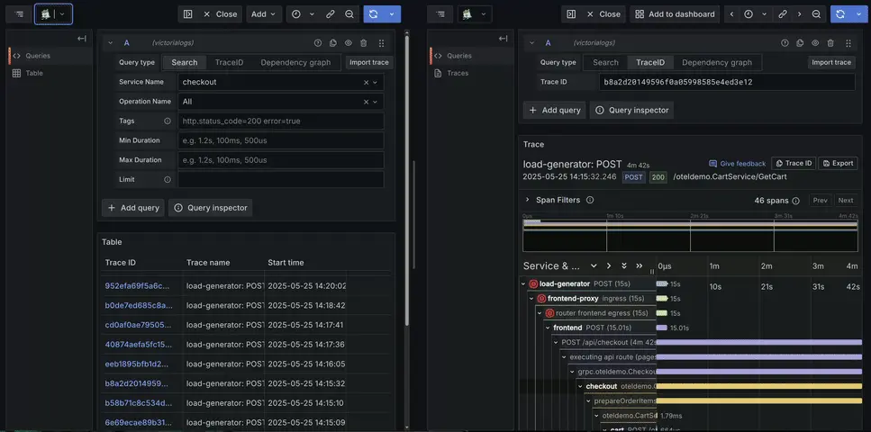
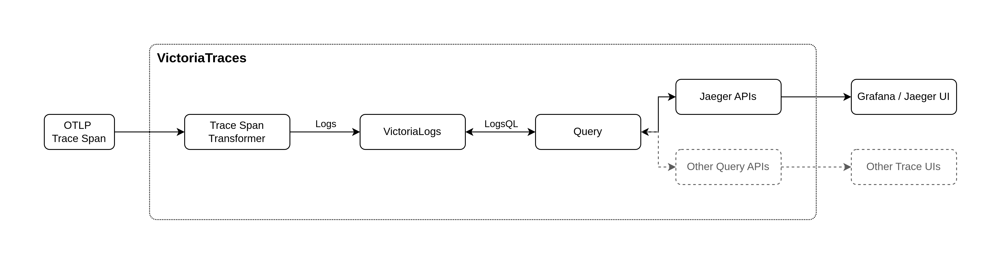

VictoriaTraces is open source user-friendly database for distributed tracing data 
from [VictoriaMetrics](https://github.com/VictoriaMetrics/VictoriaMetrics/).

VictoriaTraces provides the following features:
- It is resource-efficient and fast. It uses up to 3.7x less RAM and up to 2.6x less CPU than other solutions such as Grafana Tempo.
- VictoriaTraces' capacity and performance scales linearly with the available resources (CPU, RAM, disk IO, disk space).
- It accepts trace spans in the popular [OpenTelemetry protocol](https://opentelemetry.io/docs/specs/otel/protocol/)(OTLP), 
  which can be exported from applications, OpenTelemetry and various other collectors.
- It provides [Jaeger Query Service JSON APIs](https://www.jaegertracing.io/docs/2.6/apis/#internal-http-json) 
  which allows you to visualize trace with [Grafana](https://grafana.com/docs/grafana/latest/datasources/jaeger/) or [Jaeger Frontend](https://www.jaegertracing.io/docs/2.6/frontend-ui/).



## How does it work

VictoriaTraces is built on top of [VictoriaLogs](https://docs.victoriametrics.com/victorialogs/), which is a log database. 
VictoriaTraces transforms trace spans into structured logs, ingests them, and uses LogsQL for querying to construct the data structure 
required by the trace query APIs.



## Quick Start

Currently, VictoriaTraces is under actively developing. It can be built from VictoriaMetrics repository with:
```shell
make victoria-logs-prod
```

The `make` command generates a binary in `/bin` folder. It can be run with:
```shell
./victoria-logs-prod -storageDataPath=victoria-traces-data
```

Once it's running, it will listen to port `9428` (`-httpListenAddr`) and provide the following API for ingestion:
```
http://<victoria-traces>:<port>/insert/opentelemetry/v1/traces
```

Now, config your applications or trace collectors to export data to VictoriaTraces. Here's an example config for the OpenTelemetry Collector:
```yaml
exporters:
  otlphttp/victorialogs:
    traces_endpoint: http://<victoria-traces>:<port>/insert/opentelemetry/v1/traces

service:
  pipelines:
    traces:
      exporters: [otlphttp/victorialogs]
```

You can browse `http://<victoria-traces>:<port>/select/vmui` to verify the data ingestion, as trace spans should be displayed as logs.

And finally, to search and visualize traces with Grafana, add a new jaeger data source the following URL:
```
http://<victoria-traces>:<port>/select/jaeger`.
```

Now everything should be ready!

## Retention by disk space usage

VictoriaTraces can be configured to automatically drop older per-day partitions if the total size of data at [`-storageDataPath` directory](#storage)
becomes bigger than the given threshold at `-retention.maxDiskSpaceUsageBytes` command-line flag. For example, the following command starts VictoriaTraces,
which drops old per-day partitions if the total [storage](#storage) size becomes bigger than `100GiB`:

```sh
/path/to/victoria-traces -retention.maxDiskSpaceUsageBytes=100GiB
```

VictoriaTraces usually compresses trace data by 10x or more times. This means that VictoriaTraces can store more than a terabyte of uncompressed
traces when it runs with `-retention.maxDiskSpaceUsageBytes=100GiB`.

VictoriaTraces keeps at least two last days of data in order to guarantee that the traces for the last day can be returned in queries.
This means that the total disk space usage may exceed the `-retention.maxDiskSpaceUsageBytes` if the size of the last two days of data
exceeds the `-retention.maxDiskSpaceUsageBytes`.

The [`-retentionPeriod`](#retention) is applied independently to the `-retention.maxDiskSpaceUsageBytes`. This means that
VictoriaTraces automatically drops trace spans older than 7 days by default if only `-retention.maxDiskSpaceUsageBytes` command-line flag is set.
Set the `-retentionPeriod` to some big value (e.g. `100y` - 100 years) if trace spans shouldn't be dropped because of some small `-retentionPeriod`.
For example:

```sh
/path/to/victoria-traces -retention.maxDiskSpaceUsageBytes=10TiB -retentionPeriod=100y
```

## Storage

By default VictoriaTraces stores all its data in a single directory - `victoria-traces-data`. The path to the directory can be changed via `-storageDataPath` command-line flag.
For example, the following command starts VictoriaTraces, which stores the data at `/var/lib/victoria-traces`:

```sh
/path/to/victoria-traces -storageDataPath=/var/lib/victoria-traces
```

VictoriaTraces automatically creates the `-storageDataPath` directory on the first run if it is missing.

The ingested trace spans are stored in per-day subdirectories (partitions) at the `<-storageDataPath>/partitions` directory. The per-day subdirectories have `YYYYMMDD` names.
For example, the directory with the name `20250418` contains trace spans with [`_time` field](https://docs.victoriametrics.com/victorialogs/keyconcepts/#time-field) values
at April 18, 2025 UTC. This allows flexible data management. For example, old per-day data is automatically and quickly deleted according to the provided [retention policy](#retention)
by removing the corresponding per-day subdirectory (partition).

## Forced merge

VictoriaTraces performs data compactions in background in order to keep good performance characteristics when accepting new data.
These compactions (merges) are performed independently on per-day partitions.
This means that compactions are stopped for per-day partitions if no new data is ingested into these partitions.
Sometimes it is necessary to trigger compactions for old partitions. In this case forced compaction may be initiated on the specified per-day partition
by sending request to `/internal/force_merge?partition_prefix=YYYYMMDD`,
where `YYYYMMDD` is per-day partition name. For example, `http://victoria-traces:9428/internal/force_merge?partition_prefix=20240921` would initiate forced
merge for September 21, 2024 partition. The call to `/internal/force_merge` returns immediately, while the corresponding forced merge continues running in background.

Forced merges may require additional CPU, disk IO and storage space resources. It is unnecessary to run forced merge under normal conditions,
since VictoriaTraces automatically performs optimal merges in background when new data is ingested into it.

## Forced flush

VictoriaTraces puts the recently ingested trace spans into in-memory buffers,
which aren't available for querying for up to a second.
If you need querying traces immediately after their ingestion, then the `/internal/force_flush` HTTP endpoint must be requested
before querying. This endpoint converts in-memory buffers with the recently ingested trace spans into searchable data blocks.

It isn't recommended requesting the `/internal/force_flush` HTTP endpoint on a regular basis, since this increases CPU usage
and slows down data ingestion. It is expected that the `/internal/force_flush` is requested in automated tests, which need querying
the recently ingested data.

## List of command-line flags

See also: [VictoriaLogs - List of Command-line flags](https://docs.victoriametrics.com/victorialogs/#list-of-command-line-flags)

```shell
todo
```