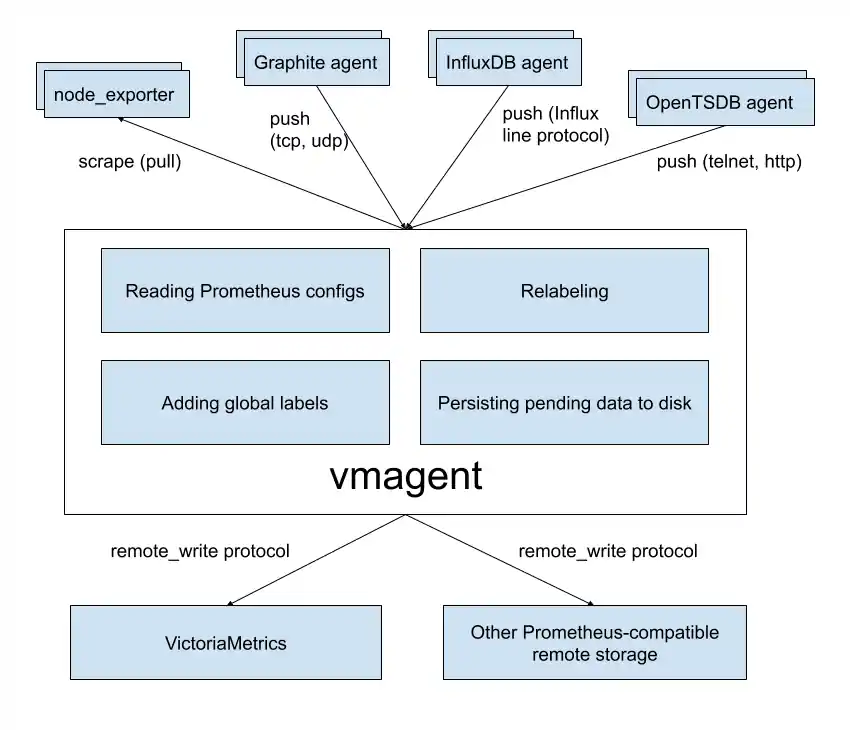

`vmagent` is a tiny agent which helps you collect metrics from various sources,
[relabel and filter the collected metrics](#relabeling)
and store them in [VictoriaMetrics](https://github.com/VictoriaMetrics/VictoriaMetrics)
or any other storage systems via Prometheus `remote_write` protocol
or via [VictoriaMetrics `remote_write` protocol](#victoriametrics-remote-write-protocol).

See [Quick Start](#quick-start) for details.



## Motivation

While VictoriaMetrics provides an efficient solution to store and observe metrics, our users needed something fast
and RAM friendly to scrape metrics from Prometheus-compatible exporters into VictoriaMetrics.
Also, we found that our user's infrastructure are like snowflakes in that no two are alike. Therefore, we decided to add more flexibility
to `vmagent` such as the ability to [accept metrics via popular push protocols](#how-to-push-data-to-vmagent)
additionally to [discovering Prometheus-compatible targets and scraping metrics from them](#how-to-collect-metrics-in-prometheus-format).

## Features

* Can be used as a drop-in replacement for Prometheus for discovering and scraping targets such as [node_exporter](https://github.com/prometheus/node_exporter).
  Note that single-node VictoriaMetrics can also discover and scrape Prometheus-compatible targets in the same way as `vmagent` does -
  see [these docs](https://docs.victoriametrics.com/#how-to-scrape-prometheus-exporters-such-as-node-exporter).
* Can add, remove and modify labels (aka tags) via Prometheus relabeling. Can filter data before sending it to remote storage. See [these docs](#relabeling) for details.
* Can accept data via all the ingestion protocols supported by VictoriaMetrics - see [these docs](#how-to-push-data-to-vmagent).
* Can aggregate incoming samples by time and by labels before sending them to remote storage - see [these docs](https://docs.victoriametrics.com/stream-aggregation/).
* Can replicate collected metrics simultaneously to multiple Prometheus-compatible remote storage systems - see [these docs](#replication-and-high-availability).
* Can save egress network bandwidth usage costs when [VictoriaMetrics remote write protocol](#victoriametrics-remote-write-protocol)
  is used for sending the data to VictoriaMetrics.
* Works smoothly in environments with unstable connections to remote storage. If the remote storage is unavailable, the collected metrics
  are buffered at `-remoteWrite.tmpDataPath`. The buffered metrics are sent to remote storage as soon as the connection
  to the remote storage is repaired. The maximum disk usage for the buffer can be limited with `-remoteWrite.maxDiskUsagePerURL`.
* Uses lower amounts of RAM, CPU, disk IO and network bandwidth than Prometheus.
* Scrape targets can be spread among multiple `vmagent` instances when big number of targets must be scraped. See [these docs](#scraping-big-number-of-targets).
* Can load scrape configs from multiple files. See [these docs](#loading-scrape-configs-from-multiple-files).
* Can efficiently scrape targets that expose millions of time series such as [/federate endpoint in Prometheus](https://prometheus.io/docs/prometheus/latest/federation/).
  See [these docs](#stream-parsing-mode).
* Can deal with [high cardinality](https://docs.victoriametrics.com/faq/#what-is-high-cardinality)
  and [high churn rate](https://docs.victoriametrics.com/faq/#what-is-high-churn-rate) issues by limiting the number of unique time series at scrape time
  and before sending them to remote storage systems. See [these docs](#cardinality-limiter).
* Can write collected metrics to multiple tenants. See [these docs](#multitenancy).
* Can read and write data from / to Kafka. See [these docs](#kafka-integration).
* Can read and write data from / to Google PubSub. See [these docs](#google-pubsub-integration).

## Quick Start

Please download `vmutils-*` archive from [releases page](https://github.com/VictoriaMetrics/VictoriaMetrics/releases/latest) (
`vmagent` is also available in [docker images](https://hub.docker.com/r/victoriametrics/vmagent/tags)),
unpack it and pass the following flags to the `vmagent` binary in order to start scraping Prometheus-compatible targets
and sending the data to the Prometheus-compatible remote storage:

* `-promscrape.config` with the path to [Prometheus config file](https://docs.victoriametrics.com/sd_configs/) (usually located at `/etc/prometheus/prometheus.yml`).
  The path can point either to local file or to http url. See [scrape config examples](https://docs.victoriametrics.com/scrape_config_examples/).
  `vmagent` doesn't support some sections of Prometheus config file, so you may need either to delete these sections or
  to run `vmagent` with `-promscrape.config.strictParse=false` command-line flag.
  In this case `vmagent` ignores unsupported sections. See [the list of unsupported sections](#unsupported-prometheus-config-sections).
* `-remoteWrite.url` with Prometheus-compatible remote storage endpoint such as VictoriaMetrics, where to send the data to.
  The `-remoteWrite.url` may refer to [DNS SRV](https://en.wikipedia.org/wiki/SRV_record) address. See [these docs](#srv-urls) for details.

Example command for writing the data received via [supported push-based protocols](#how-to-push-data-to-vmagent)
to [single-node VictoriaMetrics](https://docs.victoriametrics.com/) located at `victoria-metrics-host:8428`:

```sh
/path/to/vmagent -remoteWrite.url=https://victoria-metrics-host:8428/api/v1/write
```

See [these docs](https://docs.victoriametrics.com/cluster-victoriametrics/#url-format) if you need writing
the data to [VictoriaMetrics cluster](https://docs.victoriametrics.com/cluster-victoriametrics/).

Example command for scraping Prometheus targets and writing the data to single-node VictoriaMetrics:

```sh
/path/to/vmagent -promscrape.config=/path/to/prometheus.yml -remoteWrite.url=https://victoria-metrics-host:8428/api/v1/write
```

See [how to scrape Prometheus-compatible targets](#how-to-collect-metrics-in-prometheus-format) for more details.

If you use single-node VictoriaMetrics, then you can discover and scrape Prometheus-compatible targets directly from VictoriaMetrics
without the need to use `vmagent` - see [these docs](https://docs.victoriametrics.com/#how-to-scrape-prometheus-exporters-such-as-node-exporter).

`vmagent` can save network bandwidth usage costs under high load when [VictoriaMetrics remote write protocol is used](#victoriametrics-remote-write-protocol).

See [troubleshooting docs](#troubleshooting) if you encounter common issues with `vmagent`.

See [various use cases](#use-cases) for vmagent.

Pass `-help` to `vmagent` in order to see [the full list of supported command-line flags with their descriptions](#advanced-usage).

## How to push data to vmagent

`vmagent` supports [the same set of push-based data ingestion protocols as VictoriaMetrics does](https://docs.victoriametrics.com/#how-to-import-time-series-data)
in addition to the pull-based Prometheus-compatible targets' scraping:

* DataDog "submit metrics" API. See [these docs](https://docs.victoriametrics.com/single-server-victoriametrics/#how-to-send-data-from-datadog-agent).
* InfluxDB line protocol via `http://<vmagent>:8429/write`. See [these docs](https://docs.victoriametrics.com/single-server-victoriametrics/#how-to-send-data-from-influxdb-compatible-agents-such-as-telegraf).
* Graphite plaintext protocol if `-graphiteListenAddr` command-line flag is set. See [these docs](https://docs.victoriametrics.com/single-server-victoriametrics/#how-to-send-data-from-graphite-compatible-agents-such-as-statsd).
* OpenTelemetry http API. See [these docs](https://docs.victoriametrics.com/single-server-victoriametrics/#sending-data-via-opentelemetry).
* NewRelic API. See [these docs](https://docs.victoriametrics.com/single-server-victoriametrics/#how-to-send-data-from-newrelic-agent).
* OpenTSDB telnet and http protocols if `-opentsdbListenAddr` command-line flag is set. See [these docs](https://docs.victoriametrics.com/single-server-victoriametrics/#how-to-send-data-from-opentsdb-compatible-agents).
* Prometheus remote write protocol via `http://<vmagent>:8429/api/v1/write`.
* JSON lines import protocol via `http://<vmagent>:8429/api/v1/import`. See [these docs](https://docs.victoriametrics.com/single-server-victoriametrics/#how-to-import-data-in-json-line-format).
* Native data import protocol via `http://<vmagent>:8429/api/v1/import/native`. See [these docs](https://docs.victoriametrics.com/single-server-victoriametrics/#how-to-import-data-in-native-format).
* Prometheus exposition format via `http://<vmagent>:8429/api/v1/import/prometheus`. See [these docs](https://docs.victoriametrics.com/single-server-victoriametrics/#how-to-import-data-in-prometheus-exposition-format) for details.
* Arbitrary CSV data via `http://<vmagent>:8429/api/v1/import/csv`. See [these docs](https://docs.victoriametrics.com/single-server-victoriametrics/#how-to-import-csv-data).

## Configuration update

`vmagent` should be restarted in order to update config options set via command-line args.
`vmagent` supports multiple approaches for reloading configs from updated config files such as
`-promscrape.config`, `-remoteWrite.relabelConfig`, `-remoteWrite.urlRelabelConfig`, `-streamAggr.config`
and `-remoteWrite.streamAggr.config`:

* Sending `SIGHUP` signal to `vmagent` process:

  ```sh
  kill -SIGHUP `pidof vmagent`
  ```

* Sending HTTP request to `http://vmagent:8429/-/reload` endpoint. This endpoint can be protected with `-reloadAuthKey` command-line flag.

There is also `-promscrape.configCheckInterval` command-line flag, which can be used for automatic reloading configs from updated `-promscrape.config` file.

## Use cases

### IoT and Edge monitoring

`vmagent` can run and collect metrics in IoT environments and industrial networks with unreliable or scheduled connections to their remote storage.
It buffers the collected data in local files until the connection to remote storage becomes available and then sends the buffered
data to the remote storage. It re-tries sending the data to remote storage until errors are resolved.
The maximum on-disk size for the buffered metrics can be limited with `-remoteWrite.maxDiskUsagePerURL`.

`vmagent` works on various architectures from the IoT world - 32-bit arm, 64-bit arm, ppc64, 386, amd64.

The `vmagent` can save network bandwidth usage costs by using [VictoriaMetrics remote write protocol](#victoriametrics-remote-write-protocol).

### Drop-in replacement for Prometheus

If you use Prometheus only for scraping metrics from various targets and forwarding these metrics to remote storage
then `vmagent` can replace Prometheus. Typically, `vmagent` requires lower amounts of RAM, CPU and network bandwidth compared with Prometheus.
See [these docs](#how-to-collect-metrics-in-prometheus-format) for details.

### Statsd alternative

`vmagent` can be used as an alternative to [statsd](https://github.com/statsd/statsd)
when [stream aggregation](https://docs.victoriametrics.com/stream-aggregation/) is enabled.
See [these docs](https://docs.victoriametrics.com/stream-aggregation/#statsd-alternative) for details.

### Flexible metrics relay

`vmagent` can accept metrics in [various popular data ingestion protocols](#how-to-push-data-to-vmagent), apply [relabeling](#relabeling)
to the accepted metrics (for example, change metric names/labels or drop unneeded metrics) and then forward the relabeled metrics
to other remote storage systems, which support Prometheus `remote_write` protocol (including other `vmagent` instances).

### Replication and high availability

`vmagent` replicates the collected metrics among multiple remote storage instances configured via `-remoteWrite.url` args.
If a single remote storage instance temporarily is out of service, then the collected data remains available in another remote storage instance.
`vmagent` buffers the collected data in files at `-remoteWrite.tmpDataPath` until the remote storage becomes available again,
and then it sends the buffered data to the remote storage in order to prevent data gaps.

[VictoriaMetrics cluster](https://docs.victoriametrics.com/cluster-victoriametrics/) already supports replication,
so there is no need in specifying multiple `-remoteWrite.url` flags when writing data to the same cluster.
See [these docs](https://docs.victoriametrics.com/cluster-victoriametrics/#replication-and-data-safety).

### Sharding among remote storages

By default `vmagent` replicates data among remote storage systems enumerated via `-remoteWrite.url` command-line flag.
If the `-remoteWrite.shardByURL` command-line flag is set, then `vmagent` spreads evenly
the outgoing [time series](https://docs.victoriametrics.com/keyconcepts/#time-series) among all the remote storage systems
enumerated via `-remoteWrite.url`.

It is possible to replicate samples among remote storage systems by passing `-remoteWrite.shardByURLReplicas=N`
command-line flag to `vmagent` additionally to `-remoteWrite.shardByURL` command-line flag.
This instructs `vmagent` writing every outgoing sample to `N` distinct remote storage systems enumerated via `-remoteWrite.url`
in addition to sharding.

Samples for the same time series are routed to the same remote storage system if `-remoteWrite.shardByURL` flag is specified.
This allows building scalable data processing pipelines when a single remote storage cannot keep up with the data ingestion workload.
For example, this allows building horizontally scalable [stream aggregation](https://docs.victoriametrics.com/stream-aggregation/)
by routing outgoing samples for the same time series of [counter](https://docs.victoriametrics.com/keyconcepts/#counter)
and [histogram](https://docs.victoriametrics.com/keyconcepts/#histogram) types from top-level `vmagent` instances
to the same second-level `vmagent` instance, so they are aggregated properly.

If `-remoteWrite.shardByURL` command-line flag is set, then all the metric labels are used for even sharding
among remote storage systems specified in `-remoteWrite.url`.

Sometimes it may be needed to use only a particular set of labels for sharding. For example, it may be needed to route all the metrics with the same `instance` label
to the same `-remoteWrite.url`. In this case you can specify comma-separated list of these labels in the `-remoteWrite.shardByURL.labels`
command-line flag. For example, `-remoteWrite.shardByURL.labels=instance,__name__` would shard metrics with the same name and `instance`
label to the same `-remoteWrite.url`.

Sometimes, it may be necessary to ignore some labels when sharding samples across multiple `-remoteWrite.url` backends.
For example, if all the [raw samples](https://docs.victoriametrics.com/keyconcepts/#raw-samples) with the same set of labels
except of `instance` and `pod` labels must be routed to the same backend. In this case the list of ignored labels must be passed to
`-remoteWrite.shardByURL.ignoreLabels` command-line flag: `-remoteWrite.shardByURL.ignoreLabels=instance,pod`.

See also [how to scrape big number of targets](#scraping-big-number-of-targets).

### Relabeling and filtering

`vmagent` can add, remove or update labels on the collected data before sending it to the remote storage. Additionally,
it can remove unwanted samples via Prometheus-like relabeling before sending the collected data to remote storage.
Please see [these docs](#relabeling) for details.

### Splitting data streams among multiple systems

`vmagent` supports splitting the collected data between multiple destinations with the help of `-remoteWrite.urlRelabelConfig`,
which is applied independently for each configured `-remoteWrite.url` destination. For example, it is possible to replicate or split
data among long-term remote storage, short-term remote storage and a real-time analytical system [built on top of Kafka](https://github.com/Telefonica/prometheus-kafka-adapter).
Note that each destination can receive its own subset of the collected data due to per-destination relabeling via `-remoteWrite.urlRelabelConfig`.

For example, let's assume all the scraped or received metrics by `vmagent` have label `env` with values `dev` or `prod`.
To route metrics `env=dev` to destination `dev` and metrics with `env=prod` to destination `prod` apply the following config:
1. Create relabeling config file `relabelDev.yml` to drop all metrics that don't have label `env=dev`:
```yaml
- action: keep
  source_labels: [env]
  regex: "dev"
```
2. Create relabeling config file `relabelProd.yml` to drop all metrics that don't have label `env=prod`:
```yaml
- action: keep
  source_labels: [env]
  regex: "prod"
```
3. Configure `vmagent` with 2 `-remoteWrite.url` flags pointing to destinations `dev` and `prod` with corresponding
`-remoteWrite.urlRelabelConfig` configs:
```sh
./vmagent \
  -remoteWrite.url=http://<dev-url> -remoteWrite.urlRelabelConfig=relabelDev.yml \
  -remoteWrite.url=http://<prod-url> -remoteWrite.urlRelabelConfig=relabelProd.yml 
```
With this configuration `vmagent` will forward to `http://<dev-url>` only metrics that have `env=dev` label.
And to `http://<prod-url>` it will forward only metrics that have `env=prod` label.

Please note, order of flags is important: 1st mentioned `-remoteWrite.urlRelabelConfig` will be applied to the
1st mentioned `-remoteWrite.url`, and so on.

### Prometheus remote_write proxy

`vmagent` can be used as a proxy for Prometheus data sent via Prometheus `remote_write` protocol. It can accept data via the `remote_write` API
at the`/api/v1/write` endpoint. Then apply relabeling and filtering and proxy it to another `remote_write` system .
The `vmagent` can be configured to encrypt the incoming `remote_write` requests with `-tls*` command-line flags.
Also, Basic Auth can be enabled for the incoming `remote_write` requests with `-httpAuth.*` command-line flags.

### remote_write for clustered version

While `vmagent` can accept data in several supported protocols (OpenTSDB, Influx, Prometheus, Graphite) and scrape data from various targets,
writes are always performed in Prometheus remote_write protocol. Therefore, for the [clustered version](https://docs.victoriametrics.com/cluster-victoriametrics/),
the `-remoteWrite.url` command-line flag should be configured as `<schema>://<vminsert-host>:8480/insert/<accountID>/prometheus/api/v1/write`
according to [these docs](https://docs.victoriametrics.com/cluster-victoriametrics/#url-format).
There is also support for multitenant writes. See [these docs](#multitenancy).

### Flexible deduplication

[Deduplication at stream aggregation](https://docs.victoriametrics.com/stream-aggregation/#deduplication) allows setting up arbitrary complex de-duplication schemes
for the collected samples. Examples:

- The following command instructs `vmagent` to send only the last sample per each seen [time series](https://docs.victoriametrics.com/keyconcepts/#time-series) per every 60 seconds:
  ```sh
  ./vmagent -remoteWrite.url=http://remote-storage/api/v1/write -streamAggr.dedupInterval=60s
  ```

- The following command instructs `vmagent` to merge [time series](https://docs.victoriametrics.com/keyconcepts/#time-series) with different `replica` label values
  and then to send only the last sample per each merged series per every 60 seconds:
  ```sh
  ./vmagent -remoteWrite=http://remote-storage/api/v1/write -streamAggr.dropInputLabels=replica -streamAggr.dedupInterval=60s
  ```


## SRV urls

If `vmagent` encounters urls with `srv+` prefix in hostname (such as `http://srv+some-addr/some/path`), then it resolves `some-addr` [DNS SRV](https://en.wikipedia.org/wiki/SRV_record)
record into TCP address with hostname and TCP port, and then uses the resulting url when it needs connecting to it.

SRV urls are supported in the following places:

- In `-remoteWrite.url` command-line flag. For example, if `victoria-metrics` [DNS SRV](https://en.wikipedia.org/wiki/SRV_record) record contains
  `victoria-metrics-host:8428` TCP address, then `-remoteWrite.url=http://srv+victoria-metrics/api/v1/write` is automatically resolved into
  `-remoteWrite.url=http://victoria-metrics-host:8428/api/v1/write`. If the DNS SRV record is resolved into multiple TCP addresses, then `vmagent`
  uses randomly chosen address per each connection it establishes to the remote storage.

- In scrape target addresses aka `__address__` label - see [these docs](https://docs.victoriametrics.com/relabeling/#how-to-modify-scrape-urls-in-targets) for details.

- In urls used for [service discovery](https://docs.victoriametrics.com/sd_configs/).

SRV urls are useful when HTTP services run on different TCP ports or when they can change TCP ports over time (for instance, after the restart).

## VictoriaMetrics remote write protocol

`vmagent` supports sending data to the configured `-remoteWrite.url` either via Prometheus remote write protocol
or via VictoriaMetrics remote write protocol.

VictoriaMetrics remote write protocol provides the following benefits comparing to Prometheus remote write protocol:

- Reduced network bandwidth usage by 2x-5x. This allows saving network bandwidth usage costs when `vmagent` and
  the configured remote storage systems are located in different datacenters, availability zones or regions.

- Reduced disk read/write IO and disk space usage at `vmagent` when the remote storage is temporarily unavailable.
  In this case `vmagent` buffers the incoming data to disk using the VictoriaMetrics remote write format.
  This reduces disk read/write IO and disk space usage by 2x-5x comparing to Prometheus remote write format.

`vmagent` automatically switches to VictoriaMetrics remote write protocol when it sends data to VictoriaMetrics components such as other `vmagent` instances,
[single-node VictoriaMetrics](https://docs.victoriametrics.com/single-server-victoriametrics/)
or `vminsert` at [cluster version](https://docs.victoriametrics.com/cluster-victoriametrics/).
It is possible to force switch to VictoriaMetrics remote write protocol by specifying `-remoteWrite.forceVMProto`
command-line flag for the corresponding `-remoteWrite.url`.
It is possible to tune the compression level for VictoriaMetrics remote write protocol with `-remoteWrite.vmProtoCompressLevel` command-line flag.
Bigger values reduce network usage at the cost of higher CPU usage. Negative values reduce CPU usage at the cost of higher network usage.
The default value for the compression level is `0`, the minimum value is `-22` and the maximum value is `22`. The default value works optimally
in most cases, so it isn't recommended changing it.

`vmagent` automatically switches to Prometheus remote write protocol when it sends data to old versions of VictoriaMetrics components
or to other Prometheus-compatible remote storage systems. It is possible to force switch to Prometheus remote write protocol
by specifying `-remoteWrite.forcePromProto` command-line flag for the corresponding `-remoteWrite.url`.

## Multitenancy

By default `vmagent` collects the data without [tenant](https://docs.victoriametrics.com/cluster-victoriametrics/#multitenancy) identifiers
and routes it to the remote storage specified via `-remoteWrite.url` command-line flag. The `-remoteWrite.url` can point to `/insert/<tenant_id>/prometheus/api/v1/write` path
at `vminsert` according to [these docs](https://docs.victoriametrics.com/cluster-victoriametrics/#url-format). In this case all the metrics are written to the given `<tenant_id>` tenant.

The easiest way to write data to multiple distinct tenants is to specify the needed tenants via `vm_account_id` and `vm_project_id` labels
and then to push metrics with these labels to [multitenant url at VictoriaMetrics cluster](https://docs.victoriametrics.com/cluster-victoriametrics/#multitenancy-via-labels).
The `vm_account_id` and `vm_project_id` labels can be specified via [relabeling](#relabeling) before sending the metrics to `-remoteWrite.url`.

For example, the following relabeling rule instructs sending metrics to `<account_id>:0` [tenant](https://docs.victoriametrics.com/cluster-victoriametrics/#multitenancy)
defined in the `prometheus.io/account_id` annotation of Kubernetes pod deployment:

```yaml
scrape_configs:
- kubernetes_sd_configs:
  - role: pod
  relabel_configs:
  - source_labels: [__meta_kubernetes_pod_annotation_prometheus_io_account_id]
    target_label: vm_account_id
```

`vmagent` can accept data via the same multitenant endpoints (`/insert/<accountID>/<suffix>`) as `vminsert` at [VictoriaMetrics cluster](https://docs.victoriametrics.com/cluster-victoriametrics/)
does according to [these docs](https://docs.victoriametrics.com/cluster-victoriametrics/#url-format) if `-enableMultitenantHandlers` command-line flag is set.
In this case, vmagent automatically converts tenant identifiers from the URL to `vm_account_id` and `vm_project_id` labels.
These tenant labels are added before applying [relabeling](#relabeling) specified via `-remoteWrite.relabelConfig`
and `-remoteWrite.urlRelabelConfig` command-line flags. Metrics with `vm_account_id` and `vm_project_id` labels can be routed to the corresponding tenants
when specifying `-remoteWrite.url` to [multitenant url at VictoriaMetrics cluster](https://docs.victoriametrics.com/cluster-victoriametrics/#multitenancy-via-labels).

## How to collect metrics in Prometheus format

Specify the path to `prometheus.yml` file via `-promscrape.config` command-line flag. `vmagent` takes into account the following
sections from [Prometheus config file](https://prometheus.io/docs/prometheus/latest/configuration/configuration/):

* `global`
* `scrape_configs`

All other sections are ignored, including the [remote_write](https://prometheus.io/docs/prometheus/latest/configuration/configuration/#remote_write) section.
Use `-remoteWrite.*` command-line flag instead for configuring remote write settings. See [the list of unsupported config sections](#unsupported-prometheus-config-sections).

The file pointed by `-promscrape.config` may contain `%{ENV_VAR}` placeholders which are substituted by the corresponding `ENV_VAR` environment variable values.

See also:

- [scrape config examples](https://docs.victoriametrics.com/scrape_config_examples/)
- [the list of supported service discovery types for Prometheus scrape targets](https://docs.victoriametrics.com/sd_configs/).


## scrape_config enhancements

`vmagent` supports the following additional options in [scrape_configs](https://docs.victoriametrics.com/sd_configs/#scrape_configs) section:

* `headers` - a list of HTTP headers to send to scrape target with each scrape request. This can be used when the scrape target
  needs custom authorization and authentication. For example:

```yaml
scrape_configs:
- job_name: custom_headers
  headers:
  - "TenantID: abc"
  - "My-Auth: TopSecret"
```

* `disable_compression: true` for disabling response compression on a per-job basis. By default, `vmagent` requests compressed responses
  from scrape targets for saving network bandwidth.
* `disable_keepalive: true` for disabling [HTTP keep-alive connections](https://en.wikipedia.org/wiki/HTTP_persistent_connection)
  on a per-job basis. By default, `vmagent` uses keep-alive connections to scrape targets for reducing overhead on connection re-establishing.
* `series_limit: N` for limiting the number of unique time series a single scrape target can expose. See [these docs](#cardinality-limiter).
* `stream_parse: true` for scraping targets in a streaming manner. This may be useful when targets export big number of metrics. See [these docs](#stream-parsing-mode).
* `scrape_align_interval: duration` for aligning scrapes to the given interval instead of using random offset
  in the range `[0 ... scrape_interval]` for scraping each target. The random offset helps to spread scrapes evenly in time.
* `scrape_offset: duration` for specifying the exact offset for scraping instead of using random offset in the range `[0 ... scrape_interval]`.

See [scrape_configs docs](https://docs.victoriametrics.com/sd_configs/#scrape_configs) for more details on all the supported options.


## Loading scrape configs from multiple files

`vmagent` supports loading [scrape configs](https://docs.victoriametrics.com/sd_configs/#scrape_configs) from multiple files specified
in the `scrape_config_files` section of `-promscrape.config` file. For example, the following `-promscrape.config` instructs `vmagent`
loading scrape configs from all the `*.yml` files under `configs` directory, from `single_scrape_config.yml` local file
and from `https://config-server/scrape_config.yml` url:

```yaml
scrape_config_files:
- configs/*.yml
- single_scrape_config.yml
- https://config-server/scrape_config.yml
```

Every referred file can contain arbitrary number of [supported scrape configs](https://docs.victoriametrics.com/sd_configs/#scrape_configs).
There is no need in specifying top-level `scrape_configs` section in these files. For example:

```yaml
- job_name: foo
  static_configs:
  - targets: ["vmagent:8429"]
- job_name: bar
  kubernetes_sd_configs:
  - role: pod
```

`vmagent` is able to dynamically reload these files - see [these docs](#configuration-update).

## Unsupported Prometheus config sections

`vmagent` doesn't support the following sections in Prometheus config file passed to `-promscrape.config` command-line flag:

* [remote_write](https://prometheus.io/docs/prometheus/latest/configuration/configuration/#remote_write). This section is substituted
  with various `-remoteWrite*` command-line flags. See [the full list of flags](#advanced-usage). The `remote_write` section isn't supported
  in order to reduce possible confusion when `vmagent` is used for accepting incoming metrics via [supported push protocols](#how-to-push-data-to-vmagent).
  In this case the `-promscrape.config` file isn't needed.
* `remote_read`. This section isn't supported at all, since `vmagent` doesn't provide Prometheus querying API.
  It is expected that the querying API is provided by the remote storage specified via `-remoteWrite.url` such as VictoriaMetrics.
  See [Prometheus querying API docs for VictoriaMetrics](https://docs.victoriametrics.com/#prometheus-querying-api-usage).
* `rule_files` and `alerting`. These sections are supported by [vmalert](https://docs.victoriametrics.com/vmalert/).

The list of supported service discovery types is available [here](#how-to-collect-metrics-in-prometheus-format).

Additionally, `vmagent` doesn't support `refresh_interval` option at service discovery sections.
This option is substituted with `-promscrape.*CheckInterval` command-line flags, which are specific per each service discovery type.
See [the full list of command-line flags for vmagent](#advanced-usage).

## Adding labels to metrics

Extra labels can be added to metrics collected by `vmagent` via the following mechanisms:

* The `global -> external_labels` section in `-promscrape.config` file. These labels are added only to metrics scraped from targets configured
  in the `-promscrape.config` file. They aren't added to metrics collected via other [data ingestion protocols](#how-to-push-data-to-vmagent).
* The `-remoteWrite.label` command-line flag. These labels are added to all the collected metrics before sending them to `-remoteWrite.url`.
  For example, the following command starts `vmagent`, which adds `{datacenter="foobar"}` label to all the metrics pushed
  to all the configured remote storage systems (all the `-remoteWrite.url` flag values):

  ```sh
  /path/to/vmagent -remoteWrite.label=datacenter=foobar ...
  ```

* Via relabeling. See [these docs](#relabeling).


## Automatically generated metrics

`vmagent` automatically generates the following metrics per each scrape of every [Prometheus-compatible target](#how-to-collect-metrics-in-prometheus-format)
and attaches `instance`, `job` and other target-specific labels to these metrics:

* `up` - this metric exposes `1` value on successful scrape and `0` value on unsuccessful scrape. This allows monitoring
  failing scrapes with the following [MetricsQL query](https://docs.victoriametrics.com/metricsql/):

  ```metricsql
  up == 0
  ```

* `scrape_duration_seconds` - the duration of the scrape for the given target. This allows monitoring slow scrapes.
  For example, the following [MetricsQL query](https://docs.victoriametrics.com/metricsql/) returns scrapes,
  which take more than 1.5 seconds to complete:

  ```metricsql
  scrape_duration_seconds > 1.5
  ```

* `scrape_timeout_seconds` - the configured timeout for the current scrape target (aka `scrape_timeout`).
  This allows detecting targets with scrape durations close to the configured scrape timeout.
  For example, the following [MetricsQL query](https://docs.victoriametrics.com/metricsql/) returns targets (identified by `instance` label),
  which take more than 80% of the configured `scrape_timeout` during scrapes:

  ```metricsql
  scrape_duration_seconds / scrape_timeout_seconds > 0.8
  ```

* `scrape_response_size_bytes` - response size in bytes for the given target. This allows to monitor amount of data scraped
  and to adjust [`max_scrape_size` option](https://docs.victoriametrics.com/sd_configs/#scrape_configs) for scraped targets.
  For example, the following [MetricsQL query](https://docs.victoriametrics.com/metricsql/) returns targets with scrape response
  bigger than `10MiB`:

  ```metricsql
  scrape_response_size_bytes > 10MiB
  ```

* `scrape_samples_scraped` - the number of samples (aka metrics) parsed per each scrape. This allows detecting targets,
  which expose too many metrics. For example, the following [MetricsQL query](https://docs.victoriametrics.com/metricsql/)
  returns targets, which expose more than 10000 metrics:

  ```metricsql
  scrape_samples_scraped > 10000
  ```

* `scrape_samples_limit` - the configured limit on the number of metrics the given target can expose.
  The limit can be set via `sample_limit` option at [scrape_configs](https://docs.victoriametrics.com/sd_configs/#scrape_configs).
  This metric is exposed only if the `sample_limit` is set. This allows detecting targets,
  which expose too many metrics compared to the configured `sample_limit`. For example, the following query
  returns targets (identified by `instance` label), which expose more than 80% metrics compared to the configured `sample_limit`:

  ```metricsql
  scrape_samples_scraped / scrape_samples_limit > 0.8
  ```

* `scrape_samples_post_metric_relabeling` - the number of samples (aka metrics) left after applying metric-level relabeling
  from `metric_relabel_configs` section (see [relabeling docs](#relabeling) for more details).
  This allows detecting targets with too many metrics after the relabeling.
  For example, the following [MetricsQL query](https://docs.victoriametrics.com/metricsql/) returns targets
  with more than 10000 metrics after the relabeling:

  ```metricsql
  scrape_samples_post_metric_relabeling > 10000
  ```

* `scrape_series_added` - **an approximate** number of new series the given target generates during the current scrape.
  This metric allows detecting targets (identified by `instance` label),
  which lead to [high churn rate](https://docs.victoriametrics.com/faq/#what-is-high-churn-rate).
  For example, the following [MetricsQL query](https://docs.victoriametrics.com/metricsql/) returns targets,
  which generate more than 1000 new series during the last hour:

  ```metricsql
  sum_over_time(scrape_series_added[1h]) > 1000
  ```

  `vmagent` sets `scrape_series_added` to zero when it runs with `-promscrape.noStaleMarkers` command-line flag
  or when it scrapes target with `no_stale_markers: true` option, e.g. when [staleness markers](#prometheus-staleness-markers) are disabled.

* `scrape_series_limit` - the limit on the number of unique time series the given target can expose according to [these docs](#cardinality-limiter).
  This metric is exposed only if the series limit is set.

* `scrape_series_current` - the number of unique series the given target exposed so far.
  This metric is exposed only if the series limit is set according to [these docs](#cardinality-limiter).
  This metric allows alerting when the number of exposed series by the given target reaches the limit.
  For example, the following query would alert when the target exposes more than 90% of unique series compared to the configured limit.

  ```metricsql
  scrape_series_current / scrape_series_limit > 0.9
  ```

* `scrape_series_limit_samples_dropped` - exposes the number of dropped samples during the scrape because of the exceeded limit
  on the number of unique series. This metric is exposed only if the series limit is set according to [these docs](#cardinality-limiter).
  This metric allows alerting when scraped samples are dropped because of the exceeded limit.
  For example, the following query alerts when at least a single sample is dropped because of the exceeded limit during the last hour:

  ```metricsql
  sum_over_time(scrape_series_limit_samples_dropped[1h]) > 0
  ```

If the target exports metrics with names clashing with the automatically generated metric names, then `vmagent` automatically
adds `exported_` prefix to these metric names, so they don't clash with automatically generated metric names.


## Relabeling

VictoriaMetrics components support [Prometheus-compatible relabeling](https://prometheus.io/docs/prometheus/latest/configuration/configuration/#relabel_config)
with [additional enhancements](#relabeling-enhancements). The relabeling can be defined in the following places processed by `vmagent`:

* At the `scrape_config -> relabel_configs` section in `-promscrape.config` file.
  This relabeling is used for modifying labels in discovered targets and for dropping unneeded targets.
  See [relabeling cookbook](https://docs.victoriametrics.com/relabeling/) for details.

  This relabeling can be debugged by clicking the `debug` link at the corresponding target on the `http://vmagent:8429/targets` page
  or on the `http://vmagent:8429/service-discovery` page. See [these docs](#relabel-debug) for details.
  The link is unavailable if `vmagent` runs with `-promscrape.dropOriginalLabels` command-line flag.

* At the `scrape_config -> metric_relabel_configs` section in `-promscrape.config` file.
  This relabeling is used for modifying labels in scraped metrics and for dropping unneeded metrics.
  See [relabeling cookbook](https://docs.victoriametrics.com/relabeling/) for details.

  This relabeling can be debugged via `http://vmagent:8429/metric-relabel-debug` page. See [these docs](#relabel-debug) for details.

* At the `-remoteWrite.relabelConfig` file. This relabeling is used for modifying labels for all the collected metrics
  (including [metrics obtained via push-based protocols](#how-to-push-data-to-vmagent)) and for dropping unneeded metrics
  before sending them to all the configured `-remoteWrite.url` addresses.

  This relabeling can be debugged via `http://vmagent:8429/metric-relabel-debug` page. See [these docs](#relabel-debug) for details.

* At the `-remoteWrite.urlRelabelConfig` files. This relabeling is used for modifying labels for metrics
  and for dropping unneeded metrics before sending them to the particular `-remoteWrite.url`.

  This relabeling can be debugged via `http://vmagent:8429/metric-relabel-debug` page. See [these docs](#relabel-debug) for details.

All the files with relabeling configs can contain special placeholders in the form `%{ENV_VAR}`,
which are replaced by the corresponding environment variable values.

[Streaming aggregation](https://docs.victoriametrics.com/stream-aggregation/), if configured,
is performed after applying all the relabeling stages mentioned above.

The following articles contain useful information about Prometheus relabeling:

* [Cookbook for common relabeling tasks](https://docs.victoriametrics.com/relabeling/)
* [How to use Relabeling in Prometheus and VictoriaMetrics](https://valyala.medium.com/how-to-use-relabeling-in-prometheus-and-victoriametrics-8b90fc22c4b2)
* [Life of a label](https://www.robustperception.io/life-of-a-label)
* [Discarding targets and timeseries with relabeling](https://www.robustperception.io/relabelling-can-discard-targets-timeseries-and-alerts)
* [Dropping labels at scrape time](https://www.robustperception.io/dropping-metrics-at-scrape-time-with-prometheus)
* [Extracting labels from legacy metric names](https://www.robustperception.io/extracting-labels-from-legacy-metric-names)
* [relabel_configs vs metric_relabel_configs](https://www.robustperception.io/relabel_configs-vs-metric_relabel_configs)

## Relabeling enhancements

`vmagent` provides the following enhancements on top of Prometheus-compatible relabeling:

* The `replacement` option can refer arbitrary labels via `{{label_name}}` placeholders.
  Such placeholders are substituted with the corresponding label value. For example, the following relabeling rule
  sets `instance-job` label value to `host123-foo` when applied to the metric with `{instance="host123",job="foo"}` labels:

  ```yaml
  - target_label: "instance-job"
    replacement: "{{instance}}-{{job}}"
  ```

* An optional `if` filter can be used for conditional relabeling. The `if` filter may contain
  arbitrary [time series selector](https://docs.victoriametrics.com/keyconcepts/#filtering).
  The `action` is performed only for [samples](https://docs.victoriametrics.com/keyconcepts/#raw-samples), which match the provided `if` filter.
  For example, the following relabeling rule keeps metrics matching `foo{bar="baz"}` series selector, while dropping the rest of metrics:

  ```yaml
  - if: 'foo{bar="baz"}'
    action: keep
  ```

  This is equivalent to less clear Prometheus-compatible relabeling rule:

  ```yaml
  - action: keep
    source_labels: [__name__, bar]
    regex: 'foo;baz'
  ```

  The `if` option may contain more than one filter. In this case the `action` is performed if at least a single filter
  matches the given [sample](https://docs.victoriametrics.com/keyconcepts/#raw-samples).
  For example, the following relabeling rule adds `foo="bar"` label to samples with `job="foo"` or `instance="bar"` labels:

  ```yaml
  - target_label: foo
    replacement: bar
    if:
    - '{job="foo"}'
    - '{instance="bar"}'
  ```

* The `regex` value can be split into multiple lines for improved readability and maintainability.
  These lines are automatically joined with `|` char when parsed. For example, the following configs are equivalent:

  ```yaml
  - action: keep_metrics
    regex: "metric_a|metric_b|foo_.+"
  ```

  ```yaml
  - action: keep_metrics
    regex:
    - "metric_a"
    - "metric_b"
    - "foo_.+"
  ```

* VictoriaMetrics provides the following additional relabeling actions on top of standard actions
  from the [Prometheus relabeling](https://prometheus.io/docs/prometheus/latest/configuration/configuration/#relabel_config):

  * `replace_all` replaces all the occurrences of `regex` in the values of `source_labels` with the `replacement`
    and stores the results in the `target_label`. For example, the following relabeling config replaces all the occurrences
    of `-` char in metric names with `_` char (e.g. `foo-bar-baz` metric name is transformed into `foo_bar_baz`):

    ```yaml
    - action: replace_all
      source_labels: ["__name__"]
      target_label: "__name__"
      regex: "-"
      replacement: "_"
    ```

  * `labelmap_all` replaces all the occurrences of `regex` in all the label names with the `replacement`.
    For example, the following relabeling config replaces all the occurrences of `-` char in all the label names
    with `_` char (e.g. `foo-bar-baz` label name is transformed into `foo_bar_baz`):

    ```yaml
    - action: labelmap_all
      regex: "-"
      replacement: "_"
    ```

  * `keep_if_equal`: keeps the entry if all the label values from `source_labels` are equal,
    while dropping all the other entries. For example, the following relabeling config keeps targets
    if they contain equal values for `instance` and `host` labels, while dropping all the other targets:

    ```yaml
    - action: keep_if_equal
      source_labels: ["instance", "host"]
    ```

  * `drop_if_equal`: drops the entry if all the label values from `source_labels` are equal,
    while keeping all the other entries. For example, the following relabeling config drops targets
    if they contain equal values for `instance` and `host` labels, while keeping all the other targets:

    ```yaml
    - action: drop_if_equal
      source_labels: ["instance", "host"]
    ```

  * `keep_if_contains`: keeps the entry if `target_label` contains all the label values listed in `source_labels`,
    while dropping all the other entries. For example, the following relabeling config keeps targets
    if `__meta_consul_tags` contains value from the `required_consul_tag` label:

    ```yaml
    - action: keep_if_contains
      target_label: __meta_consul_tags
      source_labels: [required_consul_tag]
    ```

  * `drop_if_contains`: drops the entry if `target_label` contains all the label values listed in `source_labels`,
    while keeping all the other entries. For example, the following relabeling config drops targets
    if `__meta_consul_tag` contains value from the `denied_consul_tag` label:

    ```yaml
    - action: drop_if_contains
      target_label: __meta_consul_tags
      source_labels: [denied_consul_tag]
    ```

  * `keep_metrics`: keeps all the metrics with names matching the given `regex`,
    while dropping all the other metrics. For example, the following relabeling config keeps metrics
    with `foo` and `bar` names, while dropping all the other metrics:

    ```yaml
    - action: keep_metrics
      regex: "foo|bar"
    ```

  * `drop_metrics`: drops all the metrics with names matching the given `regex`, while keeping all the other metrics.
    For example, the following relabeling config drops metrics with `foo` and `bar` names, while leaving all the other metrics:

    ```yaml
    - action: drop_metrics
      regex: "foo|bar"
    ```

  * `graphite`: applies Graphite-style relabeling to metric name. See [these docs](#graphite-relabeling) for details.

## Graphite relabeling

VictoriaMetrics components support `action: graphite` relabeling rules, which allow extracting various parts from Graphite-style metrics
into the configured labels with the syntax similar to [Glob matching in statsd_exporter](https://github.com/prometheus/statsd_exporter#glob-matching).
Note that the `name` field must be substituted with explicit `__name__` option under `labels` section.
If `__name__` option is missing under `labels` section, then the original Graphite-style metric name is left unchanged.

For example, the following relabeling rule generates `requests_total{job="app42",instance="host124:8080"}` metric
from `app42.host123.requests.total` Graphite-style metric:

```yaml
- action: graphite
  match: "*.*.*.total"
  labels:
    __name__: "${3}_total"
    job: "$1"
    instance: "${2}:8080"
```

Important notes about `action: graphite` relabeling rules:

- The relabeling rule is applied only to metrics, which match the given `match` expression. Other metrics remain unchanged.
- The `*` matches the maximum possible number of chars until the next dot or until the next part of the `match` expression whichever comes first.
  It may match zero chars if the next char is `.`.
  For example, `match: "app*foo.bar"` matches `app42foo.bar` and `42` becomes available to use at `labels` section via `$1` capture group.
- The `$0` capture group matches the original metric name.
- The relabeling rules are executed in order defined in the original config.

The `action: graphite` relabeling rules are easier to write and maintain than `action: replace` for labels extraction from Graphite-style metric names.
Additionally, the `action: graphite` relabeling rules usually work much faster than the equivalent `action: replace` rules.

## Relabel debug

`vmagent` and [single-node VictoriaMetrics](https://docs.victoriametrics.com/#how-to-scrape-prometheus-exporters-such-as-node-exporter)
provide the following tools for debugging target-level and metric-level relabeling:

- Target-level debugging (e.g. `relabel_configs` section at [scrape_configs](https://docs.victoriametrics.com/sd_configs/#scrape_configs))
  can be performed by navigating to `http://vmagent:8429/targets` page (`http://victoriametrics:8428/targets` page for single-node VictoriaMetrics)
  and clicking the `debug target relabeling` link at the target, which must be debugged.
  The link is unavailable if `vmagent` runs with `-promscrape.dropOriginalLabels` command-line flag.
  The opened page shows step-by-step results for the actual target relabeling rules applied to the discovered target labels.
  The page shows also the target URL generated after applying all the relabeling rules.

  The `http://vmagent:8429/targets` page shows only active targets. If you need to understand why some target
  is dropped during the relabeling, then navigate to `http://vmagent:8428/service-discovery` page
  (`http://victoriametrics:8428/service-discovery` for single-node VictoriaMetrics), find the dropped target
  and click the `debug` link there. The link is unavailable if `vmagent` runs with `-promscrape.dropOriginalLabels` command-line flag.
  The opened page shows step-by-step results for the actual relabeling rules, which result to target drop.

- Metric-level debugging (e.g. `metric_relabel_configs` section at [scrape_configs](https://docs.victoriametrics.com/sd_configs/#scrape_configs)
  can be performed by navigating to `http://vmagent:8429/targets` page (`http://victoriametrics:8428/targets` page for single-node VictoriaMetrics)
  and clicking the `debug metrics relabeling` link at the target, which must be debugged.
  The link is unavailable if `vmagent` runs with `-promscrape.dropOriginalLabels` command-line flag.
  The opened page shows step-by-step results for the actual metric relabeling rules applied to the given target labels.

See also [debugging scrape targets](#debugging-scrape-targets).

## Debugging scrape targets

`vmagent` and [single-node VictoriaMetrics](https://docs.victoriametrics.com/#how-to-scrape-prometheus-exporters-such-as-node-exporter)
provide the following tools for debugging scrape targets:

- `http://vmagent:8429/targets` page, which contains information about all the targets, which are scraped at the moment.
  This page helps answering the following questions:
  - **Why some targets cannot be scraped?** The `last error` column contains the reason why the given target cannot be scraped.
    You can also click the `endpoint` link in order open the target url in your browser.
    You can also click the `response` link in order to open the target url on behalf of `vmagent`. This may be helpful when `vmagent`
    is located in some isolated network.
  - **Which labels the particular target has?** The `labels` column shows per-target labels. These labels are attached to all the metrics
    scraped from the given target. You can also click on the target labels in order to see the original labels of the target
    before applying the [relabeling](#relabeling). The original labels are unavailable if `vmagent` runs with `-promscrape.dropOriginalLabels` command-line flag.
  - **Why the given target has the given set of labels?** Click the `target` link at `debug relabeling` column for the particular target in order to see step-by-step
    execution of [target relabeling rules](#relabeling) applied to the original labels. This link is unavailable if `vmagent` runs
    with `-promscrape.dropOriginalLabels` command-line flag.
  - **How the given metrics relabeling rules are applied to scraped metrics?** Click the `metrics` link at `debug relabeling` column
    for the particular target in order to see step-by-step execution of [metric relabeling rules](#relabeling) applied to the scraped metrics.
  - **How many failed scrapes were for the particular target?** The `errors` column shows this value.
  - **How many metrics the given target exposes?** The `samples` column shows the number of metrics scraped per each target during the last scrape.
  - **How long does it take to scrape the given target?** The `duration` column shows last scrape duration per each target.
  - **When was the last scrape for the given target?** The `last scrape` column shows the last time the given target was scraped.
  - **How many times the given target was scraped?** The `scrapes` column shows this information.
  - **What is the current state of the particular target?** The `state` column shows the current state of the particular target.

- `http://vmagent:8429/service-discovery` page, which contains information about all the [discovered targets](https://docs.victoriametrics.com/sd_configs/).
  This page doesn't work if `vmagent` runs with `-promscrape.dropOriginalLabels` command-line flag.
  This pages helps answering the following questions:
  - **Why some targets are dropped during service discovery?** Click `debug` link at `debug relabeling` on the dropped target in order to see step-by-step
    execution of [target relabeling rules](#relabeling) applied to the original labels of discovered target.
  - **Why some targets contain unexpected labels?** Click `debug` link at `debug relabeling` on the dropped target in order to see step-by-step
    execution of [target relabeling rules](#relabeling) applied to the original labels of discovered target.
  - **What were the original labels before relabeling for a particular target?** The `discovered labels` column contains the original labels per each discovered target.

See also [relabel debug](#relabel-debug).

## Prometheus staleness markers

`vmagent` sends [Prometheus staleness markers](https://www.robustperception.io/staleness-and-promql) to `-remoteWrite.url` in the following cases:

* If they are passed to `vmagent` via [Prometheus remote_write protocol](#prometheus-remote_write-proxy).
* If the metric disappears from the list of scraped metrics, then stale marker is sent to this particular metric.
* If the scrape target becomes temporarily unavailable, then stale markers are sent for all the metrics scraped from this target.
* If the scrape target is removed from the list of targets, then stale markers are sent for all the metrics scraped from this target.

Prometheus staleness markers' tracking needs additional memory, since it must store the previous response body per each scrape target
in order to compare it to the current response body. The memory usage may be reduced by disabling staleness tracking in the following ways:

* By passing `-promscrape.noStaleMarkers` command-line flag to `vmagent`. This disables staleness tracking across all the targets.
* By specifying `no_stale_markers: true` option in the [scrape_config](https://docs.victoriametrics.com/sd_configs/#scrape_configs) for the corresponding target.

When staleness tracking is disabled, then `vmagent` doesn't track the number of new time series per each scrape,
e.g. it sets `scrape_series_added` metric to zero. See [these docs](#automatically-generated-metrics) for details.

## Stream parsing mode

By default, `vmagent` parses the full response from the scrape target, applies [relabeling](#relabeling)
and then pushes the resulting metrics to the configured `-remoteWrite.url` in one go. This mode works good for the majority of cases
when the scrape target exposes small number of metrics (e.g. less than 10K). But this mode may take big amounts of memory
when the scrape target exposes big number of metrics (for example, when `vmagent` scrapes [`kube-state-metrics`](https://github.com/kubernetes/kube-state-metrics)
in large Kubernetes cluster). It is recommended enabling stream parsing mode for such targets.
When this mode is enabled, `vmagent` processes the response from the scrape target in chunks.
This allows saving memory when scraping targets that expose millions of metrics.

Stream parsing mode is automatically enabled for scrape targets returning response bodies with sizes bigger than
the `-promscrape.minResponseSizeForStreamParse` command-line flag value. Additionally,
stream parsing mode can be explicitly enabled in the following places:

* Via `-promscrape.streamParse` command-line flag. In this case all the scrape targets defined
  in the file pointed by `-promscrape.config` are scraped in stream parsing mode.
* Via `stream_parse: true` option at `scrape_configs` section. In this case all the scrape targets defined
  in this section are scraped in stream parsing mode.
* Via `__stream_parse__=true` label, which can be set via [relabeling](#relabeling) at `relabel_configs` section.
  In this case stream parsing mode is enabled for the corresponding scrape targets.
  Typical use case: to set the label via [Kubernetes annotations](https://kubernetes.io/docs/concepts/overview/working-with-objects/annotations/)
  for targets exposing big number of metrics.

Examples:

```yaml
scrape_configs:
- job_name: 'big-federate'
  stream_parse: true
  static_configs:
  - targets:
    - big-prometheus1
    - big-prometheus2
  honor_labels: true
  metrics_path: /federate
  params:
    'match[]': ['{__name__!=""}']
```

Note that `vmagent` in stream parsing mode stores up to `sample_limit` samples to the configured `-remoteStorage.url`
instead of dropping all the samples read from the target, because the parsed data is sent to the remote storage
as soon as it is parsed in stream parsing mode.

## Scraping big number of targets

A single `vmagent` instance can scrape tens of thousands of scrape targets. Sometimes this isn't enough due to limitations on CPU, network, RAM, etc.
In this case scrape targets can be split among multiple `vmagent` instances (aka `vmagent` horizontal scaling, sharding and clustering).
The number of `vmagent` instances in the cluster must be passed to `-promscrape.cluster.membersCount` command-line flag.
Each `vmagent` instance in the cluster must use identical `-promscrape.config` files with distinct `-promscrape.cluster.memberNum` values
in the range `0 ... N-1`, where `N` is the number of `vmagent` instances in the cluster specified via `-promscrape.cluster.membersCount`.
For example, the following commands spread scrape targets among a cluster of two `vmagent` instances:

```sh
/path/to/vmagent -promscrape.cluster.membersCount=2 -promscrape.cluster.memberNum=0 -promscrape.config=/path/to/config.yml ...
/path/to/vmagent -promscrape.cluster.membersCount=2 -promscrape.cluster.memberNum=1 -promscrape.config=/path/to/config.yml ...
```

The `-promscrape.cluster.memberNum` can be set to a StatefulSet pod name when `vmagent` runs in Kubernetes.
The pod name must end with a number in the range `0 ... promscrape.cluster.membersCount-1`. For example, `-promscrape.cluster.memberNum=vmagent-0`.

By default, each scrape target is scraped only by a single `vmagent` instance in the cluster. If there is a need for replicating scrape targets among multiple `vmagent` instances,
then `-promscrape.cluster.replicationFactor` command-line flag must be set to the desired number of replicas. For example, the following commands
start a cluster of three `vmagent` instances, where each target is scraped by two `vmagent` instances:

```sh
/path/to/vmagent -promscrape.cluster.membersCount=3 -promscrape.cluster.replicationFactor=2 -promscrape.cluster.memberNum=0 -promscrape.config=/path/to/config.yml ...
/path/to/vmagent -promscrape.cluster.membersCount=3 -promscrape.cluster.replicationFactor=2 -promscrape.cluster.memberNum=1 -promscrape.config=/path/to/config.yml ...
/path/to/vmagent -promscrape.cluster.membersCount=3 -promscrape.cluster.replicationFactor=2 -promscrape.cluster.memberNum=2 -promscrape.config=/path/to/config.yml ...
```

Every `vmagent` in the cluster exposes all the discovered targets at `http://vmagent:8429/service-discovery` page.
Each discovered target on this page contains its status (`UP`, `DOWN` or `DROPPED` with the reason why the target has been dropped).
If the target is dropped because of sharding to other `vmagent` instances in the cluster, then the status column contains
`-promscrape.cluster.memberNum` values for `vmagent` instances where the given target is scraped.

The `/service-discovery` page provides links to the corresponding `vmagent` instances if `-promscrape.cluster.memberURLTemplate` command-line flag is set.
Every occurrence of `%d` inside the `-promscrape.cluster.memberURLTemplate` is substituted with the `-promscrape.cluster.memberNum`
for the corresponding `vmagent` instance. For example, `-promscrape.cluster.memberURLTemplate='http://vmagent-instance-%d:8429/targets'`
generates `http://vmagent-instance-42:8429/targets` url for `vmagent` instance, which runs with `-promscrape.cluster.memberNum=42`.

Note that `vmagent` shows up to `-promscrape.maxDroppedTargets` dropped targets on the `/service-discovery` page.
Increase the `-promscrape.maxDroppedTargets` command-line flag value if the `/service-discovery` page misses some dropped targets.

If each target is scraped by multiple `vmagent` instances, then data deduplication must be enabled at remote storage pointed by `-remoteWrite.url`.
The `-dedup.minScrapeInterval` must be set to the `scrape_interval` configured at `-promscrape.config`.
See [these docs](https://docs.victoriametrics.com/#deduplication) for details.

The `-promscrape.cluster.memberLabel` command-line flag allows specifying a name for `member num` label to add to all the scraped metrics.
The value of the `member num` label is set to `-promscrape.cluster.memberNum`. For example, the following config instructs adding `vmagent_instance="0"` label
to all the metrics scraped by the given `vmagent` instance:

```sh
/path/to/vmagent -promscrape.cluster.membersCount=2 -promscrape.cluster.memberNum=0 -promscrape.cluster.memberLabel=vmagent_instance
```

See also [how to shard data among multiple remote storage systems](#sharding-among-remote-storages).

## High availability

It is possible to run multiple **identically configured** `vmagent` instances or `vmagent` 
[clusters](#scraping-big-number-of-targets), so they [scrape](#how-to-collect-metrics-in-prometheus-format) 
the same set of targets and push the collected data to the same set of VictoriaMetrics remote storage systems. 
Two **identically configured** vmagent instances or clusters is usually called an HA pair.

When running HA pairs, [deduplication](https://docs.victoriametrics.com/#deduplication) must be configured 
at VictoriaMetrics side in order to de-duplicate received samples.
See [these docs](https://docs.victoriametrics.com/#deduplication) for details.

It is also recommended passing different values to `-promscrape.cluster.name` command-line flag per each `vmagent` 
instance or per each `vmagent` cluster in HA setup. This is needed for proper data de-duplication. 
See [this issue](https://github.com/VictoriaMetrics/VictoriaMetrics/issues/2679) for details.

## Scraping targets via a proxy

`vmagent` supports scraping targets via http, https and socks5 proxies. Proxy address must be specified in `proxy_url` option. For example, the following scrape config instructs
target scraping via https proxy at `https://proxy-addr:1234`:

```yaml
scrape_configs:
- job_name: foo
  proxy_url: https://proxy-addr:1234
```

Proxy can be configured with the following optional settings:

* `proxy_authorization` for generic token authorization. See [these docs](https://docs.victoriametrics.com/sd_configs/#http-api-client-options).
* `proxy_basic_auth` for Basic authorization. See [these docs](https://docs.victoriametrics.com/sd_configs/#http-api-client-options).
* `proxy_bearer_token` and `proxy_bearer_token_file` for Bearer token authorization
* `proxy_oauth2` for OAuth2 config. See [these docs](https://prometheus.io/docs/prometheus/latest/configuration/configuration/#oauth2).
* `proxy_tls_config` for TLS config. See [these docs](https://prometheus.io/docs/prometheus/latest/configuration/configuration/#tls_config).
* `proxy_headers` for passing additional HTTP headers in requests to proxy.

For example:

```yaml
scrape_configs:
- job_name: foo
  proxy_url: https://proxy-addr:1234
  proxy_basic_auth:
    username: foobar
    password: secret
  proxy_tls_config:
    insecure_skip_verify: true
    cert_file: /path/to/cert
    key_file: /path/to/key
    ca_file: /path/to/ca
    server_name: real-server-name
  proxy_headers:
  - "Proxy-Auth: top-secret"
```

## Disabling on-disk persistence

By default `vmagent` stores pending data, which cannot be sent to the configured remote storage systems in a timely manner, in the folder set
by `-remoteWrite.tmpDataPath` command-line flag. By default `vmagent` writes all the pending data to this folder until this data is sent to the configured
`-remoteWrite.url` systems or until the folder becomes full. The maximum data size, which can be saved to `-remoteWrite.tmpDataPath`
per every configured `-remoteWrite.url`, can be limited via `-remoteWrite.maxDiskUsagePerURL` command-line flag.
When this limit is reached, `vmagent` drops the oldest data from disk in order to save newly ingested data.

There are cases when it is better disabling on-disk persistence for pending data at `vmagent` side:

- When the persistent disk performance isn't enough for the given data processing rate.
- When it is better to buffer pending data at the client side instead of bufferring it at `vmagent` side in the `-remoteWrite.tmpDataPath` folder.
- When the data is already buffered at [Kafka side](#reading-metrics-from-kafka) or at [Google PubSub side](#reading-metrics-from-pubsub).
- When it is better to drop pending data instead of buffering it.

In this case `-remoteWrite.disableOnDiskQueue` command-line flag can be passed to `vmagent` per each configured `-remoteWrite.url`.
`vmagent` works in the following way if the corresponding remote storage system at `-remoteWrite.url` cannot keep up with the data ingestion rate
and the `-remoteWrite.disableOnDiskQueue` command-line flag is set:

- It returns `429 Too Many Requests` HTTP error to clients, which send data to `vmagent` via [supported HTTP endpoints](#how-to-push-data-to-vmagent).
  If `-remoteWrite.dropSamplesOnOverload` command-line flag is set or if multiple `-remoteWrite.disableOnDiskQueue` command-line flags are set
  for different `-remoteWrite.url` options, then the ingested samples are silently dropped instead of returning the error to clients.
- It suspends consuming data from [Kafka side](#reading-metrics-from-kafka) or [Google PubSub side](#google-pubsub-integration) until the remote storage becomes available.
  If `-remoteWrite.dropSamplesOnOverload` command-line flag is set or if multiple `-remoteWrite.disableOnDiskQueue` command-line flags are set
  for different `-remoteWrite.url` options, then the fetched samples are silently dropped instead of suspending data consumption from Kafka or Google PubSub.
- It drops samples pushed to `vmagent` via non-HTTP protocols and logs the error. Pass `-remoteWrite.dropSamplesOnOverload` command-line flag in order
  to suppress error messages in this case.
- It drops samples [scraped from Prometheus-compatible targets](#how-to-collect-metrics-in-prometheus-format), because it is better from operations perspective
  to drop samples instead of blocking the scrape process.
- It drops [stream aggregation](https://docs.victoriametrics.com/stream-aggregation/) output samples, because it is better from operations perspective
  to drop output samples instead of blocking the stream aggregation process.

The number of dropped samples because of overloaded remote storage can be [monitored](#monitoring) via `vmagent_remotewrite_samples_dropped_total` metric.
The number of unsuccessful attempts to send data to overloaded remote storage can be [monitored](#monitoring) via `vmagent_remotewrite_push_failures_total` metric.

Running `vmagent` on hosts with more RAM or increasing the value for `-memory.allowedPercent` may reduce the number of unsuccessful attempts or dropped samples
on spiky workloads, since `vmagent` may buffer more data in memory before returning the error or dropping data.

`vmagent` still may write pending in-memory data to `-remoteWrite.tmpDataPath` on graceful shutdown
if `-remoteWrite.disableOnDiskQueue` command-line flag is specified. It may also read buffered data from `-remoteWrite.tmpDataPath`
on startup.

When `-remoteWrite.disableOnDiskQueue` command-line flag is set, `vmagent` may send the same samples multiple times to the configured remote storage
if it cannot keep up with the data ingestion rate. In this case the [deduplication](https://docs.victoriametrics.com/#deduplication)
must be enabled on all the configured remote storage systems.

## Cardinality limiter

By default, `vmagent` doesn't limit the number of time series each scrape target can expose.
The limit can be enforced in the following places:

* Via `-promscrape.seriesLimitPerTarget` command-line flag. This limit is applied individually
  to all the scrape targets defined in the file pointed by `-promscrape.config`.
* Via `series_limit` config option at [scrape_config](https://docs.victoriametrics.com/sd_configs/#scrape_configs) section.
  The `series_limit` allows overriding the `-promscrape.seriesLimitPerTarget` on a per-`scrape_config` basis.
  If `series_limit` is set to `0` or to negative value, then it isn't applied to the given `scrape_config`,
  even if `-promscrape.seriesLimitPerTarget` command-line flag is set.
* Via `__series_limit__` label, which can be set with [relabeling](#relabeling) at `relabel_configs` section.
  The `__series_limit__` allows overriding the `series_limit` on a per-target basis.
  If `__series_limit__` is set to `0` or to negative value, then it isn't applied to the given target.
  Typical use case: to set the limit via [Kubernetes annotations](https://kubernetes.io/docs/concepts/overview/working-with-objects/annotations/)
  for targets, which may expose too high number of time series.

Scraped metrics are dropped for time series exceeding the given limit on the time window of 24h.
`vmagent` creates the following additional per-target metrics for targets with non-zero series limit:

- `scrape_series_limit_samples_dropped` - the number of dropped samples during the scrape when the unique series limit is exceeded.
- `scrape_series_limit` - the series limit for the given target.
- `scrape_series_current` - the current number of series for the given target.

These metrics are automatically sent to the configured `-remoteWrite.url` alongside with the scraped per-target metrics.

These metrics allow building the following alerting rules:

- `scrape_series_current / scrape_series_limit > 0.9` - alerts when the number of series exposed by the target reaches 90% of the limit.
- `sum_over_time(scrape_series_limit_samples_dropped[1h]) > 0` - alerts when some samples are dropped because the series limit on a particular target is reached.

See also `sample_limit` option at [scrape_config section](https://docs.victoriametrics.com/sd_configs/#scrape_configs).

By default, `vmagent` doesn't limit the number of time series written to remote storage systems specified at `-remoteWrite.url`.
The limit can be enforced by setting the following command-line flags:

* `-remoteWrite.maxHourlySeries` - limits the number of unique time series `vmagent` can write to remote storage systems during the last hour.
  Useful for limiting the number of active time series.
* `-remoteWrite.maxDailySeries` - limits the number of unique time series `vmagent` can write to remote storage systems during the last day.
  Useful for limiting daily churn rate.

Both limits can be set simultaneously. If any of these limits is reached, then samples for new time series are dropped instead of sending
them to remote storage systems. A sample of dropped series is put in the log with `WARNING` level.

`vmagent` exposes the following metrics at `http://vmagent:8429/metrics` page (see [monitoring docs](#monitoring) for details):

* `vmagent_hourly_series_limit_rows_dropped_total` - the number of metrics dropped due to exceeded hourly limit on the number of unique time series.
* `vmagent_hourly_series_limit_max_series` - the hourly series limit set via `-remoteWrite.maxHourlySeries`.
* `vmagent_hourly_series_limit_current_series` - the current number of unique series registered during the last hour.
* `vmagent_daily_series_limit_rows_dropped_total` - the number of metrics dropped due to exceeded daily limit on the number of unique time series.
* `vmagent_daily_series_limit_max_series` - the daily series limit set via `-remoteWrite.maxDailySeries`.
* `vmagent_daily_series_limit_current_series` - the current number of unique series registered during the last day.

These limits are approximate, so `vmagent` can underflow/overflow the limit by a small percentage (usually less than 1%).

See also [cardinality explorer docs](https://docs.victoriametrics.com/#cardinality-explorer).

## Monitoring

`vmagent` exports various metrics in Prometheus exposition format at `http://vmagent-host:8429/metrics` page.
We recommend setting up regular scraping of this page either through `vmagent` itself or by Prometheus-compatible scraper,
so that the exported metrics may be analyzed later.

If you use Google Cloud Managed Prometheus for scraping metrics from VictoriaMetrics components, then pass `-metrics.exposeMetadata`
command-line to them, so they add `TYPE` and `HELP` comments per each exposed metric at `/metrics` page.
See [these docs](https://cloud.google.com/stackdriver/docs/managed-prometheus/troubleshooting#missing-metric-type) for details.

Use official [Grafana dashboard](https://grafana.com/grafana/dashboards/12683) for `vmagent` state overview.
Graphs on this dashboard contain useful hints - hover the `i` icon at the top left corner of each graph in order to read it.
If you have suggestions for improvements or have found a bug - please open an issue on github or add a review to the dashboard.

`vmagent` also exports the status for various targets at the following pages:

* `http://vmagent-host:8429/targets`. This pages shows the current status for every active target.
* `http://vmagent-host:8429/service-discovery`. This pages shows the list of discovered targets with the discovered `__meta_*` labels
  according to [these docs](https://docs.victoriametrics.com/sd_configs/).
  This page may help debugging target [relabeling](#relabeling).
* `http://vmagent-host:8429/api/v1/targets`. This handler returns JSON response
  compatible with [the corresponding page from Prometheus API](https://prometheus.io/docs/prometheus/latest/querying/api/#targets).
* `http://vmagent-host:8429/ready`. This handler returns http 200 status code when `vmagent` finishes
  its initialization for all the [service_discovery configs](https://docs.victoriametrics.com/sd_configs/).
  It may be useful to perform `vmagent` rolling update without any scrape loss.

## Troubleshooting

* It is recommended [setting up the official Grafana dashboard](#monitoring) in order to monitor the state of `vmagent'.

* It is recommended increasing the maximum number of open files in the system (`ulimit -n`) when scraping a big number of targets,
  as `vmagent` establishes at least a single TCP connection per target.

* If `vmagent` uses too big amounts of memory, then the following options can help:
  * Reducing the amounts of RAM vmagent can use for in-memory buffering with `-memory.allowedPercent` or `-memory.allowedBytes` command-line flag.
    Another option is to reduce memory limits in Docker and/or Kubernetes if `vmagent` runs under these systems.
  * Reducing the number of CPU cores vmagent can use by passing `GOMAXPROCS=N` environment variable to `vmagent`,
    where `N` is the desired limit on CPU cores. Another option is to reduce CPU limits in Docker or Kubernetes if `vmagent` runs under these systems.
  * Disabling staleness tracking with `-promscrape.noStaleMarkers` option. See [these docs](#prometheus-staleness-markers).
  * Enabling stream parsing mode if `vmagent` scrapes targets with millions of metrics per target. See [these docs](#stream-parsing-mode).
  * Reducing the number of tcp connections to remote storage systems with `-remoteWrite.queues` command-line flag.
  * Passing `-promscrape.dropOriginalLabels` command-line flag to `vmagent` if it [discovers](https://docs.victoriametrics.com/sd_configs/)
    big number of targets and many of these targets are [dropped](https://docs.victoriametrics.com/relabeling/#how-to-drop-discovered-targets)
    before scraping. In this case `vmagent` drops `"discoveredLabels"` and `"droppedTargets"`
    lists at `http://vmagent-host:8429/service-discovery` page. This reduces memory usage when scraping big number of targets at the cost
    of reduced debuggability for improperly configured per-target [relabeling](https://docs.victoriametrics.com/relabeling/).

* When `vmagent` scrapes many unreliable targets, it can flood the error log with scrape errors. It is recommended investigating and fixing these errors.
  If it is unfeasible to fix all the reported errors, then they can be suppressed by passing `-promscrape.suppressScrapeErrors` command-line flag to `vmagent`.
  The most recent scrape error per each target can be observed at `http://vmagent-host:8429/targets` and `http://vmagent-host:8429/api/v1/targets`.

* The `http://vmagent-host:8429/service-discovery` page could be useful for debugging relabeling process for scrape targets.
  This page contains original labels for targets dropped during relabeling.
  By default, the `-promscrape.maxDroppedTargets` targets are shown here. If your setup drops more targets during relabeling,
  then increase `-promscrape.maxDroppedTargets` command-line flag value to see all the dropped targets.
  Note that tracking each dropped target requires up to 10Kb of RAM. Therefore, big values for `-promscrape.maxDroppedTargets`
  may result in increased memory usage if a big number of scrape targets are dropped during relabeling.

* It is recommended increaseing `-remoteWrite.queues` if `vmagent_remotewrite_pending_data_bytes` [metric](#monitoring)
  grows constantly. It is also recommended increasing `-remoteWrite.maxBlockSize` and `-remoteWrite.maxRowsPerBlock` command-line flags in this case.
  This can improve data ingestion performance to the configured remote storage systems at the cost of higher memory usage.

* If you see gaps in the data pushed by `vmagent` to remote storage when `-remoteWrite.maxDiskUsagePerURL` is set,
  try increasing `-remoteWrite.queues`. Such gaps may appear because `vmagent` cannot keep up with sending the collected data to remote storage.
  Therefore, it starts dropping the buffered data if the on-disk buffer size exceeds `-remoteWrite.maxDiskUsagePerURL`.

* `vmagent` drops data blocks if remote storage replies with `400 Bad Request` and `409 Conflict` HTTP responses.
  The number of dropped blocks can be monitored via `vmagent_remotewrite_packets_dropped_total` metric exported at [/metrics page](#monitoring).

* Use `-remoteWrite.queues=1` when `-remoteWrite.url` points to remote storage, which doesn't accept out-of-order samples (aka data backfilling).
  Such storage systems include Prometheus, Mimir, Cortex and Thanos, which typically emit `out of order sample` errors.
  The best solution is to use remote storage with [backfilling support](https://docs.victoriametrics.com/#backfilling) such as VictoriaMetrics.

* `vmagent` buffers scraped data at the `-remoteWrite.tmpDataPath` directory until it is sent to `-remoteWrite.url`.
  The directory can grow large when remote storage is unavailable for extended periods of time and if the maximum directory size isn't limited
  with `-remoteWrite.maxDiskUsagePerURL` command-line flag.
  If you don't want to send all the buffered data from the directory to remote storage then simply stop `vmagent` and delete the directory.

* If `vmagent` runs on a host with slow persistent storage, which cannot keep up with the volume of processed samples, then it is possible to disable
  the persistent storage with `-remoteWrite.disableOnDiskQueue` command-line flag. See [these docs](#disabling-on-disk-persistence) for more details.

* By default `vmagent` masks `-remoteWrite.url` with `secret-url` values in logs and at `/metrics` page because
  the url may contain sensitive information such as auth tokens or passwords.
  Pass `-remoteWrite.showURL` command-line flag when starting `vmagent` in order to see all the valid urls.

* By default `vmagent` evenly spreads scrape load in time. If a particular scrape target must be scraped at the beginning of some interval,
  then `scrape_align_interval` option  must be used. For example, the following config aligns hourly scrapes to the beginning of hour:

  ```yaml
  scrape_configs:
  - job_name: foo
    scrape_interval: 1h
    scrape_align_interval: 1h
  ```

* By default `vmagent` evenly spreads scrape load in time. If a particular scrape target must be scraped at specific offset, then `scrape_offset` option must be used.
  For example, the following config instructs `vmagent` to scrape the target at 10 seconds of every minute:

  ```yaml
  scrape_configs:
  - job_name: foo
    scrape_interval: 1m
    scrape_offset: 10s
  ```

* If you see `skipping duplicate scrape target with identical labels` errors when scraping Kubernetes pods, then it is likely these pods listen to multiple ports
  or they use an init container. These errors can either be fixed or suppressed with the `-promscrape.suppressDuplicateScrapeTargetErrors` command-line flag.
  See the available options below if you prefer fixing the root cause of the error:

  The following relabeling rule may be added to `relabel_configs` section in order to filter out pods with unneeded ports:

  ```yaml
  - action: keep_if_equal
    source_labels: [__meta_kubernetes_pod_annotation_prometheus_io_port, __meta_kubernetes_pod_container_port_number]
  ```

  The following relabeling rule may be added to `relabel_configs` section in order to filter out init container pods:

  ```yaml
  - action: drop
    source_labels: [__meta_kubernetes_pod_container_init]
    regex: true
  ```

See also:

- [debugging scrape targets](#debugging-scrape-targets)
- [relabel debug](#relabel-debug)
- [general troubleshooting docs](https://docs.victoriametrics.com/troubleshooting/)

## Calculating disk space for persistence queue

`vmagent` buffers collected metrics on disk at the directory specified via `-remoteWrite.tmpDataPath` command-line flag
until the metrics are sent to remote storage configured via `-remoteWrite.url` command-line flag.
The `-remoteWrite.tmpDataPath` directory can grow large when remote storage is unavailable for extended
periods of time and if the maximum directory size isn't limited with `-remoteWrite.maxDiskUsagePerURL` command-line flag.

To estimate the allocated disk size for persistent queue, or to estimate `-remoteWrite.maxDiskUsagePerURL` command-line flag value,
take into account the following attributes:

1. The **size in bytes** of data stream sent by vmagent:

   Run the query `sum(rate(vmagent_remotewrite_bytes_sent_total[1h])) by(instance,url)` in [vmui](https://docs.victoriametrics.com/#vmui)
   or Grafana to get the amount of bytes sent by each vmagent instance per second.

1. The amount of **time** a persistent queue should keep the data before starting to drop it.

   For example, if `vmagent` should be able to buffer the data for at least 6 hours, then the following query
   can be used for estimating the needed amounts of disk space in gigabytes:

   ```metricsql
   sum(rate(vmagent_remotewrite_bytes_sent_total[1h])) by(instance,url) * 6h / 1Gi
   ```

Additional notes:

1. Ensure that `vmagent` [monitoring](#monitoring) is configured properly.
1. Re-evaluate the estimation each time when:
    * there is an increase in the vmagent's workload
    * there is a change in [relabeling rules](https://docs.victoriametrics.com/vmagent/#relabeling) which could increase the amount metrics to send
    * there is a change in number of configured `-remoteWrite.url` addresses
1. The minimum disk size to allocate for the persistent queue is 500Mi per each `-remoteWrite.url`.
1. On-disk persistent queue can be disabled if needed. See [these docs](https://docs.victoriametrics.com/vmagent/#disabling-on-disk-persistence).


## Google PubSub integration

[Enterprise version](https://docs.victoriametrics.com/enterprise/) of `vmagent` can read and write metrics from / to [Google PubSub](https://cloud.google.com/pubsub):

### Reading metrics from PubSub

[Enterprise version](https://docs.victoriametrics.com/enterprise/) of `vmagent` can read metrics in various formats from Google PubSub messages.
`-gcp.pubsub.subscribe.defaultMessageFormat` and `-gcp.pubsub.subscribe.topicSubscription.messageFormat` command-line flags allow configuring the needed message format.
The following message formats are supported:

* `promremotewrite` - [Prometheus remote_write](https://prometheus.io/docs/prometheus/latest/configuration/configuration/#remote_write).
  Messages in this format can be sent by vmagent - see [these docs](#writing-metrics-to-pubsub).
* `influx` - [InfluxDB line protocol format](https://docs.influxdata.com/influxdb/cloud/reference/syntax/line-protocol/).
* `prometheus` - [Prometheus text exposition format](https://github.com/prometheus/docs/blob/master/content/docs/instrumenting/exposition_formats.md#text-based-format)
  and [OpenMetrics format](https://github.com/OpenObservability/OpenMetrics/blob/master/specification/OpenMetrics.md).
* `graphite` - [Graphite plaintext format](https://graphite.readthedocs.io/en/latest/feeding-carbon.html#the-plaintext-protocol).
* `jsonline` - [JSON line format](https://docs.victoriametrics.com/#how-to-import-data-in-json-line-format).

Every PubSub message may contain multiple lines in `influx`, `prometheus`, `graphite` and `jsonline` format delimited by `\n`.

`vmagent` consumes messages from PubSub topic subscriptions specified by `-gcp.pubsub.subscribe.topicSubscription` command-line flag.
Multiple topics can be specified by passing multiple `-gcp.pubsub.subscribe.topicSubscription` command-line flags to `vmagent`.

`vmagent` uses standard Google authorization mechanism for topic access. It's possible to specify credentials directly via `-gcp.pubsub.subscribe.credentialsFile` command-line flag.

For example, the following command starts `vmagent`, which reads metrics in [InfluxDB line protocol format](https://docs.influxdata.com/influxdb/cloud/reference/syntax/line-protocol/)
from PubSub `projects/victoriametrics-vmagent-pub-sub-test/subscriptions/telegraf-testing` and sends them to remote storage at `http://localhost:8428/api/v1/write`:

```sh
./bin/vmagent -remoteWrite.url=http://localhost:8428/api/v1/write \
       -gcp.pubsub.subscribe.topicSubscription=projects/victoriametrics-vmagent-pub-sub-test/subscriptions/telegraf-testing \
       -gcp.pubsub.subscribe.topicSubscription.messageFormat=influx
```

It is expected that [Telegraf](https://github.com/influxdata/telegraf) sends metrics to the `telegraf-testing` topic at the `victoriametrics-vmagent-pub-sub-test` project
with the following config:

```yaml
[[outputs.cloud_pubsub]]
  project = "victoriametrics-vmagent-pub-sub-test"
  topic = "telegraf-testing"
  data_format = "influx"
```

`vmagent` buffers messages read from Google PubSub topic on local disk if the remote storage at `-remoteWrite.url` cannot keep up with the data ingestion rate.
In this case it may be useful to disable on-disk data persistence in order to prevent from unbounded growth of the on-disk queue.
See [these docs](https://docs.victoriametrics.com/vmagent/#disabling-on-disk-persistence).

See also [how to write metrics to multiple distinct tenants](https://docs.victoriametrics.com/vmagent/#multitenancy).

#### Consume metrics from multiple topics

`vmagent` can read messages from different topics in different formats. For example, the following command starts `vmagent`, which reads plaintext
[Influx](https://docs.influxdata.com/influxdb/cloud/reference/syntax/line-protocol/) messages from `telegraf-testing` topic
and gzipped [JSON line](https://docs.victoriametrics.com/#json-line-format) messages from `json-line-testing` topic:

```sh
./bin/vmagent -remoteWrite.url=http://localhost:8428/api/v1/write \
       -gcp.pubsub.subscribe.topicSubscription=projects/victoriametrics-vmagent-pub-sub-test/subscriptions/telegraf-testing \
       -gcp.pubsub.subscribe.topicSubscription.messageFormat=influx \
       -gcp.pubsub.subscribe.topicSubscription.isGzipped=false \
       -gcp.pubsub.subscribe.topicSubscription=projects/victoriametrics-vmagent-pub-sub-test/subscriptions/json-line-testing \
       -gcp.pubsub.subscribe.topicSubscription.messageFormat=jsonline \
       -gcp.pubsub.subscribe.topicSubscription.isGzipped=true
```

#### Command-line flags for PubSub consumer

These command-line flags are available only in [enterprise](https://docs.victoriametrics.com/enterprise/) version of `vmagent`,
which can be downloaded for evaluation from [releases](https://github.com/VictoriaMetrics/VictoriaMetrics/releases/latest) page
(see `vmutils-...-enterprise.tar.gz` archives) and from [docker images](https://hub.docker.com/r/victoriametrics/vmagent/tags) with tags containing `enterprise` suffix.

```sh
  -gcp.pubsub.subscribe.credentialsFile string
        Path to file with GCP credentials to use for PubSub client. If not set, default credentials are used (see Workload Identity for K8S or https://cloud.google.com/docs/authentication/application-default-credentials ). See https://docs.victoriametrics.com/vmagent/#reading-metrics-from-pubsub . This flag is available only in Enterprise binaries. See https://docs.victoriametrics.com/enterprise/
  -gcp.pubsub.subscribe.defaultMessageFormat string
        Default message format if -gcp.pubsub.subscribe.topicSubscription.messageFormat is missing. See https://docs.victoriametrics.com/vmagent/#reading-metrics-from-pubsub . This flag is available only in Enterprise binaries. See https://docs.victoriametrics.com/enterprise/ (default "promremotewrite")
  -gcp.pubsub.subscribe.topicSubscription array
        GCP PubSub topic subscription in the format: projects/<project-id>/subscriptions/<subscription-name>. See https://docs.victoriametrics.com/vmagent/#reading-metrics-from-pubsub . This flag is available only in Enterprise binaries. See https://docs.victoriametrics.com/enterprise/
        Supports an array of values separated by comma or specified via multiple flags.
  -gcp.pubsub.subscribe.topicSubscription.concurrency array
        The number of concurrently processed messages for topic subscription specified via -gcp.pubsub.subscribe.topicSubscription flag. See https://docs.victoriametrics.com/vmagent/#reading-metrics-from-pubsub . This flag is available only in Enterprise binaries. See https://docs.victoriametrics.com/enterprise/ (default 0)
        Supports array of values separated by comma or specified via multiple flags.
  -gcp.pubsub.subscribe.topicSubscription.isGzipped array
        Enables gzip decompression for messages payload at the corresponding -gcp.pubsub.subscribe.topicSubscription. Only prometheus, jsonline, graphite and influx formats accept gzipped messages. See https://docs.victoriametrics.com/vmagent/#reading-metrics-from-pubsub . This flag is available only in Enterprise binaries. See https://docs.victoriametrics.com/enterprise/
        Supports array of values separated by comma or specified via multiple flags.
  -gcp.pubsub.subscribe.topicSubscription.messageFormat array
        Message format for the corresponding -gcp.pubsub.subscribe.topicSubscription. Valid formats: influx, prometheus, promremotewrite, graphite, jsonline . See https://docs.victoriametrics.com/vmagent/#reading-metrics-from-pubsub . This flag is available only in Enterprise binaries. See https://docs.victoriametrics.com/enterprise/
        Supports an array of values separated by comma or specified via multiple flags.
```

### Writing metrics to PubSub

[Enterprise version](https://docs.victoriametrics.com/enterprise/) of `vmagent` writes data into Google PubSub if `-remoteWrite.url` command-line flag starts with `pubsub:` prefix.
For example, `-remoteWrite.url=pubsub:projects/victoriametrics-vmagent-publish-test/topics/testing-pubsub-push`.

These messages can be read later from Google PubSub by another `vmagent` instance - see [these docs](#reading-metrics-from-pubsub) for details.

`vmagent` uses standard Google authorization mechanism for PubSub topic access. Custom auth credentials can be specified via `-gcp.pubsub.subscribe.credentialsFile` command-line flag.

#### Command-line flags for PubSub producer

These command-line flags are available only in [enterprise](https://docs.victoriametrics.com/enterprise/) version of `vmagent`,
which can be downloaded for evaluation from [releases](https://github.com/VictoriaMetrics/VictoriaMetrics/releases/latest) page
(see `vmutils-...-enterprise.tar.gz` archives) and from [docker images](https://hub.docker.com/r/victoriametrics/vmagent/tags) with tags containing `enterprise` suffix.

```sh
  -gcp.pubsub.publish.byteThreshold int
        Publish a batch when its size in bytes reaches this value. See https://docs.victoriametrics.com/vmagent/#writing-metrics-to-pubsub . This flag is available only in Enterprise binaries. See https://docs.victoriametrics.com/enterprise/ (default 1000000)
  -gcp.pubsub.publish.countThreshold int
        Publish a batch when it has this many messages. See https://docs.victoriametrics.com/vmagent/#writing-metrics-to-pubsub . This flag is available only in Enterprise binaries. See https://docs.victoriametrics.com/enterprise/ (default 100)
  -gcp.pubsub.publish.credentialsFile string
        Path to file with GCP credentials to use for PubSub client. If not set, default credentials will be used (see Workload Identity for K8S or https://cloud.google.com/docs/authentication/application-default-credentials). See https://docs.victoriametrics.com/vmagent/#writing-metrics-to-pubsub . This flag is available only in Enterprise binaries. See https://docs.victoriametrics.com/enterprise/
  -gcp.pubsub.publish.delayThreshold value
        Publish a non-empty batch after this delay has passed. See https://docs.victoriametrics.com/vmagent/#writing-metrics-to-pubsub . This flag is available only in Enterprise binaries. See https://docs.victoriametrics.com/enterprise/
        The following optional suffixes are supported: s (second), m (minute), h (hour), d (day), w (week), y (year). If suffix isn't set, then the duration is counted in months (default 10ms)
  -gcp.pubsub.publish.maxOutstandingBytes int
        The maximum size of buffered messages to be published. If less than or equal to zero, this is disabled. See https://docs.victoriametrics.com/vmagent/#writing-metrics-to-pubsub . This flag is available only in Enterprise binaries. See https://docs.victoriametrics.com/enterprise/ (default -1)
  -gcp.pubsub.publish.maxOutstandingMessages int
        The maximum number of buffered messages to be published. If less than or equal to zero, this is disabled. See https://docs.victoriametrics.com/vmagent/#writing-metrics-to-pubsub . This flag is available only in Enterprise binaries. See https://docs.victoriametrics.com/enterprise/ (default 100)
  -gcp.pubsub.publish.timeout value
        The maximum time that the client will attempt to publish a bundle of messages. See https://docs.victoriametrics.com/vmagent/#writing-metrics-to-pubsub . This flag is available only in Enterprise binaries. See https://docs.victoriametrics.com/enterprise/
        The following optional suffixes are supported: s (second), m (minute), h (hour), d (day), w (week), y (year). If suffix isn't set, then the duration is counted in months (default 60s)
```

## Kafka integration

[Enterprise version](https://docs.victoriametrics.com/enterprise/) of `vmagent` can read and write metrics from / to Kafka:

* [Reading metrics from Kafka](#reading-metrics-from-kafka)
* [Writing metrics to Kafka](#writing-metrics-to-kafka)

The enterprise version of vmagent is available for evaluation at [releases](https://github.com/VictoriaMetrics/VictoriaMetrics/releases/latest) page
in `vmutils-...-enterprise.tar.gz` archives and in [docker images](https://hub.docker.com/r/victoriametrics/vmagent/tags) with tags containing `enterprise` suffix.
See how to request a free trial license [here](https://victoriametrics.com/products/enterprise/trial/).

### Reading metrics from Kafka

[Enterprise version](https://docs.victoriametrics.com/enterprise/) of `vmagent` can read metrics in various formats from Kafka messages.
These formats can be configured with `-kafka.consumer.topic.defaultFormat` or `-kafka.consumer.topic.format` command-line flags. The following formats are supported:

* `promremotewrite` - [Prometheus remote_write](https://prometheus.io/docs/prometheus/latest/configuration/configuration/#remote_write).
  Messages in this format can be sent by vmagent - see [these docs](#writing-metrics-to-kafka).
* `influx` - [InfluxDB line protocol format](https://docs.influxdata.com/influxdb/cloud/reference/syntax/line-protocol/).
* `prometheus` - [Prometheus text exposition format](https://github.com/prometheus/docs/blob/master/content/docs/instrumenting/exposition_formats.md#text-based-format)
  and [OpenMetrics format](https://github.com/OpenObservability/OpenMetrics/blob/master/specification/OpenMetrics.md).
* `graphite` - [Graphite plaintext format](https://graphite.readthedocs.io/en/latest/feeding-carbon.html#the-plaintext-protocol).
* `jsonline` - [JSON line format](https://docs.victoriametrics.com/#how-to-import-data-in-json-line-format).

For Kafka messages in the `promremotewrite` format, `vmagent` will automatically detect whether they are using [the Prometheus remote write protocol](https://prometheus.io/docs/specs/remote_write_spec/#protocol) 
or [the VictoriaMetrics remote write protocol](https://docs.victoriametrics.com/vmagent/#victoriametrics-remote-write-protocol), and handle them accordingly.

Every Kafka message may contain multiple lines in `influx`, `prometheus`, `graphite` and `jsonline` format delimited by `\n`.

`vmagent` consumes messages from Kafka topics specified by `-kafka.consumer.topic` command-line flag. Multiple topics can be specified
by passing multiple `-kafka.consumer.topic` command-line flags to `vmagent`.

`vmagent` consumes messages from Kafka brokers specified by `-kafka.consumer.topic.brokers` command-line flag.
Multiple brokers can be specified per each `-kafka.consumer.topic` by passing a list of brokers delimited by `;`.
For example:
```sh
./bin/vmagent 
      -kafka.consumer.topic='topic-a' 
      -kafka.consumer.topic.brokers='host1:9092;host2:9092' 
      -kafka.consumer.topic='topic-b' 
      -kafka.consumer.topic.brokers='host3:9092;host4:9092'
```
This command starts `vmagent` which reads messages from `topic-a` at `host1:9092` and `host2:9092` brokers and messages 
from `topic-b` at `host3:9092` and `host4:9092` brokers.

Note that when using YAML configuration (for example, when using [Helm charts](https://github.com/VictoriaMetrics/helm-charts) or [Kubernetes operator](https://docs.victoriametrics.com/operator/))
keys provided in `extraArgs` must be unique, so in order to achieve the same configuration as in the example above, the following configuration must be used:
```yaml
extraArgs:
  "kafka.consumer.topic": "topic-a,topic-b"
  "kafka.consumer.topic.brokers": "host1:9092;host2:9092,host3:9092;host4:9092"
```
Note that list of brokers for the same topic is separated by `;` and different groups of brokers are separated by `,`.

The following command starts `vmagent`, which reads metrics in InfluxDB line protocol format from Kafka broker at `localhost:9092`
from the topic `metrics-by-telegraf` and sends them to remote storage at `http://localhost:8428/api/v1/write`:

```sh
./bin/vmagent -remoteWrite.url=http://localhost:8428/api/v1/write \
       -kafka.consumer.topic.brokers=localhost:9092 \
       -kafka.consumer.topic.format=influx \
       -kafka.consumer.topic=metrics-by-telegraf \
       -kafka.consumer.topic.groupID=some-id
```

It is expected that [Telegraf](https://github.com/influxdata/telegraf) sends metrics to the `metrics-by-telegraf` topic with the following config:

```yaml
[[outputs.kafka]]
brokers = ["localhost:9092"]
topic = "influx"
data_format = "influx"
```

`vmagent` buffers messages read from Kafka topic on local disk if the remote storage at `-remoteWrite.url` cannot keep up with the data ingestion rate.
In this case it may be useful to disable on-disk data persistence in order to prevent from unbounded growth of the on-disk queue.
See [these docs](https://docs.victoriametrics.com/vmagent/#disabling-on-disk-persistence).

See also [how to write metrics to multiple distinct tenants](https://docs.victoriametrics.com/vmagent/#multitenancy).

#### Command-line flags for Kafka consumer

These command-line flags are available only in [enterprise](https://docs.victoriametrics.com/enterprise/) version of `vmagent`,
which can be downloaded for evaluation from [releases](https://github.com/VictoriaMetrics/VictoriaMetrics/releases/latest) page
(see `vmutils-...-enterprise.tar.gz` archives) and from [docker images](https://hub.docker.com/r/victoriametrics/vmagent/tags) with tags containing `enterprise` suffix.

```sh
  -kafka.consumer.topic array
        Kafka topic names for data consumption. See https://docs.victoriametrics.com/vmagent/#reading-metrics-from-kafka . This flag is available only in Enterprise binaries. See https://docs.victoriametrics.com/enterprise/
        Supports an array of values separated by comma or specified via multiple flags.
  -kafka.consumer.topic.basicAuth.password array
        Optional basic auth password for -kafka.consumer.topic.  Must be used in conjunction with any supported auth methods for kafka client, specified by flag -kafka.consumer.topic.options='security.protocol=SASL_SSL;sasl.mechanisms=PLAIN' . See https://docs.victoriametrics.com/vmagent/#reading-metrics-from-kafka . This flag is available only in Enterprise binaries. See https://docs.victoriametrics.com/enterprise/
        Supports an array of values separated by comma or specified via multiple flags.
  -kafka.consumer.topic.basicAuth.username array
        Optional basic auth username for -kafka.consumer.topic. Must be used in conjunction with any supported auth methods for kafka client, specified by flag -kafka.consumer.topic.options='security.protocol=SASL_SSL;sasl.mechanisms=PLAIN' . See https://docs.victoriametrics.com/vmagent/#reading-metrics-from-kafka . This flag is available only in Enterprise binaries. See https://docs.victoriametrics.com/enterprise/
        Supports an array of values separated by comma or specified via multiple flags.
  -kafka.consumer.topic.brokers array
        List of brokers to connect for given topic, e.g. -kafka.consumer.topic.broker=host-1:9092;host-2:9092 . See https://docs.victoriametrics.com/vmagent/#reading-metrics-from-kafka . This flag is available only in Enterprise binaries. See https://docs.victoriametrics.com/enterprise/
        Supports an array of values separated by comma or specified via multiple flags.
  -kafka.consumer.topic.concurrency array
        Configures consumer concurrency for topic specified via -kafka.consumer.topic flag. See https://docs.victoriametrics.com/vmagent/#reading-metrics-from-kafka . This flag is available only in Enterprise binaries. See https://docs.victoriametrics.com/enterprise/ (default 1)
        Supports array of values separated by comma or specified via multiple flags.
  -kafka.consumer.topic.defaultFormat string
        Expected data format in the topic if -kafka.consumer.topic.format is skipped. See https://docs.victoriametrics.com/vmagent/#reading-metrics-from-kafka . This flag is available only in Enterprise binaries. See https://docs.victoriametrics.com/enterprise/ (default "promremotewrite")
  -kafka.consumer.topic.format array
        data format for corresponding kafka topic. Valid formats: influx, prometheus, promremotewrite, graphite, jsonline . See https://docs.victoriametrics.com/vmagent/#reading-metrics-from-kafka . This flag is available only in Enterprise binaries. See https://docs.victoriametrics.com/enterprise/
        Supports an array of values separated by comma or specified via multiple flags.
  -kafka.consumer.topic.groupID array
        Defines group.id for topic. See https://docs.victoriametrics.com/vmagent/#reading-metrics-from-kafka . This flag is available only in Enterprise binaries. See https://docs.victoriametrics.com/enterprise/
        Supports an array of values separated by comma or specified via multiple flags.
  -kafka.consumer.topic.isGzipped array
        Enables gzip setting for topic messages payload. Only prometheus, jsonline, graphite and influx formats accept gzipped messages.See https://docs.victoriametrics.com/vmagent/#reading-metrics-from-kafka . This flag is available only in Enterprise binaries. See https://docs.victoriametrics.com/enterprise/
        Supports array of values separated by comma or specified via multiple flags.
  -kafka.consumer.topic.options array
        Optional key=value;key1=value2 settings for topic consumer. See full configuration options at https://github.com/edenhill/librdkafka/blob/master/CONFIGURATION.md . See https://docs.victoriametrics.com/vmagent/#reading-metrics-from-kafka . This flag is available only in Enterprise binaries. See https://docs.victoriametrics.com/enterprise/
        Supports an array of values separated by comma or specified via multiple flags.
```

### Writing metrics to Kafka

[Enterprise version](https://docs.victoriametrics.com/enterprise/) of `vmagent` writes data to Kafka with `at-least-once`
semantics if `-remoteWrite.url` contains e.g. Kafka url. For example, if `vmagent` is started with `-remoteWrite.url=kafka://localhost:9092/?topic=prom-rw`,
then it would send Prometheus remote_write messages to Kafka bootstrap server at `localhost:9092` with the topic `prom-rw`.
These messages can be read later from Kafka by another `vmagent` - see [these docs](#reading-metrics-from-kafka) for details.

Additional Kafka options can be passed as query params to `-remoteWrite.url`. For instance, `kafka://localhost:9092/?topic=prom-rw&client.id=my-favorite-id`
sets `client.id` Kafka option to `my-favorite-id`. The full list of Kafka options is available [here](https://github.com/edenhill/librdkafka/blob/master/CONFIGURATION.md).

By default, `vmagent` sends compressed messages using Google's Snappy, as defined in [the Prometheus remote write protocol](https://prometheus.io/docs/specs/remote_write_spec/#protocol).
To switch to [the VictoriaMetrics remote write protocol](https://docs.victoriametrics.com/vmagent/#victoriametrics-remote-write-protocol) and reduce network bandwidth,
simply set the `-remoteWrite.forceVMProto=true` flag. It is also possible to adjust the compression level for the VictoriaMetrics remote write protocol using the `-remoteWrite.vmProtoCompressLevel` 
command-line flag.

#### Kafka broker authorization and authentication

Two types of auth are supported:

* sasl with username and password:

```sh
./bin/vmagent -remoteWrite.url='kafka://localhost:9092/?topic=prom-rw&security.protocol=SASL_SSL&sasl.mechanisms=PLAIN' \
    -remoteWrite.basicAuth.username=user \
    -remoteWrite.basicAuth.password=password
```

* tls certificates:

```sh
./bin/vmagent -remoteWrite.url='kafka://localhost:9092/?topic=prom-rw&security.protocol=SSL' \
    -remoteWrite.tlsCAFile=/opt/ca.pem \
    -remoteWrite.tlsCertFile=/opt/cert.pem \
    -remoteWrite.tlsKeyFile=/opt/key.pem
```

## mTLS protection

By default `vmagent` accepts http requests at `8429` port (this port can be changed via `-httpListenAddr` command-line flags),
since it is expected it runs in an isolated trusted network.
[Enterprise version of vmagent](https://docs.victoriametrics.com/enterprise/) supports the ability to accept [mTLS](https://en.wikipedia.org/wiki/Mutual_authentication)
requests at this port, by specifying `-tls` and `-mtls` command-line flags. For example, the following command runs `vmagent`, which accepts only mTLS requests at port `8429`:

```
./vmagent -tls -mtls -remoteWrite.url=...
```

By default system-wide [TLS Root CA](https://en.wikipedia.org/wiki/Root_certificate) is used for verifying client certificates if `-mtls` command-line flag is specified.
It is possible to specify custom TLS Root CA via `-mtlsCAFile` command-line flag.

## Security

See general recommendations regarding security [here](https://docs.victoriametrics.com/single-server-victoriametrics/#security).

See also [mTLS protection docs](#mtls-protection).

## How to build from sources

We recommend using [official binary releases](https://github.com/VictoriaMetrics/VictoriaMetrics/releases/latest) - `vmagent` is located in the `vmutils-...` archives.

It may be needed to build `vmagent` from source code when developing or testing new feature or bugfix.

### Development build

1. [Install Go](https://golang.org/doc/install). The minimum supported version is Go 1.22.
1. Run `make vmagent` from the root folder of [the repository](https://github.com/VictoriaMetrics/VictoriaMetrics).
   It builds the `vmagent` binary and puts it into the `bin` folder.

### Production build

1. [Install docker](https://docs.docker.com/install/).
1. Run `make vmagent-prod` from the root folder of [the repository](https://github.com/VictoriaMetrics/VictoriaMetrics).
   It builds `vmagent-prod` binary and puts it into the `bin` folder.

### Building docker images

Run `make package-vmagent`. It builds `victoriametrics/vmagent:<PKG_TAG>` docker image locally.
`<PKG_TAG>` is an auto-generated image tag, which depends on source code in [the repository](https://github.com/VictoriaMetrics/VictoriaMetrics).
The `<PKG_TAG>` may be manually set via `PKG_TAG=foobar make package-vmagent`.

The base docker image is [alpine](https://hub.docker.com/_/alpine) but it is possible to use any other base image
by setting it via `<ROOT_IMAGE>` environment variable. For example, the following command builds the image on top of [scratch](https://hub.docker.com/_/scratch) image:

```sh
ROOT_IMAGE=scratch make package-vmagent
```

### ARM build

ARM build may run on Raspberry Pi or on [energy-efficient ARM servers](https://blog.cloudflare.com/arm-takes-wing/).

### Development ARM build

1. [Install Go](https://golang.org/doc/install). The minimum supported version is Go 1.22.
1. Run `make vmagent-linux-arm` or `make vmagent-linux-arm64` from the root folder of [the repository](https://github.com/VictoriaMetrics/VictoriaMetrics)
   It builds `vmagent-linux-arm` or `vmagent-linux-arm64` binary respectively and puts it into the `bin` folder.

### Production ARM build

1. [Install docker](https://docs.docker.com/install/).
1. Run `make vmagent-linux-arm-prod` or `make vmagent-linux-arm64-prod` from the root folder of [the repository](https://github.com/VictoriaMetrics/VictoriaMetrics).
   It builds `vmagent-linux-arm-prod` or `vmagent-linux-arm64-prod` binary respectively and puts it into the `bin` folder.

## Profiling

`vmagent` provides handlers for collecting the following [Go profiles](https://blog.golang.org/profiling-go-programs):

* Memory profile can be collected with the following command (replace `0.0.0.0` with hostname if needed):


```sh
curl http://0.0.0.0:8429/debug/pprof/heap > mem.pprof
```


* CPU profile can be collected with the following command (replace `0.0.0.0` with hostname if needed):


```sh
curl http://0.0.0.0:8429/debug/pprof/profile > cpu.pprof
```


The command for collecting CPU profile waits for 30 seconds before returning.

The collected profiles may be analyzed with [go tool pprof](https://github.com/google/pprof).

It is safe sharing the collected profiles from security point of view, since they do not contain sensitive information.

## Advanced usage

`vmagent` can be fine-tuned with various command-line flags. Run `./vmagent -help` in order to see the full list of these flags with their descriptions and default values:

```sh
./vmagent -help

vmagent collects metrics data via popular data ingestion protocols and routes them to VictoriaMetrics.

See the docs at https://docs.victoriametrics.com/vmagent/ .

  -blockcache.missesBeforeCaching int
     The number of cache misses before putting the block into cache. Higher values may reduce indexdb/dataBlocks cache size at the cost of higher CPU and disk read usage (default 2)
  -cacheExpireDuration duration
     Items are removed from in-memory caches after they aren't accessed for this duration. Lower values may reduce memory usage at the cost of higher CPU usage. See also -prevCacheRemovalPercent (default 30m0s)
  -configAuthKey value
     Authorization key for accessing /config page. It must be passed via authKey query arg. It overrides -httpAuth.*
     Flag value can be read from the given file when using -configAuthKey=file:///abs/path/to/file or -configAuthKey=file://./relative/path/to/file . Flag value can be read from the given http/https url when using -configAuthKey=http://host/path or -configAuthKey=https://host/path
  -csvTrimTimestamp duration
     Trim timestamps when importing csv data to this duration. Minimum practical duration is 1ms. Higher duration (i.e. 1s) may be used for reducing disk space usage for timestamp data (default 1ms)
  -datadog.maxInsertRequestSize size
     The maximum size in bytes of a single DataDog POST request to /datadog/api/v2/series
     Supports the following optional suffixes for size values: KB, MB, GB, TB, KiB, MiB, GiB, TiB (default 67108864)
  -datadog.sanitizeMetricName
     Sanitize metric names for the ingested DataDog data to comply with DataDog behaviour described at https://docs.datadoghq.com/metrics/custom_metrics/#naming-custom-metrics (default true)
  -denyQueryTracing
     Whether to disable the ability to trace queries. See https://docs.victoriametrics.com/#query-tracing
  -dryRun
     Whether to check config files without running vmagent. The following files are checked: -promscrape.config, -remoteWrite.relabelConfig, -remoteWrite.urlRelabelConfig, -remoteWrite.streamAggr.config . Unknown config entries aren't allowed in -promscrape.config by default. This can be changed by passing -promscrape.config.strictParse=false command-line flag
  -enableMultitenantHandlers
     Whether to process incoming data via multitenant insert handlers according to https://docs.victoriametrics.com/cluster-victoriametrics/#url-format . By default incoming data is processed via single-node insert handlers according to https://docs.victoriametrics.com/#how-to-import-time-series-data .See https://docs.victoriametrics.com/vmagent/#multitenancy for details
  -enableTCP6
     Whether to enable IPv6 for listening and dialing. By default, only IPv4 TCP and UDP are used
  -envflag.enable
     Whether to enable reading flags from environment variables in addition to the command line. Command line flag values have priority over values from environment vars. Flags are read only from the command line if this flag isn't set. See https://docs.victoriametrics.com/#environment-variables for more details
  -envflag.prefix string
     Prefix for environment variables if -envflag.enable is set
  -eula
     Deprecated, please use -license or -licenseFile flags instead. By specifying this flag, you confirm that you have an enterprise license and accept the ESA https://victoriametrics.com/legal/esa/ . This flag is available only in Enterprise binaries. See https://docs.victoriametrics.com/enterprise/
  -filestream.disableFadvise
     Whether to disable fadvise() syscall when reading large data files. The fadvise() syscall prevents from eviction of recently accessed data from OS page cache during background merges and backups. In some rare cases it is better to disable the syscall if it uses too much CPU
  -flagsAuthKey value
     Auth key for /flags endpoint. It must be passed via authKey query arg. It overrides -httpAuth.*
     Flag value can be read from the given file when using -flagsAuthKey=file:///abs/path/to/file or -flagsAuthKey=file://./relative/path/to/file . Flag value can be read from the given http/https url when using -flagsAuthKey=http://host/path or -flagsAuthKey=https://host/path
  -fs.disableMmap
     Whether to use pread() instead of mmap() for reading data files. By default, mmap() is used for 64-bit arches and pread() is used for 32-bit arches, since they cannot read data files bigger than 2^32 bytes in memory. mmap() is usually faster for reading small data chunks than pread()
  -gcp.pubsub.publish.byteThreshold int
     Publish a batch when its size in bytes reaches this value. See https://docs.victoriametrics.com/vmagent/#writing-metrics-to-pubsub . This flag is available only in Enterprise binaries. See https://docs.victoriametrics.com/enterprise/ (default 1000000)
  -gcp.pubsub.publish.countThreshold int
     Publish a batch when it has this many messages. See https://docs.victoriametrics.com/vmagent/#writing-metrics-to-pubsub . This flag is available only in Enterprise binaries. See https://docs.victoriametrics.com/enterprise/ (default 100)
  -gcp.pubsub.publish.credentialsFile string
     Path to file with GCP credentials to use for PubSub client. If not set, default credentials will be used (see Workload Identity for K8S or https://cloud.google.com/docs/authentication/application-default-credentials). See https://docs.victoriametrics.com/vmagent/#writing-metrics-to-pubsub . This flag is available only in Enterprise binaries. See https://docs.victoriametrics.com/enterprise/
  -gcp.pubsub.publish.delayThreshold value
     Publish a non-empty batch after this delay has passed. See https://docs.victoriametrics.com/vmagent/#writing-metrics-to-pubsub . This flag is available only in Enterprise binaries. See https://docs.victoriametrics.com/enterprise/
     The following optional suffixes are supported: s (second), m (minute), h (hour), d (day), w (week), y (year). If suffix isn't set, then the duration is counted in months (default 10ms)
  -gcp.pubsub.publish.maxOutstandingBytes int
     The maximum size of buffered messages to be published. If less than or equal to zero, this is disabled. See https://docs.victoriametrics.com/vmagent/#writing-metrics-to-pubsub . This flag is available only in Enterprise binaries. See https://docs.victoriametrics.com/enterprise/ (default -1)
  -gcp.pubsub.publish.maxOutstandingMessages int
     The maximum number of buffered messages to be published. If less than or equal to zero, this is disabled. See https://docs.victoriametrics.com/vmagent/#writing-metrics-to-pubsub . This flag is available only in Enterprise binaries. See https://docs.victoriametrics.com/enterprise/ (default 100)
  -gcp.pubsub.publish.timeout value
     The maximum time that the client will attempt to publish a bundle of messages. See https://docs.victoriametrics.com/vmagent/#writing-metrics-to-pubsub . This flag is available only in Enterprise binaries. See https://docs.victoriametrics.com/enterprise/
     The following optional suffixes are supported: s (second), m (minute), h (hour), d (day), w (week), y (year). If suffix isn't set, then the duration is counted in months (default 60s)
  -gcp.pubsub.subscribe.credentialsFile string
     Path to file with GCP credentials to use for PubSub client. If not set, default credentials are used (see Workload Identity for K8S or https://cloud.google.com/docs/authentication/application-default-credentials ). See https://docs.victoriametrics.com/vmagent/#reading-metrics-from-pubsub . This flag is available only in Enterprise binaries. See https://docs.victoriametrics.com/enterprise/
  -gcp.pubsub.subscribe.defaultMessageFormat string
     Default message format if -gcp.pubsub.subscribe.topicSubscription.messageFormat is missing. See https://docs.victoriametrics.com/vmagent/#reading-metrics-from-pubsub . This flag is available only in Enterprise binaries. See https://docs.victoriametrics.com/enterprise/ (default "promremotewrite")
  -gcp.pubsub.subscribe.topicSubscription array
     GCP PubSub topic subscription in the format: projects/<project-id>/subscriptions/<subscription-name>. See https://docs.victoriametrics.com/vmagent/#reading-metrics-from-pubsub . This flag is available only in Enterprise binaries. See https://docs.victoriametrics.com/enterprise/
     Supports an array of values separated by comma or specified via multiple flags.
     Value can contain comma inside single-quoted or double-quoted string, {}, [] and () braces.
  -gcp.pubsub.subscribe.topicSubscription.concurrency array
     The number of concurrently processed messages for topic subscription specified via -gcp.pubsub.subscribe.topicSubscription flag. See https://docs.victoriametrics.com/vmagent/#reading-metrics-from-pubsub . This flag is available only in Enterprise binaries. See https://docs.victoriametrics.com/enterprise/ (default 0)
     Supports array of values separated by comma or specified via multiple flags.
     Empty values are set to default value.
  -gcp.pubsub.subscribe.topicSubscription.isGzipped array
     Enables gzip decompression for messages payload at the corresponding -gcp.pubsub.subscribe.topicSubscription. Only prometheus, jsonline, graphite and influx formats accept gzipped messages. See https://docs.victoriametrics.com/vmagent/#reading-metrics-from-pubsub . This flag is available only in Enterprise binaries. See https://docs.victoriametrics.com/enterprise/
     Supports array of values separated by comma or specified via multiple flags.
     Empty values are set to false.
  -gcp.pubsub.subscribe.topicSubscription.messageFormat array
     Message format for the corresponding -gcp.pubsub.subscribe.topicSubscription. Valid formats: influx, prometheus, promremotewrite, graphite, jsonline . See https://docs.victoriametrics.com/vmagent/#reading-metrics-from-pubsub . This flag is available only in Enterprise binaries. See https://docs.victoriametrics.com/enterprise/
     Supports an array of values separated by comma or specified via multiple flags.
     Value can contain comma inside single-quoted or double-quoted string, {}, [] and () braces.
  -graphiteListenAddr string
     TCP and UDP address to listen for Graphite plaintext data. Usually :2003 must be set. Doesn't work if empty. See also -graphiteListenAddr.useProxyProtocol
  -graphiteListenAddr.useProxyProtocol
     Whether to use proxy protocol for connections accepted at -graphiteListenAddr . See https://www.haproxy.org/download/1.8/doc/proxy-protocol.txt
  -graphiteTrimTimestamp duration
     Trim timestamps for Graphite data to this duration. Minimum practical duration is 1s. Higher duration (i.e. 1m) may be used for reducing disk space usage for timestamp data (default 1s)
  -http.connTimeout duration
     Incoming connections to -httpListenAddr are closed after the configured timeout. This may help evenly spreading load among a cluster of services behind TCP-level load balancer. Zero value disables closing of incoming connections (default 2m0s)
  -http.disableResponseCompression
     Disable compression of HTTP responses to save CPU resources. By default, compression is enabled to save network bandwidth
  -http.header.csp string
     Value for 'Content-Security-Policy' header, recommended: "default-src 'self'"
  -http.header.frameOptions string
     Value for 'X-Frame-Options' header
  -http.header.hsts string
     Value for 'Strict-Transport-Security' header, recommended: 'max-age=31536000; includeSubDomains'
  -http.idleConnTimeout duration
     Timeout for incoming idle http connections (default 1m0s)
  -http.maxGracefulShutdownDuration duration
     The maximum duration for a graceful shutdown of the HTTP server. A highly loaded server may require increased value for a graceful shutdown (default 7s)
  -http.pathPrefix string
     An optional prefix to add to all the paths handled by http server. For example, if '-http.pathPrefix=/foo/bar' is set, then all the http requests will be handled on '/foo/bar/*' paths. This may be useful for proxied requests. See https://www.robustperception.io/using-external-urls-and-proxies-with-prometheus
  -http.shutdownDelay duration
     Optional delay before http server shutdown. During this delay, the server returns non-OK responses from /health page, so load balancers can route new requests to other servers
  -httpAuth.password value
     Password for HTTP server's Basic Auth. The authentication is disabled if -httpAuth.username is empty
     Flag value can be read from the given file when using -httpAuth.password=file:///abs/path/to/file or -httpAuth.password=file://./relative/path/to/file . Flag value can be read from the given http/https url when using -httpAuth.password=http://host/path or -httpAuth.password=https://host/path
  -httpAuth.username string
     Username for HTTP server's Basic Auth. The authentication is disabled if empty. See also -httpAuth.password
  -httpListenAddr array
     TCP address to listen for incoming http requests. Set this flag to empty value in order to disable listening on any port. This mode may be useful for running multiple vmagent instances on the same server. Note that /targets and /metrics pages aren't available if -httpListenAddr=''. See also -tls and -httpListenAddr.useProxyProtocol
     Supports an array of values separated by comma or specified via multiple flags.
     Value can contain comma inside single-quoted or double-quoted string, {}, [] and () braces.
  -httpListenAddr.useProxyProtocol array
     Whether to use proxy protocol for connections accepted at the corresponding -httpListenAddr . See https://www.haproxy.org/download/1.8/doc/proxy-protocol.txt . With enabled proxy protocol http server cannot serve regular /metrics endpoint. Use -pushmetrics.url for metrics pushing
     Supports array of values separated by comma or specified via multiple flags.
     Empty values are set to false.
  -import.maxLineLen size
     The maximum length in bytes of a single line accepted by /api/v1/import; the line length can be limited with 'max_rows_per_line' query arg passed to /api/v1/export
     Supports the following optional suffixes for size values: KB, MB, GB, TB, KiB, MiB, GiB, TiB (default 10485760)
  -influx.databaseNames array
     Comma-separated list of database names to return from /query and /influx/query API. This can be needed for accepting data from Telegraf plugins such as https://github.com/fangli/fluent-plugin-influxdb
     Supports an array of values separated by comma or specified via multiple flags.
     Value can contain comma inside single-quoted or double-quoted string, {}, [] and () braces.
  -influx.maxLineSize size
     The maximum size in bytes for a single InfluxDB line during parsing
     Supports the following optional suffixes for size values: KB, MB, GB, TB, KiB, MiB, GiB, TiB (default 262144)
  -influxDBLabel string
     Default label for the DB name sent over '?db={db_name}' query parameter (default "db")
  -influxListenAddr string
     TCP and UDP address to listen for InfluxDB line protocol data. Usually :8089 must be set. Doesn't work if empty. This flag isn't needed when ingesting data over HTTP - just send it to http://<vmagent>:8429/write . See also -influxListenAddr.useProxyProtocol
  -influxListenAddr.useProxyProtocol
     Whether to use proxy protocol for connections accepted at -influxListenAddr . See https://www.haproxy.org/download/1.8/doc/proxy-protocol.txt
  -influxMeasurementFieldSeparator string
     Separator for '{measurement}{separator}{field_name}' metric name when inserted via InfluxDB line protocol (default "_")
  -influxSkipMeasurement
     Uses '{field_name}' as a metric name while ignoring '{measurement}' and '-influxMeasurementFieldSeparator'
  -influxSkipSingleField
     Uses '{measurement}' instead of '{measurement}{separator}{field_name}' for metric name if InfluxDB line contains only a single field
  -influxTrimTimestamp duration
     Trim timestamps for InfluxDB line protocol data to this duration. Minimum practical duration is 1ms. Higher duration (i.e. 1s) may be used for reducing disk space usage for timestamp data (default 1ms)
  -insert.maxQueueDuration duration
     The maximum duration to wait in the queue when -maxConcurrentInserts concurrent insert requests are executed (default 1m0s)
  -internStringCacheExpireDuration duration
     The expiry duration for caches for interned strings. See https://en.wikipedia.org/wiki/String_interning . See also -internStringMaxLen and -internStringDisableCache (default 6m0s)
  -internStringDisableCache
     Whether to disable caches for interned strings. This may reduce memory usage at the cost of higher CPU usage. See https://en.wikipedia.org/wiki/String_interning . See also -internStringCacheExpireDuration and -internStringMaxLen
  -internStringMaxLen int
     The maximum length for strings to intern. A lower limit may save memory at the cost of higher CPU usage. See https://en.wikipedia.org/wiki/String_interning . See also -internStringDisableCache and -internStringCacheExpireDuration (default 500)
  -kafka.consumer.topic array
     Kafka topic names for data consumption. See https://docs.victoriametrics.com/vmagent/#reading-metrics-from-kafka . This flag is available only in Enterprise binaries. See https://docs.victoriametrics.com/enterprise/
     Supports an array of values separated by comma or specified via multiple flags.
     Value can contain comma inside single-quoted or double-quoted string, {}, [] and () braces.
  -kafka.consumer.topic.basicAuth.password array
     Optional basic auth password for -kafka.consumer.topic.  Must be used in conjunction with any supported auth methods for kafka client, specified by flag -kafka.consumer.topic.options='security.protocol=SASL_SSL;sasl.mechanisms=PLAIN' . See https://docs.victoriametrics.com/vmagent/#reading-metrics-from-kafka . This flag is available only in Enterprise binaries. See https://docs.victoriametrics.com/enterprise/
     Supports an array of values separated by comma or specified via multiple flags.
     Value can contain comma inside single-quoted or double-quoted string, {}, [] and () braces.
  -kafka.consumer.topic.basicAuth.username array
     Optional basic auth username for -kafka.consumer.topic. Must be used in conjunction with any supported auth methods for kafka client, specified by flag -kafka.consumer.topic.options='security.protocol=SASL_SSL;sasl.mechanisms=PLAIN' . See https://docs.victoriametrics.com/vmagent/#reading-metrics-from-kafka . This flag is available only in Enterprise binaries. See https://docs.victoriametrics.com/enterprise/
     Supports an array of values separated by comma or specified via multiple flags.
     Value can contain comma inside single-quoted or double-quoted string, {}, [] and () braces.
  -kafka.consumer.topic.brokers array
     List of brokers to connect for given topic, e.g. -kafka.consumer.topic.broker=host-1:9092;host-2:9092 . See https://docs.victoriametrics.com/vmagent/#reading-metrics-from-kafka . This flag is available only in Enterprise binaries. See https://docs.victoriametrics.com/enterprise/
     Supports an array of values separated by comma or specified via multiple flags.
     Value can contain comma inside single-quoted or double-quoted string, {}, [] and () braces.
  -kafka.consumer.topic.concurrency array
     Configures consumer concurrency for topic specified via -kafka.consumer.topic flag. See https://docs.victoriametrics.com/vmagent/#reading-metrics-from-kafka . This flag is available only in Enterprise binaries. See https://docs.victoriametrics.com/enterprise/ (default 1)
     Supports array of values separated by comma or specified via multiple flags.
     Empty values are set to default value.
  -kafka.consumer.topic.defaultFormat string
     Expected data format in the topic if -kafka.consumer.topic.format is skipped. See https://docs.victoriametrics.com/vmagent/#reading-metrics-from-kafka . This flag is available only in Enterprise binaries. See https://docs.victoriametrics.com/enterprise/ (default "promremotewrite")
  -kafka.consumer.topic.format array
     data format for corresponding kafka topic. Valid formats: influx, prometheus, promremotewrite, graphite, jsonline . See https://docs.victoriametrics.com/vmagent/#reading-metrics-from-kafka . This flag is available only in Enterprise binaries. See https://docs.victoriametrics.com/enterprise/
     Supports an array of values separated by comma or specified via multiple flags.
     Value can contain comma inside single-quoted or double-quoted string, {}, [] and () braces.
  -kafka.consumer.topic.groupID array
     Defines group.id for topic. See https://docs.victoriametrics.com/vmagent/#reading-metrics-from-kafka . This flag is available only in Enterprise binaries. See https://docs.victoriametrics.com/enterprise/
     Supports an array of values separated by comma or specified via multiple flags.
     Value can contain comma inside single-quoted or double-quoted string, {}, [] and () braces.
  -kafka.consumer.topic.isGzipped array
     Enables gzip setting for topic messages payload. Only prometheus, jsonline, graphite and influx formats accept gzipped messages.See https://docs.victoriametrics.com/vmagent/#reading-metrics-from-kafka . This flag is available only in Enterprise binaries. See https://docs.victoriametrics.com/enterprise/
     Supports array of values separated by comma or specified via multiple flags.
     Empty values are set to false.
  -kafka.consumer.topic.options array
     Optional key=value;key1=value2 settings for topic consumer. See full configuration options at https://github.com/edenhill/librdkafka/blob/master/CONFIGURATION.md . See https://docs.victoriametrics.com/vmagent/#reading-metrics-from-kafka . This flag is available only in Enterprise binaries. See https://docs.victoriametrics.com/enterprise/
     Supports an array of values separated by comma or specified via multiple flags.
     Value can contain comma inside single-quoted or double-quoted string, {}, [] and () braces.
  -license string
     License key for VictoriaMetrics Enterprise. See https://victoriametrics.com/products/enterprise/ . Trial Enterprise license can be obtained from https://victoriametrics.com/products/enterprise/trial/ . This flag is available only in Enterprise binaries. The license key can be also passed via file specified by -licenseFile command-line flag
  -license.forceOffline
     Whether to enable offline verification for VictoriaMetrics Enterprise license key, which has been passed either via -license or via -licenseFile command-line flag. The issued license key must support offline verification feature. Contact info@victoriametrics.com if you need offline license verification. This flag is available only in Enterprise binaries
  -licenseFile string
     Path to file with license key for VictoriaMetrics Enterprise. See https://victoriametrics.com/products/enterprise/ . Trial Enterprise license can be obtained from https://victoriametrics.com/products/enterprise/trial/ . This flag is available only in Enterprise binaries. The license key can be also passed inline via -license command-line flag
  -loggerDisableTimestamps
     Whether to disable writing timestamps in logs
  -loggerErrorsPerSecondLimit int
     Per-second limit on the number of ERROR messages. If more than the given number of errors are emitted per second, the remaining errors are suppressed. Zero values disable the rate limit
  -loggerFormat string
     Format for logs. Possible values: default, json (default "default")
  -loggerJSONFields string
     Allows renaming fields in JSON formatted logs. Example: "ts:timestamp,msg:message" renames "ts" to "timestamp" and "msg" to "message". Supported fields: ts, level, caller, msg
  -loggerLevel string
     Minimum level of errors to log. Possible values: INFO, WARN, ERROR, FATAL, PANIC (default "INFO")
  -loggerMaxArgLen int
     The maximum length of a single logged argument. Longer arguments are replaced with 'arg_start..arg_end', where 'arg_start' and 'arg_end' is prefix and suffix of the arg with the length not exceeding -loggerMaxArgLen / 2 (default 1000)
  -loggerOutput string
     Output for the logs. Supported values: stderr, stdout (default "stderr")
  -loggerTimezone string
     Timezone to use for timestamps in logs. Timezone must be a valid IANA Time Zone. For example: America/New_York, Europe/Berlin, Etc/GMT+3 or Local (default "UTC")
  -loggerWarnsPerSecondLimit int
     Per-second limit on the number of WARN messages. If more than the given number of warns are emitted per second, then the remaining warns are suppressed. Zero values disable the rate limit
  -maxConcurrentInserts int
     The maximum number of concurrent insert requests. Set higher value when clients send data over slow networks. Default value depends on the number of available CPU cores. It should work fine in most cases since it minimizes resource usage. See also -insert.maxQueueDuration (default 32)
  -maxIngestionRate int
     The maximum number of samples vmagent can receive per second. Data ingestion is paused when the limit is exceeded. By default there are no limits on samples ingestion rate. See also -remoteWrite.rateLimit
  -maxInsertRequestSize size
     The maximum size in bytes of a single Prometheus remote_write API request
     Supports the following optional suffixes for size values: KB, MB, GB, TB, KiB, MiB, GiB, TiB (default 33554432)
  -memory.allowedBytes size
     Allowed size of system memory VictoriaMetrics caches may occupy. This option overrides -memory.allowedPercent if set to a non-zero value. Too low a value may increase the cache miss rate usually resulting in higher CPU and disk IO usage. Too high a value may evict too much data from the OS page cache resulting in higher disk IO usage
     Supports the following optional suffixes for size values: KB, MB, GB, TB, KiB, MiB, GiB, TiB (default 0)
  -memory.allowedPercent float
     Allowed percent of system memory VictoriaMetrics caches may occupy. See also -memory.allowedBytes. Too low a value may increase cache miss rate usually resulting in higher CPU and disk IO usage. Too high a value may evict too much data from the OS page cache which will result in higher disk IO usage (default 60)
  -metrics.exposeMetadata
     Whether to expose TYPE and HELP metadata at the /metrics page, which is exposed at -httpListenAddr . The metadata may be needed when the /metrics page is consumed by systems, which require this information. For example, Managed Prometheus in Google Cloud - https://cloud.google.com/stackdriver/docs/managed-prometheus/troubleshooting#missing-metric-type
  -metricsAuthKey value
     Auth key for /metrics endpoint. It must be passed via authKey query arg. It overrides -httpAuth.*
     Flag value can be read from the given file when using -metricsAuthKey=file:///abs/path/to/file or -metricsAuthKey=file://./relative/path/to/file . Flag value can be read from the given http/https url when using -metricsAuthKey=http://host/path or -metricsAuthKey=https://host/path
  -mtls array
     Whether to require valid client certificate for https requests to the corresponding -httpListenAddr . This flag works only if -tls flag is set. See also -mtlsCAFile . This flag is available only in Enterprise binaries. See https://docs.victoriametrics.com/enterprise/
     Supports array of values separated by comma or specified via multiple flags.
     Empty values are set to false.
  -mtlsCAFile array
     Optional path to TLS Root CA for verifying client certificates at the corresponding -httpListenAddr when -mtls is enabled. By default the host system TLS Root CA is used for client certificate verification. This flag is available only in Enterprise binaries. See https://docs.victoriametrics.com/enterprise/
     Supports an array of values separated by comma or specified via multiple flags.
     Value can contain comma inside single-quoted or double-quoted string, {}, [] and () braces.
  -newrelic.maxInsertRequestSize size
     The maximum size in bytes of a single NewRelic request to /newrelic/infra/v2/metrics/events/bulk
     Supports the following optional suffixes for size values: KB, MB, GB, TB, KiB, MiB, GiB, TiB (default 67108864)
  -opentelemetry.usePrometheusNaming
     Whether to convert metric names and labels into Prometheus-compatible format for the metrics ingested via OpenTelemetry protocol; see https://docs.victoriametrics.com/#sending-data-via-opentelemetry
  -opentsdbHTTPListenAddr string
     TCP address to listen for OpenTSDB HTTP put requests. Usually :4242 must be set. Doesn't work if empty. See also -opentsdbHTTPListenAddr.useProxyProtocol
  -opentsdbHTTPListenAddr.useProxyProtocol
     Whether to use proxy protocol for connections accepted at -opentsdbHTTPListenAddr . See https://www.haproxy.org/download/1.8/doc/proxy-protocol.txt
  -opentsdbListenAddr string
     TCP and UDP address to listen for OpenTSDB metrics. Telnet put messages and HTTP /api/put messages are simultaneously served on TCP port. Usually :4242 must be set. Doesn't work if empty. See also -opentsdbListenAddr.useProxyProtocol
  -opentsdbListenAddr.useProxyProtocol
     Whether to use proxy protocol for connections accepted at -opentsdbListenAddr . See https://www.haproxy.org/download/1.8/doc/proxy-protocol.txt
  -opentsdbTrimTimestamp duration
     Trim timestamps for OpenTSDB 'telnet put' data to this duration. Minimum practical duration is 1s. Higher duration (i.e. 1m) may be used for reducing disk space usage for timestamp data (default 1s)
  -opentsdbhttp.maxInsertRequestSize size
     The maximum size of OpenTSDB HTTP put request
     Supports the following optional suffixes for size values: KB, MB, GB, TB, KiB, MiB, GiB, TiB (default 33554432)
  -opentsdbhttpTrimTimestamp duration
     Trim timestamps for OpenTSDB HTTP data to this duration. Minimum practical duration is 1ms. Higher duration (i.e. 1s) may be used for reducing disk space usage for timestamp data (default 1ms)
  -pprofAuthKey value
     Auth key for /debug/pprof/* endpoints. It must be passed via authKey query arg. It overrides -httpAuth.*
     Flag value can be read from the given file when using -pprofAuthKey=file:///abs/path/to/file or -pprofAuthKey=file://./relative/path/to/file . Flag value can be read from the given http/https url when using -pprofAuthKey=http://host/path or -pprofAuthKey=https://host/path
  -prevCacheRemovalPercent float
     Items in the previous caches are removed when the percent of requests it serves becomes lower than this value. Higher values reduce memory usage at the cost of higher CPU usage. See also -cacheExpireDuration (default 0.1)
  -promscrape.azureSDCheckInterval duration
     Interval for checking for changes in Azure. This works only if azure_sd_configs is configured in '-promscrape.config' file. See https://docs.victoriametrics.com/sd_configs/#azure_sd_configs for details (default 1m0s)
  -promscrape.cluster.memberLabel string
     If non-empty, then the label with this name and the -promscrape.cluster.memberNum value is added to all the scraped metrics. See https://docs.victoriametrics.com/vmagent/#scraping-big-number-of-targets for more info
  -promscrape.cluster.memberNum string
     The number of vmagent instance in the cluster of scrapers. It must be a unique value in the range 0 ... promscrape.cluster.membersCount-1 across scrapers in the cluster. Can be specified as pod name of Kubernetes StatefulSet - pod-name-Num, where Num is a numeric part of pod name. See also -promscrape.cluster.memberLabel . See https://docs.victoriametrics.com/vmagent/#scraping-big-number-of-targets for more info (default "0")
  -promscrape.cluster.memberURLTemplate string
     An optional template for URL to access vmagent instance with the given -promscrape.cluster.memberNum value. Every %d occurrence in the template is substituted with -promscrape.cluster.memberNum at urls to vmagent instances responsible for scraping the given target at /service-discovery page. For example -promscrape.cluster.memberURLTemplate='http://vmagent-%d:8429/targets'. See https://docs.victoriametrics.com/vmagent/#scraping-big-number-of-targets for more details
  -promscrape.cluster.membersCount int
     The number of members in a cluster of scrapers. Each member must have a unique -promscrape.cluster.memberNum in the range 0 ... promscrape.cluster.membersCount-1 . Each member then scrapes roughly 1/N of all the targets. By default, cluster scraping is disabled, i.e. a single scraper scrapes all the targets. See https://docs.victoriametrics.com/vmagent/#scraping-big-number-of-targets for more info (default 1)
  -promscrape.cluster.name string
     Optional name of the cluster. If multiple vmagent clusters scrape the same targets, then each cluster must have unique name in order to properly de-duplicate samples received from these clusters. See https://docs.victoriametrics.com/vmagent/#scraping-big-number-of-targets for more info
  -promscrape.cluster.replicationFactor int
     The number of members in the cluster, which scrape the same targets. If the replication factor is greater than 1, then the deduplication must be enabled at remote storage side. See https://docs.victoriametrics.com/vmagent/#scraping-big-number-of-targets for more info (default 1)
  -promscrape.config string
     Optional path to Prometheus config file with 'scrape_configs' section containing targets to scrape. The path can point to local file and to http url. See https://docs.victoriametrics.com/#how-to-scrape-prometheus-exporters-such-as-node-exporter for details
  -promscrape.config.dryRun
     Checks -promscrape.config file for errors and unsupported fields and then exits. Returns non-zero exit code on parsing errors and emits these errors to stderr. See also -promscrape.config.strictParse command-line flag. Pass -loggerLevel=ERROR if you don't need to see info messages in the output.
  -promscrape.config.strictParse
     Whether to deny unsupported fields in -promscrape.config . Set to false in order to silently skip unsupported fields (default true)
  -promscrape.configCheckInterval duration
     Interval for checking for changes in -promscrape.config file. By default, the checking is disabled. See how to reload -promscrape.config file at https://docs.victoriametrics.com/vmagent/#configuration-update
  -promscrape.consul.waitTime duration
     Wait time used by Consul service discovery. Default value is used if not set
  -promscrape.consulSDCheckInterval duration
     Interval for checking for changes in Consul. This works only if consul_sd_configs is configured in '-promscrape.config' file. See https://docs.victoriametrics.com/sd_configs/#consul_sd_configs for details (default 30s)
  -promscrape.consulagentSDCheckInterval duration
     Interval for checking for changes in Consul Agent. This works only if consulagent_sd_configs is configured in '-promscrape.config' file. See https://docs.victoriametrics.com/sd_configs/#consulagent_sd_configs for details (default 30s)
  -promscrape.digitaloceanSDCheckInterval duration
     Interval for checking for changes in digital ocean. This works only if digitalocean_sd_configs is configured in '-promscrape.config' file. See https://docs.victoriametrics.com/sd_configs/#digitalocean_sd_configs for details (default 1m0s)
  -promscrape.disableCompression
     Whether to disable sending 'Accept-Encoding: gzip' request headers to all the scrape targets. This may reduce CPU usage on scrape targets at the cost of higher network bandwidth utilization. It is possible to set 'disable_compression: true' individually per each 'scrape_config' section in '-promscrape.config' for fine-grained control
  -promscrape.disableKeepAlive
     Whether to disable HTTP keep-alive connections when scraping all the targets. This may be useful when targets has no support for HTTP keep-alive connection. It is possible to set 'disable_keepalive: true' individually per each 'scrape_config' section in '-promscrape.config' for fine-grained control. Note that disabling HTTP keep-alive may increase load on both vmagent and scrape targets
  -promscrape.discovery.concurrency int
     The maximum number of concurrent requests to Prometheus autodiscovery API (Consul, Kubernetes, etc.) (default 100)
  -promscrape.discovery.concurrentWaitTime duration
     The maximum duration for waiting to perform API requests if more than -promscrape.discovery.concurrency requests are simultaneously performed (default 1m0s)
  -promscrape.dnsSDCheckInterval duration
     Interval for checking for changes in dns. This works only if dns_sd_configs is configured in '-promscrape.config' file. See https://docs.victoriametrics.com/sd_configs/#dns_sd_configs for details (default 30s)
  -promscrape.dockerSDCheckInterval duration
     Interval for checking for changes in docker. This works only if docker_sd_configs is configured in '-promscrape.config' file. See https://docs.victoriametrics.com/sd_configs/#docker_sd_configs for details (default 30s)
  -promscrape.dockerswarmSDCheckInterval duration
     Interval for checking for changes in dockerswarm. This works only if dockerswarm_sd_configs is configured in '-promscrape.config' file. See https://docs.victoriametrics.com/sd_configs/#dockerswarm_sd_configs for details (default 30s)
  -promscrape.dropOriginalLabels
     Whether to drop original labels for scrape targets at /targets and /api/v1/targets pages. This may be needed for reducing memory usage when original labels for big number of scrape targets occupy big amounts of memory. Note that this reduces debuggability for improper per-target relabeling configs
  -promscrape.ec2SDCheckInterval duration
     Interval for checking for changes in ec2. This works only if ec2_sd_configs is configured in '-promscrape.config' file. See https://docs.victoriametrics.com/sd_configs/#ec2_sd_configs for details (default 1m0s)
  -promscrape.eurekaSDCheckInterval duration
     Interval for checking for changes in eureka. This works only if eureka_sd_configs is configured in '-promscrape.config' file. See https://docs.victoriametrics.com/sd_configs/#eureka_sd_configs for details (default 30s)
  -promscrape.fileSDCheckInterval duration
     Interval for checking for changes in 'file_sd_config'. See https://docs.victoriametrics.com/sd_configs/#file_sd_configs for details (default 1m0s)
  -promscrape.gceSDCheckInterval duration
     Interval for checking for changes in gce. This works only if gce_sd_configs is configured in '-promscrape.config' file. See https://docs.victoriametrics.com/sd_configs/#gce_sd_configs for details (default 1m0s)
  -promscrape.hetznerSDCheckInterval duration
     Interval for checking for changes in Hetzner API. This works only if hetzner_sd_configs is configured in '-promscrape.config' file. See https://docs.victoriametrics.com/sd_configs/#hetzner_sd_configs for details (default 1m0s)
  -promscrape.httpSDCheckInterval duration
     Interval for checking for changes in http endpoint service discovery. This works only if http_sd_configs is configured in '-promscrape.config' file. See https://docs.victoriametrics.com/sd_configs/#http_sd_configs for details (default 1m0s)
  -promscrape.kubernetes.apiServerTimeout duration
     How frequently to reload the full state from Kubernetes API server (default 30m0s)
  -promscrape.kubernetes.attachNodeMetadataAll
     Whether to set attach_metadata.node=true for all the kubernetes_sd_configs at -promscrape.config . It is possible to set attach_metadata.node=false individually per each kubernetes_sd_configs . See https://docs.victoriametrics.com/sd_configs/#kubernetes_sd_configs
  -promscrape.kubernetes.useHTTP2Client
     Whether to use HTTP/2 client for connection to Kubernetes API server. This may reduce amount of concurrent connections to API server when watching for a big number of Kubernetes objects.
  -promscrape.kubernetesSDCheckInterval duration
     Interval for checking for changes in Kubernetes API server. This works only if kubernetes_sd_configs is configured in '-promscrape.config' file. See https://docs.victoriametrics.com/sd_configs/#kubernetes_sd_configs for details (default 30s)
  -promscrape.kumaSDCheckInterval duration
     Interval for checking for changes in kuma service discovery. This works only if kuma_sd_configs is configured in '-promscrape.config' file. See https://docs.victoriametrics.com/sd_configs/#kuma_sd_configs for details (default 30s)
  -promscrape.maxDroppedTargets int
     The maximum number of droppedTargets to show at /api/v1/targets page. Increase this value if your setup drops more scrape targets during relabeling and you need investigating labels for all the dropped targets. Note that the increased number of tracked dropped targets may result in increased memory usage (default 10000)
  -promscrape.maxResponseHeadersSize size
     The maximum size of http response headers from Prometheus scrape targets
     Supports the following optional suffixes for size values: KB, MB, GB, TB, KiB, MiB, GiB, TiB (default 4096)
  -promscrape.maxScrapeSize size
     The maximum size of scrape response in bytes to process from Prometheus targets. Bigger responses are rejected
     Supports the following optional suffixes for size values: KB, MB, GB, TB, KiB, MiB, GiB, TiB (default 16777216)
  -promscrape.minResponseSizeForStreamParse size
     The minimum target response size for automatic switching to stream parsing mode, which can reduce memory usage. See https://docs.victoriametrics.com/vmagent/#stream-parsing-mode
     Supports the following optional suffixes for size values: KB, MB, GB, TB, KiB, MiB, GiB, TiB (default 1000000)
  -promscrape.noStaleMarkers
     Whether to disable sending Prometheus stale markers for metrics when scrape target disappears. This option may reduce memory usage if stale markers aren't needed for your setup. This option also disables populating the scrape_series_added metric. See https://prometheus.io/docs/concepts/jobs_instances/#automatically-generated-labels-and-time-series
  -promscrape.nomad.waitTime duration
     Wait time used by Nomad service discovery. Default value is used if not set
  -promscrape.nomadSDCheckInterval duration
     Interval for checking for changes in Nomad. This works only if nomad_sd_configs is configured in '-promscrape.config' file. See https://docs.victoriametrics.com/sd_configs/#nomad_sd_configs for details (default 30s)
  -promscrape.openstackSDCheckInterval duration
     Interval for checking for changes in openstack API server. This works only if openstack_sd_configs is configured in '-promscrape.config' file. See https://docs.victoriametrics.com/sd_configs/#openstack_sd_configs for details (default 30s)
  -promscrape.ovhcloudSDCheckInterval duration
     Interval for checking for changes in OVH Cloud VPS and dedicated server. This works only if ovhcloud_sd_configs is configured in '-promscrape.config' file. See https://docs.victoriametrics.com/sd_configs/#ovhcloud_sd_configs for details (default 30s)
  -promscrape.seriesLimitPerTarget int
     Optional limit on the number of unique time series a single scrape target can expose. See https://docs.victoriametrics.com/vmagent/#cardinality-limiter for more info
  -promscrape.streamParse
     Whether to enable stream parsing for metrics obtained from scrape targets. This may be useful for reducing memory usage when millions of metrics are exposed per each scrape target. It is possible to set 'stream_parse: true' individually per each 'scrape_config' section in '-promscrape.config' for fine-grained control
  -promscrape.suppressDuplicateScrapeTargetErrors
     Whether to suppress 'duplicate scrape target' errors; see https://docs.victoriametrics.com/vmagent/#troubleshooting for details
  -promscrape.suppressScrapeErrors
     Whether to suppress scrape errors logging. The last error for each target is always available at '/targets' page even if scrape errors logging is suppressed. See also -promscrape.suppressScrapeErrorsDelay
  -promscrape.suppressScrapeErrorsDelay duration
     The delay for suppressing repeated scrape errors logging per each scrape targets. This may be used for reducing the number of log lines related to scrape errors. See also -promscrape.suppressScrapeErrors
  -promscrape.vultrSDCheckInterval duration
     Interval for checking for changes in Vultr. This works only if vultr_sd_configs is configured in '-promscrape.config' file. See https://docs.victoriametrics.com/sd_configs.html#vultr_sd_configs for details  (default 30s)
  -promscrape.yandexcloudSDCheckInterval duration
     Interval for checking for changes in Yandex Cloud API. This works only if yandexcloud_sd_configs is configured in '-promscrape.config' file. See https://docs.victoriametrics.com/sd_configs/#yandexcloud_sd_configs for details (default 30s)
  -pushmetrics.disableCompression
     Whether to disable request body compression when pushing metrics to every -pushmetrics.url
  -pushmetrics.extraLabel array
     Optional labels to add to metrics pushed to every -pushmetrics.url . For example, -pushmetrics.extraLabel='instance="foo"' adds instance="foo" label to all the metrics pushed to every -pushmetrics.url
     Supports an array of values separated by comma or specified via multiple flags.
     Value can contain comma inside single-quoted or double-quoted string, {}, [] and () braces.
  -pushmetrics.header array
     Optional HTTP request header to send to every -pushmetrics.url . For example, -pushmetrics.header='Authorization: Basic foobar' adds 'Authorization: Basic foobar' header to every request to every -pushmetrics.url
     Supports an array of values separated by comma or specified via multiple flags.
     Value can contain comma inside single-quoted or double-quoted string, {}, [] and () braces.
  -pushmetrics.interval duration
     Interval for pushing metrics to every -pushmetrics.url (default 10s)
  -pushmetrics.url array
     Optional URL to push metrics exposed at /metrics page. See https://docs.victoriametrics.com/#push-metrics . By default, metrics exposed at /metrics page aren't pushed to any remote storage
     Supports an array of values separated by comma or specified via multiple flags.
     Value can contain comma inside single-quoted or double-quoted string, {}, [] and () braces.
  -reloadAuthKey value
     Auth key for /-/reload http endpoint. It must be passed via authKey query arg. It overrides -httpAuth.*
     Flag value can be read from the given file when using -reloadAuthKey=file:///abs/path/to/file or -reloadAuthKey=file://./relative/path/to/file . Flag value can be read from the given http/https url when using -reloadAuthKey=http://host/path or -reloadAuthKey=https://host/path
  -remoteWrite.aws.accessKey array
     Optional AWS AccessKey to use for the corresponding -remoteWrite.url if -remoteWrite.aws.useSigv4 is set
     Supports an array of values separated by comma or specified via multiple flags.
     Value can contain comma inside single-quoted or double-quoted string, {}, [] and () braces.
  -remoteWrite.aws.ec2Endpoint array
     Optional AWS EC2 API endpoint to use for the corresponding -remoteWrite.url if -remoteWrite.aws.useSigv4 is set
     Supports an array of values separated by comma or specified via multiple flags.
     Value can contain comma inside single-quoted or double-quoted string, {}, [] and () braces.
  -remoteWrite.aws.region array
     Optional AWS region to use for the corresponding -remoteWrite.url if -remoteWrite.aws.useSigv4 is set
     Supports an array of values separated by comma or specified via multiple flags.
     Value can contain comma inside single-quoted or double-quoted string, {}, [] and () braces.
  -remoteWrite.aws.roleARN array
     Optional AWS roleARN to use for the corresponding -remoteWrite.url if -remoteWrite.aws.useSigv4 is set
     Supports an array of values separated by comma or specified via multiple flags.
     Value can contain comma inside single-quoted or double-quoted string, {}, [] and () braces.
  -remoteWrite.aws.secretKey array
     Optional AWS SecretKey to use for the corresponding -remoteWrite.url if -remoteWrite.aws.useSigv4 is set
     Supports an array of values separated by comma or specified via multiple flags.
     Value can contain comma inside single-quoted or double-quoted string, {}, [] and () braces.
  -remoteWrite.aws.service array
     Optional AWS Service to use for the corresponding -remoteWrite.url if -remoteWrite.aws.useSigv4 is set. Defaults to "aps"
     Supports an array of values separated by comma or specified via multiple flags.
     Value can contain comma inside single-quoted or double-quoted string, {}, [] and () braces.
  -remoteWrite.aws.stsEndpoint array
     Optional AWS STS API endpoint to use for the corresponding -remoteWrite.url if -remoteWrite.aws.useSigv4 is set
     Supports an array of values separated by comma or specified via multiple flags.
     Value can contain comma inside single-quoted or double-quoted string, {}, [] and () braces.
  -remoteWrite.aws.useSigv4 array
     Enables SigV4 request signing for the corresponding -remoteWrite.url. It is expected that other -remoteWrite.aws.* command-line flags are set if sigv4 request signing is enabled
     Supports array of values separated by comma or specified via multiple flags.
     Empty values are set to false.
  -remoteWrite.basicAuth.password array
     Optional basic auth password to use for the corresponding -remoteWrite.url
     Supports an array of values separated by comma or specified via multiple flags.
     Value can contain comma inside single-quoted or double-quoted string, {}, [] and () braces.
  -remoteWrite.basicAuth.passwordFile array
     Optional path to basic auth password to use for the corresponding -remoteWrite.url. The file is re-read every second
     Supports an array of values separated by comma or specified via multiple flags.
     Value can contain comma inside single-quoted or double-quoted string, {}, [] and () braces.
  -remoteWrite.basicAuth.username array
     Optional basic auth username to use for the corresponding -remoteWrite.url
     Supports an array of values separated by comma or specified via multiple flags.
     Value can contain comma inside single-quoted or double-quoted string, {}, [] and () braces.
  -remoteWrite.bearerToken array
     Optional bearer auth token to use for the corresponding -remoteWrite.url
     Supports an array of values separated by comma or specified via multiple flags.
     Value can contain comma inside single-quoted or double-quoted string, {}, [] and () braces.
  -remoteWrite.bearerTokenFile array
     Optional path to bearer token file to use for the corresponding -remoteWrite.url. The token is re-read from the file every second
     Supports an array of values separated by comma or specified via multiple flags.
     Value can contain comma inside single-quoted or double-quoted string, {}, [] and () braces.
  -remoteWrite.disableOnDiskQueue array
     Whether to disable storing pending data to -remoteWrite.tmpDataPath when the remote storage system at the corresponding -remoteWrite.url cannot keep up with the data ingestion rate. See https://docs.victoriametrics.com/vmagent#disabling-on-disk-persistence . See also -remoteWrite.dropSamplesOnOverload
     Supports array of values separated by comma or specified via multiple flags.
     Empty values are set to false.
  -remoteWrite.dropSamplesOnOverload
     Whether to drop samples when -remoteWrite.disableOnDiskQueue is set and if the samples cannot be pushed into the configured -remoteWrite.url systems in a timely manner. See https://docs.victoriametrics.com/vmagent#disabling-on-disk-persistence
  -remoteWrite.flushInterval duration
     Interval for flushing the data to remote storage. This option takes effect only when less than 10K data points per second are pushed to -remoteWrite.url (default 1s)
  -remoteWrite.forcePromProto array
     Whether to force Prometheus remote write protocol for sending data to the corresponding -remoteWrite.url . See https://docs.victoriametrics.com/vmagent/#victoriametrics-remote-write-protocol
     Supports array of values separated by comma or specified via multiple flags.
     Empty values are set to false.
  -remoteWrite.forceVMProto array
     Whether to force VictoriaMetrics remote write protocol for sending data to the corresponding -remoteWrite.url . See https://docs.victoriametrics.com/vmagent/#victoriametrics-remote-write-protocol
     Supports array of values separated by comma or specified via multiple flags.
     Empty values are set to false.
  -remoteWrite.headers array
     Optional HTTP headers to send with each request to the corresponding -remoteWrite.url. For example, -remoteWrite.headers='My-Auth:foobar' would send 'My-Auth: foobar' HTTP header with every request to the corresponding -remoteWrite.url. Multiple headers must be delimited by '^^': -remoteWrite.headers='header1:value1^^header2:value2'
     Supports an array of values separated by comma or specified via multiple flags.
     Value can contain comma inside single-quoted or double-quoted string, {}, [] and () braces.
  -remoteWrite.keepDanglingQueues
     Keep persistent queues contents at -remoteWrite.tmpDataPath in case there are no matching -remoteWrite.url. Useful when -remoteWrite.url is changed temporarily and persistent queue files will be needed later on.
  -remoteWrite.label array
     Optional label in the form 'name=value' to add to all the metrics before sending them to -remoteWrite.url. Pass multiple -remoteWrite.label flags in order to add multiple labels to metrics before sending them to remote storage
     Supports an array of values separated by comma or specified via multiple flags.
     Value can contain comma inside single-quoted or double-quoted string, {}, [] and () braces.
  -remoteWrite.maxBlockSize size
     The maximum block size to send to remote storage. Bigger blocks may improve performance at the cost of the increased memory usage. See also -remoteWrite.maxRowsPerBlock
     Supports the following optional suffixes for size values: KB, MB, GB, TB, KiB, MiB, GiB, TiB (default 8388608)
  -remoteWrite.maxDailySeries int
     The maximum number of unique series vmagent can send to remote storage systems during the last 24 hours. Excess series are logged and dropped. This can be useful for limiting series churn rate. See https://docs.victoriametrics.com/vmagent/#cardinality-limiter
  -remoteWrite.maxDiskUsagePerURL array
     The maximum file-based buffer size in bytes at -remoteWrite.tmpDataPath for each -remoteWrite.url. When buffer size reaches the configured maximum, then old data is dropped when adding new data to the buffer. Buffered data is stored in ~500MB chunks. It is recommended to set the value for this flag to a multiple of the block size 500MB. Disk usage is unlimited if the value is set to 0
     Supports the following optional suffixes for size values: KB, MB, GB, TB, KiB, MiB, GiB, TiB. (default 0)
     Supports array of values separated by comma or specified via multiple flags.
     Empty values are set to default value.
  -remoteWrite.maxHourlySeries int
     The maximum number of unique series vmagent can send to remote storage systems during the last hour. Excess series are logged and dropped. This can be useful for limiting series cardinality. See https://docs.victoriametrics.com/vmagent/#cardinality-limiter
  -remoteWrite.maxRowsPerBlock int
     The maximum number of samples to send in each block to remote storage. Higher number may improve performance at the cost of the increased memory usage. See also -remoteWrite.maxBlockSize (default 10000)
  -remoteWrite.oauth2.clientID array
     Optional OAuth2 clientID to use for the corresponding -remoteWrite.url
     Supports an array of values separated by comma or specified via multiple flags.
     Value can contain comma inside single-quoted or double-quoted string, {}, [] and () braces.
  -remoteWrite.oauth2.clientSecret array
     Optional OAuth2 clientSecret to use for the corresponding -remoteWrite.url
     Supports an array of values separated by comma or specified via multiple flags.
     Value can contain comma inside single-quoted or double-quoted string, {}, [] and () braces.
  -remoteWrite.oauth2.clientSecretFile array
     Optional OAuth2 clientSecretFile to use for the corresponding -remoteWrite.url
     Supports an array of values separated by comma or specified via multiple flags.
     Value can contain comma inside single-quoted or double-quoted string, {}, [] and () braces.
  -remoteWrite.oauth2.endpointParams array
     Optional OAuth2 endpoint parameters to use for the corresponding -remoteWrite.url . The endpoint parameters must be set in JSON format: {"param1":"value1",...,"paramN":"valueN"}
     Supports an array of values separated by comma or specified via multiple flags.
     Value can contain comma inside single-quoted or double-quoted string, {}, [] and () braces.
  -remoteWrite.oauth2.scopes array
     Optional OAuth2 scopes to use for the corresponding -remoteWrite.url. Scopes must be delimited by ';'
     Supports an array of values separated by comma or specified via multiple flags.
     Value can contain comma inside single-quoted or double-quoted string, {}, [] and () braces.
  -remoteWrite.oauth2.tokenUrl array
     Optional OAuth2 tokenURL to use for the corresponding -remoteWrite.url
     Supports an array of values separated by comma or specified via multiple flags.
     Value can contain comma inside single-quoted or double-quoted string, {}, [] and () braces.
  -remoteWrite.proxyURL array
     Optional proxy URL for writing data to the corresponding -remoteWrite.url. Supported proxies: http, https, socks5. Example: -remoteWrite.proxyURL=socks5://proxy:1234
     Supports an array of values separated by comma or specified via multiple flags.
     Value can contain comma inside single-quoted or double-quoted string, {}, [] and () braces.
  -remoteWrite.queues int
     The number of concurrent queues to each -remoteWrite.url. Set more queues if default number of queues isn't enough for sending high volume of collected data to remote storage. Default value depends on the number of available CPU cores. It should work fine in most cases since it minimizes resource usage (default 32)
  -remoteWrite.rateLimit array
     Optional rate limit in bytes per second for data sent to the corresponding -remoteWrite.url. By default, the rate limit is disabled. It can be useful for limiting load on remote storage when big amounts of buffered data is sent after temporary unavailability of the remote storage. See also -maxIngestionRate (default 0)
     Supports array of values separated by comma or specified via multiple flags.
     Empty values are set to default value.
  -remoteWrite.relabelConfig string
     Optional path to file with relabeling configs, which are applied to all the metrics before sending them to -remoteWrite.url. See also -remoteWrite.urlRelabelConfig. The path can point either to local file or to http url. See https://docs.victoriametrics.com/vmagent/#relabeling
  -remoteWrite.retryMaxTime array
     The max time spent on retry attempts to send a block of data to the corresponding -remoteWrite.url. Change this value if it is expected for -remoteWrite.url to be unreachable for more than -remoteWrite.retryMaxTime. See also -remoteWrite.retryMinInterval (default 1m0s)
     Supports array of values separated by comma or specified via multiple flags.
     Empty values are set to default value.
  -remoteWrite.retryMinInterval array
     The minimum delay between retry attempts to send a block of data to the corresponding -remoteWrite.url. Every next retry attempt will double the delay to prevent hammering of remote database. See also -remoteWrite.retryMaxTime (default 1s)
     Supports array of values separated by comma or specified via multiple flags.
     Empty values are set to default value.
  -remoteWrite.roundDigits array
     Round metric values to this number of decimal digits after the point before writing them to remote storage. Examples: -remoteWrite.roundDigits=2 would round 1.236 to 1.24, while -remoteWrite.roundDigits=-1 would round 126.78 to 130. By default, digits rounding is disabled. Set it to 100 for disabling it for a particular remote storage. This option may be used for improving data compression for the stored metrics (default 100)
     Supports array of values separated by comma or specified via multiple flags.
     Empty values are set to default value.
  -remoteWrite.sendTimeout array
     Timeout for sending a single block of data to the corresponding -remoteWrite.url (default 1m0s)
     Supports array of values separated by comma or specified via multiple flags.
     Empty values are set to default value.
  -remoteWrite.shardByURL
     Whether to shard outgoing series across all the remote storage systems enumerated via -remoteWrite.url . By default the data is replicated across all the -remoteWrite.url . See https://docs.victoriametrics.com/vmagent/#sharding-among-remote-storages . See also -remoteWrite.shardByURLReplicas
  -remoteWrite.shardByURL.ignoreLabels array
     Optional list of labels, which must be ignored when sharding outgoing samples among remote storage systems if -remoteWrite.shardByURL command-line flag is set. By default all the labels are used for sharding in order to gain even distribution of series over the specified -remoteWrite.url systems. See also -remoteWrite.shardByURL.labels
     Supports an array of values separated by comma or specified via multiple flags.
     Value can contain comma inside single-quoted or double-quoted string, {}, [] and () braces.
  -remoteWrite.shardByURL.labels array
     Optional list of labels, which must be used for sharding outgoing samples among remote storage systems if -remoteWrite.shardByURL command-line flag is set. By default all the labels are used for sharding in order to gain even distribution of series over the specified -remoteWrite.url systems. See also -remoteWrite.shardByURL.ignoreLabels
     Supports an array of values separated by comma or specified via multiple flags.
     Value can contain comma inside single-quoted or double-quoted string, {}, [] and () braces.
  -remoteWrite.shardByURLReplicas int
     How many copies of data to make among remote storage systems enumerated via -remoteWrite.url when -remoteWrite.shardByURL is set. See https://docs.victoriametrics.com/vmagent/#sharding-among-remote-storages (default 1)
  -remoteWrite.showURL
     Whether to show -remoteWrite.url in the exported metrics. It is hidden by default, since it can contain sensitive info such as auth key
  -remoteWrite.significantFigures array
     The number of significant figures to leave in metric values before writing them to remote storage. See https://en.wikipedia.org/wiki/Significant_figures . Zero value saves all the significant figures. This option may be used for improving data compression for the stored metrics. See also -remoteWrite.roundDigits (default 0)
     Supports array of values separated by comma or specified via multiple flags.
     Empty values are set to default value.
  -remoteWrite.streamAggr.config array
     Optional path to file with stream aggregation config for the corresponding -remoteWrite.url. See https://docs.victoriametrics.com/stream-aggregation/ . See also -remoteWrite.streamAggr.keepInput, -remoteWrite.streamAggr.dropInput and -remoteWrite.streamAggr.dedupInterval
     Supports an array of values separated by comma or specified via multiple flags.
     Value can contain comma inside single-quoted or double-quoted string, {}, [] and () braces.
  -remoteWrite.streamAggr.dedupInterval array
     Input samples are de-duplicated with this interval before optional aggregation with -remoteWrite.streamAggr.config at the corresponding -remoteWrite.url. See also -dedup.minScrapeInterval and https://docs.victoriametrics.com/stream-aggregation/#deduplication (default 0s)
     Supports array of values separated by comma or specified via multiple flags.
     Empty values are set to default value.
  -remoteWrite.streamAggr.dropInput array
     Whether to drop all the input samples after the aggregation with -remoteWrite.streamAggr.config at the corresponding -remoteWrite.url. By default, only aggregates samples are dropped, while the remaining samples are written to the corresponding -remoteWrite.url . See also -remoteWrite.streamAggr.keepInput and https://docs.victoriametrics.com/stream-aggregation/
     Supports array of values separated by comma or specified via multiple flags.
     Empty values are set to false.
  -remoteWrite.streamAggr.dropInputLabels array
     An optional list of labels to drop from samples before stream de-duplication and aggregation with -remoteWrite.streamAggr.config and -remoteWrite.streamAggr.dedupInterval at the corresponding -remoteWrite.url. Multiple labels per remoteWrite.url must be delimited by '^^': -remoteWrite.streamAggr.dropInputLabels='replica^^az,replica'. See https://docs.victoriametrics.com/stream-aggregation/#dropping-unneeded-labels
     Supports an array of values separated by comma or specified via multiple flags.
     Value can contain comma inside single-quoted or double-quoted string, {}, [] and () braces.
  -remoteWrite.streamAggr.ignoreFirstIntervals array
     Number of aggregation intervals to skip after the start for the corresponding -remoteWrite.streamAggr.config at the corresponding -remoteWrite.url. Increase this value if you observe incorrect aggregation results after vmagent restarts. It could be caused by receiving bufferred delayed data from clients pushing data into the vmagent. See https://docs.victoriametrics.com/stream-aggregation/#ignore-aggregation-intervals-on-start
  -remoteWrite.streamAggr.ignoreOldSamples array
     Whether to ignore input samples with old timestamps outside the current aggregation interval for the corresponding -remoteWrite.streamAggr.config at the corresponding -remoteWrite.url. See https://docs.victoriametrics.com/stream-aggregation/#ignoring-old-samples
     Supports array of values separated by comma or specified via multiple flags.
     Empty values are set to false.
  -remoteWrite.streamAggr.keepInput array
     Whether to keep all the input samples after the aggregation with -remoteWrite.streamAggr.config at the corresponding -remoteWrite.url. By default, only aggregates samples are dropped, while the remaining samples are written to the corresponding -remoteWrite.url . See also -remoteWrite.streamAggr.dropInput and https://docs.victoriametrics.com/stream-aggregation/
     Supports array of values separated by comma or specified via multiple flags.
     Empty values are set to false.
  -remoteWrite.tlsCAFile array
     Optional path to TLS CA file to use for verifying connections to the corresponding -remoteWrite.url. By default, system CA is used
     Supports an array of values separated by comma or specified via multiple flags.
     Value can contain comma inside single-quoted or double-quoted string, {}, [] and () braces.
  -remoteWrite.tlsCertFile array
     Optional path to client-side TLS certificate file to use when connecting to the corresponding -remoteWrite.url
     Supports an array of values separated by comma or specified via multiple flags.
     Value can contain comma inside single-quoted or double-quoted string, {}, [] and () braces.
  -remoteWrite.tlsHandshakeTimeout array
     The timeout for establishing tls connections to the corresponding -remoteWrite.url (default 20s)
     Supports array of values separated by comma or specified via multiple flags.
     Empty values are set to default value.
  -remoteWrite.tlsInsecureSkipVerify array
     Whether to skip tls verification when connecting to the corresponding -remoteWrite.url
     Supports array of values separated by comma or specified via multiple flags.
     Empty values are set to false.
  -remoteWrite.tlsKeyFile array
     Optional path to client-side TLS certificate key to use when connecting to the corresponding -remoteWrite.url
     Supports an array of values separated by comma or specified via multiple flags.
     Value can contain comma inside single-quoted or double-quoted string, {}, [] and () braces.
  -remoteWrite.tlsServerName array
     Optional TLS server name to use for connections to the corresponding -remoteWrite.url. By default, the server name from -remoteWrite.url is used
     Supports an array of values separated by comma or specified via multiple flags.
     Value can contain comma inside single-quoted or double-quoted string, {}, [] and () braces.
  -remoteWrite.tmpDataPath string
     Path to directory for storing pending data, which isn't sent to the configured -remoteWrite.url . See also -remoteWrite.maxDiskUsagePerURL and -remoteWrite.disableOnDiskQueue (default "vmagent-remotewrite-data")
  -remoteWrite.url array
     Remote storage URL to write data to. It must support either VictoriaMetrics remote write protocol or Prometheus remote_write protocol. Example url: http://<victoriametrics-host>:8428/api/v1/write . Pass multiple -remoteWrite.url options in order to replicate the collected data to multiple remote storage systems. The data can be sharded among the configured remote storage systems if -remoteWrite.shardByURL flag is set
     Supports an array of values separated by comma or specified via multiple flags.
     Value can contain comma inside single-quoted or double-quoted string, {}, [] and () braces.
  -remoteWrite.urlRelabelConfig array
     Optional path to relabel configs for the corresponding -remoteWrite.url. See also -remoteWrite.relabelConfig. The path can point either to local file or to http url. See https://docs.victoriametrics.com/vmagent/#relabeling
     Supports an array of values separated by comma or specified via multiple flags.
     Value can contain comma inside single-quoted or double-quoted string, {}, [] and () braces.
  -remoteWrite.vmProtoCompressLevel int
     The compression level for VictoriaMetrics remote write protocol. Higher values reduce network traffic at the cost of higher CPU usage. Negative values reduce CPU usage at the cost of increased network traffic. See https://docs.victoriametrics.com/vmagent/#victoriametrics-remote-write-protocol
  -sortLabels
     Whether to sort labels for incoming samples before writing them to all the configured remote storage systems. This may be needed for reducing memory usage at remote storage when the order of labels in incoming samples is random. For example, if m{k1="v1",k2="v2"} may be sent as m{k2="v2",k1="v1"}Enabled sorting for labels can slow down ingestion performance a bit
  -streamAggr.config string
    Optional path to file with stream aggregation config. See https://docs.victoriametrics.com/stream-aggregation/ . See also -streamAggr.keepInput, -streamAggr.dropInput and -streamAggr.dedupInterval
  -streamAggr.dedupInterval value
    Input samples are de-duplicated with this interval on aggregator before optional aggregation with -streamAggr.config . See also -dedup.minScrapeInterval and https://docs.victoriametrics.com/stream-aggregation/#deduplication
    The following optional suffixes are supported: s (second), m (minute), h (hour), d (day), w (week), y (year). If suffix isn't set, then the duration is counted in months (default 0s)
  -streamAggr.dropInput
    Whether to drop all the input samples after the aggregation with -remoteWrite.streamAggr.config. By default, only aggregates samples are dropped, while the remaining samples are written to remote storages write. See also -streamAggr.keepInput and https://docs.victoriametrics.com/stream-aggregation/
  -streamAggr.dropInputLabels array
    An optional list of labels to drop from samples for aggregator before stream de-duplication and aggregation . See https://docs.victoriametrics.com/stream-aggregation/#dropping-unneeded-labels
    Supports an array of values separated by comma or specified via multiple flags.
    Value can contain comma inside single-quoted or double-quoted string, {}, [] and () braces.
  -streamAggr.ignoreFirstIntervals int
    Number of aggregation intervals to skip after the start for aggregator. Increase this value if you observe incorrect aggregation results after vmagent restarts. It could be caused by receiving unordered delayed data from clients pushing data into the vmagent. See https://docs.victoriametrics.com/stream-aggregation/#ignore-aggregation-intervals-on-start
  -streamAggr.ignoreOldSamples
    Whether to ignore input samples with old timestamps outside the current aggregation interval for aggregator. See https://docs.victoriametrics.com/stream-aggregation/#ignoring-old-samples
  -streamAggr.keepInput
    Whether to keep all the input samples after the aggregation with -streamAggr.config. By default, only aggregates samples are dropped, while the remaining samples are written to remote storages write. See also -streamAggr.dropInput and https://docs.victoriametrics.com/stream-aggregation/
  -tls array
    Whether to enable TLS for incoming HTTP requests at the given -httpListenAddr (aka https). -tlsCertFile and -tlsKeyFile must be set if -tls is set. See also -mtls
    Supports array of values separated by comma or specified via multiple flags.
    Empty values are set to false.
 -tlsAutocertCacheDir string
    Directory to store TLS certificates issued via Let's Encrypt. Certificates are lost on restarts if this flag isn't set. This flag is available only in Enterprise binaries. See https://docs.victoriametrics.com/enterprise/
 -tlsAutocertEmail string
    Contact email for the issued Let's Encrypt TLS certificates. See also -tlsAutocertHosts and -tlsAutocertCacheDir .This flag is available only in Enterprise binaries. See https://docs.victoriametrics.com/enterprise/
 -tlsAutocertHosts array
    Optional hostnames for automatic issuing of Let's Encrypt TLS certificates. These hostnames must be reachable at -httpListenAddr . The -httpListenAddr must listen tcp port 443 . The -tlsAutocertHosts overrides -tlsCertFile and -tlsKeyFile . See also -tlsAutocertEmail and -tlsAutocertCacheDir . This flag is available only in Enterprise binaries. See https://docs.victoriametrics.com/enterprise/
    Supports an array of values separated by comma or specified via multiple flags.
    Value can contain comma inside single-quoted or double-quoted string, {}, [] and () braces.
  -tlsCertFile array
     Path to file with TLS certificate for the corresponding -httpListenAddr if -tls is set. Prefer ECDSA certs instead of RSA certs as RSA certs are slower. The provided certificate file is automatically re-read every second, so it can be dynamically updated. See also -tlsAutocertHosts
     Supports an array of values separated by comma or specified via multiple flags.
     Value can contain comma inside single-quoted or double-quoted string, {}, [] and () braces.
  -tlsCipherSuites array
     Optional list of TLS cipher suites for incoming requests over HTTPS if -tls is set. See the list of supported cipher suites at https://pkg.go.dev/crypto/tls#pkg-constants
     Supports an array of values separated by comma or specified via multiple flags.
     Value can contain comma inside single-quoted or double-quoted string, {}, [] and () braces.
  -tlsKeyFile array
     Path to file with TLS key for the corresponding -httpListenAddr if -tls is set. The provided key file is automatically re-read every second, so it can be dynamically updated. See also -tlsAutocertHosts
     Supports an array of values separated by comma or specified via multiple flags.
     Value can contain comma inside single-quoted or double-quoted string, {}, [] and () braces.
  -tlsMinVersion array
     Optional minimum TLS version to use for the corresponding -httpListenAddr if -tls is set. Supported values: TLS10, TLS11, TLS12, TLS13
     Supports an array of values separated by comma or specified via multiple flags.
     Value can contain comma inside single-quoted or double-quoted string, {}, [] and () braces.
  -usePromCompatibleNaming
     Whether to replace characters unsupported by Prometheus with underscores in the ingested metric names and label names. For example, foo.bar{a.b='c'} is transformed into foo_bar{a_b='c'} during data ingestion if this flag is set. See https://prometheus.io/docs/concepts/data_model/#metric-names-and-labels
  -version
     Show VictoriaMetrics version
```
