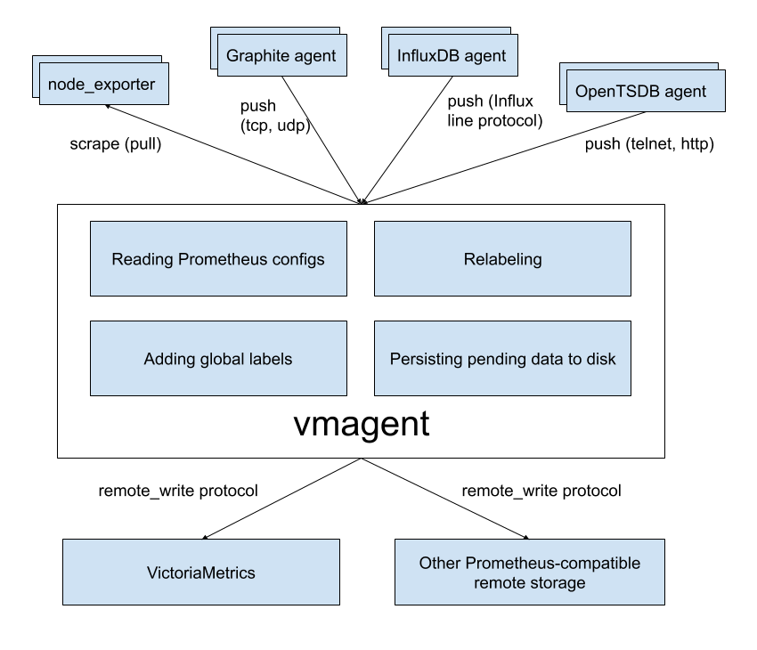

## vmagent

`vmagent` is a tiny but brave agent, which helps you collecting metrics from various sources
and storing them to [VictoriaMetrics](https://github.com/VictoriaMetrics/VictoriaMetrics)
or any other Prometheus-compatible storage system that supports `remote_write` protocol.




### Motivation

While VictoriaMetrics provides an efficient solution to store and observe metrics, our users needed something fast
and RAM friendly to scrape metrics from Prometheus-compatible exporters to VictoriaMetrics.
Also, we found that users’ infrastructure is like snowflakes - never alike, and we decided to add more flexibility
to `vmagent` (like the ability to push metrics instead of pulling them). We did our best and plan to do even more.


### Features

* Can be used as drop-in replacement for Prometheus for scraping targets such as [node_exporter](https://github.com/prometheus/node_exporter).
  See [Quick Start](#quick-start) for details.
* Can add, remove and modify labels (aka tags) via Prometheus relabeling. Can filter data before sending it to remote storage. See [these docs](#relabeling) for details.
* Accepts data via all the ingestion protocols supported by VictoriaMetrics:
  * Influx line protocol via `http://<vmagent>:8429/write`. See [these docs](https://github.com/VictoriaMetrics/VictoriaMetrics/blob/master/README.md#how-to-send-data-from-influxdb-compatible-agents-such-as-telegraf).
  * Graphite plaintext protocol if `-graphiteListenAddr` command-line flag is set. See [these docs](https://github.com/VictoriaMetrics/VictoriaMetrics/blob/master/README.md#how-to-send-data-from-graphite-compatible-agents-such-as-statsd).
  * OpenTSDB telnet and http protocols if `-opentsdbListenAddr` command-line flag is set. See [these docs](https://github.com/VictoriaMetrics/VictoriaMetrics/blob/master/README.md#how-to-send-data-from-opentsdb-compatible-agents).
  * Prometheus remote write protocol via `http://<vmagent>:8429/api/v1/write`.
  * JSON lines import protocol via `http://<vmagent>:8429/api/v1/import`. See [these docs](https://github.com/VictoriaMetrics/VictoriaMetrics/blob/master/README.md#how-to-import-time-series-data).
  * Arbitrary CSV data via `http://<vmagent>:8429/api/v1/import/csv`. See [these docs](https://github.com/VictoriaMetrics/VictoriaMetrics/blob/master/README.md#how-to-import-csv-data).
* Can replicate collected metrics simultaneously to multiple remote storage systems.
* Works in environments with unstable connections to remote storage. If the remote storage is unavailable, the collected metrics
  are buffered at `-remoteWrite.tmpDataPath`. The buffered metrics are sent to remote storage as soon as connection
  to remote storage is recovered. The maximum disk usage for the buffer can be limited with `-remoteWrite.maxDiskUsagePerURL`.
* Uses lower amounts of RAM, CPU, disk IO and network bandwidth comparing to Prometheus.


### Quick Start

Just download `vmutils-*` archive from [releases page](https://github.com/VictoriaMetrics/VictoriaMetrics/releases), unpack it
and pass the following flags to `vmagent` binary in order to start scraping Prometheus targets:

* `-promscrape.config` with the path to Prometheus config file (it is usually located at `/etc/prometheus/prometheus.yml`)
* `-remoteWrite.url` with the remote storage endpoint such as VictoriaMetrics. Multiple `-remoteWrite.url` args can be set in parallel
  in order to replicate data concurrently to multiple remote storage systems.

Example command line:

```
/path/to/vmagent -promscrape.config=/path/to/prometheus.yml -remoteWrite.url=https://victoria-metrics-host:8428/api/v1/write
```

If you need collecting only Influx data, then the following command line would be enough:

```
/path/to/vmagent -remoteWrite.url=https://victoria-metrics-host:8428/api/v1/write
```

Then send Influx data to `http://vmagent-host:8429`. See [these docs](https://github.com/VictoriaMetrics/VictoriaMetrics/blob/master/README.md#how-to-send-data-from-influxdb-compatible-agents-such-as-telegraf) for more details.

`vmagent` is also available in [docker images](https://hub.docker.com/r/victoriametrics/vmagent/).

Pass `-help` to `vmagent` in order to see the full list of supported command-line flags with their descriptions.


### Use cases


#### IoT and Edge monitoring

`vmagent` can run and collect metrics in IoT and industrial networks with unreliable or scheduled connections to the remote storage.
It buffers the collected data in local files until the connection to remote storage becomes available and then sends the buffered
data to the remote storage. It re-tries sending the data to remote storage on any errors.
The maximum buffer size can be limited with `-remoteWrite.maxDiskUsagePerURL`.

`vmagent` works on various architectures from IoT world - 32-bit arm, 64-bit arm, ppc64, 386, amd64.
See [the corresponding Makefile rules](https://github.com/VictoriaMetrics/VictoriaMetrics/blob/master/app/vmagent/Makefile) for details.


#### Drop-in replacement for Prometheus

If you use Prometheus only for scraping metrics from various targets and forwarding these metrics to remote storage,
then `vmagent` can replace such Prometheus setup. Usually `vmagent` requires lower amounts of RAM, CPU and network bandwidth comparing to Prometheus for such setup.
See [these docs](#how-to-collect-metrics-in-prometheus-format) for details.


#### Replication and high availability

`vmagent` replicates the collected metrics among multiple remote storage instances configured via `-remoteWrite.url` args.
If a single remote storage instance temporarily goes out of service, then the collected data remains available in another remote storage instances.
`vmagent` buffers the collected data in files at `-remoteWrite.tmpDataPath` until the remote storage becomes available again.
Then it sends the buffered data to the remote storage in order to prevent data gaps in the remote storage.


#### Relabeling and filtering

`vmagent` can add, remove or update labels on the collected data before sending it to remote storage. Additionally,
it can remove unneeded samples via Prometheus-like relabeling before sending the collected data to remote storage.
See [these docs](#relabeling) for details.


#### Splitting data streams among multiple systems

`vmagent` supports splitting of the collected data among muliple destinations with the help of `-remoteWrite.urlRelabelConfig`,
which is applied independently for each configured `-remoteWrite.url` destination. For instance, it is possible to replicate or split
data among long-term remote storage, short-term remote storage and real-time analytical system [built on top of Kafka](https://github.com/Telefonica/prometheus-kafka-adapter).
Note that each destination can receive its own subset of the collected data thanks to per-destination relabeling via `-remoteWrite.urlRelabelConfig`.


#### Prometheus remote_write proxy

`vmagent` may be used as a proxy for Prometheus data sent via Prometheus `remote_write` protocol. It can accept data via `remote_write` API
at `/api/v1/write` endpoint, apply relabeling and filtering and then proxy it to another `remote_write` systems.
The `vmagent` can be configured to encrypt the incoming `remote_write` requests with `-tls*` command-line flags.
Additionally, Basic Auth can be enabled for the incoming `remote_write` requests with `-httpAuth.*` command-line flags.


### How to collect metrics in Prometheus format

Pass the path to `prometheus.yml` to `-promscrape.config` command-line flag. `vmagent` takes into account the following
sections from [Prometheus config file](https://prometheus.io/docs/prometheus/latest/configuration/configuration/):

* `global`
* `scrape_configs`

All the other sections are ignored, including [remote_write](https://prometheus.io/docs/prometheus/latest/configuration/configuration/#remote_write) section.
Use `-remoteWrite.*` command-line flags instead for configuring remote write settings.

The following scrape types in [scrape_config](https://prometheus.io/docs/prometheus/latest/configuration/configuration/#scrape_config) section are supported:

* `static_configs` - for scraping statically defined targets. See [these docs](https://prometheus.io/docs/prometheus/latest/configuration/configuration/#static_config) for details.
* `file_sd_configs` - for scraping targets defined in external files aka file-based service discover.
  See [these docs](https://prometheus.io/docs/prometheus/latest/configuration/configuration/#file_sd_config) for details.
* `kubernetes_sd_configs` - for scraping targets in Kubernetes (k8s).
  See [kubernetes_sd_config](https://prometheus.io/docs/prometheus/latest/configuration/configuration/#kubernetes_sd_config) for details.

The following service discovery mechanisms will be added to `vmagent` soon:

* [ec2_sd_config](https://prometheus.io/docs/prometheus/latest/configuration/configuration/#ec2_sd_config)
* [gce_sd_config](https://prometheus.io/docs/prometheus/latest/configuration/configuration/#gce_sd_config)
* [consul_sd_config](https://prometheus.io/docs/prometheus/latest/configuration/configuration/#consul_sd_config)
* [dns_sd_config](https://prometheus.io/docs/prometheus/latest/configuration/configuration/#dns_sd_config)


File feature requests at [our issue tracker](https://github.com/VictoriaMetrics/VictoriaMetrics/issues) if you need other service discovery mechanisms to be supported by `vmagent`.


### Adding labels to metrics

Labels can be added to metrics via the following mechanisms:

* Via `global -> external_labels` section in `-promscrape.config` file. These labels are added only to metrics scraped from targets configured in `-promscrape.config` file.
* Via `-remoteWrite.label` command-line flag. These labels are added to all the collected metrics before sending them to `-remoteWrite.url`.


### Relabeling

`vmagent` supports [Prometheus relabeling](https://prometheus.io/docs/prometheus/latest/configuration/configuration/#relabel_config).
Additionally it provides the following extra actions:

* `replace_all`: replaces all the occurences of `regex` in the values of `source_labels` with the `replacement` and stores the result in the `target_label`.
* `labelmap_all`: replaces all the occurences of `regex` in all the label names with the `replacement`.

The relabeling can be defined in the following places:

* At `scrape_config -> relabel_configs` section in `-promscrape.config` file. This relabeling is applied to targets when parsing the file during `vmagent` startup
  or during config reload after sending `SIGHUP` signal to `vmagent`  via `kill -HUP`.
* At `scrape_config -> metric_relabel_configs` section in `-promscrape.config` file. This relabeling is applied to metrics after each scrape for the configured targets.
* At `-remoteWrite.relabelConfig` file. This relabeling is aplied to all the collected metrics before sending them to remote storage.
* At `-remoteWrite.urlRelabelConfig` files. This relabeling is applied to metrics before sending them to the corresponding `-remoteWrite.url`.

Read more about relabeling in the following articles:

* [Life of a label](https://www.robustperception.io/life-of-a-label)
* [Discarding targets and timeseries with relabeling](https://www.robustperception.io/relabelling-can-discard-targets-timeseries-and-alerts)
* [Dropping labels at scrape time](https://www.robustperception.io/dropping-metrics-at-scrape-time-with-prometheus)
* [Extracting labels from legacy metric names](https://www.robustperception.io/extracting-labels-from-legacy-metric-names)
* [relabel_configs vs metric_relabel_configs](https://www.robustperception.io/relabel_configs-vs-metric_relabel_configs)


### Monitoring

`vmagent` exports various metrics in Prometheus exposition format at `http://vmagent-host:8429/metrics` page. It is recommended setting up regular scraping of this page
either via `vmagent` itself or via Prometheus, so the exported metrics could be analyzed later.

`vmagent` also exports target statuses at `http://vmagent-host:8429/targets` page in plaintext format. This page also exports information on improperly configured scrape configs.


### Troubleshooting

* It is recommended increasing the maximum number of open files in the system (`ulimit -n`) when scraping big number of targets,
  since `vmagent` establishes at least a single TCP connection per each target.

* When `vmagent` scrapes many unreliable targets, it can flood error log with scrape errors. These errors can be suppressed
  by passing `-promscrape.suppressScrapeErrors` command-line flag to `vmagent`. The most recent scrape error per each target can be observed at `http://vmagent-host:8429/targets`.

* It is recommended increasing `-remoteWrite.queues` if `vmagent` collects more than 100K samples per second
  and `vmagent_remotewrite_pending_data_bytes` metric exported by `vmagent` at `/metrics` page constantly grows.

* `vmagent` buffers scraped data at `-remoteWrite.tmpDataPath` directory until it is sent to `-remoteWrite.url`.
  The directory can grow big when remote storage is unvailable during extended periods of time and if `-remoteWrite.maxDiskUsagePerURL` isn't set.
  If you don't want sending all the data from the directory to remote storage, just stop `vmagent` and delete the directory.


### How to build from sources

It is recommended using [binary releases](https://github.com/VictoriaMetrics/VictoriaMetrics/releases) - `vmagent` is located in `vmutils-*` archives there.


#### Development build

1. [Install Go](https://golang.org/doc/install). The minimum supported version is Go 1.13.
2. Run `make vmagent` from the root folder of the repository.
   It builds `vmagent` binary and puts it into the `bin` folder.

#### Production build

1. [Install docker](https://docs.docker.com/install/).
2. Run `make vmagent-prod` from the root folder of the repository.
   It builds `vmagent-prod` binary and puts it into the `bin` folder.

#### Building docker images

Run `make package-vmagent`. It builds `victoriametrics/vmagent:<PKG_TAG>` docker image locally.
`<PKG_TAG>` is auto-generated image tag, which depends on source code in the repository.
The `<PKG_TAG>` may be manually set via `PKG_TAG=foobar make package-vmagent`.
