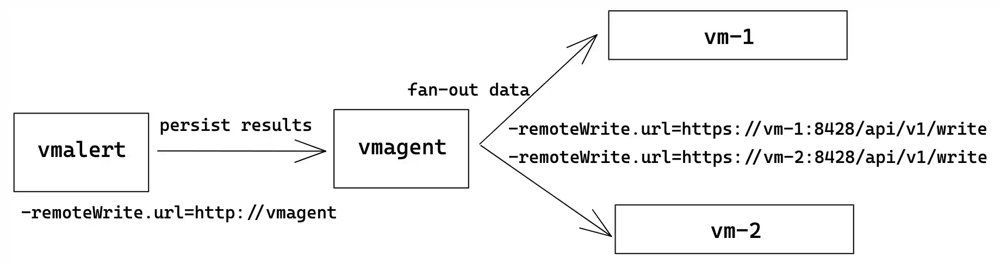
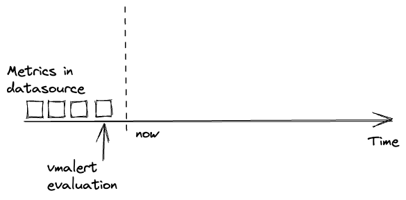
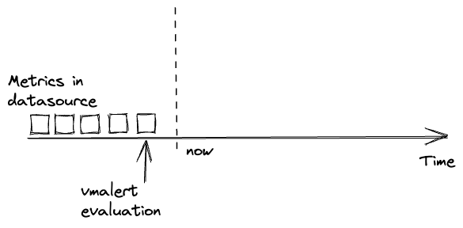
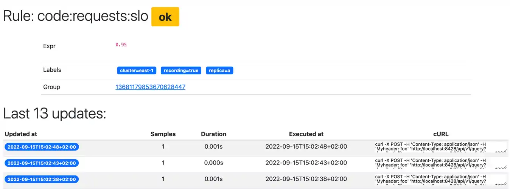

`vmalert` executes a list of the given [alerting](https://prometheus.io/docs/prometheus/latest/configuration/alerting_rules/)
or [recording](https://prometheus.io/docs/prometheus/latest/configuration/recording_rules/)
rules against configured `-datasource.url` compatible with Prometheus HTTP API. For sending alerting notifications
`vmalert` relies on [Alertmanager](https://github.com/prometheus/alertmanager) configured via `-notifier.url` flag.
Recording rules results are persisted via [remote write](https://prometheus.io/docs/prometheus/latest/storage/#remote-storage-integrations)
protocol and require `-remoteWrite.url` to be configured.
`vmalert` is heavily inspired by [Prometheus](https://prometheus.io/docs/alerting/latest/overview/)
implementation and aims to be compatible with its syntax.

A [single-node](https://docs.victoriametrics.com/single-server-victoriametrics/#vmalert)
or [cluster version](https://docs.victoriametrics.com/cluster-victoriametrics/#vmalert)
of VictoriaMetrics are capable of proxying requests to `vmalert` via `-vmalert.proxyURL` command-line flag. 
Use this feature for the following cases:
* for proxying requests from [Grafana Alerting UI](https://grafana.com/docs/grafana/latest/alerting/);
* for accessing `vmalert`'s UI through VictoriaMetrics Web interface.

[VictoriaMetrics Cloud](https://console.victoriametrics.cloud/signUp?utm_source=website&utm_campaign=docs_vm_vmalert_intro) 
provides out-of-the-box alerting functionality based on `vmalert`. This service simplifies the setup 
and management of alerting and recording rules as well as the integration with Alertmanager. For more details, 
please refer to the [VictoriaMetrics Cloud documentation](https://docs.victoriametrics.com/victoriametrics-cloud/alertmanager-setup-for-deployment/).

## Features

* Integration with [VictoriaMetrics](https://github.com/VictoriaMetrics/VictoriaMetrics) TSDB;
* VictoriaMetrics [MetricsQL](https://docs.victoriametrics.com/metricsql/)
  support and expressions validation;
* Prometheus [alerting rules definition format](https://prometheus.io/docs/prometheus/latest/configuration/alerting_rules/#defining-alerting-rules)
  support;
* Integration with [Alertmanager](https://github.com/prometheus/alertmanager) starting from [Alertmanager v0.16.0-alpha](https://github.com/prometheus/alertmanager/releases/tag/v0.16.0-alpha.0);
* Keeps the alerts [state on restarts](#alerts-state-on-restarts);
* Graphite datasource can be used for alerting and recording rules. See [these docs](#graphite);
* Recording and Alerting rules backfilling (aka `replay`). See [these docs](#rules-backfilling);
* Lightweight and without extra dependencies.
* Supports [reusable templates](#reusable-templates) for annotations;
* Load of recording and alerting rules from local filesystem, URL, GCS and S3;
* Detect alerting rules which [don't match any series](https://github.com/VictoriaMetrics/VictoriaMetrics/issues/4039).

## Limitations

* `vmalert` execute queries against remote datasource which has reliability risks because of the network.
  It is recommended to configure alerts thresholds and rules expressions with the understanding that network
  requests may fail;
* by default, rules execution is sequential within one group, but persistence of execution results to remote
  storage is asynchronous. Hence, user shouldn't rely on chaining of recording rules when result of previous
  recording rule is reused in the next one;

## QuickStart

To build `vmalert` from sources:

```sh
git clone https://github.com/VictoriaMetrics/VictoriaMetrics
cd VictoriaMetrics
make vmalert
```

The build binary will be placed in `VictoriaMetrics/bin` folder.

To start using `vmalert` you will need the following things:

* list of rules - PromQL/MetricsQL expressions to execute;
* datasource address - reachable endpoint with [Prometheus HTTP API](https://prometheus.io/docs/prometheus/latest/querying/api/#http-api) support for running queries against;
* notifier address [optional] - reachable [Alert Manager](https://github.com/prometheus/alertmanager) instance for processing,
  aggregating alerts, and sending notifications. Please note, notifier address also supports Consul and DNS Service Discovery via
  [config file](https://github.com/VictoriaMetrics/VictoriaMetrics/blob/master/app/vmalert/notifier/config.go).
* remote write address [optional] - [remote write](https://prometheus.io/docs/prometheus/latest/storage/#remote-storage-integrations)
  compatible storage to persist rules and alerts state info. To persist results to multiple destinations use vmagent
  configured with multiple remote writes as a proxy;
* remote read address [optional] - MetricsQL compatible datasource to restore alerts state from.

Then configure `vmalert` accordingly:

```sh
./bin/vmalert -rule=alert.rules \            # Path to the file with rules configuration. Supports wildcard
    -datasource.url=http://localhost:8428 \  # Prometheus HTTP API compatible datasource
    -notifier.url=http://localhost:9093 \    # AlertManager URL (required if alerting rules are used)
    -notifier.url=http://127.0.0.1:9093 \    # AlertManager replica URL
    -remoteWrite.url=http://localhost:8428 \ # Remote write compatible storage to persist rules and alerts state info (required if recording rules are used)
    -remoteRead.url=http://localhost:8428 \  # Prometheus HTTP API compatible datasource to restore alerts state from
    -external.label=cluster=east-1 \         # External label to be applied for each rule
    -external.label=replica=a                # Multiple external labels may be set
```

> _To validate the syntax of configured rules simply run vmalert with `-rule` and `-dryRun` cmd-line flags._

Note there's a separate `-remoteWrite.url` command-line flag to allow writing results of
alerting/recording rules into a different storage than the initial data that's
queried. This allows using `vmalert` to aggregate data from a short-term,
high-frequency, high-cardinality storage into a long-term storage with
decreased cardinality and a bigger interval between samples.
See also [stream aggregation](https://docs.victoriametrics.com/stream-aggregation/).

See the full list of configuration flags in [configuration](#configuration) section.

If you run multiple `vmalert` services for the same datastore or AlertManager - do not forget
to specify different `-external.label` command-line flags in order to define which `vmalert` generated rules or alerts.
If rule result metrics have label that conflict with `-external.label`, `vmalert` will automatically rename
it with prefix `exported_`.

Configuration for [recording](https://prometheus.io/docs/prometheus/latest/configuration/recording_rules/)
and [alerting](https://prometheus.io/docs/prometheus/latest/configuration/alerting_rules/) rules is very
similar to Prometheus rules and configured using YAML. Configuration examples may be found
in [testdata](https://github.com/VictoriaMetrics/VictoriaMetrics/blob/master/app/vmalert/config/testdata) folder.
Every `rule` belongs to a `group` and every configuration file may contain arbitrary number of groups:

```yaml
groups:
  [ - <rule_group> ]
```

> Explore how to integrate `vmalert` with [VictoriaMetrics Anomaly Detection](/anomaly-detection/) in the following [guide](/anomaly-detection/guides/guide-vmanomaly-vmalert/)

> For users of [VictoriaMetrics Cloud](https://console.victoriametrics.cloud/signUp?utm_source=website&utm_campaign=docs_vm_vmalert_config), 
> many of the configuration steps (including highly available setup of `vmalert` for cluster deployments) are handled automatically. 
> Please, refer to the [VictoriaMetrics Cloud documentation](https://docs.victoriametrics.com/victoriametrics-cloud/alertmanager-setup-for-deployment/) for more details.

### Groups

Each group has the following attributes:

```yaml
# The name of the group. Must be unique within a file.
name: <string>

# How often rules in the group are evaluated.
[ interval: <duration> | default = -evaluationInterval flag ]

# Optional
# Group will be evaluated at the exact offset in the range of [0...interval].
# E.g. for Group with `interval: 1h` and `eval_offset: 5m` the evaluation will
# start at 5th minute of the hour. See https://github.com/VictoriaMetrics/VictoriaMetrics/issues/3409
# `eval_offset` can't be bigger than `interval`.
[ eval_offset: <duration> ]

# Optional
# Adjust the `time` parameter of group evaluation requests to compensate intentional query delay from the datasource.
# By default, the value is inherited from the `-rule.evalDelay` cmd-line flag - see its description for details.
# If group has `latency_offset` set in `params`, then it is recommended to set `eval_delay` equal to `latency_offset`.
# See https://github.com/VictoriaMetrics/VictoriaMetrics/issues/5155 and https://docs.victoriametrics.com/keyconcepts/#query-latency.
[ eval_delay: <duration> ]

# Limit limits the number of alerts or recording results the rule within this group can produce.
# On exceeding the limit, rule will be marked with an error and all its results will be discarded.
# 0 is no limit.
[ limit: <integer> | default 0]

# How many rules execute at once within a group. Increasing concurrency may speed
# up group's evaluation duration (exposed via `vmalert_iteration_duration_seconds` metric).
[ concurrency: <integer> | default = 1 ]

# Optional type for expressions inside the rules. Supported values: "graphite" and "prometheus".
# By default, "prometheus" type is used.
[ type: <string> ]

# Optional
# The evaluation timestamp will be aligned with group's interval, 
# instead of using the actual timestamp that evaluation happens at.
#
# It is enabled by default to get more predictable results 
# and to visually align with graphs plotted via Grafana or vmui.
# When comparing with raw queries, remember to use `step` equal to evaluation interval.
#
# See https://github.com/VictoriaMetrics/VictoriaMetrics/issues/5049 
# Available starting from v1.95
[ eval_alignment: <bool> | default true]

# Optional list of HTTP URL parameters
# applied for all rules requests within a group
# For example:
#  params:
#    nocache: ["1"]                # disable caching for vmselect
#    denyPartialResponse: ["true"] # fail if one or more vmstorage nodes returned an error
#    extra_label: ["env=dev"]      # apply additional label filter "env=dev" for all requests
# see more details at https://docs.victoriametrics.com#prometheus-querying-api-enhancements
params:
  [ <string>: [<string>, ...]]

# Optional list of HTTP headers in form `header-name: value`
# applied for all rules requests within a group
# For example:
#  headers:
#    - "CustomHeader: foo"
#    - "CustomHeader2: bar"
# Headers set via this param have priority over headers set via `-datasource.headers` flag.
headers:
  [ <string>, ...]

# Optional list of HTTP headers in form `header-name: value`
# applied for all alert notifications sent to notifiers 
# generated by rules of this group.
# It has higher priority over headers defined in notifier config.
# For example:
#  notifier_headers:
#    - "TenantID: foo"
notifier_headers:
        [ <string>, ...]

# Optional list of labels added to every rule within a group.
# It has priority over the external labels.
# Labels are commonly used for adding environment
# or tenant-specific tag.
labels:
  [ <labelname>: <labelvalue> ... ]

rules:
  [ - <rule> ... ]
```

### Rules

Every rule contains `expr` field for [PromQL](https://prometheus.io/docs/prometheus/latest/querying/basics/)
or [MetricsQL](https://docs.victoriametrics.com/metricsql/) expression. `vmalert` will execute the configured
expression and then act according to the Rule type.

There are two types of Rules:

* [alerting](https://prometheus.io/docs/prometheus/latest/configuration/alerting_rules/) -
  Alerting rules allow defining alert conditions via `expr` field and to send notifications to
  [Alertmanager](https://github.com/prometheus/alertmanager) if execution result is not empty.
* [recording](https://prometheus.io/docs/prometheus/latest/configuration/recording_rules/) -
  Recording rules allow defining `expr` which result will be then backfilled to configured
  `-remoteWrite.url`. Recording rules are used to precompute frequently needed or computationally
  expensive expressions and save their result as a new set of time series.

`vmalert` forbids defining duplicates - rules with the same combination of name, expression, and labels
within one group.

#### Alerting rules

The syntax for alerting rule is the following:

```yaml
# The name of the alert. Must be a valid metric name.
alert: <string>

# The expression to evaluate. The expression language depends on the type value.
# By default, PromQL/MetricsQL expression is used. If group.type="graphite", then the expression
# must contain valid Graphite expression.
expr: <string>

# Alerts are considered firing once they have been returned for this long.
# Alerts which have not yet been fired for long enough are considered pending.
# If param is omitted or set to 0 then alerts will be immediately considered
# as firing once they return.
[ for: <duration> | default = 0s ]

# Alert will continue firing for this long even when the alerting expression no longer has results.
# This allows you to delay alert resolution.
[ keep_firing_for: <duration> | default = 0s ]

# Whether to print debug information into logs.
# Information includes alerts state changes and requests sent to the datasource.
# Please note, that if rule's query params contain sensitive
# information - it will be printed to logs.
# Is applicable to alerting rules only.
# Available starting from https://docs.victoriametrics.com/changelog/#v1820
[ debug: <bool> | default = false ]

# Defines the number of rule's updates entries stored in memory
# and available for view on rule's Details page.
# Overrides `rule.updateEntriesLimit` value for this specific rule.
# Available starting from https://docs.victoriametrics.com/changelog/#v1860
[ update_entries_limit: <integer> | default 0 ]

# Labels to add or overwrite for each alert.
# In case of conflicts, original labels are kept with prefix `exported_`.
labels:
  [ <labelname>: <tmpl_string> ]

# Annotations to add to each alert.
annotations:
  [ <labelname>: <tmpl_string> ]
```

#### Templating

It is allowed to use [Go templating](https://golang.org/pkg/text/template/) in annotations to format data, iterate over
or execute expressions.
The following variables are available in templating:

| Variable                           | Description                                                                                               | Example                                                                                                                                                                                                   |
|------------------------------------|-----------------------------------------------------------------------------------------------------------|-----------------------------------------------------------------------------------------------------------------------------------------------------------------------------------------------------------|
| $value or .Value                   | The current alert's value. Avoid using value in labels, it may cause unexpected issues.                   | Number of connections is {{ $value }}                                                                                                                                                |
| $activeAt or .ActiveAt             | The moment of [time](https://pkg.go.dev/time) when alert became active (`pending` or `firing`).           | http://vm-grafana.com/<dashboard-id>?viewPanel=<panel-id>&from={{($activeAt.Add (parseDurationTime \"1h\")).UnixMilli}}&to={{($activeAt.Add (parseDurationTime \"-1h\")).UnixMilli}} |
| $labels or .Labels                 | The list of labels of the current alert. Use as ".Labels.<label_name>".                                   | Too high number of connections for {{ .Labels.instance }}                                                                                                                            |
| $alertID or .AlertID               | The current alert's ID generated by vmalert.                                                              | Link: vmalert/alert?group_id={{.GroupID}}&alert_id={{.AlertID}}                                                                                                                      |
| $groupID or .GroupID               | The current alert's group ID generated by vmalert.                                                        | Link: vmalert/alert?group_id={{.GroupID}}&alert_id={{.AlertID}}                                                                                                                      |
| $expr or .Expr                     | Alert's expression. Can be used for generating links to Grafana or other systems.                         | /api/v1/query?query={{ $expr&#124;queryEscape }}                                                                                                                                     |
| $for or .For                       | Alert's configured for param.                                                                             | Number of connections is too high for more than {{ .For }}                                                                                                                           |
| $externalLabels or .ExternalLabels | List of labels configured via `-external.label` command-line flag.                                        | Issues with {{ $labels.instance }} (datacenter-{{ $externalLabels.dc }})                                                                                                             |
| $externalURL or .ExternalURL       | URL configured via `-external.url` command-line flag. Used for cases when vmalert is hidden behind proxy. | Visit {{ $externalURL }} for more details                                                                                                                                            |

Additionally, `vmalert` provides some extra templating functions listed [here](#template-functions) and [reusable templates](#reusable-templates).

#### Template functions

`vmalert` provides the following template functions, which can be used during [templating](#templating):

- `args arg0 ... argN` - converts the input args into a map with `arg0`, ..., `argN` keys.
- `externalURL` - returns the value of `-external.url` command-line flag.
- `first` - returns the first result from the input query results returned by `query` function.
- `htmlEscape` - escapes special chars in input string, so it can be safely embedded as a plaintext into HTML.
- `humanize` - converts the input number into human-readable format by adding [metric prefixes](https://en.wikipedia.org/wiki/Metric_prefix).
  For example, `100000` is converted into `100K`.
- `humanize1024` - converts the input number into human-readable format with 1024 base.
  For example, `1024` is converted into 1ki`.
- `humanizeDuration` - converts the input number in seconds into human-readable duration.
- `humanizePercentage` - converts the input number to percentage. For example, `0.123` is converted into `12.3%`.
- `humanizeTimestamp` - converts the input unix timestamp into human-readable time.
- `jsonEscape` - JSON-encodes the input string.
- `label name` - returns the value of the label with the given `name` from the input query result.
- `match regex` - matches the input string against the provided `regex`.
- `parseDuration` - parses the input string into duration in seconds. For example, `1h` is parsed into `3600`.
- `parseDurationTime` - parses the input string into [time.Duration](https://pkg.go.dev/time#Duration).
- `pathEscape` - escapes the input string, so it can be safely put inside path part of URL.
- `pathPrefix` - returns the path part of the `-external.url` command-line flag.
- `query` - executes the [MetricsQL](https://docs.victoriametrics.com/metricsql/) query against `-datasource.url` and returns the query result.
  For example, `{{ query "sort_desc(process_resident_memory_bytes)" | first | value }}` executes the `sort_desc(process_resident_memory_bytes)`
  query at `-datasource.url` and returns the first result.
- `queryEscape` - escapes the input string, so it can be safely put inside [query arg](https://en.wikipedia.org/wiki/Percent-encoding) part of URL.
- `quotesEscape` - escapes the input string, so it can be safely embedded into JSON string.
- `reReplaceAll regex repl` - replaces all the occurrences of the `regex` in input string with the `repl`.
- `safeHtml` - marks the input string as safe to use in HTML context without the need to html-escape it.
- `sortByLabel name` - sorts the input query results by the label with the given `name`.
- `stripDomain` - leaves the first part of the domain. For example, `foo.bar.baz` is converted to `foo`.
  The port part is left in the output string. E.g. `foo.bar:1234` is converted into `foo:1234`.
- `stripPort` - strips `port` part from `host:port` input string.
- `strvalue` - returns the metric name from the input query result.
- `title` - converts the first letters of every input word to uppercase.
- `toLower` - converts all the chars in the input string to lowercase.
- `toTime` - converts the input unix timestamp to [time.Time](https://pkg.go.dev/time#Time).
- `toUpper` - converts all the chars in the input string to uppercase.
- `value` - returns the numeric value from the input query result.

#### Reusable templates

Like in Alertmanager you can define [reusable templates](https://prometheus.io/docs/prometheus/latest/configuration/template_examples/#defining-reusable-templates)
to share same templates across annotations. Just define the templates in a file and
set the path via `-rule.templates` flag.

For example, template `grafana.filter` can be defined as following:

```
{{ define "grafana.filter" -}}
  {{- $labels := .arg0 -}}
  {{- range $name, $label := . -}}
    {{- if (ne $name "arg0") -}}
      {{- ( or (index $labels $label) "All" ) | printf "&var-%s=%s" $label -}}
    {{- end -}}
  {{- end -}}
{{- end -}}
```

And then used in annotations:

```yaml
groups:
  - name: AlertGroupName
    rules:
      - alert: AlertName
        expr: any_metric > 100
        for: 30s
        labels:
          alertname: 'Any metric is too high'
          severity: 'warning'
        annotations:
          dashboard: '{{ $externalURL }}/d/dashboard?orgId=1{{ template "grafana.filter" (args .CommonLabels "account_id" "any_label") }}'
```

The `-rule.templates` flag supports wildcards so multiple files with templates can be loaded.
The content of `-rule.templates` can be also [hot reloaded](#hot-config-reload).


#### Recording rules

The syntax for recording rules is following:

```yaml
# The name of the time series to output to. Must be a valid metric name.
record: <string>

# The expression to evaluate. The expression language depends on the type value.
# By default, MetricsQL expression is used. If group.type="graphite", then the expression
# must contain valid Graphite expression.
expr: <string>

# Labels to add or overwrite before storing the result.
# In case of conflicts, original labels are kept with prefix `exported_`.
labels:
  [ <labelname>: <labelvalue> ]


# Defines the number of rule's updates entries stored in memory
# and available for view on rule's Details page.
# Overrides `rule.updateEntriesLimit` value for this specific rule.
[ update_entries_limit: <integer> | default 0 ]
```

For recording rules to work `-remoteWrite.url` must be specified.

### Alerts state on restarts

`vmalert` holds alerts state in the memory. Restart of the `vmalert` process will reset the state of all active alerts 
in the memory. To prevent `vmalert` from losing the state on restarts configure it to persist the state 
to the remote database via the following flags:

* `-remoteWrite.url` - URL to VictoriaMetrics (Single) or vminsert (Cluster). `vmalert` will persist alerts state
  to the configured address in the form of [time series](https://docs.victoriametrics.com/keyconcepts/#time-series)
  `ALERTS` and `ALERTS_FOR_STATE` via remote-write protocol.
  These time series can be queried from VictoriaMetrics just as any other time series.
  The state will be persisted to the configured address on each evaluation.
* `-remoteRead.url` - URL to VictoriaMetrics (Single) or vmselect (Cluster). `vmalert` will try to restore alerts state
  from the configured address by querying time series with name `ALERTS_FOR_STATE`. The restore happens only once when
  `vmalert` process starts, and only for the configured rules. Config [hot reload](#hot-config-reload) doesn't trigger 
  state restore.

Both flags are required for proper state restoration. Restore process may fail if time series are missing
in configured `-remoteRead.url`, weren't updated in the last `1h` (controlled by `-remoteRead.lookback`)
or received state doesn't match current `vmalert` rules configuration. `vmalert` marks successfully restored rules
with `restored` label in [web UI](#web).

### Link to alert source

Alerting notifications sent by vmalert always contain a `source` link. By default, the link format
is the following `http://<vmalert-addr>/vmalert/alert?group_id=<group_id>&alert_id=<alert_id>`. On click, it opens
vmalert [web UI](https://docs.victoriametrics.com/vmalert/#web) to show the alert status and its fields.

It is possible to override the link format. For example, to make the link to [vmui](https://docs.victoriametrics.com/single-server-victoriametrics/#vmui)
specify the following cmd-line flags:
```
./bin/vmalert \
    -external.url=http://<vmui-addr> \  # the hostname and port for datasource vmui 
    -external.alert.source='vmui/#/?g0.expr={{.Expr|queryEscape}}' # the path built using alert expr
```

Now, all `source` links will lead to `http://<vmui-addr>/vmui/#/?g0.expr=$expr`, where $expr is an alerting rule
expression.

The `-external.alert.source` cmd-line flag supports [templating](https://docs.victoriametrics.com/vmalert/#templating)
and allows using labels and extra data related to the alert. For example, see the following link to Grafana:
```
./bin/vmalert \
    -external.url=http://<grafana-addr> \  # the hostname and port for Grafana 
    -external.alert.source='explore?left={"datasource":"VictoriaMetrics","queries":[{"expr":{{ .Expr|jsonEscape|queryEscape }},"refId":"A"}],"range":{"from":"{{ .ActiveAt.UnixMilli }}","to":"now"}}'
```

In this example, `-external.alert.source` will lead to Grafana's Explore page with `expr` field equal to alert expression,
and time range will be selected starting from `"from":"{{ .ActiveAt.UnixMilli }}"` when alert became active.

In addition to `source` link, some extra links could be added to alert's [annotations](https://docs.victoriametrics.com/vmalert/#alerting-rules)
field. See [how we use them](https://github.com/VictoriaMetrics/VictoriaMetrics/blob/839596c00df123c639d1244b28ee8137dfc9609c/deployment/docker/alerts-cluster.yml#L43) 
to link alerting rule and the corresponding panel on Grafana dashboard.

### Multitenancy

There are the following approaches exist for alerting and recording rules across
[multiple tenants](https://docs.victoriametrics.com/cluster-victoriametrics/#multitenancy):

* To run a separate `vmalert` instance per each tenant.
  The corresponding tenant must be specified in `-datasource.url` command-line flag
  according to [these docs](https://docs.victoriametrics.com/cluster-victoriametrics/#url-format).
  For example, `/path/to/vmalert -datasource.url=http://vmselect:8481/select/123/prometheus`
  would run alerts against `AccountID=123`. For recording rules the `-remoteWrite.url` command-line
  flag must contain the url for the specific tenant as well.
  For example, `-remoteWrite.url=http://vminsert:8480/insert/123/prometheus` would write recording
  rules to `AccountID=123`.

* To specify `tenant` parameter per each alerting and recording group if
  [enterprise version of vmalert](https://docs.victoriametrics.com/enterprise/) is used
  with `-clusterMode` command-line flag. For example:

```yaml
groups:
- name: rules_for_tenant_123
  tenant: "123"
  rules:
    # Rules for accountID=123

- name: rules_for_tenant_456:789
  tenant: "456:789"
  rules:
    # Rules for accountID=456, projectID=789
```

The results of alerting and recording rules contain `vm_account_id` and `vm_project_id` labels
if `-clusterMode` is enabled. These labels can be used during [templating](https://docs.victoriametrics.com/vmalert/#templating),
and help to identify to which account or project the triggered alert or produced recording belongs.

If `-clusterMode` is enabled, then `-datasource.url`, `-remoteRead.url` and `-remoteWrite.url` must
contain only the hostname without tenant id. For example: `-datasource.url=http://vmselect:8481`.
`vmalert` automatically adds the specified tenant to urls per each recording rule in this case.

If `-clusterMode` is enabled and the `tenant` in a particular group is missing, then the tenant value
is obtained from `-defaultTenant.prometheus` or `-defaultTenant.graphite` depending on the `type` of the group.

The enterprise version of vmalert is available in `vmutils-*-enterprise.tar.gz` files
at [release page](https://github.com/VictoriaMetrics/VictoriaMetrics/releases/latest) and in `*-enterprise`
tags at [Docker Hub](https://hub.docker.com/r/victoriametrics/vmalert/tags).

### Reading rules from object storage

[Enterprise version](https://docs.victoriametrics.com/enterprise/) of `vmalert` may read alerting and recording rules
from object storage:

- `./bin/vmalert -rule=s3://bucket/dir/alert.rules` would read rules from the given path at S3 bucket
- `./bin/vmalert -rule=gs://bucket/dir/alert.rules` would read rules from the given path at GCS bucket

S3 and GCS paths support only matching by prefix, e.g. `s3://bucket/dir/rule_` matches
all files with prefix `rule_` in the folder `dir`.

The following [command-line flags](#flags) can be used for fine-tuning access to S3 and GCS:

- `-s3.credsFilePath` - path to file with GCS or S3 credentials. Credentials are loaded from default locations if not set.
- `-s3.configFilePath` - path to file with S3 configs. Configs are loaded from default location if not set.
- `-s3.configProfile` - profile name for S3 configs. If no set, the value of the environment variable will be loaded (`AWS_PROFILE` or `AWS_DEFAULT_PROFILE`).
- `-s3.customEndpoint` - custom S3 endpoint for use with S3-compatible storages (e.g. MinIO). S3 is used if not set.
- `-s3.forcePathStyle` - prefixing endpoint with bucket name when set false, true by default.

### Topology examples

The following sections are showing how `vmalert` may be used and configured
for different scenarios.

Please note, not all flags in examples are required:

* `-remoteWrite.url` and `-remoteRead.url` are optional and are needed only if
  you have recording rules or want to store [alerts state](#alerts-state-on-restarts) on `vmalert` restarts;
* `-notifier.url` is optional and is needed only if you have alerting rules.

#### Single-node VictoriaMetrics

The simplest configuration where one single-node VM server is used for
rules execution, storing recording rules results and alerts state.

`vmalert` configuration flags:

```
./bin/vmalert -rule=rules.yml  \                    # Path to the file with rules configuration. Supports wildcard
    -datasource.url=http://victoriametrics:8428 \   # VM-single addr for executing rules expressions
    -remoteWrite.url=http://victoriametrics:8428 \  # VM-single addr to persist alerts state and recording rules results
    -remoteRead.url=http://victoriametrics:8428 \   # VM-single addr for restoring alerts state after restart
    -notifier.url=http://alertmanager:9093          # AlertManager addr to send alerts when they trigger
```


{width="500"}

#### Cluster VictoriaMetrics

In [cluster mode](https://docs.victoriametrics.com/cluster-victoriametrics/)
VictoriaMetrics has separate components for writing and reading path:
`vminsert` and `vmselect` components respectively. `vmselect` is used for executing rules expressions
and `vminsert` is used to persist recording rules results and alerts state.
Cluster mode could have multiple `vminsert` and `vmselect` components.

`vmalert` configuration flags:

```
./bin/vmalert -rule=rules.yml  \                                # Path to the file with rules configuration. Supports wildcard
    -datasource.url=http://vmselect:8481/select/0/prometheus    # vmselect addr for executing rules expressions
    -remoteWrite.url=http://vminsert:8480/insert/0/prometheus   # vminsert addr to persist alerts state and recording rules results
    -remoteRead.url=http://vmselect:8481/select/0/prometheus    # vmselect addr for restoring alerts state after restart
    -notifier.url=http://alertmanager:9093                      # AlertManager addr to send alerts when they trigger
```


In case when you want to spread the load on these components - add balancers before them and configure
`vmalert` with balancer addresses. Please, see more about VM's cluster architecture
[here](https://docs.victoriametrics.com/cluster-victoriametrics/#architecture-overview).

#### HA vmalert

For High Availability(HA) user can run multiple identically configured `vmalert` instances.
It means all of them will execute the same rules, write state and results to
the same destinations, and send alert notifications to multiple configured
Alertmanagers.

`vmalert` configuration flags:

```
./bin/vmalert -rule=rules.yml \                   # Path to the file with rules configuration. Supports wildcard
    -datasource.url=http://victoriametrics:8428 \   # VM-single addr for executing rules expressions
    -remoteWrite.url=http://victoriametrics:8428 \  # VM-single addr to persist alerts state and recording rules results
    -remoteRead.url=http://victoriametrics:8428 \   # VM-single addr for restoring alerts state after restart
    -notifier.url=http://alertmanager1:9093 \       # Multiple AlertManager addresses to send alerts when they trigger
    -notifier.url=http://alertmanagerN:9093         # The same alert will be sent to all configured notifiers
```


To avoid recording rules results and alerts state duplication in VictoriaMetrics server
don't forget to configure [deduplication](https://docs.victoriametrics.com/single-server-victoriametrics/#deduplication).
Multiple equally configured vmalerts should evaluate rules at the same timestamps, so it is recommended 
to set `-dedup.minScrapeInterval` as equal to vmalert's `-evaluationInterval`.

If you have multiple different `interval` params for distinct rule groups, then set `-dedup.minScrapeInterval` to
the biggest `interval` value, or value which will be a multiple for all `interval` values. For example, if you have
two groups with `interval: 10s` and `interval: 15s`, then set `-dedup.minScrapeInterval=30s`. This would consistently
keep only a single data point on 30s time interval for all rules. However, try to avoid having inconsistent `interval`
values.

It is not recommended having `-dedup.minScrapeInterval` smaller than `-evaluationInterval`, as it may produce 
results with inconsistent intervals between data points.

Alertmanager will automatically deduplicate alerts with identical labels, so ensure that
all `vmalert`s are having identical config.

Don't forget to configure [cluster mode](https://prometheus.io/docs/alerting/latest/alertmanager/)
for Alertmanagers for better reliability. List all Alertmanager URLs in vmalert `-notifier.url`
to ensure [high availability](https://github.com/prometheus/alertmanager#high-availability).

This example uses single-node VM server for the sake of simplicity.
Check how to replace it with [cluster VictoriaMetrics](#cluster-victoriametrics) if needed.

#### Downsampling and aggregation via vmalert

_Please note, [stream aggregation](https://docs.victoriametrics.com/stream-aggregation/) might be more efficient
for cases when downsampling or aggregation need to be applied **before data gets into the TSDB.**_

`vmalert` can't modify existing data. But it can run arbitrary PromQL/MetricsQL queries
via [recording rules](#recording-rules) and backfill results to the configured `-remoteWrite.url`.
This ability allows to aggregate data. For example, the following rule will calculate the average value for
metric `http_requests` on the `5m` interval:

```yaml
  - record: http_requests:avg5m
    expr: avg_over_time(http_requests[5m])
```

Every time this rule will be evaluated, `vmalert` will backfill its results as a new time series `http_requests:avg5m`
to the configured `-remoteWrite.url`.

`vmalert` executes rules with specified interval (configured via flag `-evaluationInterval`
or as [group's](#groups) `interval` param). The interval helps to control "resolution" of the produced series.
This ability allows to downsample data. For example, the following config will execute the rule only once every `5m`:

```yaml
groups:
  - name: my_group
    interval: 5m
    rules:
    - record: http_requests:avg5m
      expr: avg_over_time(http_requests[5m])
```

Ability of `vmalert` to be configured with different `-datasource.url` and `-remoteWrite.url` command-line flags
allows reading data from one data source and backfilling results to another. This helps to build a system
for aggregating and downsampling the data.

The following example shows how to build a topology where `vmalert` will process data from one cluster
and write results into another. Such clusters may be called as "hot" (low retention,
high-speed disks, used for operative monitoring) and "cold" (long term retention,
slower/cheaper disks, low resolution data). With help of `vmalert`, user can setup
recording rules to process raw data from "hot" cluster (by applying additional transformations
or reducing resolution) and push results to "cold" cluster.

`vmalert` configuration flags:

```
./bin/vmalert -rule=downsampling-rules.yml \                                        # Path to the file with rules configuration. Supports wildcard
    -datasource.url=http://raw-cluster-vmselect:8481/select/0/prometheus            # vmselect addr for executing recording rules expressions
    -remoteWrite.url=http://aggregated-cluster-vminsert:8480/insert/0/prometheus    # vminsert addr to persist recording rules results
```


Please note, [replay](#rules-backfilling) feature may be used for transforming historical data.

Flags `-remoteRead.url` and `-notifier.url` are omitted since we assume only recording rules are used.

See also [stream aggregation](https://docs.victoriametrics.com/stream-aggregation/) and [downsampling](https://docs.victoriametrics.com/#downsampling).

#### Multiple remote writes

For persisting recording or alerting rule results `vmalert` requires `-remoteWrite.url` to be set.
But this flag supports only one destination. To persist rule results to multiple destinations
we recommend using [vmagent](https://docs.victoriametrics.com/vmagent/) as fan-out proxy:



In this topology, `vmalert` is configured to persist rule results to `vmagent`. And `vmagent`
is configured to fan-out received data to two or more destinations.
Using `vmagent` as a proxy provides additional benefits such as
[data persisting when storage is unreachable](https://docs.victoriametrics.com/vmagent/#replication-and-high-availability),
or time series modification via [relabeling](https://docs.victoriametrics.com/vmagent/#relabeling).


### Web

`vmalert` runs a web-server (`-httpListenAddr`) for serving metrics and alerts endpoints:

* `http://<vmalert-addr>` - UI;
* `http://<vmalert-addr>/api/v1/rules` - list of all loaded groups and rules. Supports additional [filtering](https://prometheus.io/docs/prometheus/2.49/querying/api/#rules);
* `http://<vmalert-addr>/api/v1/alerts` - list of all active alerts;
* `http://<vmalert-addr>/vmalert/api/v1/alert?group_id=<group_id>&alert_id=<alert_id>` - get alert status in JSON format.
  Used as alert source in AlertManager.
* `http://<vmalert-addr>/vmalert/alert?group_id=<group_id>&alert_id=<alert_id>` - get alert status in web UI.
* `http://<vmalert-addr>/vmalert/rule?group_id=<group_id>&rule_id=<rule_id>` - get rule status in web UI.
* `http://<vmalert-addr>/vmalert/api/v1/rule?group_id=<group_id>&alert_id=<alert_id>` - get rule status in JSON format.
* `http://<vmalert-addr>/metrics` - application metrics.
* `http://<vmalert-addr>/-/reload` - hot configuration reload.

`vmalert` web UI can be accessed from [single-node version of VictoriaMetrics](https://docs.victoriametrics.com/single-server-victoriametrics/)
and from [cluster version of VictoriaMetrics](https://docs.victoriametrics.com/cluster-victoriametrics/).
This may be used for better integration with Grafana unified alerting system. See the following docs for details:

* [How to query vmalert from single-node VictoriaMetrics](https://docs.victoriametrics.com/single-server-victoriametrics/#vmalert)
* [How to query vmalert from VictoriaMetrics cluster](https://docs.victoriametrics.com/cluster-victoriametrics/#vmalert)


## Graphite

vmalert sends requests to `<-datasource.url>/render?format=json` during evaluation of alerting and recording rules
if the corresponding group or rule contains `type: "graphite"` config option. It is expected that the `<-datasource.url>/render`
implements [Graphite Render API](https://graphite.readthedocs.io/en/stable/render_api.html) for `format=json`.
When using vmalert with both `graphite` and `prometheus` rules configured against cluster version of VM do not forget
to set `-datasource.appendTypePrefix` flag to `true`, so vmalert can adjust URL prefix automatically based on the query type.

## Rules backfilling

vmalert supports alerting and recording rules backfilling (aka `replay`). In replay mode vmalert
can read the same rules configuration as normal, evaluate them on the given time range and backfill
results via remote write to the configured storage. vmalert supports any PromQL/MetricsQL compatible
data source for backfilling.

Please note, that response caching may lead to unexpected results during and after backfilling process.
In order to avoid this you need to reset cache contents or disable caching when using backfilling
as described in [backfilling docs](https://docs.victoriametrics.com/single-server-victoriametrics/#backfilling).

See a blogpost about [Rules backfilling via vmalert](https://victoriametrics.com/blog/rules-replay/).

### How it works

In `replay` mode vmalert works as a cli-tool and exits immediately after work is done.
To run vmalert in `replay` mode:

```
./bin/vmalert -rule=path/to/your.rules \        # path to files with rules you usually use with vmalert
    -datasource.url=http://localhost:8428 \     # Prometheus HTTP API compatible datasource
    -remoteWrite.url=http://localhost:8428 \    # remote write compatible storage to persist results
    -replay.timeFrom=2021-05-11T07:21:43Z \     # to start replay from
    -replay.timeTo=2021-05-29T18:40:43Z         # to finish replay by, is optional
```

The output of the command will look like the following:

```
Replay mode:
from:   2021-05-11 07:21:43 +0000 UTC   # set by -replay.timeFrom
to:     2021-05-29 18:40:43 +0000 UTC   # set by -replay.timeTo
max data points per request: 1000       # set by -replay.maxDatapointsPerQuery

Group "ReplayGroup"
interval:       1m0s
requests to make:       27
max range per request:  16h40m0s
> Rule "type:vm_cache_entries:rate5m" (ID: 1792509946081842725)
27 / 27 [----------------------------------------------------------------------------------------------------] 100.00% 78 p/s
> Rule "go_cgo_calls_count:rate5m" (ID: 17958425467471411582)
27 / 27 [-----------------------------------------------------------------------------------------------------] 100.00% ? p/s

Group "vmsingleReplay"
interval:       30s
requests to make:       54
max range per request:  8h20m0s
> Rule "RequestErrorsToAPI" (ID: 17645863024999990222)
54 / 54 [-----------------------------------------------------------------------------------------------------] 100.00% ? p/s
> Rule "TooManyLogs" (ID: 9042195394653477652)
54 / 54 [-----------------------------------------------------------------------------------------------------] 100.00% ? p/s
2021-06-07T09:59:12.098Z        info    app/vmalert/replay.go:68        replay finished! Imported 511734 samples
```

In `replay` mode all groups are executed sequentially one-by-one. Rules within the group are
executed sequentially as well (`concurrency` setting is ignored). vmalert sends rule's expression
to [/query_range](https://docs.victoriametrics.com/keyconcepts/#range-query) endpoint
of the configured `-datasource.url`. Returned data is then processed according to the rule type and
backfilled to `-remoteWrite.url` via [remote Write protocol](https://prometheus.io/docs/prometheus/latest/storage/#remote-storage-integrations).
vmalert respects `evaluationInterval` value set by flag or per-group during the replay.
vmalert automatically disables caching on VictoriaMetrics side by sending `nocache=1` param. It allows
to prevent cache pollution and unwanted time range boundaries adjustment during backfilling.

#### Recording rules

The result of recording rules `replay` should match with results of normal rules evaluation.

#### Alerting rules

The result of alerting rules `replay` is time series reflecting [alert's state](#alerts-state-on-restarts).
To see if `replayed` alert has fired in the past use the following PromQL/MetricsQL expression:

```
ALERTS{alertname="your_alertname", alertstate="firing"}
```

Execute the query against storage which was used for `-remoteWrite.url` during the `replay`.

### Additional configuration

There are following non-required `replay` flags:

* `-replay.maxDatapointsPerQuery` - the max number of data points expected to receive in one request.
  In two words, it affects the max time range for every `/query_range` request. The higher the value,
  the fewer requests will be issued during `replay`.
* `-replay.ruleRetryAttempts` - when datasource fails to respond vmalert will make this number of retries
  per rule before giving up.
* `-replay.rulesDelay` - delay between sequential rules execution. Important in cases if there are chaining
  (rules which depend on each other) rules. It is expected, that remote storage will be able to persist
  previously accepted data during the delay, so data will be available for the subsequent queries.
  Keep it equal or bigger than `-remoteWrite.flushInterval`.
* `-replay.disableProgressBar` - whether to disable progress bar which shows progress work.
  Progress bar may generate a lot of log records, which is not formatted as standard VictoriaMetrics logger.
  It could break logs parsing by external system and generate additional load on it.

See full description for these flags in `./vmalert -help`.

### Limitations

* Graphite engine isn't supported yet;
* `query` template function is disabled for performance reasons (might be changed in future);
* `limit` group's param has no effect during replay (might be changed in future);
* `keep_firing_for` alerting rule param has no effect during replay (might be changed in future).

## Unit Testing for Rules

You can use `vmalert-tool` to test your alerting and recording rules like [promtool does](https://prometheus.io/docs/prometheus/latest/configuration/unit_testing_rules/).
See more details [here](https://docs.victoriametrics.com/vmalert-tool.html#Unit-testing-for-rules).

## Monitoring

`vmalert` exports various metrics in Prometheus exposition format at `http://vmalert-host:8880/metrics` page.
The default list of alerting rules for these metric can be found [here](https://github.com/VictoriaMetrics/VictoriaMetrics/tree/master/deployment/docker).
We recommend setting up regular scraping of this page either through [vmagent](https://docs.victoriametrics.com/vmagent/) or by Prometheus-compatible scraper,
so that the exported metrics may be analyzed later.

If you use Google Cloud Managed Prometheus for scraping metrics from VictoriaMetrics components, then pass `-metrics.exposeMetadata`
command-line to them, so they add `TYPE` and `HELP` comments per each exposed metric at `/metrics` page.
See [these docs](https://cloud.google.com/stackdriver/docs/managed-prometheus/troubleshooting#missing-metric-type) for details.

Use the official [Grafana dashboard](https://grafana.com/grafana/dashboards/14950) for `vmalert` overview.
Graphs on this dashboard contain useful hints - hover the `i` icon in the top left corner of each graph in order to read it.
If you have suggestions for improvements or have found a bug - please open an issue on github or add
a review to the dashboard.

## Troubleshooting

### Data delay

Data delay is one of the most common issues with rules execution.
vmalert executes configured rules within certain intervals at specifics timestamps. 
It expects that the data is already present in configured `-datasource.url` at the moment of time when rule is executed:



Usually, troubles start to appear when data in `-datasource.url` is delayed or absent. In such cases, evaluations
may get empty response from the datasource and produce empty recording rules or reset alerts state:



Try the following recommendations to reduce the chance of hitting the data delay issue:
* Always configure group's `-evaluationInterval` to be bigger or at least equal to
  [time series resolution](https://docs.victoriametrics.com/keyconcepts/#time-series-resolution);
* Ensure that `[duration]` value is at least twice bigger than
  [time series resolution](https://docs.victoriametrics.com/keyconcepts/#time-series-resolution). For example,
  if expression is `rate(my_metric[2m]) > 0` then ensure that `my_metric` resolution is at least `1m` or better `30s`.
* Extend `[duration]` in expr to help tolerate the delay. For example, `max_over_time(errors_total[10m]) > 0` will be active even if there is no data in datasource for last `9m`.
* If [time series resolution](https://docs.victoriametrics.com/keyconcepts/#time-series-resolution)
  in datasource is inconsistent or `>=5min` - try changing vmalerts `-datasource.queryStep` command-line flag to specify
  how far search query can look back for the recent datapoint. The recommendation is to have the step
  at least two times bigger than the resolution.

> Please note, data delay is inevitable in distributed systems. And it is better to account for it instead of ignoring.

By default, recently written samples to VictoriaMetrics [aren't visible for queries](https://docs.victoriametrics.com/keyconcepts/#query-latency)
for up to 30s (see `-search.latencyOffset` command-line flag at vmselect or VictoriaMetrics single-node). Such delay is needed to eliminate risk of
incomplete data on the moment of querying, due to chance that metrics collectors won't be able to deliver that data in time.
To compensate the latency in timestamps for produced evaluation results, `-rule.evalDelay` is also set to `30s` by default.
If you expect data to be delayed for longer intervals (it gets buffered, queued, or just network is slow sometimes),
or you changed default value of `-search.latencyOffset` - consider increasing the `-rule.evalDelay` value accordingly.

### Alerts state

Sometimes, it is not clear why some specific alert fired or didn't fire. It is very important to remember, that
alerts with `for: 0` fire immediately when their expression becomes true. And alerts with `for > 0` will fire only
after multiple consecutive evaluations, and at each evaluation their expression must be true. If at least one evaluation
becomes false, then alert's state resets to the initial state.

If `-remoteWrite.url` command-line flag is configured, vmalert will persist alert's state in form of time series
`ALERTS` and `ALERTS_FOR_STATE` to the specified destination. Such time series can be then queried via
[vmui](https://docs.victoriametrics.com/single-server-victoriametrics/#vmui) or Grafana to track how alerts state
changed in time.

vmalert stores last `-rule.updateEntriesLimit` (or `update_entries_limit` [per-rule config](https://docs.victoriametrics.com/vmalert/#alerting-rules)) 
state updates for each rule starting from [v1.86](https://docs.victoriametrics.com/changelog/#v1860).
To check updates, click on `Details` link next to rule's name on `/vmalert/groups` page 
and check the `Last updates` section:



Rows in the section represent ordered rule evaluations and their results. The column `curl` contains an example of
HTTP request sent by vmalert to the `-datasource.url` during evaluation. If specific state shows that there were
no samples returned and curl command returns data - then it is very likely there was no data in datasource on the
moment when rule was evaluated. Sensitive info is stripped from the `curl` examples - see [security](#security) section
for more details.

### Debug mode

vmalert allows configuring more detailed logging for specific alerting rule starting from [v1.82](https://docs.victoriametrics.com/changelog/#v1820).
Just set `debug: true` in rule's configuration and vmalert will start printing additional log messages:
```shell-session
2022-09-15T13:35:41.155Z  DEBUG rule "TestGroup":"Conns" (2601299393013563564) at 2022-09-15T15:35:41+02:00: query returned 0 samples (elapsed: 5.896041ms)
2022-09-15T13:35:56.149Z  DEBUG datasource request: executing POST request with params "denyPartialResponse=true&query=sum%28vm_tcplistener_conns%7Binstance%3D%22localhost%3A8429%22%7D%29+by%28instance%29+%3E+0&step=15s&time=1663248945"
2022-09-15T13:35:56.178Z  DEBUG rule "TestGroup":"Conns" (2601299393013563564) at 2022-09-15T15:35:56+02:00: query returned 1 samples (elapsed: 28.368208ms)
2022-09-15T13:35:56.178Z  DEBUG datasource request: executing POST request with params "denyPartialResponse=true&query=sum%28vm_tcplistener_conns%7Binstance%3D%22localhost%3A8429%22%7D%29&step=15s&time=1663248945"
2022-09-15T13:35:56.179Z  DEBUG rule "TestGroup":"Conns" (2601299393013563564) at 2022-09-15T15:35:56+02:00: alert 10705778000901301787 {alertgroup="TestGroup",alertname="Conns",cluster="east-1",instance="localhost:8429",replica="a"} created in state PENDING
...
2022-09-15T13:36:56.153Z  DEBUG rule "TestGroup":"Conns" (2601299393013563564) at 2022-09-15T15:36:56+02:00: alert 10705778000901301787 {alertgroup="TestGroup",alertname="Conns",cluster="east-1",instance="localhost:8429",replica="a"} PENDING => FIRING: 1m0s since becoming active at 2022-09-15 15:35:56.126006 +0200 CEST m=+39.384575417
```

Sensitive info is stripped from the `curl` examples - see [security](#security) section for more details.

### Never-firing alerts

vmalert can detect if alert's expression doesn't match any time series in runtime 
starting from [v1.91](https://docs.victoriametrics.com/changelog/#v1910). This problem usually happens
when alerting expression selects time series which aren't present in the datasource (i.e. wrong `job` label)
or there is a typo in the series selector (i.e. `env=prod`). Such alerting rules will be marked with special icon in 
vmalerts UI and exposed via `vmalert_alerting_rules_last_evaluation_series_fetched` metric. The metric value will
show how many time series were matched before the filtering by rule's expression. If metric value is `-1`, then
this feature is not supported by the datasource (old versions of VictoriaMetrics). The following expression can be
used to detect rules matching no series:
```
max(vmalert_alerting_rules_last_evaluation_series_fetched) by(group, alertname) == 0
```

See more details [here](https://github.com/VictoriaMetrics/VictoriaMetrics/issues/4039).
This feature is available only if vmalert is using VictoriaMetrics v1.90 or higher as a datasource.

### Series with the same labelset

vmalert can produce the following error message:
```
result contains metrics with the same labelset during evaluation
```

The error means there is a collision between [time series](https://docs.victoriametrics.com/keyconcepts#time-series)
during evaluation.

For example, a rule with `expr: {__name__=~"vmalert_alerts_.*"} > 0` returns two distinct time series in response:
```
{__name__="vmalert_alerts_pending",job="vmalert",alertname="HostContextSwitching"} 12
{__name__="vmalert_alerts_firing",job="vmalert",alertname="HostContextSwitching"} 0
```

As label `__name__` will be dropped during evaluation, leads to duplicated time series.
To fix this, one could use function like [label_replace](https://docs.victoriametrics.com/metricsql/#label_replace) to preserve the distinct labelset.

## mTLS protection

By default `vmalert` accepts http requests at `8880` port (this port can be changed via `-httpListenAddr` command-line flags),
since it is expected it runs in an isolated trusted network.
[Enterprise version of vmagent](https://docs.victoriametrics.com/enterprise/) supports the ability to accept [mTLS](https://en.wikipedia.org/wiki/Mutual_authentication)
requests at this port, by specifying `-tls` and `-mtls` command-line flags. For example, the following command runs `vmalert`, which accepts only mTLS requests at port `8880`:

```
./vmalert -tls -mtls -remoteWrite.url=...
```

By default system-wide [TLS Root CA](https://en.wikipedia.org/wiki/Root_certificate) is used for verifying client certificates if `-mtls` command-line flag is specified.
It is possible to specify custom TLS Root CA via `-mtlsCAFile` command-line flag.

## Security

See general recommendations regarding security [here](https://docs.victoriametrics.com/single-server-victoriametrics/#security).

vmalert [web UI](#web) exposes configuration details such as list of [Groups](#groups), active alerts, 
[alerts state](#alerts-state), [notifiers](#notifier-configuration-file). Notifier addresses (sanitized) are attached
as labels to metrics `vmalert_alerts_sent_.*` on `http://<vmalert>/metrics` page. Consider limiting user's access 
to the web UI or `/metrics` page if this information is sensitive.

[Alerts state](#alerts-state) page or [debug mode](#debug-mode) could emit additional information about configured
datasource URL, GET params and headers. Sensitive information such as passwords or auth tokens is stripped by default.
To disable stripping of such info pass `-datasource.showURL` cmd-line flag to vmalert.

See also [mTLS protection docs](#mtls-protection).

## Profiling

`vmalert` provides handlers for collecting the following [Go profiles](https://blog.golang.org/profiling-go-programs):

* Memory profile. It can be collected with the following command (replace `0.0.0.0` with hostname if needed):


```sh
curl http://0.0.0.0:8880/debug/pprof/heap > mem.pprof
```


* CPU profile. It can be collected with the following command (replace `0.0.0.0` with hostname if needed):


```sh
curl http://0.0.0.0:8880/debug/pprof/profile > cpu.pprof
```


The command for collecting CPU profile waits for 30 seconds before returning.

The collected profiles may be analyzed with [go tool pprof](https://github.com/google/pprof).
It is safe sharing the collected profiles from security point of view, since they do not contain sensitive information.

## Configuration

### Flags

Pass `-help` to `vmalert` in order to see the full list of supported
command-line flags with their descriptions.

The shortlist of configuration flags is the following:

```sh
  -clusterMode
     If clusterMode is enabled, then vmalert automatically adds the tenant specified in config groups to -datasource.url, -remoteWrite.url and -remoteRead.url. See https://docs.victoriametrics.com/vmalert/#multitenancy . This flag is available only in Enterprise binaries. See https://docs.victoriametrics.com/enterprise/
  -configCheckInterval duration
     Interval for checking for changes in '-rule' or '-notifier.config' files. By default, the checking is disabled. Send SIGHUP signal in order to force config check for changes.
  -datasource.appendTypePrefix
     Whether to add type prefix to -datasource.url based on the query type. Set to true if sending different query types to the vmselect URL.
  -datasource.basicAuth.password string
     Optional basic auth password for -datasource.url
  -datasource.basicAuth.passwordFile string
     Optional path to basic auth password to use for -datasource.url
  -datasource.basicAuth.username string
     Optional basic auth username for -datasource.url
  -datasource.bearerToken string
     Optional bearer auth token to use for -datasource.url.
  -datasource.bearerTokenFile string
     Optional path to bearer token file to use for -datasource.url.
  -datasource.disableKeepAlive
     Whether to disable long-lived connections to the datasource. If true, disables HTTP keep-alive and will only use the connection to the server for a single HTTP request.
  -datasource.disableStepParam
     Whether to disable adding 'step' param to the issued instant queries. This might be useful when using vmalert with datasources that do not support 'step' param for instant queries, like Google Managed Prometheus. It is not recommended to enable this flag if you use vmalert with VictoriaMetrics.
  -datasource.headers string
     Optional HTTP extraHeaders to send with each request to the corresponding -datasource.url. For example, -datasource.headers='My-Auth:foobar' would send 'My-Auth: foobar' HTTP header with every request to the corresponding -datasource.url. Multiple headers must be delimited by '^^': -datasource.headers='header1:value1^^header2:value2'
  -datasource.idleConnTimeout duration
     Defines a duration for idle (keep-alive connections) to exist. Consider settings this value less to the value of "-http.idleConnTimeout". It must prevent possible "write: broken pipe" and "read: connection reset by peer" errors. (default 50s)
  -datasource.lookback duration
     Deprecated: please adjust "-search.latencyOffset" at datasource side or specify "latency_offset" in rule group's params. Lookback defines how far into the past to look when evaluating queries. For example, if the datasource.lookback=5m then param "time" with value now()-5m will be added to every query.
  -datasource.maxIdleConnections int
     Defines the number of idle (keep-alive connections) to each configured datasource. Consider setting this value equal to the value: groups_total * group.concurrency. Too low a value may result in a high number of sockets in TIME_WAIT state. (default 100)
  -datasource.oauth2.clientID string
     Optional OAuth2 clientID to use for -datasource.url
  -datasource.oauth2.clientSecret string
     Optional OAuth2 clientSecret to use for -datasource.url
  -datasource.oauth2.clientSecretFile string
     Optional OAuth2 clientSecretFile to use for -datasource.url
  -datasource.oauth2.endpointParams string
     Optional OAuth2 endpoint parameters to use for -datasource.url . The endpoint parameters must be set in JSON format: {"param1":"value1",...,"paramN":"valueN"}
  -datasource.oauth2.scopes string
     Optional OAuth2 scopes to use for -datasource.url. Scopes must be delimited by ';'
  -datasource.oauth2.tokenUrl string
     Optional OAuth2 tokenURL to use for -datasource.url
  -datasource.queryStep duration
     How far a value can fallback to when evaluating queries. For example, if -datasource.queryStep=15s then param "step" with value "15s" will be added to every query. If set to 0, rule's evaluation interval will be used instead. (default 5m0s)
  -datasource.queryTimeAlignment
     Deprecated: please use "eval_alignment" in rule group instead. Whether to align "time" parameter with evaluation interval. Alignment supposed to produce deterministic results despite number of vmalert replicas or time they were started. See more details at https://github.com/VictoriaMetrics/VictoriaMetrics/pull/1257 (default true)
  -datasource.roundDigits int
     Adds "round_digits" GET param to datasource requests. In VM "round_digits" limits the number of digits after the decimal point in response values.
  -datasource.showURL
     Whether to avoid stripping sensitive information such as auth headers or passwords from URLs in log messages or UI and exported metrics. It is hidden by default, since it can contain sensitive info such as auth key
  -datasource.tlsCAFile string
     Optional path to TLS CA file to use for verifying connections to -datasource.url. By default, system CA is used
  -datasource.tlsCertFile string
     Optional path to client-side TLS certificate file to use when connecting to -datasource.url
  -datasource.tlsInsecureSkipVerify
     Whether to skip tls verification when connecting to -datasource.url
  -datasource.tlsKeyFile string
     Optional path to client-side TLS certificate key to use when connecting to -datasource.url
  -datasource.tlsServerName string
     Optional TLS server name to use for connections to -datasource.url. By default, the server name from -datasource.url is used
  -datasource.url string
     Datasource compatible with Prometheus HTTP API. It can be single node VictoriaMetrics or vmselect URL. Required parameter. Supports address in the form of IP address with a port (e.g., http://127.0.0.1:8428) or DNS SRV record. See also -remoteRead.disablePathAppend and -datasource.showURL
  -defaultTenant.graphite string
     Default tenant for Graphite alerting groups. See https://docs.victoriametrics.com/vmalert/#multitenancy .This flag is available only in Enterprise binaries. See https://docs.victoriametrics.com/enterprise/
  -defaultTenant.prometheus string
     Default tenant for Prometheus alerting groups. See https://docs.victoriametrics.com/vmalert/#multitenancy . This flag is available only in Enterprise binaries. See https://docs.victoriametrics.com/enterprise/
  -disableAlertgroupLabel
     Whether to disable adding group's Name as label to generated alerts and time series.
  -dryRun
     Whether to check only config files without running vmalert. The rules file are validated. The -rule flag must be specified.
  -enableTCP6
     Whether to enable IPv6 for listening and dialing. By default, only IPv4 TCP and UDP are used
  -envflag.enable
     Whether to enable reading flags from environment variables in addition to the command line. Command line flag values have priority over values from environment vars. Flags are read only from the command line if this flag isn't set. See https://docs.victoriametrics.com/#environment-variables for more details
  -envflag.prefix string
     Prefix for environment variables if -envflag.enable is set
  -eula
     Deprecated, please use -license or -licenseFile flags instead. By specifying this flag, you confirm that you have an enterprise license and accept the ESA https://victoriametrics.com/legal/esa/ . This flag is available only in Enterprise binaries. See https://docs.victoriametrics.com/enterprise/
  -evaluationInterval duration
     How often to evaluate the rules (default 1m0s)
  -external.alert.source string
     External Alert Source allows to override the Source link for alerts sent to AlertManager for cases where you want to build a custom link to Grafana, Prometheus or any other service. Supports templating - see https://docs.victoriametrics.com/vmalert/#templating . For example, link to Grafana: -external.alert.source='explore?orgId=1&left={"datasource":"VictoriaMetrics","queries":[{"expr":{{.Expr|jsonEscape|queryEscape}},"refId":"A"}],"range":{"from":"now-1h","to":"now"}}'. Link to VMUI: -external.alert.source='vmui/#/?g0.expr={{.Expr|queryEscape}}'. If empty 'vmalert/alert?group_id={{.GroupID}}&alert_id={{.AlertID}}' is used.
  -external.label array
     Optional label in the form 'Name=value' to add to all generated recording rules and alerts. In case of conflicts, original labels are kept with prefix `exported_`.
     Supports an array of values separated by comma or specified via multiple flags.
     Value can contain comma inside single-quoted or double-quoted string, {}, [] and () braces.
  -external.url string
     External URL is used as alert's source for sent alerts to the notifier. By default, hostname is used as address.
  -filestream.disableFadvise
     Whether to disable fadvise() syscall when reading large data files. The fadvise() syscall prevents from eviction of recently accessed data from OS page cache during background merges and backups. In some rare cases it is better to disable the syscall if it uses too much CPU
  -flagsAuthKey value
     Auth key for /flags endpoint. It must be passed via authKey query arg. It overrides -httpAuth.*
     Flag value can be read from the given file when using -flagsAuthKey=file:///abs/path/to/file or -flagsAuthKey=file://./relative/path/to/file . Flag value can be read from the given http/https url when using -flagsAuthKey=http://host/path or -flagsAuthKey=https://host/path
  -fs.disableMmap
     Whether to use pread() instead of mmap() for reading data files. By default, mmap() is used for 64-bit arches and pread() is used for 32-bit arches, since they cannot read data files bigger than 2^32 bytes in memory. mmap() is usually faster for reading small data chunks than pread()
  -http.connTimeout duration
     Incoming connections to -httpListenAddr are closed after the configured timeout. This may help evenly spreading load among a cluster of services behind TCP-level load balancer. Zero value disables closing of incoming connections (default 2m0s)
  -http.disableResponseCompression
     Disable compression of HTTP responses to save CPU resources. By default, compression is enabled to save network bandwidth
  -http.header.csp string
     Value for 'Content-Security-Policy' header, recommended: "default-src 'self'"
  -http.header.frameOptions string
     Value for 'X-Frame-Options' header
  -http.header.hsts string
     Value for 'Strict-Transport-Security' header, recommended: 'max-age=31536000; includeSubDomains'
  -http.idleConnTimeout duration
     Timeout for incoming idle http connections (default 1m0s)
  -http.maxGracefulShutdownDuration duration
     The maximum duration for a graceful shutdown of the HTTP server. A highly loaded server may require increased value for a graceful shutdown (default 7s)
  -http.pathPrefix string
     An optional prefix to add to all the paths handled by http server. For example, if '-http.pathPrefix=/foo/bar' is set, then all the http requests will be handled on '/foo/bar/*' paths. This may be useful for proxied requests. See https://www.robustperception.io/using-external-urls-and-proxies-with-prometheus
  -http.shutdownDelay duration
     Optional delay before http server shutdown. During this delay, the server returns non-OK responses from /health page, so load balancers can route new requests to other servers
  -httpAuth.password value
     Password for HTTP server's Basic Auth. The authentication is disabled if -httpAuth.username is empty
     Flag value can be read from the given file when using -httpAuth.password=file:///abs/path/to/file or -httpAuth.password=file://./relative/path/to/file . Flag value can be read from the given http/https url when using -httpAuth.password=http://host/path or -httpAuth.password=https://host/path
  -httpAuth.username string
     Username for HTTP server's Basic Auth. The authentication is disabled if empty. See also -httpAuth.password
  -httpListenAddr array
     Address to listen for incoming http requests. See also -tls and -httpListenAddr.useProxyProtocol
     Supports an array of values separated by comma or specified via multiple flags.
     Value can contain comma inside single-quoted or double-quoted string, {}, [] and () braces.
  -httpListenAddr.useProxyProtocol array
     Whether to use proxy protocol for connections accepted at the corresponding -httpListenAddr . See https://www.haproxy.org/download/1.8/doc/proxy-protocol.txt . With enabled proxy protocol http server cannot serve regular /metrics endpoint. Use -pushmetrics.url for metrics pushing
     Supports array of values separated by comma or specified via multiple flags.
     Empty values are set to false.
  -internStringCacheExpireDuration duration
     The expiry duration for caches for interned strings. See https://en.wikipedia.org/wiki/String_interning . See also -internStringMaxLen and -internStringDisableCache (default 6m0s)
  -internStringDisableCache
     Whether to disable caches for interned strings. This may reduce memory usage at the cost of higher CPU usage. See https://en.wikipedia.org/wiki/String_interning . See also -internStringCacheExpireDuration and -internStringMaxLen
  -internStringMaxLen int
     The maximum length for strings to intern. A lower limit may save memory at the cost of higher CPU usage. See https://en.wikipedia.org/wiki/String_interning . See also -internStringDisableCache and -internStringCacheExpireDuration (default 500)
  -license string
     License key for VictoriaMetrics Enterprise. See https://victoriametrics.com/products/enterprise/ . Trial Enterprise license can be obtained from https://victoriametrics.com/products/enterprise/trial/ . This flag is available only in Enterprise binaries. The license key can be also passed via file specified by -licenseFile command-line flag
  -license.forceOffline
     Whether to enable offline verification for VictoriaMetrics Enterprise license key, which has been passed either via -license or via -licenseFile command-line flag. The issued license key must support offline verification feature. Contact info@victoriametrics.com if you need offline license verification. This flag is available only in Enterprise binaries
  -licenseFile string
     Path to file with license key for VictoriaMetrics Enterprise. See https://victoriametrics.com/products/enterprise/ . Trial Enterprise license can be obtained from https://victoriametrics.com/products/enterprise/trial/ . This flag is available only in Enterprise binaries. The license key can be also passed inline via -license command-line flag
  -loggerDisableTimestamps
     Whether to disable writing timestamps in logs
  -loggerErrorsPerSecondLimit int
     Per-second limit on the number of ERROR messages. If more than the given number of errors are emitted per second, the remaining errors are suppressed. Zero values disable the rate limit
  -loggerFormat string
     Format for logs. Possible values: default, json (default "default")
  -loggerJSONFields string
     Allows renaming fields in JSON formatted logs. Example: "ts:timestamp,msg:message" renames "ts" to "timestamp" and "msg" to "message". Supported fields: ts, level, caller, msg
  -loggerLevel string
     Minimum level of errors to log. Possible values: INFO, WARN, ERROR, FATAL, PANIC (default "INFO")
  -loggerMaxArgLen int
     The maximum length of a single logged argument. Longer arguments are replaced with 'arg_start..arg_end', where 'arg_start' and 'arg_end' is prefix and suffix of the arg with the length not exceeding -loggerMaxArgLen / 2 (default 1000)
  -loggerOutput string
     Output for the logs. Supported values: stderr, stdout (default "stderr")
  -loggerTimezone string
     Timezone to use for timestamps in logs. Timezone must be a valid IANA Time Zone. For example: America/New_York, Europe/Berlin, Etc/GMT+3 or Local (default "UTC")
  -loggerWarnsPerSecondLimit int
     Per-second limit on the number of WARN messages. If more than the given number of warns are emitted per second, then the remaining warns are suppressed. Zero values disable the rate limit
  -memory.allowedBytes size
     Allowed size of system memory VictoriaMetrics caches may occupy. This option overrides -memory.allowedPercent if set to a non-zero value. Too low a value may increase the cache miss rate usually resulting in higher CPU and disk IO usage. Too high a value may evict too much data from the OS page cache resulting in higher disk IO usage
     Supports the following optional suffixes for size values: KB, MB, GB, TB, KiB, MiB, GiB, TiB (default 0)
  -memory.allowedPercent float
     Allowed percent of system memory VictoriaMetrics caches may occupy. See also -memory.allowedBytes. Too low a value may increase cache miss rate usually resulting in higher CPU and disk IO usage. Too high a value may evict too much data from the OS page cache which will result in higher disk IO usage (default 60)
  -metrics.exposeMetadata
     Whether to expose TYPE and HELP metadata at the /metrics page, which is exposed at -httpListenAddr . The metadata may be needed when the /metrics page is consumed by systems, which require this information. For example, Managed Prometheus in Google Cloud - https://cloud.google.com/stackdriver/docs/managed-prometheus/troubleshooting#missing-metric-type
  -metricsAuthKey value
     Auth key for /metrics endpoint. It must be passed via authKey query arg. It overrides -httpAuth.*
     Flag value can be read from the given file when using -metricsAuthKey=file:///abs/path/to/file or -metricsAuthKey=file://./relative/path/to/file . Flag value can be read from the given http/https url when using -metricsAuthKey=http://host/path or -metricsAuthKey=https://host/path
  -mtls array
     Whether to require valid client certificate for https requests to the corresponding -httpListenAddr . This flag works only if -tls flag is set. See also -mtlsCAFile . This flag is available only in Enterprise binaries. See https://docs.victoriametrics.com/enterprise/
     Supports array of values separated by comma or specified via multiple flags.
     Empty values are set to false.
  -mtlsCAFile array
     Optional path to TLS Root CA for verifying client certificates at the corresponding -httpListenAddr when -mtls is enabled. By default the host system TLS Root CA is used for client certificate verification. This flag is available only in Enterprise binaries. See https://docs.victoriametrics.com/enterprise/
     Supports an array of values separated by comma or specified via multiple flags.
     Value can contain comma inside single-quoted or double-quoted string, {}, [] and () braces.
  -notifier.basicAuth.password array
     Optional basic auth password for -notifier.url
     Supports an array of values separated by comma or specified via multiple flags.
     Value can contain comma inside single-quoted or double-quoted string, {}, [] and () braces.
  -notifier.basicAuth.passwordFile array
     Optional path to basic auth password file for -notifier.url
     Supports an array of values separated by comma or specified via multiple flags.
     Value can contain comma inside single-quoted or double-quoted string, {}, [] and () braces.
  -notifier.basicAuth.username array
     Optional basic auth username for -notifier.url
     Supports an array of values separated by comma or specified via multiple flags.
     Value can contain comma inside single-quoted or double-quoted string, {}, [] and () braces.
  -notifier.bearerToken array
     Optional bearer token for -notifier.url
     Supports an array of values separated by comma or specified via multiple flags.
     Value can contain comma inside single-quoted or double-quoted string, {}, [] and () braces.
  -notifier.bearerTokenFile array
     Optional path to bearer token file for -notifier.url
     Supports an array of values separated by comma or specified via multiple flags.
     Value can contain comma inside single-quoted or double-quoted string, {}, [] and () braces.
  -notifier.blackhole
     Whether to blackhole alerting notifications. Enable this flag if you want vmalert to evaluate alerting rules without sending any notifications to external receivers (eg. alertmanager). -notifier.url, -notifier.config and -notifier.blackhole are mutually exclusive.
  -notifier.config string
     Path to configuration file for notifiers
  -notifier.headers array
     Optional HTTP headers to send with each request to the corresponding -notifier.url. For example, -notifier.headers='My-Auth:foobar' would send 'My-Auth: foobar' HTTP header with every request to the corresponding -notifier.url. Multiple headers must be delimited by '^^': -notifier.headers='header1:value1^^header2:value2,header3:value3'.
  -notifier.oauth2.clientID array
     Optional OAuth2 clientID to use for -notifier.url. If multiple args are set, then they are applied independently for the corresponding -notifier.url
     Supports an array of values separated by comma or specified via multiple flags.
     Value can contain comma inside single-quoted or double-quoted string, {}, [] and () braces.
  -notifier.oauth2.clientSecret array
     Optional OAuth2 clientSecret to use for -notifier.url. If multiple args are set, then they are applied independently for the corresponding -notifier.url
     Supports an array of values separated by comma or specified via multiple flags.
     Value can contain comma inside single-quoted or double-quoted string, {}, [] and () braces.
  -notifier.oauth2.clientSecretFile array
     Optional OAuth2 clientSecretFile to use for -notifier.url. If multiple args are set, then they are applied independently for the corresponding -notifier.url
     Supports an array of values separated by comma or specified via multiple flags.
     Value can contain comma inside single-quoted or double-quoted string, {}, [] and () braces.
  -notifier.oauth2.endpointParams array
     Optional OAuth2 endpoint parameters to use for the corresponding -notifier.url . The endpoint parameters must be set in JSON format: {"param1":"value1",...,"paramN":"valueN"}
     Supports an array of values separated by comma or specified via multiple flags.
     Value can contain comma inside single-quoted or double-quoted string, {}, [] and () braces.
  -notifier.oauth2.scopes array
     Optional OAuth2 scopes to use for -notifier.url. Scopes must be delimited by ';'. If multiple args are set, then they are applied independently for the corresponding -notifier.url
     Supports an array of values separated by comma or specified via multiple flags.
     Value can contain comma inside single-quoted or double-quoted string, {}, [] and () braces.
  -notifier.oauth2.tokenUrl array
     Optional OAuth2 tokenURL to use for -notifier.url. If multiple args are set, then they are applied independently for the corresponding -notifier.url
     Supports an array of values separated by comma or specified via multiple flags.
     Value can contain comma inside single-quoted or double-quoted string, {}, [] and () braces.
  -notifier.showURL
     Whether to avoid stripping sensitive information such as passwords from URL in log messages or UI for -notifier.url. It is hidden by default, since it can contain sensitive info such as auth key
  -notifier.suppressDuplicateTargetErrors
     Whether to suppress 'duplicate target' errors during discovery
  -notifier.tlsCAFile array
     Optional path to TLS CA file to use for verifying connections to -notifier.url. By default, system CA is used
     Supports an array of values separated by comma or specified via multiple flags.
     Value can contain comma inside single-quoted or double-quoted string, {}, [] and () braces.
  -notifier.tlsCertFile array
     Optional path to client-side TLS certificate file to use when connecting to -notifier.url
     Supports an array of values separated by comma or specified via multiple flags.
     Value can contain comma inside single-quoted or double-quoted string, {}, [] and () braces.
  -notifier.tlsInsecureSkipVerify array
     Whether to skip tls verification when connecting to -notifier.url
     Supports array of values separated by comma or specified via multiple flags.
     Empty values are set to false.
  -notifier.tlsKeyFile array
     Optional path to client-side TLS certificate key to use when connecting to -notifier.url
     Supports an array of values separated by comma or specified via multiple flags.
     Value can contain comma inside single-quoted or double-quoted string, {}, [] and () braces.
  -notifier.tlsServerName array
     Optional TLS server name to use for connections to -notifier.url. By default, the server name from -notifier.url is used
     Supports an array of values separated by comma or specified via multiple flags.
     Value can contain comma inside single-quoted or double-quoted string, {}, [] and () braces.
  -notifier.url array
     Prometheus Alertmanager URL, e.g. http://127.0.0.1:9093. List all Alertmanager URLs if it runs in the cluster mode to ensure high availability.
     Supports an array of values separated by comma or specified via multiple flags.
     Value can contain comma inside single-quoted or double-quoted string, {}, [] and () braces.
  -pprofAuthKey value
     Auth key for /debug/pprof/* endpoints. It must be passed via authKey query arg. It overrides -httpAuth.*
     Flag value can be read from the given file when using -pprofAuthKey=file:///abs/path/to/file or -pprofAuthKey=file://./relative/path/to/file . Flag value can be read from the given http/https url when using -pprofAuthKey=http://host/path or -pprofAuthKey=https://host/path
  -promscrape.consul.waitTime duration
     Wait time used by Consul service discovery. Default value is used if not set
  -promscrape.consulSDCheckInterval duration
     Interval for checking for changes in Consul. This works only if consul_sd_configs is configured in '-promscrape.config' file. See https://docs.victoriametrics.com/sd_configs/#consul_sd_configs for details (default 30s)
  -promscrape.discovery.concurrency int
     The maximum number of concurrent requests to Prometheus autodiscovery API (Consul, Kubernetes, etc.) (default 100)
  -promscrape.discovery.concurrentWaitTime duration
     The maximum duration for waiting to perform API requests if more than -promscrape.discovery.concurrency requests are simultaneously performed (default 1m0s)
  -promscrape.dnsSDCheckInterval duration
     Interval for checking for changes in dns. This works only if dns_sd_configs is configured in '-promscrape.config' file. See https://docs.victoriametrics.com/sd_configs/#dns_sd_configs for details (default 30s)
  -pushmetrics.disableCompression
     Whether to disable request body compression when pushing metrics to every -pushmetrics.url
  -pushmetrics.extraLabel array
     Optional labels to add to metrics pushed to every -pushmetrics.url . For example, -pushmetrics.extraLabel='instance="foo"' adds instance="foo" label to all the metrics pushed to every -pushmetrics.url
     Supports an array of values separated by comma or specified via multiple flags.
     Value can contain comma inside single-quoted or double-quoted string, {}, [] and () braces.
  -pushmetrics.header array
     Optional HTTP request header to send to every -pushmetrics.url . For example, -pushmetrics.header='Authorization: Basic foobar' adds 'Authorization: Basic foobar' header to every request to every -pushmetrics.url
     Supports an array of values separated by comma or specified via multiple flags.
     Value can contain comma inside single-quoted or double-quoted string, {}, [] and () braces.
  -pushmetrics.interval duration
     Interval for pushing metrics to every -pushmetrics.url (default 10s)
  -pushmetrics.url array
     Optional URL to push metrics exposed at /metrics page. See https://docs.victoriametrics.com/#push-metrics . By default, metrics exposed at /metrics page aren't pushed to any remote storage
     Supports an array of values separated by comma or specified via multiple flags.
     Value can contain comma inside single-quoted or double-quoted string, {}, [] and () braces.
  -reloadAuthKey value
     Auth key for /-/reload http endpoint. It must be passed via authKey query arg. It overrides -httpAuth.*
     Flag value can be read from the given file when using -reloadAuthKey=file:///abs/path/to/file or -reloadAuthKey=file://./relative/path/to/file . Flag value can be read from the given http/https url when using -reloadAuthKey=http://host/path or -reloadAuthKey=https://host/path
  -remoteRead.basicAuth.password string
     Optional basic auth password for -remoteRead.url
  -remoteRead.basicAuth.passwordFile string
     Optional path to basic auth password to use for -remoteRead.url
  -remoteRead.basicAuth.username string
     Optional basic auth username for -remoteRead.url
  -remoteRead.bearerToken string
     Optional bearer auth token to use for -remoteRead.url.
  -remoteRead.bearerTokenFile string
     Optional path to bearer token file to use for -remoteRead.url.
  -remoteRead.disablePathAppend
     Whether to disable automatic appending of '/api/v1/query' path to the configured -datasource.url and -remoteRead.url
  -remoteRead.headers string
     Optional HTTP headers to send with each request to the corresponding -remoteRead.url. For example, -remoteRead.headers='My-Auth:foobar' would send 'My-Auth: foobar' HTTP header with every request to the corresponding -remoteRead.url. Multiple headers must be delimited by '^^': -remoteRead.headers='header1:value1^^header2:value2'
  -remoteRead.idleConnTimeout duration
     Defines a duration for idle (keep-alive connections) to exist. Consider settings this value less to the value of "-http.idleConnTimeout". It must prevent possible "write: broken pipe" and "read: connection reset by peer" errors. (default 50s)
  -remoteRead.ignoreRestoreErrors
     Whether to ignore errors from remote storage when restoring alerts state on startup. DEPRECATED - this flag has no effect and will be removed in the next releases. (default true)
  -remoteRead.lookback duration
     Lookback defines how far to look into past for alerts timeseries. For example, if lookback=1h then range from now() to now()-1h will be scanned. (default 1h0m0s)
  -remoteRead.oauth2.clientID string
     Optional OAuth2 clientID to use for -remoteRead.url.
  -remoteRead.oauth2.clientSecret string
     Optional OAuth2 clientSecret to use for -remoteRead.url.
  -remoteRead.oauth2.clientSecretFile string
     Optional OAuth2 clientSecretFile to use for -remoteRead.url.
  -remoteRead.oauth2.endpointParams string
     Optional OAuth2 endpoint parameters to use for -remoteRead.url . The endpoint parameters must be set in JSON format: {"param1":"value1",...,"paramN":"valueN"}
  -remoteRead.oauth2.scopes string
     Optional OAuth2 scopes to use for -remoteRead.url. Scopes must be delimited by ';'.
  -remoteRead.oauth2.tokenUrl string
     Optional OAuth2 tokenURL to use for -remoteRead.url. 
  -remoteRead.showURL
     Whether to show -remoteRead.url in the exported metrics. It is hidden by default, since it can contain sensitive info such as auth key
  -remoteRead.tlsCAFile string
     Optional path to TLS CA file to use for verifying connections to -remoteRead.url. By default, system CA is used
  -remoteRead.tlsCertFile string
     Optional path to client-side TLS certificate file to use when connecting to -remoteRead.url
  -remoteRead.tlsInsecureSkipVerify
     Whether to skip tls verification when connecting to -remoteRead.url
  -remoteRead.tlsKeyFile string
     Optional path to client-side TLS certificate key to use when connecting to -remoteRead.url
  -remoteRead.tlsServerName string
     Optional TLS server name to use for connections to -remoteRead.url. By default, the server name from -remoteRead.url is used
  -remoteRead.url vmalert
     Optional URL to datasource compatible with Prometheus HTTP API. It can be single node VictoriaMetrics or vmselect.Remote read is used to restore alerts state.This configuration makes sense only if vmalert was configured with `remoteWrite.url` before and has been successfully persisted its state. Supports address in the form of IP address with a port (e.g., http://127.0.0.1:8428) or DNS SRV record. See also '-remoteRead.disablePathAppend', '-remoteRead.showURL'.
  -remoteWrite.basicAuth.password string
     Optional basic auth password for -remoteWrite.url
  -remoteWrite.basicAuth.passwordFile string
     Optional path to basic auth password to use for -remoteWrite.url
  -remoteWrite.basicAuth.username string
     Optional basic auth username for -remoteWrite.url
  -remoteWrite.bearerToken string
     Optional bearer auth token to use for -remoteWrite.url.
  -remoteWrite.bearerTokenFile string
     Optional path to bearer token file to use for -remoteWrite.url.
  -remoteWrite.concurrency int
     Defines number of writers for concurrent writing into remote write endpoint (default 4)
  -remoteWrite.disablePathAppend
     Whether to disable automatic appending of '/api/v1/write' path to the configured -remoteWrite.url.
  -remoteWrite.flushInterval duration
     Defines interval of flushes to remote write endpoint (default 5s)
  -remoteWrite.headers string
     Optional HTTP headers to send with each request to the corresponding -remoteWrite.url. For example, -remoteWrite.headers='My-Auth:foobar' would send 'My-Auth: foobar' HTTP header with every request to the corresponding -remoteWrite.url. Multiple headers must be delimited by '^^': -remoteWrite.headers='header1:value1^^header2:value2'
  -remoteWrite.idleConnTimeout duration
     Defines a duration for idle (keep-alive connections) to exist. Consider settings this value less to the value of "-http.idleConnTimeout". It must prevent possible "write: broken pipe" and "read: connection reset by peer" errors. (default 50s)
  -remoteWrite.maxBatchSize int
     Defines max number of timeseries to be flushed at once (default 10000)
  -remoteWrite.maxQueueSize int
     Defines the max number of pending datapoints to remote write endpoint (default 1000000)
  -remoteWrite.oauth2.clientID string
     Optional OAuth2 clientID to use for -remoteWrite.url
  -remoteWrite.oauth2.clientSecret string
     Optional OAuth2 clientSecret to use for -remoteWrite.url
  -remoteWrite.oauth2.clientSecretFile string
     Optional OAuth2 clientSecretFile to use for -remoteWrite.url
  -remoteWrite.oauth2.endpointParams string
     Optional OAuth2 endpoint parameters to use for -remoteWrite.url . The endpoint parameters must be set in JSON format: {"param1":"value1",...,"paramN":"valueN"}
  -remoteWrite.oauth2.scopes string
     Optional OAuth2 scopes to use for -notifier.url. Scopes must be delimited by ';'.
  -remoteWrite.oauth2.tokenUrl string
     Optional OAuth2 tokenURL to use for -notifier.url.
  -remoteWrite.retryMaxTime duration
     The max time spent on retry attempts for the failed remote-write request. Change this value if it is expected for remoteWrite.url to be unreachable for more than -remoteWrite.retryMaxTime. See also -remoteWrite.retryMinInterval (default 30s)
  -remoteWrite.retryMinInterval duration
     The minimum delay between retry attempts. Every next retry attempt will double the delay to prevent hammering of remote database. See also -remoteWrite.retryMaxTime (default 1s)
  -remoteWrite.sendTimeout duration
     Timeout for sending data to the configured -remoteWrite.url. (default 30s)
  -remoteWrite.showURL
     Whether to show -remoteWrite.url in the exported metrics. It is hidden by default, since it can contain sensitive info such as auth key
  -remoteWrite.tlsCAFile string
     Optional path to TLS CA file to use for verifying connections to -remoteWrite.url. By default, system CA is used
  -remoteWrite.tlsCertFile string
     Optional path to client-side TLS certificate file to use when connecting to -remoteWrite.url
  -remoteWrite.tlsInsecureSkipVerify
     Whether to skip tls verification when connecting to -remoteWrite.url
  -remoteWrite.tlsKeyFile string
     Optional path to client-side TLS certificate key to use when connecting to -remoteWrite.url
  -remoteWrite.tlsServerName string
     Optional TLS server name to use for connections to -remoteWrite.url. By default, the server name from -remoteWrite.url is used
  -remoteWrite.url string
     Optional URL to VictoriaMetrics or vminsert where to persist alerts state and recording rules results in form of timeseries. Supports address in the form of IP address with a port (e.g., http://127.0.0.1:8428) or DNS SRV record. For example, if -remoteWrite.url=http://127.0.0.1:8428 is specified, then the alerts state will be written to http://127.0.0.1:8428/api/v1/write . See also -remoteWrite.disablePathAppend, '-remoteWrite.showURL'.
  -replay.disableProgressBar
     Whether to disable rendering progress bars during the replay. Progress bar rendering might be verbose or break the logs parsing, so it is recommended to be disabled when not used in interactive mode.
  -replay.maxDatapointsPerQuery /query_range
     Max number of data points expected in one request. It affects the max time range for every /query_range request during the replay. The higher the value, the less requests will be made during replay. (default 1000)
  -replay.ruleRetryAttempts int
     Defines how many retries to make before giving up on rule if request for it returns an error. (default 5)
  -replay.rulesDelay duration
     Delay between rules evaluation within the group. Could be important if there are chained rules inside the group and processing need to wait for previous rule results to be persisted by remote storage before evaluating the next rule.Keep it equal or bigger than -remoteWrite.flushInterval. (default 1s)
  -replay.timeFrom string
     The time filter in RFC3339 format to start the replay from. E.g. '2020-01-01T20:07:00Z'
  -replay.timeTo string
     The time filter in RFC3339 format to finish the replay by. E.g. '2020-01-01T20:07:00Z'. By default, is set to the current time.
  -rule array
     Path to the files or http url with alerting and/or recording rules in YAML format.
     Supports hierarchical patterns and regexpes.
     Examples:
      -rule="/path/to/file". Path to a single file with alerting rules.
      -rule="http://<some-server-addr>/path/to/rules". HTTP URL to a page with alerting rules.
      -rule="dir/*.yaml" -rule="/*.yaml" -rule="gcs://vmalert-rules/tenant_%{TENANT_ID}/prod". 
      -rule="dir/**/*.yaml". Includes all the .yaml files in "dir" subfolders recursively.
     Rule files support YAML multi-document. Files may contain %{ENV_VAR} placeholders, which are substituted by the corresponding env vars.  
     Enterprise version of vmalert supports S3 and GCS paths to rules.
     For example: gs://bucket/path/to/rules, s3://bucket/path/to/rules
     S3 and GCS paths support only matching by prefix, e.g. s3://bucket/dir/rule_ matches
     all files with prefix rule_ in folder dir.
     Supports an array of values separated by comma or specified via multiple flags.
     Value can contain comma inside single-quoted or double-quoted string, {}, [] and () braces.
  -rule.evalDelay time
     Adjustment of the time parameter for rule evaluation requests to compensate intentional data delay from the datasource.Normally, should be equal to `-search.latencyOffset` (cmd-line flag configured for VictoriaMetrics single-node or vmselect). (default 30s)
  -rule.maxResolveDuration duration
     Limits the maxiMum duration for automatic alert expiration, which by default is 4 times evaluationInterval of the parent group
  -rule.resendDelay duration
     MiniMum amount of time to wait before resending an alert to notifier
  -rule.stripFilePath
     Whether to strip file path in responses from the api/v1/rules API for files configured via -rule cmd-line flag. For example, the file path '/path/to/tenant_id/rules.yml' will be stripped to just 'rules.yml'. This flag might be useful to hide sensitive information in file path such as tenant ID. This flag is available only in Enterprise binaries. See https://docs.victoriametrics.com/enterprise/
  -rule.templates array
     Path or glob pattern to location with go template definitions for rules annotations templating. Flag can be specified multiple times.
     Examples:
      -rule.templates="/path/to/file". Path to a single file with go templates
      -rule.templates="dir/*.tpl" -rule.templates="/*.tpl". Relative path to all .tpl files in "dir" folder,
     absolute path to all .tpl files in root.
      -rule.templates="dir/**/*.tpl". Includes all the .tpl files in "dir" subfolders recursively.   
     Supports an array of values separated by comma or specified via multiple flags.
     Value can contain comma inside single-quoted or double-quoted string, {}, [] and () braces.
  -rule.updateEntriesLimit int
     Defines the max number of rule's state updates stored in-memory. Rule's updates are available on rule's Details page and are used for debugging purposes. The number of stored updates can be overridden per rule via update_entries_limit param. (default 20)
  -rule.validateExpressions
     Whether to validate rules expressions via MetricsQL engine (default true)
  -rule.validateTemplates
     Whether to validate annotation and label templates (default true)
  -s3.configFilePath string
     Path to file with S3 configs. Configs are loaded from default location if not set.
     See https://docs.aws.amazon.com/general/latest/gr/aws-security-credentials.html . This flag is available only in Enterprise binaries. See https://docs.victoriametrics.com/enterprise/
  -s3.configProfile string
     Profile name for S3 configs. If no set, the value of the environment variable will be loaded (AWS_PROFILE or AWS_DEFAULT_PROFILE), or if both not set, DefaultSharedConfigProfile is used. This flag is available only in Enterprise binaries. See https://docs.victoriametrics.com/enterprise/
  -s3.credsFilePath string
     Path to file with GCS or S3 credentials. Credentials are loaded from default locations if not set.
     See https://cloud.google.com/iam/docs/creating-managing-service-account-keys and https://docs.aws.amazon.com/general/latest/gr/aws-security-credentials.html . This flag is available only in Enterprise binaries. See https://docs.victoriametrics.com/enterprise/
  -s3.customEndpoint string
     Custom S3 endpoint for use with S3-compatible storages (e.g. MinIO). S3 is used if not set. This flag is available only in Enterprise binaries. See https://docs.victoriametrics.com/enterprise/
  -s3.forcePathStyle
     Prefixing endpoint with bucket name when set false, true by default. This flag is available only in Enterprise binaries. See https://docs.victoriametrics.com/enterprise/ (default true)
  -tls array
     Whether to enable TLS for incoming HTTP requests at the given -httpListenAddr (aka https). -tlsCertFile and -tlsKeyFile must be set if -tls is set. See also -mtls
     Supports array of values separated by comma or specified via multiple flags.
     Empty values are set to false.
  -tlsAutocertCacheDir string
     Directory to store TLS certificates issued via Let's Encrypt. Certificates are lost on restarts if this flag isn't set. This flag is available only in Enterprise binaries. See https://docs.victoriametrics.com/enterprise/
  -tlsAutocertEmail string
     Contact email for the issued Let's Encrypt TLS certificates. See also -tlsAutocertHosts and -tlsAutocertCacheDir .This flag is available only in Enterprise binaries. See https://docs.victoriametrics.com/enterprise/
  -tlsAutocertHosts array
     Optional hostnames for automatic issuing of Let's Encrypt TLS certificates. These hostnames must be reachable at -httpListenAddr . The -httpListenAddr must listen tcp port 443 . The -tlsAutocertHosts overrides -tlsCertFile and -tlsKeyFile . See also -tlsAutocertEmail and -tlsAutocertCacheDir . This flag is available only in Enterprise binaries. See https://docs.victoriametrics.com/enterprise/
     Supports an array of values separated by comma or specified via multiple flags.
     Value can contain comma inside single-quoted or double-quoted string, {}, [] and () braces.
  -tlsCertFile array
     Path to file with TLS certificate for the corresponding -httpListenAddr if -tls is set. Prefer ECDSA certs instead of RSA certs as RSA certs are slower. The provided certificate file is automatically re-read every second, so it can be dynamically updated. See also -tlsAutocertHosts
     Supports an array of values separated by comma or specified via multiple flags.
     Value can contain comma inside single-quoted or double-quoted string, {}, [] and () braces.
  -tlsCipherSuites array
     Optional list of TLS cipher suites for incoming requests over HTTPS if -tls is set. See the list of supported cipher suites at https://pkg.go.dev/crypto/tls#pkg-constants
     Supports an array of values separated by comma or specified via multiple flags.
     Value can contain comma inside single-quoted or double-quoted string, {}, [] and () braces.
  -tlsKeyFile array
     Path to file with TLS key for the corresponding -httpListenAddr if -tls is set. The provided key file is automatically re-read every second, so it can be dynamically updated. See also -tlsAutocertHosts
     Supports an array of values separated by comma or specified via multiple flags.
     Value can contain comma inside single-quoted or double-quoted string, {}, [] and () braces.
  -tlsMinVersion array
     Optional minimum TLS version to use for the corresponding -httpListenAddr if -tls is set. Supported values: TLS10, TLS11, TLS12, TLS13
     Supports an array of values separated by comma or specified via multiple flags.
     Value can contain comma inside single-quoted or double-quoted string, {}, [] and () braces.
  -version
     Show VictoriaMetrics version
```

### Hot config reload

`vmalert` supports "hot" config reload via the following methods:

* send SIGHUP signal to `vmalert` process;
* send GET request to `/-/reload` endpoint (this endpoint can be protected with `-reloadAuthKey` command-line flag);
* configure `-configCheckInterval` flag for periodic reload on config change.

### URL params

To set additional URL params for `datasource.url`, `remoteWrite.url` or `remoteRead.url`
just add them in address: `-datasource.url=http://localhost:8428?nocache=1`.

To set additional URL params for specific [group of rules](#Groups) modify
the `params` group:

```yaml
groups:
  - name: TestGroup
    params:
      denyPartialResponse: ["true"]
      extra_label: ["env=dev"]
```

Please note, `params` are used only for executing rules expressions (requests to `datasource.url`).
If there would be a conflict between URL params set in `datasource.url` flag and params in group definition
the latter will have higher priority.

### Notifier configuration file

Notifier also supports configuration via file specified with flag `notifier.config`:

```
./bin/vmalert -rule=app/vmalert/config/testdata/rules.good.rules \
  -datasource.url=http://localhost:8428 \
  -notifier.config=app/vmalert/notifier/testdata/consul.good.yaml
```

The configuration file allows to configure static notifiers, discover notifiers via
[Consul](https://prometheus.io/docs/prometheus/latest/configuration/configuration/#consul_sd_config)
and [DNS](https://prometheus.io/docs/prometheus/latest/configuration/configuration/#dns_sd_config):
For example:

```yaml
static_configs:
  - targets:
      # support using full url
      - 'http://alertmanager:9093/test/api/v2/alerts'
      - 'https://alertmanager:9093/api/v2/alerts'
      # the following target with only host:port will be used as <scheme>://localhost:9093/<path_prefix>/api/v2/alerts
      - localhost:9093

consul_sd_configs:
  - server: localhost:8500
    services:
      - alertmanager

dns_sd_configs:
  - names:
      - my.domain.com
    type: 'A'
    port: 9093
```

The list of configured or discovered Notifiers can be explored via [UI](#web).
If Alertmanager runs in cluster mode then all its URLs needs to be available during discovery
to ensure [high availability](https://github.com/prometheus/alertmanager#high-availability).

The configuration file [specification](https://github.com/VictoriaMetrics/VictoriaMetrics/blob/master/app/vmalert/notifier/config.go)
is the following:

```yaml
# Per-target Notifier timeout when pushing alerts.
[ timeout: <duration> | default = 10s ]

# Prefix for the HTTP path alerts are pushed to.
[ path_prefix: <path> | default = / ]

# Configures the protocol scheme used for requests.
[ scheme: <scheme> | default = http ]

# Sets the `Authorization` header on every request with the
# configured username and password.
# password and password_file are mutually exclusive.
basic_auth:
  [ username: <string> ]
  [ password: <string> ]
  [ password_file: <string> ]

# Optional `Authorization` header configuration.
authorization:
  # Sets the authentication type.
  [ type: <string> | default: Bearer ]
  # Sets the credentials. It is mutually exclusive with
  # `credentials_file`.
  [ credentials: <secret> ]
  # Sets the credentials to the credentials read from the configured file.
  # It is mutually exclusive with `credentials`.
  [ credentials_file: <filename> ]

# Configures the scrape request's TLS settings.
# see https://prometheus.io/docs/prometheus/latest/configuration/configuration/#tls_config
tls_config:
  [ <tls_config> ]

# Configures Bearer authentication token via string
bearer_token: <string>
# or by passing path to the file with token.
bearer_token_file: <string>

# Configures OAuth 2.0 authentication
# see https://prometheus.io/docs/prometheus/latest/configuration/configuration/#oauth2
oauth2:
  [ <oauth2_config> ]
  
# Optional list of HTTP headers in form `header-name: value`
# applied for all requests to notifiers
# For example:
#  headers:
#    - "CustomHeader: foo"
#    - "CustomHeader2: bar"
headers:
  [ <string>, ...]

# List of labeled statically configured Notifiers.
#
# Each list of targets may be additionally instructed with
# authorization params. Target's authorization params will
# inherit params from global authorization params if there
# are no conflicts.
static_configs:
  [ - targets: ]
      [ - '<host>' ]
      [ oauth2 ]
      [ basic_auth ]
      [ authorization ]
      [ tls_config ]
      [ bearer_token ]
      [ bearer_token_file ]
      [ headers ]

# List of Consul service discovery configurations.
# See https://prometheus.io/docs/prometheus/latest/configuration/configuration/#consul_sd_config
consul_sd_configs:
  [ - <consul_sd_config> ... ]

# List of DNS service discovery configurations.
# See https://prometheus.io/docs/prometheus/latest/configuration/configuration/#dns_sd_config
dns_sd_configs:
  [ - <dns_sd_config> ... ]

# List of relabel configurations for entities discovered via service discovery.
# Supports the same relabeling features as the rest of VictoriaMetrics components.
# See https://docs.victoriametrics.com/vmagent/#relabeling
relabel_configs:
  [ - <relabel_config> ... ]

# List of relabel configurations for alert labels sent via Notifier.
# Supports the same relabeling features as the rest of VictoriaMetrics components.
# See https://docs.victoriametrics.com/vmagent/#relabeling
alert_relabel_configs:
  [ - <relabel_config> ... ]
```

The configuration file can be [hot-reloaded](#hot-config-reload).

## Contributing

`vmalert` is mostly designed and built by VictoriaMetrics community.
Feel free to share your experience and ideas for improving this
software. Please keep simplicity as the main priority.

## How to build from sources

It is recommended using
[binary releases](https://github.com/VictoriaMetrics/VictoriaMetrics/releases/latest)

* `vmalert` is located in `vmutils-*` archives there.

### Docker image

You can build `vmalert` docker image from source and push it to your own docker repository.
Run the following commands from the root folder of [the repository](https://github.com/VictoriaMetrics/VictoriaMetrics):
```sh
make package-vmalert
docker tag victoria-metrics/vmalert:version my-repo:my-version-name
docker push my-repo:my-version-name
```

To run the built image in `victoria-metrics-k8s-stack` or `VMAlert` CR object apply the following config change:

```yaml
kind: VMAlert
spec:
  image:
    repository: my-repo
    tag: my-version-name
```

### Development build

1. [Install Go](https://golang.org/doc/install). The minimum supported version is Go 1.22.
1. Run `make vmalert` from the root folder of [the repository](https://github.com/VictoriaMetrics/VictoriaMetrics).
   It builds `vmalert` binary and puts it into the `bin` folder.

### Production build

1. [Install docker](https://docs.docker.com/install/).
1. Run `make vmalert-prod` from the root folder of [the repository](https://github.com/VictoriaMetrics/VictoriaMetrics).
   It builds `vmalert-prod` binary and puts it into the `bin` folder.

### ARM build

ARM build may run on Raspberry Pi or on [energy-efficient ARM servers](https://blog.cloudflare.com/arm-takes-wing/).

### Development ARM build

1. [Install Go](https://golang.org/doc/install). The minimum supported version is Go 1.22.
1. Run `make vmalert-linux-arm` or `make vmalert-linux-arm64` from the root folder of [the repository](https://github.com/VictoriaMetrics/VictoriaMetrics).
   It builds `vmalert-linux-arm` or `vmalert-linux-arm64` binary respectively and puts it into the `bin` folder.

### Production ARM build

1. [Install docker](https://docs.docker.com/install/).
1. Run `make vmalert-linux-arm-prod` or `make vmalert-linux-arm64-prod` from the root folder of [the repository](https://github.com/VictoriaMetrics/VictoriaMetrics).
   It builds `vmalert-linux-arm-prod` or `vmalert-linux-arm64-prod` binary respectively and puts it into the `bin` folder.
