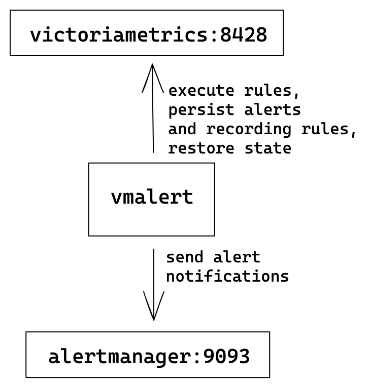
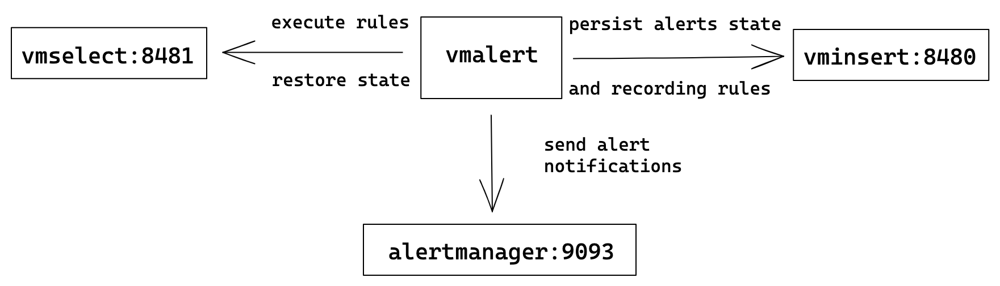
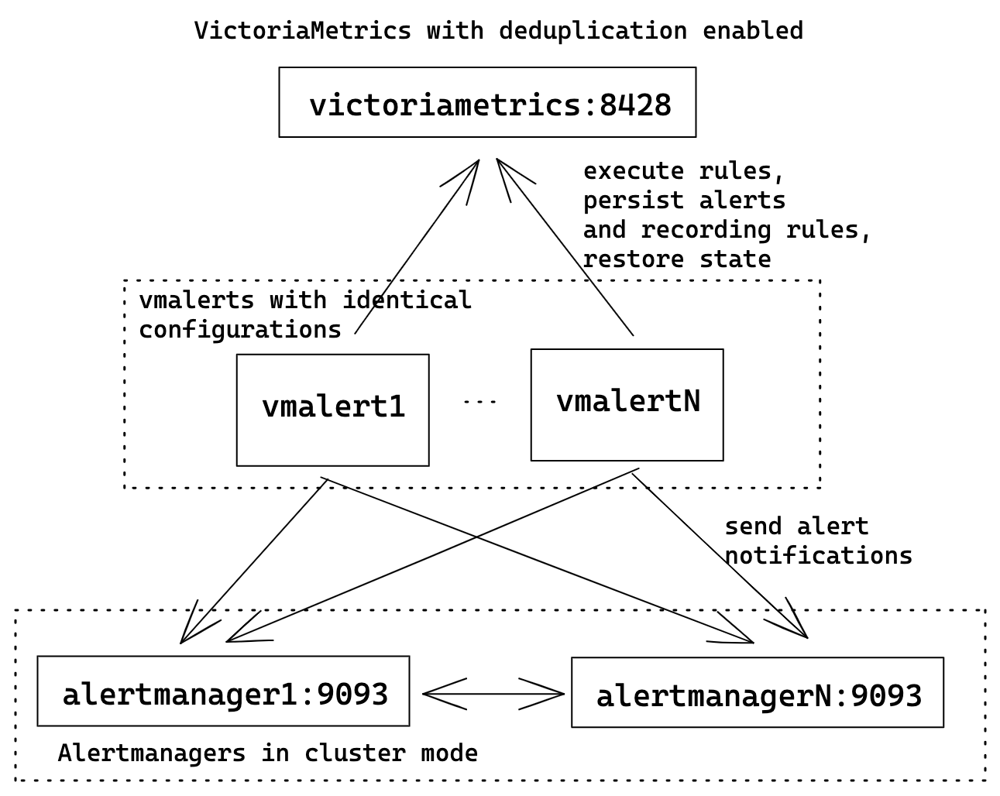
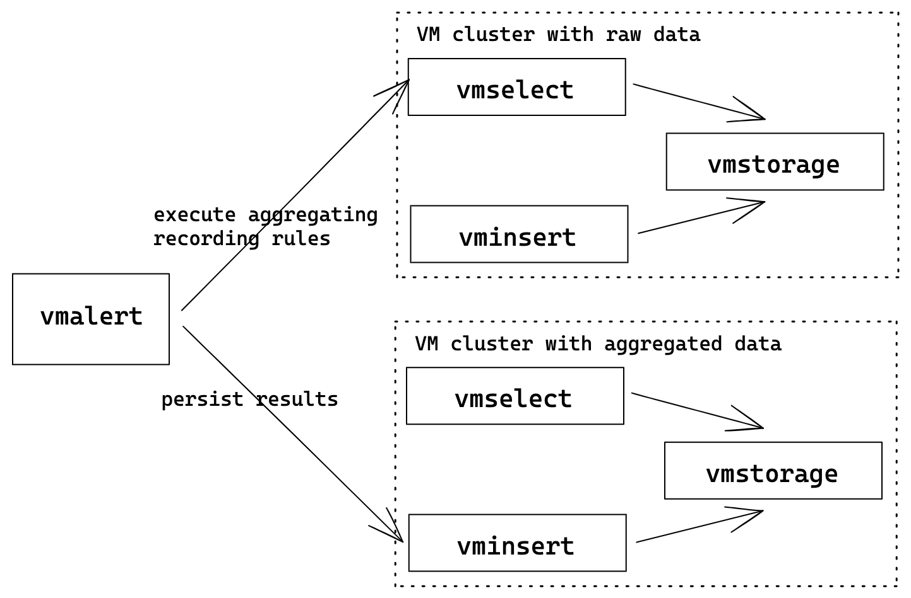

# vmalert

`vmalert` executes a list of the given [alerting](https://prometheus.io/docs/prometheus/latest/configuration/alerting_rules/)
or [recording](https://prometheus.io/docs/prometheus/latest/configuration/recording_rules/)
rules against configured `-datasource.url`. For sending alerting notifications
vmalert relies on [Alertmanager]((https://github.com/prometheus/alertmanager)) configured via `-notifier.url` flag.
Recording rules results are persisted via [remote write](https://prometheus.io/docs/prometheus/latest/storage/#remote-storage-integrations)
protocol and require `-remoteWrite.url` to be configured.
Vmalert is heavily inspired by [Prometheus](https://prometheus.io/docs/alerting/latest/overview/)
implementation and aims to be compatible with its syntax.

## Features
* Integration with [VictoriaMetrics](https://github.com/VictoriaMetrics/VictoriaMetrics) TSDB;
* VictoriaMetrics [MetricsQL](https://docs.victoriametrics.com/MetricsQL.html)
 support and expressions validation;
* Prometheus [alerting rules definition format](https://prometheus.io/docs/prometheus/latest/configuration/alerting_rules/#defining-alerting-rules)
 support;
* Integration with [Alertmanager](https://github.com/prometheus/alertmanager);
* Keeps the alerts [state on restarts](#alerts-state-on-restarts);
* Graphite datasource can be used for alerting and recording rules. See [these docs](#graphite);
* Recording and Alerting rules backfilling (aka `replay`). See [these docs](#rules-backfilling);
* Lightweight without extra dependencies.

## Limitations
* `vmalert` execute queries against remote datasource which has reliability risks because of the network.
It is recommended to configure alerts thresholds and rules expressions with the understanding that network 
requests may fail;
* by default, rules execution is sequential within one group, but persistence of execution results to remote
storage is asynchronous. Hence, user shouldn't rely on chaining of recording rules when result of previous
recording rule is reused in the next one;

## QuickStart

To build `vmalert` from sources:
```
git clone https://github.com/VictoriaMetrics/VictoriaMetrics
cd VictoriaMetrics
make vmalert
```
The build binary will be placed in `VictoriaMetrics/bin` folder.

To start using `vmalert` you will need the following things:
* list of rules - PromQL/MetricsQL expressions to execute;
* datasource address - reachable MetricsQL endpoint to run queries against;
* notifier address [optional] - reachable [Alert Manager](https://github.com/prometheus/alertmanager) instance for processing,
aggregating alerts, and sending notifications.
* remote write address [optional] - [remote write](https://prometheus.io/docs/prometheus/latest/storage/#remote-storage-integrations)
  compatible storage to persist rules and alerts state info;
* remote read address [optional] - MetricsQL compatible datasource to restore alerts state from.

Then configure `vmalert` accordingly:
```
./bin/vmalert -rule=alert.rules \            # Path to the file with rules configuration. Supports wildcard
    -datasource.url=http://localhost:8428 \  # PromQL compatible datasource
    -notifier.url=http://localhost:9093 \    # AlertManager URL (required if alerting rules are used)
    -notifier.url=http://127.0.0.1:9093 \    # AlertManager replica URL
    -remoteWrite.url=http://localhost:8428 \ # Remote write compatible storage to persist rules and alerts state info (required if recording rules are used)
    -remoteRead.url=http://localhost:8428 \  # MetricsQL compatible datasource to restore alerts state from
    -external.label=cluster=east-1 \         # External label to be applied for each rule
    -external.label=replica=a                # Multiple external labels may be set
```

Note there's a separate `remoteRead.url` to allow writing results of
alerting/recording rules into a different storage than the initial data that's
queried. This allows using `vmalert` to aggregate data from a short-term,
high-frequency, high-cardinality storage into a long-term storage with
decreased cardinality and a bigger interval between samples.

See the full list of configuration flags in [configuration](#configuration) section.

If you run multiple `vmalert` services for the same datastore or AlertManager - do not forget
to specify different `external.label` flags in order to define which `vmalert` generated rules or alerts.

Configuration for [recording](https://prometheus.io/docs/prometheus/latest/configuration/recording_rules/)
and [alerting](https://prometheus.io/docs/prometheus/latest/configuration/alerting_rules/) rules is very
similar to Prometheus rules and configured using YAML. Configuration examples may be found
in [testdata](https://github.com/VictoriaMetrics/VictoriaMetrics/blob/master/app/vmalert/config/testdata) folder.
Every `rule` belongs to a `group` and every configuration file may contain arbitrary number of groups:
```yaml
groups:
  [ - <rule_group> ]
```

### Groups

Each group has the following attributes:
```yaml
# The name of the group. Must be unique within a file.
name: <string>

# How often rules in the group are evaluated.
[ interval: <duration> | default = -evaluationInterval flag ]

# How many rules execute at once within a group. Increasing concurrency may speed
# up round execution speed.
[ concurrency: <integer> | default = 1 ]

# Optional type for expressions inside the rules. Supported values: "graphite" and "prometheus".
# By default "prometheus" type is used.
[ type: <string> ]

# Warning: DEPRECATED
# Please use `params` instead:
#   params:
#     extra_label: ["job=nodeexporter", "env=prod"]
extra_filter_labels:
  [ <labelname>: <labelvalue> ... ]

# Optional list of HTTP URL parameters
# applied for all rules requests within a group
# For example:
#  params:
#    nocache: ["1"]                # disable caching for vmselect
#    denyPartialResponse: ["true"] # fail if one or more vmstorage nodes returned an error
#    extra_label: ["env=dev"]      # apply additional label filter "env=dev" for all requests 
# see more details at https://docs.victoriametrics.com#prometheus-querying-api-enhancements
params:
  [ <string>: [<string>, ...]]

# Optional list of labels added to every rule within a group.
# It has priority over the external labels.
# Labels are commonly used for adding environment
# or tenant-specific tag.
labels:
  [ <labelname>: <labelvalue> ... ]

rules:
  [ - <rule> ... ]
```

### Rules

Every rule contains `expr` field for [PromQL](https://prometheus.io/docs/prometheus/latest/querying/basics/)
or [MetricsQL](https://docs.victoriametrics.com/MetricsQL.html) expression. Vmalert will execute the configured
expression and then act according to the Rule type.

There are two types of Rules:
* [alerting](https://prometheus.io/docs/prometheus/latest/configuration/alerting_rules/) -
Alerting rules allow defining alert conditions via `expr` field and to send notifications to
[Alertmanager](https://github.com/prometheus/alertmanager) if execution result is not empty.
* [recording](https://prometheus.io/docs/prometheus/latest/configuration/recording_rules/) -
Recording rules allow defining `expr` which result will be then backfilled to configured
`-remoteWrite.url`. Recording rules are used to precompute frequently needed or computationally
expensive expressions and save their result as a new set of time series.

`vmalert` forbids defining duplicates - rules with the same combination of name, expression, and labels
within one group.

#### Alerting rules

The syntax for alerting rule is the following:
```yaml
# The name of the alert. Must be a valid metric name.
alert: <string>

# The expression to evaluate. The expression language depends on the type value.
# By default PromQL/MetricsQL expression is used. If group.type="graphite", then the expression
# must contain valid Graphite expression.
expr: <string>

# Alerts are considered firing once they have been returned for this long.
# Alerts which have not yet been fired for long enough are considered pending.
# If param is omitted or set to 0 then alerts will be immediately considered
# as firing once they return.
[ for: <duration> | default = 0s ]

# Labels to add or overwrite for each alert.
labels:
  [ <labelname>: <tmpl_string> ]

# Annotations to add to each alert.
annotations:
  [ <labelname>: <tmpl_string> ]
```

It is allowed to use [Go templating](https://golang.org/pkg/text/template/) in annotations
to format data, iterate over it or execute expressions.
Additionally, `vmalert` provides some extra templating functions
listed [here](https://github.com/VictoriaMetrics/VictoriaMetrics/blob/master/app/vmalert/notifier/template_func.go).

#### Recording rules

The syntax for recording rules is following:
```yaml
# The name of the time series to output to. Must be a valid metric name.
record: <string>

# The expression to evaluate. The expression language depends on the type value.
# By default MetricsQL expression is used. If group.type="graphite", then the expression
# must contain valid Graphite expression.
expr: <string>

# Labels to add or overwrite before storing the result.
labels:
  [ <labelname>: <labelvalue> ]
```

For recording rules to work `-remoteWrite.url` must be specified.


### Alerts state on restarts

`vmalert` has no local storage, so alerts state is stored in the process memory. Hence, after restart of `vmalert`
the process alerts state will be lost. To avoid this situation, `vmalert` should be configured via the following flags:
* `-remoteWrite.url` - URL to VictoriaMetrics (Single) or vminsert (Cluster). `vmalert` will persist alerts state
into the configured address in the form of time series named `ALERTS` and `ALERTS_FOR_STATE` via remote-write protocol.
These are regular time series and maybe queried from VM just as any other time series.
The state is stored to the configured address on every rule evaluation.
* `-remoteRead.url` - URL to VictoriaMetrics (Single) or vmselect (Cluster). `vmalert` will try to restore alerts state
from configured address by querying time series with name `ALERTS_FOR_STATE`.

Both flags are required for proper state restoration. Restore process may fail if time series are missing
in configured `-remoteRead.url`, weren't updated in the last `1h` (controlled by `-remoteRead.lookback`)
or received state doesn't match current `vmalert` rules configuration.


### Multitenancy

There are the following approaches exist for alerting and recording rules across
[multiple tenants](https://docs.victoriametrics.com/Cluster-VictoriaMetrics.html#multitenancy):

* To run a separate `vmalert` instance per each tenant.
  The corresponding tenant must be specified in `-datasource.url` command-line flag
  according to [these docs](https://docs.victoriametrics.com/Cluster-VictoriaMetrics.html#url-format).
  For example, `/path/to/vmalert -datasource.url=http://vmselect:8481/select/123/prometheus`
  would run alerts against `AccountID=123`. For recording rules the `-remoteWrite.url` command-line
  flag must contain the url for the specific tenant as well.
  For example, `-remoteWrite.url=http://vminsert:8480/insert/123/prometheus` would write recording
  rules to `AccountID=123`.

* To specify `tenant` parameter per each alerting and recording group if
  [enterprise version of vmalert](https://victoriametrics.com/products/enterprise/) is used
  with `-clusterMode` command-line flag. For example:

```yaml
groups:
- name: rules_for_tenant_123
  tenant: "123"
  rules:
    # Rules for accountID=123

- name: rules_for_tenant_456:789
  tenant: "456:789"
  rules:
    # Rules for accountID=456, projectID=789
```

If `-clusterMode` is enabled, then `-datasource.url`, `-remoteRead.url` and `-remoteWrite.url` must
contain only the hostname without tenant id. For example: `-datasource.url=http://vmselect:8481`.
`vmalert` automatically adds the specified tenant to urls per each recording rule in this case.

If `-clusterMode` is enabled and the `tenant` in a particular group is missing, then the tenant value
is obtained from `-defaultTenant.prometheus` or `-defaultTenant.graphite` depending on the `type` of the group.

The enterprise version of vmalert is available in `vmutils-*-enterprise.tar.gz` files
at [release page](https://github.com/VictoriaMetrics/VictoriaMetrics/releases) and in `*-enterprise`
tags at [Docker Hub](https://hub.docker.com/r/victoriametrics/vmalert/tags).

### Topology examples

The following sections are showing how `vmalert` may be used and configured 
for different scenarios. 

Please note, not all flags in examples are required: 
* `-remoteWrite.url` and `-remoteRead.url` are optional and are needed only if
you have recording rules or want to store [alerts state](#alerts-state-on-restarts) on `vmalert` restarts;
* `-notifier.url` is optional and is needed only if you have alerting rules.

#### Single-node VictoriaMetrics

The simplest configuration where one single-node VM server is used for
rules execution, storing recording rules results and alerts state.

`vmalert` configuration flags:
```
./bin/vmalert -rule=rules.yml  \                    # Path to the file with rules configuration. Supports wildcard
    -datasource.url=http://victoriametrics:8428 \   # VM-single addr for executing rules expressions
    -remoteWrite.url=http://victoriametrics:8428 \  # VM-single addr to persist alerts state and recording rules results
    -remoteRead.url=http://victoriametrics:8428 \   # VM-single addr for restoring alerts state after restart
    -notifier.url=http://alertmanager:9093          # AlertManager addr to send alerts when they trigger
```




#### Cluster VictoriaMetrics

In [cluster mode](https://docs.victoriametrics.com/Cluster-VictoriaMetrics.html)
VictoriaMetrics has separate components for writing and reading path:
`vminsert` and `vmselect` components respectively. `vmselect` is used for executing rules expressions
and `vminsert` is used to persist recording rules results and alerts state.
Cluster mode could have multiple `vminsert` and `vmselect` components. 

`vmalert` configuration flags:
```
./bin/vmalert -rule=rules.yml  \                                # Path to the file with rules configuration. Supports wildcard
    -datasource.url=http://vmselect:8481/select/0/prometheus    # vmselect addr for executing rules expressions
    -remoteWrite.url=http://vminsert:8480/insert/0/prometheuss  # vminsert addr to persist alerts state and recording rules results
    -remoteRead.url=http://vmselect:8481/select/0/prometheus    # vmselect addr for restoring alerts state after restart
    -notifier.url=http://alertmanager:9093                      # AlertManager addr to send alerts when they trigger
```



In case when you want to spread the load on these components - add balancers before them and configure
`vmalert` with balancer's addresses. Please, see more about VM's cluster architecture
[here](https://docs.victoriametrics.com/Cluster-VictoriaMetrics.html#architecture-overview).

#### HA vmalert

For HA user can run multiple identically configured `vmalert` instances.
It means all of them will execute the same rules, write state and results to
the same destinations, and send alert notifications to multiple configured
Alertmanagers.

`vmalert` configuration flags:
```
./bin/vmalert -rule=rules.yml \                   # Path to the file with rules configuration. Supports wildcard
    -datasource.url=http://victoriametrics:8428 \   # VM-single addr for executing rules expressions
    -remoteWrite.url=http://victoriametrics:8428 \  # VM-single addr to persist alerts state and recording rules results
    -remoteRead.url=http://victoriametrics:8428 \   # VM-single addr for restoring alerts state after restart
    -notifier.url=http://alertmanager1:9093 \       # Multiple AlertManager addresses to send alerts when they trigger
    -notifier.url=http://alertmanagerN:9093         # The same alert will be sent to all configured notifiers
```



To avoid recording rules results and alerts state duplication in VictoriaMetrics server
don't forget to configure [deduplication](https://docs.victoriametrics.com/Single-server-VictoriaMetrics.html#deduplication).

Alertmanager will automatically deduplicate alerts with identical labels, so ensure that
all `vmalert`s are having the same config.

Don't forget to configure [cluster mode](https://prometheus.io/docs/alerting/latest/alertmanager/)
for Alertmanagers for better reliability.

This example uses single-node VM server for the sake of simplicity. 
Check how to replace it with [cluster VictoriaMetrics](#cluster-victoriametrics) if needed. 


#### Downsampling and aggregation via vmalert

Example shows how to build a topology where `vmalert` will process data from one cluster
and write results into another. Such clusters may be called as "hot" (low retention,
high-speed disks, used for operative monitoring) and "cold" (long term retention,
slower/cheaper disks, low resolution data). With help of `vmalert`, user can setup
recording rules to process raw data from "hot" cluster (by applying additional transformations
or reducing resolution) and push results to "cold" cluster.

`vmalert` configuration flags:
```
./bin/vmalert -rule=downsampling-rules.yml \                                        # Path to the file with rules configuration. Supports wildcard
    -datasource.url=http://raw-cluster-vmselect:8481/select/0/prometheus            # vmselect addr for executing recordi ng rules expressions
    -remoteWrite.url=http://aggregated-cluster-vminsert:8480/insert/0/prometheuss   # vminsert addr to persist recording rules results
```



Please note, [replay](#rules-backfilling) feature may be used for transforming historical data.

Flags `-remoteRead.url` and `-notifier.url` are omitted since we assume only recording rules are used.


### Web

`vmalert` runs a web-server (`-httpListenAddr`) for serving metrics and alerts endpoints:
* `http://<vmalert-addr>` - UI;
* `http://<vmalert-addr>/api/v1/groups` - list of all loaded groups and rules;
* `http://<vmalert-addr>/api/v1/alerts` - list of all active alerts;
* `http://<vmalert-addr>/api/v1/<groupID>/<alertID>/status" ` - get alert status by ID.
Used as alert source in AlertManager.
* `http://<vmalert-addr>/metrics` - application metrics.
* `http://<vmalert-addr>/-/reload` - hot configuration reload.


## Graphite

vmalert sends requests to `<-datasource.url>/render?format=json` during evaluation of alerting and recording rules
if the corresponding group or rule contains `type: "graphite"` config option. It is expected that the `<-datasource.url>/render`
implements [Graphite Render API](https://graphite.readthedocs.io/en/stable/render_api.html) for `format=json`.
When using vmalert with both `graphite` and `prometheus` rules configured against cluster version of VM do not forget
to set `-datasource.appendTypePrefix` flag to `true`, so vmalert can adjust URL prefix automatically based on the query type.

## Rules backfilling

vmalert supports alerting and recording rules backfilling (aka `replay`). In replay mode vmalert
can read the same rules configuration as normal, evaluate them on the given time range and backfill
results via remote write to the configured storage. vmalert supports any PromQL/MetricsQL compatible
data source for backfilling.

### How it works

In `replay` mode vmalert works as a cli-tool and exits immediately after work is done.
To run vmalert in `replay` mode:
```
./bin/vmalert -rule=path/to/your.rules \        # path to files with rules you usually use with vmalert
    -datasource.url=http://localhost:8428 \     # PromQL/MetricsQL compatible datasource
    -remoteWrite.url=http://localhost:8428 \    # remote write compatible storage to persist results
    -replay.timeFrom=2021-05-11T07:21:43Z \     # time from begin replay
    -replay.timeTo=2021-05-29T18:40:43Z         # time to finish replay
```

The output of the command will look like the following:
```
Replay mode:
from:   2021-05-11 07:21:43 +0000 UTC   # set by -replay.timeFrom
to:     2021-05-29 18:40:43 +0000 UTC   # set by -replay.timeTo
max data points per request: 1000       # set by -replay.maxDatapointsPerQuery

Group "ReplayGroup"
interval:       1m0s
requests to make:       27
max range per request:  16h40m0s
> Rule "type:vm_cache_entries:rate5m" (ID: 1792509946081842725)
27 / 27 [----------------------------------------------------------------------------------------------------] 100.00% 78 p/s
> Rule "go_cgo_calls_count:rate5m" (ID: 17958425467471411582)
27 / 27 [-----------------------------------------------------------------------------------------------------] 100.00% ? p/s

Group "vmsingleReplay"
interval:       30s
requests to make:       54
max range per request:  8h20m0s
> Rule "RequestErrorsToAPI" (ID: 17645863024999990222)
54 / 54 [-----------------------------------------------------------------------------------------------------] 100.00% ? p/s
> Rule "TooManyLogs" (ID: 9042195394653477652)
54 / 54 [-----------------------------------------------------------------------------------------------------] 100.00% ? p/s
2021-06-07T09:59:12.098Z        info    app/vmalert/replay.go:68        replay finished! Imported 511734 samples
```

In `replay` mode all groups are executed sequentially one-by-one. Rules within the group are
executed sequentially as well (`concurrency` setting is ignored). Vmalert sends rule's expression
to [/query_range](https://prometheus.io/docs/prometheus/latest/querying/api/#range-queries) endpoint
of the configured `-datasource.url`. Returned data is then processed according to the rule type and
backfilled to `-remoteWrite.url` via [remote Write protocol](https://prometheus.io/docs/prometheus/latest/storage/#remote-storage-integrations).
Vmalert respects `evaluationInterval` value set by flag or per-group during the replay.
Vmalert automatically disables caching on VictoriaMetrics side by sending `nocache=1` param. It allows
to prevent cache pollution and unwanted time range boundaries adjustment during backfilling.

#### Recording rules

The result of recording rules `replay` should match with results of normal rules evaluation.

#### Alerting rules

The result of alerting rules `replay` is time series reflecting [alert's state](#alerts-state-on-restarts).
To see if `replayed` alert has fired in the past use the following PromQL/MetricsQL expression:
```
ALERTS{alertname="your_alertname", alertstate="firing"}
```
Execute the query against storage which was used for `-remoteWrite.url` during the `replay`.

### Additional configuration

There are following non-required `replay` flags:

* `-replay.maxDatapointsPerQuery` - the max number of data points expected to receive in one request.
In two words, it affects the max time range for every `/query_range` request. The higher the value,
the fewer requests will be issued during `replay`.
* `-replay.ruleRetryAttempts` - when datasource fails to respond vmalert will make this number of retries
per rule before giving up.
* `-replay.rulesDelay` - delay between sequential rules execution. Important in cases if there are chaining
(rules which depend on each other) rules. It is expected, that remote storage will be able to persist
previously accepted data during the delay, so data will be available for the subsequent queries.
Keep it equal or bigger than `-remoteWrite.flushInterval`.

See full description for these flags in `./vmalert --help`.

### Limitations

* Graphite engine isn't supported yet;
* `query` template function is disabled for performance reasons (might be changed in future);


## Monitoring

`vmalert` exports various metrics in Prometheus exposition format at `http://vmalert-host:8880/metrics` page.
We recommend setting up regular scraping of this page either through `vmagent` or by Prometheus so that the exported
metrics may be analyzed later.

Use the official [Grafana dashboard](https://grafana.com/grafana/dashboards/14950) for `vmalert` overview. Graphs on this dashboard contain useful hints - hover the `i` icon at the top left corner of each graph in order to read it.
If you have suggestions for improvements or have found a bug - please open an issue on github or add
a review to the dashboard.


## Configuration

### Flags

Pass `-help` to `vmalert` in order to see the full list of supported
command-line flags with their descriptions.

The shortlist of configuration flags is the following:
```
  -datasource.appendTypePrefix
    	Whether to add type prefix to -datasource.url based on the query type. Set to true if sending different query types to the vmselect URL.
  -datasource.basicAuth.password string
    	Optional basic auth password for -datasource.url
  -datasource.basicAuth.passwordFile string
    	Optional path to basic auth password to use for -datasource.url
  -datasource.basicAuth.username string
    	Optional basic auth username for -datasource.url
  -datasource.bearerToken string
    	Optional bearer auth token to use for -datasource.url.
  -datasource.bearerTokenFile string
    	Optional path to bearer token file to use for -datasource.url.
  -datasource.lookback duration
    	Lookback defines how far into the past to look when evaluating queries. For example, if the datasource.lookback=5m then param "time" with value now()-5m will be added to every query.
  -datasource.maxIdleConnections int
    	Defines the number of idle (keep-alive connections) to each configured datasource. Consider setting this value equal to the value: groups_total * group.concurrency. Too low a value may result in a high number of sockets in TIME_WAIT state. (default 100)
  -datasource.queryStep duration
    	queryStep defines how far a value can fallback to when evaluating queries. For example, if datasource.queryStep=15s then param "step" with value "15s" will be added to every query.If queryStep isn't specified, rule's evaluationInterval will be used instead.
  -datasource.roundDigits int
    	Adds "round_digits" GET param to datasource requests. In VM "round_digits" limits the number of digits after the decimal point in response values.
  -datasource.tlsCAFile string
    	Optional path to TLS CA file to use for verifying connections to -datasource.url. By default, system CA is used
  -datasource.tlsCertFile string
    	Optional path to client-side TLS certificate file to use when connecting to -datasource.url
  -datasource.tlsInsecureSkipVerify
    	Whether to skip tls verification when connecting to -datasource.url
  -datasource.tlsKeyFile string
    	Optional path to client-side TLS certificate key to use when connecting to -datasource.url
  -datasource.tlsServerName string
    	Optional TLS server name to use for connections to -datasource.url. By default, the server name from -datasource.url is used
  -datasource.url string
    	VictoriaMetrics or vmselect url. Required parameter. E.g. http://127.0.0.1:8428
  -disableAlertgroupLabel
    	Whether to disable adding group's name as label to generated alerts and time series.
  -dryRun -rule
    	Whether to check only config files without running vmalert. The rules file are validated. The -rule flag must be specified.
  -enableTCP6
    	Whether to enable IPv6 for listening and dialing. By default only IPv4 TCP and UDP is used
  -envflag.enable
    	Whether to enable reading flags from environment variables additionally to command line. Command line flag values have priority over values from environment vars. Flags are read only from command line if this flag isn't set. See https://docs.victoriametrics.com/#environment-variables for more details
  -envflag.prefix string
    	Prefix for environment variables if -envflag.enable is set
  -evaluationInterval duration
    	How often to evaluate the rules (default 1m0s)
  -external.alert.source string
    	External Alert Source allows to override the Source link for alerts sent to AlertManager for cases where you want to build a custom link to Grafana, Prometheus or any other service.
    	eg. 'explore?orgId=1&left=[\"now-1h\",\"now\",\"VictoriaMetrics\",{\"expr\": \"{{$expr|quotesEscape|crlfEscape|queryEscape}}\"},{\"mode\":\"Metrics\"},{\"ui\":[true,true,true,\"none\"]}]'.If empty '/api/v1/:groupID/alertID/status' is used
  -external.label array
    	Optional label in the form 'name=value' to add to all generated recording rules and alerts. Pass multiple -label flags in order to add multiple label sets.
    	Supports an array of values separated by comma or specified via multiple flags.
  -external.url string
    	External URL is used as alert's source for sent alerts to the notifier
  -fs.disableMmap
    	Whether to use pread() instead of mmap() for reading data files. By default mmap() is used for 64-bit arches and pread() is used for 32-bit arches, since they cannot read data files bigger than 2^32 bytes in memory. mmap() is usually faster for reading small data chunks than pread()
  -http.connTimeout duration
    	Incoming http connections are closed after the configured timeout. This may help to spread the incoming load among a cluster of services behind a load balancer. Please note that the real timeout may be bigger by up to 10% as a protection against the thundering herd problem (default 2m0s)
  -http.disableResponseCompression
    	Disable compression of HTTP responses to save CPU resources. By default compression is enabled to save network bandwidth
  -http.idleConnTimeout duration
    	Timeout for incoming idle http connections (default 1m0s)
  -http.maxGracefulShutdownDuration duration
    	The maximum duration for a graceful shutdown of the HTTP server. A highly loaded server may require increased value for a graceful shutdown (default 7s)
  -http.pathPrefix string
    	An optional prefix to add to all the paths handled by http server. For example, if '-http.pathPrefix=/foo/bar' is set, then all the http requests will be handled on '/foo/bar/*' paths. This may be useful for proxied requests. See https://www.robustperception.io/using-external-urls-and-proxies-with-prometheus
  -http.shutdownDelay duration
    	Optional delay before http server shutdown. During this delay, the server returns non-OK responses from /health page, so load balancers can route new requests to other servers
  -httpAuth.password string
    	Password for HTTP Basic Auth. The authentication is disabled if -httpAuth.username is empty
  -httpAuth.username string
    	Username for HTTP Basic Auth. The authentication is disabled if empty. See also -httpAuth.password
  -httpListenAddr string
    	Address to listen for http connections (default ":8880")
  -loggerDisableTimestamps
    	Whether to disable writing timestamps in logs
  -loggerErrorsPerSecondLimit int
    	Per-second limit on the number of ERROR messages. If more than the given number of errors are emitted per second, the remaining errors are suppressed. Zero values disable the rate limit
  -loggerFormat string
    	Format for logs. Possible values: default, json (default "default")
  -loggerLevel string
    	Minimum level of errors to log. Possible values: INFO, WARN, ERROR, FATAL, PANIC (default "INFO")
  -loggerOutput string
    	Output for the logs. Supported values: stderr, stdout (default "stderr")
  -loggerTimezone string
    	Timezone to use for timestamps in logs. Timezone must be a valid IANA Time Zone. For example: America/New_York, Europe/Berlin, Etc/GMT+3 or Local (default "UTC")
  -loggerWarnsPerSecondLimit int
    	Per-second limit on the number of WARN messages. If more than the given number of warns are emitted per second, then the remaining warns are suppressed. Zero values disable the rate limit
  -memory.allowedBytes size
    	Allowed size of system memory VictoriaMetrics caches may occupy. This option overrides -memory.allowedPercent if set to a non-zero value. Too low a value may increase the cache miss rate usually resulting in higher CPU and disk IO usage. Too high a value may evict too much data from OS page cache resulting in higher disk IO usage
    	Supports the following optional suffixes for size values: KB, MB, GB, KiB, MiB, GiB (default 0)
  -memory.allowedPercent float
    	Allowed percent of system memory VictoriaMetrics caches may occupy. See also -memory.allowedBytes. Too low a value may increase cache miss rate usually resulting in higher CPU and disk IO usage. Too high a value may evict too much data from OS page cache which will result in higher disk IO usage (default 60)
  -metricsAuthKey string
    	Auth key for /metrics. It must be passed via authKey query arg. It overrides httpAuth.* settings
  -notifier.basicAuth.password array
    	Optional basic auth password for -notifier.url
    	Supports an array of values separated by comma or specified via multiple flags.
  -notifier.basicAuth.username array
    	Optional basic auth username for -notifier.url
    	Supports an array of values separated by comma or specified via multiple flags.
  -notifier.tlsCAFile array
    	Optional path to TLS CA file to use for verifying connections to -notifier.url. By default system CA is used
    	Supports an array of values separated by comma or specified via multiple flags.
  -notifier.tlsCertFile array
    	Optional path to client-side TLS certificate file to use when connecting to -notifier.url
    	Supports an array of values separated by comma or specified via multiple flags.
  -notifier.tlsInsecureSkipVerify array
    	Whether to skip tls verification when connecting to -notifier.url
    	Supports array of values separated by comma or specified via multiple flags.
  -notifier.tlsKeyFile array
    	Optional path to client-side TLS certificate key to use when connecting to -notifier.url
    	Supports an array of values separated by comma or specified via multiple flags.
  -notifier.tlsServerName array
    	Optional TLS server name to use for connections to -notifier.url. By default the server name from -notifier.url is used
    	Supports an array of values separated by comma or specified via multiple flags.
  -notifier.url array
    	Prometheus alertmanager URL, e.g. http://127.0.0.1:9093
    	Supports an array of values separated by comma or specified via multiple flags.
  -pprofAuthKey string
    	Auth key for /debug/pprof. It must be passed via authKey query arg. It overrides httpAuth.* settings
  -remoteRead.basicAuth.password string
    	Optional basic auth password for -remoteRead.url
  -remoteRead.basicAuth.passwordFile string
    	Optional path to basic auth password to use for -remoteRead.url
  -remoteRead.basicAuth.username string
    	Optional basic auth username for -remoteRead.url
  -remoteRead.bearerToken string
    	Optional bearer auth token to use for -remoteRead.url.
  -remoteRead.bearerTokenFile string
    	Optional path to bearer token file to use for -remoteRead.url.
  -remoteRead.disablePathAppend
    	Whether to disable automatic appending of '/api/v1/query' path to the configured -remoteRead.url.
  -remoteRead.ignoreRestoreErrors
    	Whether to ignore errors from remote storage when restoring alerts state on startup. (default true)
  -remoteRead.lookback duration
    	Lookback defines how far to look into past for alerts timeseries. For example, if lookback=1h then range from now() to now()-1h will be scanned. (default 1h0m0s)
  -remoteRead.tlsCAFile string
    	Optional path to TLS CA file to use for verifying connections to -remoteRead.url. By default system CA is used
  -remoteRead.tlsCertFile string
    	Optional path to client-side TLS certificate file to use when connecting to -remoteRead.url
  -remoteRead.tlsInsecureSkipVerify
    	Whether to skip tls verification when connecting to -remoteRead.url
  -remoteRead.tlsKeyFile string
    	Optional path to client-side TLS certificate key to use when connecting to -remoteRead.url
  -remoteRead.tlsServerName string
    	Optional TLS server name to use for connections to -remoteRead.url. By default the server name from -remoteRead.url is used
  -remoteRead.url vmalert
    	Optional URL to VictoriaMetrics or vmselect that will be used to restore alerts state. This configuration makes sense only if vmalert was configured with `remoteWrite.url` before and has been successfully persisted its state. E.g. http://127.0.0.1:8428. See also -remoteRead.disablePathAppend
  -remoteWrite.basicAuth.password string
    	Optional basic auth password for -remoteWrite.url
  -remoteWrite.basicAuth.passwordFile string
    	Optional path to basic auth password to use for -remoteWrite.url
  -remoteWrite.basicAuth.username string
    	Optional basic auth username for -remoteWrite.url
  -remoteWrite.bearerToken string
    	Optional bearer auth token to use for -remoteWrite.url.
  -remoteWrite.bearerTokenFile string
    	Optional path to bearer token file to use for -remoteWrite.url.
  -remoteWrite.concurrency int
    	Defines number of writers for concurrent writing into remote querier (default 1)
  -remoteWrite.disablePathAppend
    	Whether to disable automatic appending of '/api/v1/write' path to the configured -remoteWrite.url.
  -remoteWrite.flushInterval duration
    	Defines interval of flushes to remote write endpoint (default 5s)
  -remoteWrite.maxBatchSize int
    	Defines defines max number of timeseries to be flushed at once (default 1000)
  -remoteWrite.maxQueueSize int
    	Defines the max number of pending datapoints to remote write endpoint (default 100000)
  -remoteWrite.tlsCAFile string
    	Optional path to TLS CA file to use for verifying connections to -remoteWrite.url. By default system CA is used
  -remoteWrite.tlsCertFile string
    	Optional path to client-side TLS certificate file to use when connecting to -remoteWrite.url
  -remoteWrite.tlsInsecureSkipVerify
    	Whether to skip tls verification when connecting to -remoteWrite.url
  -remoteWrite.tlsKeyFile string
    	Optional path to client-side TLS certificate key to use when connecting to -remoteWrite.url
  -remoteWrite.tlsServerName string
    	Optional TLS server name to use for connections to -remoteWrite.url. By default the server name from -remoteWrite.url is used
  -remoteWrite.url string
    	Optional URL to VictoriaMetrics or vminsert where to persist alerts state and recording rules results in form of timeseries. For example, if -remoteWrite.url=http://127.0.0.1:8428 is specified, then the alerts state will be written to http://127.0.0.1:8428/api/v1/write . See also -remoteWrite.disablePathAppend
  -replay.maxDatapointsPerQuery int
    	Max number of data points expected in one request. The higher the value, the less requests will be made during replay. (default 1000)
  -replay.ruleRetryAttempts int
    	Defines how many retries to make before giving up on rule if request for it returns an error. (default 5)
  -replay.rulesDelay duration
    	Delay between rules evaluation within the group. Could be important if there are chained rules inside of the groupand processing need to wait for previous rule results to be persisted by remote storage before evaluating the next rule.Keep it equal or bigger than -remoteWrite.flushInterval. (default 1s)
  -replay.timeFrom string
    	The time filter in RFC3339 format to select time series with timestamp equal or higher than provided value. E.g. '2020-01-01T20:07:00Z'
  -replay.timeTo string
    	The time filter in RFC3339 format to select timeseries with timestamp equal or lower than provided value. E.g. '2020-01-01T20:07:00Z'
  -rule array
    	Path to the file with alert rules.
    	Supports patterns. Flag can be specified multiple times.
    	Examples:
    	 -rule="/path/to/file". Path to a single file with alerting rules
    	 -rule="dir/*.yaml" -rule="/*.yaml". Relative path to all .yaml files in "dir" folder,
    	absolute path to all .yaml files in root.
    	Rule files may contain %{ENV_VAR} placeholders, which are substituted by the corresponding env vars.
    	Supports an array of values separated by comma or specified via multiple flags.
  -rule.configCheckInterval duration
    	Interval for checking for changes in '-rule' files. By default the checking is disabled. Send SIGHUP signal in order to force config check for changes
  -rule.maxResolveDuration duration
    	Limits the maximum duration for automatic alert expiration, which is by default equal to 3 evaluation intervals of the parent group.
  -rule.validateExpressions
    	Whether to validate rules expressions via MetricsQL engine (default true)
  -rule.validateTemplates
    	Whether to validate annotation and label templates (default true)
  -tls
    	Whether to enable TLS (aka HTTPS) for incoming requests. -tlsCertFile and -tlsKeyFile must be set if -tls is set
  -tlsCertFile string
    	Path to file with TLS certificate. Used only if -tls is set. Prefer ECDSA certs instead of RSA certs as RSA certs are slower
  -tlsKeyFile string
    	Path to file with TLS key. Used only if -tls is set
  -version
    	Show VictoriaMetrics version
```

### Hot config reload
`vmalert` supports "hot" config reload via the following methods:
* send SIGHUP signal to `vmalert` process;
* send GET request to `/-/reload` endpoint;
* configure `-rule.configCheckInterval` flag for periodic reload
on config change.

### URL params

To set additional URL params for `datasource.url`, `remoteWrite.url` or `remoteRead.url`
just add them in address: `-datasource.url=http://localhost:8428?nocache=1`.

To set additional URL params for specific [group of rules](#Groups) modify
the `params` group:
```yaml
groups:
  - name: TestGroup
    params:
      denyPartialResponse: ["true"]
      extra_label: ["env=dev"]
```
Please note, `params` are used only for executing rules expressions (requests to `datasource.url`).
If there would be a conflict between URL params set in `datasource.url` flag and params in group definition
the latter will have higher priority.


## Contributing

`vmalert` is mostly designed and built by VictoriaMetrics community.
Feel free to share your experience and ideas for improving this
software. Please keep simplicity as the main priority.

## How to build from sources

It is recommended using
[binary releases](https://github.com/VictoriaMetrics/VictoriaMetrics/releases)
- `vmalert` is located in `vmutils-*` archives there.


### Development build

1. [Install Go](https://golang.org/doc/install). The minimum supported version is Go 1.17.
2. Run `make vmalert` from the root folder of [the repository](https://github.com/VictoriaMetrics/VictoriaMetrics).
   It builds `vmalert` binary and puts it into the `bin` folder.

### Production build

1. [Install docker](https://docs.docker.com/install/).
2. Run `make vmalert-prod` from the root folder of [the repository](https://github.com/VictoriaMetrics/VictoriaMetrics).
   It builds `vmalert-prod` binary and puts it into the `bin` folder.


### ARM build

ARM build may run on Raspberry Pi or on [energy-efficient ARM servers](https://blog.cloudflare.com/arm-takes-wing/).

### Development ARM build

1. [Install Go](https://golang.org/doc/install). The minimum supported version is Go 1.17.
2. Run `make vmalert-arm` or `make vmalert-arm64` from the root folder of [the repository](https://github.com/VictoriaMetrics/VictoriaMetrics).
   It builds `vmalert-arm` or `vmalert-arm64` binary respectively and puts it into the `bin` folder.

### Production ARM build

1. [Install docker](https://docs.docker.com/install/).
2. Run `make vmalert-arm-prod` or `make vmalert-arm64-prod` from the root folder of [the repository](https://github.com/VictoriaMetrics/VictoriaMetrics).
   It builds `vmalert-arm-prod` or `vmalert-arm64-prod` binary respectively and puts it into the `bin` folder.
