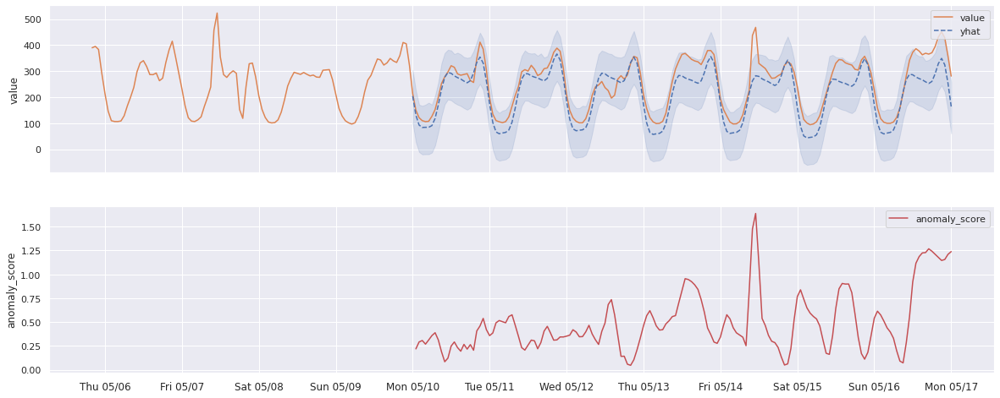
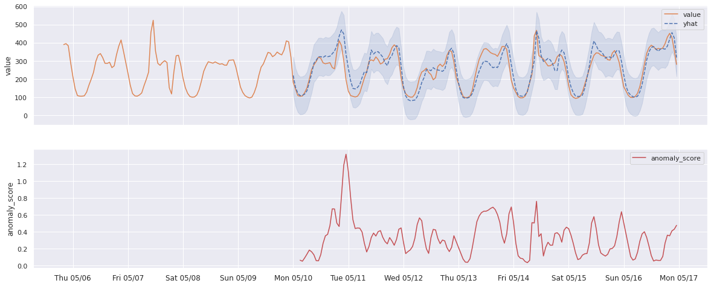

# vmanomaly

**_vmanomaly is a part of [enterprise package](https://docs.victoriametrics.com/enterprise.html).
Please [contact us](https://victoriametrics.com/contact-us/) to find out more._**

## About

**VictoriaMetrics Anomaly Detection** is a service that continuously scans Victoria Metrics time
series and detects unexpected changes within data patterns in real-time. It does so by utilizing
user-configurable machine learning models.

It periodically queries user-specified metrics, computes an “anomaly score” for them, based on how
well they fit a predicted distribution, taking into account periodical data patterns with trends,
and pushes back the computed “anomaly score” to Victoria Metrics. Then, users can enable alerting
rules based on the “anomaly score”.

Compared to classical alerting rules, anomaly detection is more “hands-off” i.e. it allows users to
avoid setting up manual alerting rules set up and catching anomalies that were not expected to happen.
In other words, by setting up alerting rules, a user must know what to look for, ahead of time,
while anomaly detection looks for any deviations from past behavior.

In addition to that, setting up alerting rules manually has been proven to be tedious and
error-prone, while anomaly detection can be easier to set up, and use the same model for different
metrics.

## How?

Victoria Metrics Anomaly Detection service (**vmanomaly**) allows you to apply several built-in
anomaly detection algorithms. You can also plug in your own detection models, code doesn’t make any
distinction between built-in models or external ones.

All the service parameters (model, schedule, input-output) are defined in a config file.

Single config file supports only one model, but it’s totally OK to run multiple **vmanomaly**
processes in parallel, each using its own config.

## Models

Currently, vmanomaly ships with a few common models:

1. **ZScore**

   _(useful for testing)_

   Simplistic model, that detects outliers as all the points that lie farther than a certain amount
   from time-series mean (straight line). Keeps only two model parameters internally:
   `mean` and `std` (standard deviation).

2. **Prophet**

   _(simplest in configuration, recommended for getting starting)_

   Uses Facebook Prophet for forecasting. The _anomaly score_ is computed of how close the actual time
   series values follow the forecasted values (_yhat_), and whether it’s within forecasted bounds
   (_yhat_lower_, _yhat_upper_). The _anomaly score_ reaches 1.0 if the actual data values 
   are equal to
   _yhat_lower_ or _yhat_upper_. The _anomaly score_ is above 1.0 if the actual data values are 
   outside
   the _yhat_lower_/_yhat_upper_ bounds.

   See [Prophet documentation](https://facebook.github.io/prophet/)

3. **Holt-Winters**

   Very popular forecasting algorithm. See [statsmodels.org documentation](
   https://www.statsmodels.org/stable/generated/statsmodels.tsa.holtwinters.ExponentialSmoothing.html)
   for Holt-Winters exponential smoothing.

4. **Seasonal-Trend Decomposition**

   Extracts three components: season, trend, and residual, that can be plotted individually for
   easier debugging. Uses LOESS (locally estimated scatterplot smoothing).
   See [statsmodels.org documentation](https://www.statsmodels.org/dev/examples/notebooks/generated/stl_decomposition.html)
   for LOESS STD.

5. **ARIMA**

   Commonly used forecasting model. See [statsmodels.org documentation](https://www.statsmodels.
   org/stable/generated/statsmodels.tsa.arima.model.ARIMA.html) for ARIMA.

6. **Rolling Quantile**

   A simple moving window of quantiles. Easy to use, easy to understand, but not as powerful as 
   other models.


### Examples
For example, here’s how Prophet predictions could look like on a real-data example  
(Prophet auto-detected seasonality interval):


And here’s what Holt-Winters predictions real-world data could look like (seasonality manually 
 set to 1 week). Notice that it predicts anomalies in 
different places than Prophet because the model noticed there are usually spikes on Friday 
morning, so it accounted for that:


## Process
Upon starting, vmanomaly queries the initial range of data, and trains its model (“fit” by convention).

Then, reads new data from VictoriaMetrics, according to schedule, and invokes its model to compute 
“anomaly score” for each data point. The anomaly score ranges from 0 to positive infinity. 
Values less than 1.0 are considered “not an anomaly”, values greater or equal than 1.0 are 
considered “anomalous”, with greater values corresponding to larger anomaly.
Then, VMAnomaly pushes the metric to vminsert (under the user-configured metric name, 
optionally preserving labels).

 
## Usage
The vmanomaly accepts only one parameter -- config file path:

```sh
python3 vmanomaly.py config_zscore.yaml
```
or
```sh
python3 -m vmanomaly config_zscore.yaml
```

It is also possible to split up config into multiple files, just list them all in the command line:

```sh
python3 -m vmanomaly model_prophet.yaml io_csv.yaml scheduler_oneoff.yaml
```
