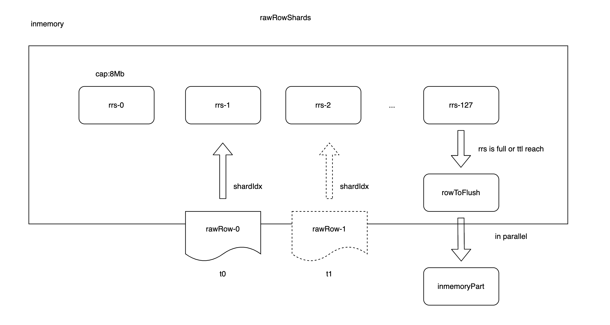

# VictoriaMetrics 设计
## 1. 背景

VictoriaMetrics(简称vm)的内部设计文档过于稀少，为了方便日后的维护和问题排查，尝试从源码分析其每个组件的核心功能

## 2. 组件

### 2.1 vmagent

// TODO

### 2.2 vmselect

// TODO

### 2.3 vmstorage



有兴趣了解这个实现可以参考这个MR [merge request](https://kgit.kugou.net/yongquanli/VictoriaMetrics/-/tree/rrs_implement)

生成partition后的内存压缩逻辑 [compression](https://segmentfault.com/a/1190000043749609)

代码路径：

```shell
raw_row.go#marshalToInmemoryPart
```


### 2.4 vminsert


